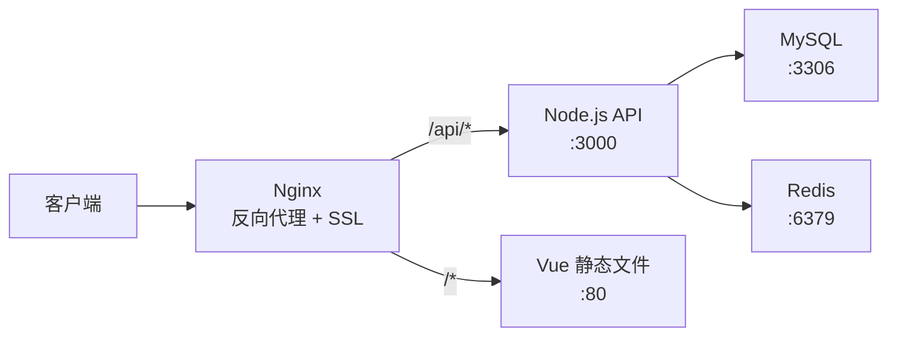

# 实战：部署前后端分离应用

## 前言

**C：** 前后端分离是最常见的项目架构——Vue/React 做前端，Spring Boot/Express 做后端 API，MySQL/PostgreSQL 做数据库。本篇从头到尾演示如何用 Docker Compose 将这套架构部署到服务器上，包括 Nginx 反向代理、HTTPS 配置、环境变量管理和数据库初始化，是一份可以直接落地的部署方案。

<!-- more -->

## 架构概览



## 项目结构

```text
deploy/
├── docker-compose.yml
├── docker-compose.prod.yml
├── .env
├── nginx/
│   ├── nginx.conf
│   └── ssl/
│       ├── cert.pem
│       └── key.pem
├── frontend/
│   ├── Dockerfile
│   └── dist/                  # 构建产物
├── backend/
│   ├── Dockerfile
│   └── src/
└── init/
    └── init.sql               # 数据库初始化
```

## 后端 Dockerfile

```dockerfile
# backend/Dockerfile
FROM node:20-alpine AS builder
WORKDIR /app
COPY package*.json ./
RUN npm ci --production
COPY . .
RUN npm run build

FROM node:20-alpine
RUN addgroup -S appgroup && adduser -S appuser -G appgroup
WORKDIR /app
COPY --from=builder --chown=appuser:appgroup /app/dist ./dist
COPY --from=builder --chown=appuser:appgroup /app/node_modules ./node_modules
COPY --from=builder --chown=appuser:appgroup /app/package.json ./

USER appuser
EXPOSE 3000

HEALTHCHECK --interval=30s --timeout=3s --retries=3 \
    CMD wget -qO- http://localhost:3000/api/health || exit 1

CMD ["node", "dist/server.js"]
```

## 前端 Dockerfile

```dockerfile
# frontend/Dockerfile
FROM node:20-alpine AS builder
WORKDIR /app
COPY package*.json ./
RUN npm ci
COPY . .
RUN npm run build

FROM nginx:alpine
COPY --from=builder /app/dist /usr/share/nginx/html
COPY nginx-default.conf /etc/nginx/conf.d/default.conf
EXPOSE 80
```

```nginx
# frontend/nginx-default.conf
server {
    listen 80;
    server_name _;

    root /usr/share/nginx/html;
    index index.html;

    # Vue Router history 模式
    location / {
        try_files $uri $uri/ /index.html;
    }

    # 静态资源缓存
    location ~* \.(js|css|png|jpg|jpeg|gif|ico|svg|woff2?)$ {
        expires 30d;
        add_header Cache-Control "public, immutable";
    }

    # gzip 压缩
    gzip on;
    gzip_types text/plain text/css application/json application/javascript text/xml;
    gzip_min_length 1000;
}
```

## Nginx 反向代理

```nginx
# nginx/nginx.conf
events {
    worker_connections 1024;
}

http {
    upstream api_backend {
        server api:3000;
    }

    # HTTP 重定向到 HTTPS
    server {
        listen 80;
        server_name example.com;
        return 301 https://$host$request_uri;
    }

    # HTTPS
    server {
        listen 443 ssl http2;
        server_name example.com;

        ssl_certificate /etc/nginx/ssl/cert.pem;
        ssl_certificate_key /etc/nginx/ssl/key.pem;
        ssl_protocols TLSv1.2 TLSv1.3;
        ssl_ciphers HIGH:!aNULL:!MD5;

        # API 代理
        location /api/ {
            proxy_pass http://api_backend;
            proxy_set_header Host $host;
            proxy_set_header X-Real-IP $remote_addr;
            proxy_set_header X-Forwarded-For $proxy_add_x_forwarded_for;
            proxy_set_header X-Forwarded-Proto $scheme;

            # 超时设置
            proxy_connect_timeout 10s;
            proxy_send_timeout 30s;
            proxy_read_timeout 30s;
        }

        # 前端代理
        location / {
            proxy_pass http://frontend:80;
            proxy_set_header Host $host;
            proxy_set_header X-Real-IP $remote_addr;
        }
    }
}
```

## docker-compose.yml

```yaml
services:
  # ===== 前端（静态文件） =====
  frontend:
    build:
      context: ./frontend
      dockerfile: Dockerfile
    restart: unless-stopped
    networks:
      - frontend

  # ===== 后端 API =====
  api:
    build:
      context: ./backend
      dockerfile: Dockerfile
    environment:
      - NODE_ENV=production
      - DB_HOST=db
      - DB_PORT=3306
      - DB_USER=${DB_USER}
      - DB_PASSWORD=${DB_PASSWORD}
      - DB_NAME=${DB_NAME}
      - REDIS_HOST=redis
      - JWT_SECRET=${JWT_SECRET}
    depends_on:
      db:
        condition: service_healthy
      redis:
        condition: service_started
    restart: unless-stopped
    deploy:
      replicas: 2
      resources:
        limits:
          cpus: "1.0"
          memory: 512M
    logging:
      driver: local
      options:
        max-size: "50m"
        max-file: "5"
    networks:
      - frontend
      - backend

  # ===== Nginx 反向代理 =====
  nginx:
    image: nginx:alpine
    ports:
      - "80:80"
      - "443:443"
    volumes:
      - ./nginx/nginx.conf:/etc/nginx/nginx.conf:ro
      - ./nginx/ssl:/etc/nginx/ssl:ro
    depends_on:
      - frontend
      - api
    restart: unless-stopped
    networks:
      - frontend

  # ===== MySQL 数据库 =====
  db:
    image: mysql:8.0
    environment:
      MYSQL_ROOT_PASSWORD: ${MYSQL_ROOT_PASSWORD}
      MYSQL_DATABASE: ${DB_NAME}
      MYSQL_USER: ${DB_USER}
      MYSQL_PASSWORD: ${DB_PASSWORD}
    volumes:
      - mysqldata:/var/lib/mysql
      - ./init/init.sql:/docker-entrypoint-initdb.d/init.sql:ro
    healthcheck:
      test: ["CMD", "mysqladmin", "ping", "-h", "localhost"]
      interval: 5s
      timeout: 3s
      retries: 10
    restart: unless-stopped
    deploy:
      resources:
        limits:
          memory: 1G
    logging:
      driver: local
      options:
        max-size: "30m"
        max-file: "3"
    networks:
      - backend

  # ===== Redis 缓存 =====
  redis:
    image: redis:7-alpine
    command: redis-server --requirepass ${REDIS_PASSWORD}
    volumes:
      - redisdata:/data
    restart: unless-stopped
    deploy:
      resources:
        limits:
          memory: 256M
    networks:
      - backend

volumes:
  mysqldata:
  redisdata:

networks:
  frontend:
  backend:
    internal: true
```

## 环境变量

```env
# .env
DB_USER=appuser
DB_PASSWORD=your_secure_db_password
DB_NAME=myapp
MYSQL_ROOT_PASSWORD=your_root_password
REDIS_PASSWORD=your_redis_password
JWT_SECRET=your_jwt_secret_key
```

## 数据库初始化

```sql
-- init/init.sql
CREATE TABLE IF NOT EXISTS users (
    id INT AUTO_INCREMENT PRIMARY KEY,
    username VARCHAR(50) UNIQUE NOT NULL,
    email VARCHAR(100) UNIQUE NOT NULL,
    password_hash VARCHAR(255) NOT NULL,
    created_at TIMESTAMP DEFAULT CURRENT_TIMESTAMP,
    updated_at TIMESTAMP DEFAULT CURRENT_TIMESTAMP ON UPDATE CURRENT_TIMESTAMP
);

CREATE TABLE IF NOT EXISTS articles (
    id INT AUTO_INCREMENT PRIMARY KEY,
    title VARCHAR(200) NOT NULL,
    content TEXT,
    author_id INT,
    created_at TIMESTAMP DEFAULT CURRENT_TIMESTAMP,
    FOREIGN KEY (author_id) REFERENCES users(id)
);
```

## 部署流程

```bash
# 1. 上传代码到服务器
git clone https://github.com/yourorg/myapp.git
cd myapp/deploy

# 2. 配置环境变量
cp .env.example .env
vim .env

# 3. 配置 SSL 证书
# 使用 Let's Encrypt 或上传已有证书
mkdir -p nginx/ssl
# ... 放入 cert.pem 和 key.pem

# 4. 构建并启动
docker compose up -d --build

# 5. 查看状态
docker compose ps
docker compose logs -f

# 6. 验证
curl https://example.com/api/health
```

## 滚动更新

```bash
# 拉取最新代码
git pull origin main

# 重新构建并滚动更新
docker compose up -d --build --no-deps api
docker compose up -d --build --no-deps frontend

# 验证
docker compose ps
docker compose logs --tail=20 api
```

## 备份与恢复

```bash
# 备份数据库
docker compose exec db mysqldump -u root -p${MYSQL_ROOT_PASSWORD} myapp | gzip > backup-$(date +%Y%m%d).sql.gz

# 恢复
gunzip < backup-20260425.sql.gz | docker compose exec -T db mysql -u root -p${MYSQL_ROOT_PASSWORD} myapp
```

## 常见问题

### 前端页面 404

Vue Router 的 history 模式需要 Nginx 配置 `try_files`。确保前端容器的 Nginx 配置正确。

### API 跨域问题

通过 Nginx 反向代理后，前端和 API 在同一域名下，不存在跨域问题。如果前端直接访问 API 地址，需要在后端配置 CORS。

### 数据库连接失败

```bash
# 检查数据库是否就绪
docker compose exec db mysqladmin -u root -p ping

# 检查 API 是否能连接数据库
docker compose exec api wget -qO- http://db:3306
```

## 小结

前后端分离部署要点：

1. **Nginx 反向代理**：统一入口、SSL 终止、路由分发
2. **前后端分离**：前端静态文件 + 后端 API 容器
3. **网络隔离**：数据库和 Redis 在 internal 网络
4. **环境变量**：`.env` 文件管理敏感配置
5. **健康检查**：确保依赖服务就绪
6. **滚动更新**：`--no-deps` 只更新特定服务
