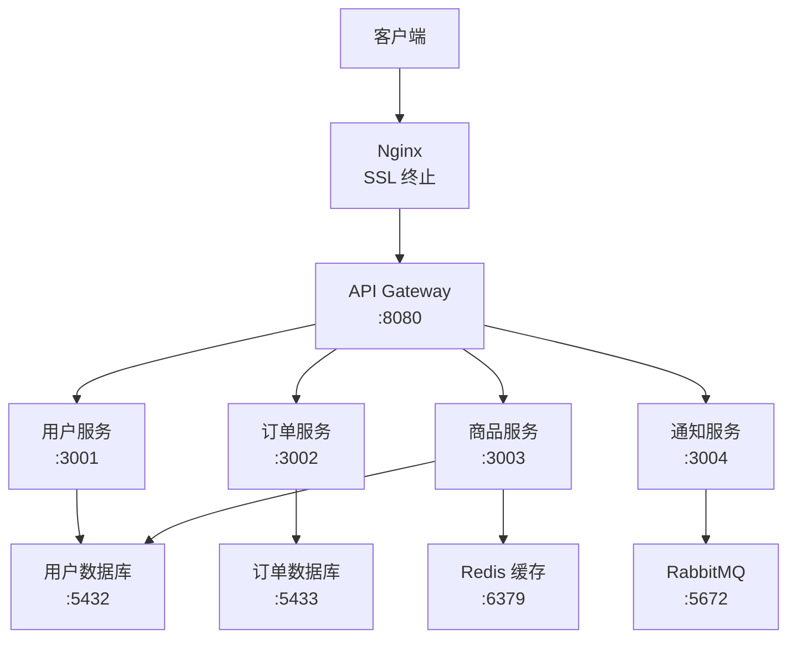

# 实战：部署微服务架构

## 前言

**C：** 单体应用部署一个容器就够了，但微服务架构有用户服务、订单服务、支付服务、商品服务……每个服务独立部署、独立扩缩容、独立数据库。服务之间怎么通信？API Gateway 怎么配？配置中心怎么管？本篇用一个电商系统的简化案例，演示 Docker Compose 部署微服务架构的完整方案。

<!-- more -->

## 架构概览



## 项目结构

```text
microservices/
├── docker-compose.yml
├── .env
├── gateway/
│   ├── Dockerfile
│   └── src/
├── user-service/
│   ├── Dockerfile
│   └── src/
├── order-service/
│   ├── Dockerfile
│   └── src/
├── product-service/
│   ├── Dockerfile
│   └── src/
├── notification-service/
│   ├── Dockerfile
│   └── src/
├── nginx/
│   └── nginx.conf
└── monitoring/
    ├── prometheus.yml
    └── alertmanager.yml
```

## API Gateway

```dockerfile
# gateway/Dockerfile
FROM node:20-alpine
RUN addgroup -S appgroup && adduser -S appuser -G appgroup
WORKDIR /app
COPY package*.json ./
RUN npm ci --production
COPY . .
RUN chown -R appuser:appgroup /app
USER appuser
EXPOSE 8080
HEALTHCHECK --interval=30s --timeout=3s --retries=3 \
    CMD wget -qO- http://localhost:8080/health || exit 1
CMD ["node", "src/index.js"]
```

Gateway 路由配置示例（Express）：

```javascript
// gateway/src/routes.js
const { createProxyMiddleware } = require('http-proxy-middleware');

module.exports = (app) => {
  app.use('/api/users',
    createProxyMiddleware({ target: 'http://user-service:3001', changeOrigin: true })
  );
  app.use('/api/orders',
    createProxyMiddleware({ target: 'http://order-service:3002', changeOrigin: true })
  );
  app.use('/api/products',
    createProxyMiddleware({ target: 'http://product-service:3003', changeOrigin: true })
  );
  app.use('/api/notifications',
    createProxyMiddleware({ target: 'http://notification-service:3004', changeOrigin: true })
  );
};
```

## docker-compose.yml

```yaml
services:
  # ===== API Gateway =====
  gateway:
    build: ./gateway
    ports:
      - "8080:8080"
    environment:
      - USER_SERVICE_URL=http://user-service:3001
      - ORDER_SERVICE_URL=http://order-service:3002
      - PRODUCT_SERVICE_URL=http://product-service:3003
      - NOTIFICATION_SERVICE_URL=http://notification-service:3004
      - JWT_SECRET=${JWT_SECRET}
    depends_on:
      user-service:
        condition: service_healthy
      order-service:
        condition: service_healthy
      product-service:
        condition: service_healthy
    restart: unless-stopped
    deploy:
      replicas: 2
      resources:
        limits:
          cpus: "1.0"
          memory: 512M
    logging:
      driver: local
      options:
        max-size: "50m"
        max-file: "5"
    networks:
      - frontend
      - backend

  # ===== 用户服务 =====
  user-service:
    build: ./user-service
    environment:
      - DB_HOST=user-db
      - DB_PORT=5432
      - DB_USER=${USER_DB_USER}
      - DB_PASSWORD=${USER_DB_PASSWORD}
      - DB_NAME=userdb
    depends_on:
      user-db:
        condition: service_healthy
    restart: unless-stopped
    deploy:
      resources:
        limits:
          cpus: "0.5"
          memory: 256M
    logging:
      driver: local
      options:
        max-size: "30m"
        max-file: "3"
    networks:
      - backend

  # ===== 订单服务 =====
  order-service:
    build: ./order-service
    environment:
      - DB_HOST=order-db
      - DB_PORT=5432
      - DB_USER=${ORDER_DB_USER}
      - DB_PASSWORD=${ORDER_DB_PASSWORD}
      - DB_NAME=orderdb
      - RABBITMQ_URL=amqp://rabbitmq:5672
    depends_on:
      order-db:
        condition: service_healthy
      rabbitmq:
        condition: service_healthy
    restart: unless-stopped
    deploy:
      resources:
        limits:
          cpus: "0.5"
          memory: 256M
    logging:
      driver: local
      options:
        max-size: "30m"
        max-file: "3"
    networks:
      - backend

  # ===== 商品服务 =====
  product-service:
    build: ./product-service
    environment:
      - DB_HOST=product-db
      - DB_PORT=5432
      - DB_USER=${PRODUCT_DB_USER}
      - DB_PASSWORD=${PRODUCT_DB_PASSWORD}
      - DB_NAME=productdb
      - REDIS_HOST=redis
      - REDIS_PASSWORD=${REDIS_PASSWORD}
    depends_on:
      product-db:
        condition: service_healthy
      redis:
        condition: service_started
    restart: unless-stopped
    deploy:
      replicas: 2
      resources:
        limits:
          cpus: "0.5"
          memory: 256M
    logging:
      driver: local
      options:
        max-size: "30m"
        max-file: "3"
    networks:
      - backend

  # ===== 通知服务 =====
  notification-service:
    build: ./notification-service
    environment:
      - RABBITMQ_URL=amqp://rabbitmq:5672
      - SMTP_HOST=${SMTP_HOST}
      - SMTP_PORT=${SMTP_PORT}
    depends_on:
      rabbitmq:
        condition: service_healthy
    restart: unless-stopped
    deploy:
      resources:
        limits:
          cpus: "0.25"
          memory: 128M
    logging:
      driver: local
      options:
        max-size: "20m"
        max-file: "3"
    networks:
      - backend

  # ===== Nginx =====
  nginx:
    image: nginx:alpine
    ports:
      - "80:80"
      - "443:443"
    volumes:
      - ./nginx/nginx.conf:/etc/nginx/nginx.conf:ro
      - ./nginx/ssl:/etc/nginx/ssl:ro
    depends_on:
      - gateway
    restart: unless-stopped
    networks:
      - frontend

  # ===== 数据库（每个服务独立数据库） =====
  user-db:
    image: postgres:15-alpine
    environment:
      POSTGRES_USER: ${USER_DB_USER}
      POSTGRES_PASSWORD: ${USER_DB_PASSWORD}
      POSTGRES_DB: userdb
    volumes:
      - userdbdata:/var/lib/postgresql/data
    healthcheck:
      test: ["CMD-SHELL", "pg_isready -U ${USER_DB_USER} -d userdb"]
      interval: 5s
      timeout: 3s
      retries: 5
    restart: unless-stopped
    deploy:
      resources:
        limits:
          memory: 512M
    networks:
      - backend

  order-db:
    image: postgres:15-alpine
    environment:
      POSTGRES_USER: ${ORDER_DB_USER}
      POSTGRES_PASSWORD: ${ORDER_DB_PASSWORD}
      POSTGRES_DB: orderdb
    volumes:
      - orderdbdata:/var/lib/postgresql/data
    healthcheck:
      test: ["CMD-SHELL", "pg_isready -U ${ORDER_DB_USER} -d orderdb"]
      interval: 5s
      timeout: 3s
      retries: 5
    restart: unless-stopped
    deploy:
      resources:
        limits:
          memory: 512M
    networks:
      - backend

  product-db:
    image: postgres:15-alpine
    environment:
      POSTGRES_USER: ${PRODUCT_DB_USER}
      POSTGRES_PASSWORD: ${PRODUCT_DB_PASSWORD}
      POSTGRES_DB: productdb
    volumes:
      - productdbdata:/var/lib/postgresql/data
    healthcheck:
      test: ["CMD-SHELL", "pg_isready -U ${PRODUCT_DB_USER} -d productdb"]
      interval: 5s
      timeout: 3s
      retries: 5
    restart: unless-stopped
    deploy:
      resources:
        limits:
          memory: 512M
    networks:
      - backend

  # ===== Redis =====
  redis:
    image: redis:7-alpine
    command: redis-server --requirepass ${REDIS_PASSWORD}
    volumes:
      - redisdata:/data
    restart: unless-stopped
    networks:
      - backend

  # ===== RabbitMQ =====
  rabbitmq:
    image: rabbitmq:3.12-management-alpine
    ports:
      - "15672:15672"       # 管理界面
    environment:
      RABBITMQ_DEFAULT_USER: ${MQ_USER}
      RABBITMQ_DEFAULT_PASS: ${MQ_PASSWORD}
    volumes:
      - mqdata:/var/lib/rabbitmq
    healthcheck:
      test: ["CMD", "rabbitmq-diagnostics", "check_running"]
      interval: 10s
      timeout: 5s
      retries: 5
    restart: unless-stopped
    deploy:
      resources:
        limits:
          memory: 512M
    networks:
      - backend

volumes:
  userdbdata:
  orderdbdata:
  productdbdata:
  redisdata:
  mqdata:

networks:
  frontend:
  backend:
    internal: true
```

## 服务间通信

### 同步通信（HTTP）

服务之间通过 Docker 内部 DNS 用服务名通信：

```javascript
// order-service 中调用 user-service
const response = await fetch('http://user-service:3001/api/users/1');
```

### 异步通信（消息队列）

```javascript
// order-service：发送事件
const amqp = require('amqplib');
const connection = await amqp.connect(process.env.RABBITMQ_URL);
const channel = await connection.createChannel();
await channel.assertExchange('order_events', 'topic', { durable: true });
channel.publish('order_events', 'order.created', Buffer.from(JSON.stringify({
  orderId: 123,
  userId: 456,
  total: 99.99
})));

// notification-service：消费事件
channel.assertQueue('notification_queue', { durable: true });
channel.bindQueue('notification_queue', 'order_events', 'order.created');
channel.consume('notification_queue', async (msg) => {
  const event = JSON.parse(msg.content.toString());
  // 发送邮件通知
  await sendNotification(event);
  channel.ack(msg);
});
```

## 服务独立扩缩容

```bash
# 商品服务流量大，扩容到 4 个副本
docker compose up -d --scale product-service=4

# 夜间流量小，缩容
docker compose up -d --scale product-service=2
```

注意：只有无状态服务可以扩缩容。数据库和消息队列不支持 replicas。

## 健康检查与熔断

### 服务健康检查端点

```javascript
// 每个服务都应提供健康检查端点
app.get('/health', async (req, res) => {
  try {
    // 检查数据库连接
    await pool.query('SELECT 1');
    res.json({ status: 'healthy', service: 'user-service' });
  } catch (err) {
    res.status(503).json({ status: 'unhealthy', error: err.message });
  }
});
```

### Nginx 被动健康检查

```nginx
# nginx/nginx.conf
upstream gateway {
    server gateway:8080 max_fails=3 fail_timeout=30s;
    server gateway_2:8080 max_fails=3 fail_timeout=30s;
}
```

## 监控

### Prometheus 配置

```yaml
# monitoring/prometheus.yml
global:
  scrape_interval: 15s

scrape_configs:
  - job_name: 'gateway'
    metrics_path: /metrics
    static_configs:
      - targets: ['gateway:8080']

  - job_name: 'user-service'
    static_configs:
      - targets: ['user-service:3001']

  - job_name: 'order-service'
    static_configs:
      - targets: ['order-service:3002']

  - job_name: 'product-service'
    static_configs:
      - targets: ['product-service:3003']
```

## 部署流程

```bash
# 1. 克隆代码
git clone https://github.com/yourorg/microservices.git
cd microservices

# 2. 配置环境变量
cp .env.example .env
vim .env

# 3. 构建并启动
docker compose up -d --build

# 4. 查看状态
docker compose ps

# 5. 查看各服务日志
docker compose logs -f gateway
docker compose logs -f order-service

# 6. 检查 RabbitMQ 管理界面
# http://服务器IP:15672
```

## 常见问题

### 服务启动顺序

使用 `depends_on` + `condition: service_healthy` 确保数据库就绪。但服务间的业务依赖（如订单服务依赖用户服务）不应该用 `depends_on`，而是通过熔断/重试机制处理。

### 服务发现

Docker Compose 的内置 DNS 服务发现已经够用。如果需要更复杂的服务发现，考虑使用 Consul 或 Kubernetes。

### 数据库连接池

微服务中每个服务都维护自己的数据库连接池：

```javascript
const pool = new Pool({
  host: process.env.DB_HOST,
  port: process.env.DB_PORT,
  user: process.env.DB_USER,
  password: process.env.DB_PASSWORD,
  database: process.env.DB_NAME,
  max: 20,          // 最大连接数
  idleTimeoutMillis: 30000,
  connectionTimeoutMillis: 5000
});
```

## 小结

微服务部署要点：

1. **API Gateway**：统一入口，路由分发
2. **服务自治**：每个服务独立容器、独立数据库
3. **通信方式**：同步 HTTP + 异步消息队列
4. **独立扩缩容**：无状态服务用 `--scale` 水平扩展
5. **健康检查**：每个服务提供 `/health` 端点
6. **网络隔离**：数据库和中间件在 internal 网络
