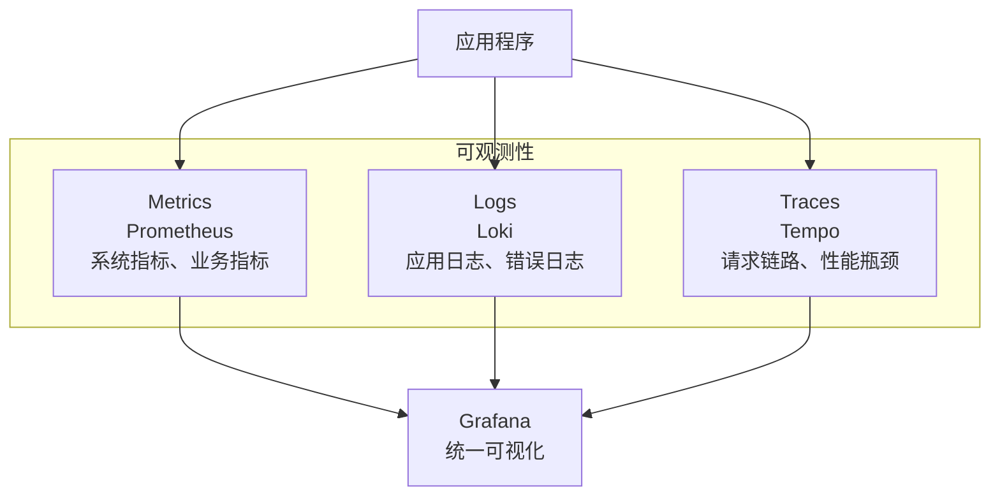

# 实战：部署可观测性监控栈

## 前言

**C：** 生产环境的容器跑着跑着就 OOM 了、磁盘满了、CPU 100% 了——如果没有监控，你只能在出事后才发现。一套完整的可观测性方案需要覆盖三大支柱：Metrics（指标）、Logs（日志）、Traces（链路追踪）。本篇用 Docker Compose 一键部署 Prometheus + Grafana + Loki + Tempo 的完整监控栈，并提供开箱即用的仪表盘配置。

<!-- more -->

## 可观测性三支柱



## 架构概览

| 组件 | 职责 | 端口 |
| --- | --- | --- |
| Prometheus | 指标采集和存储 | 9090 |
| Grafana | 可视化仪表盘 | 3000 |
| Loki | 日志聚合 | 3100 |
| Tempo | 链路追踪 | 3200 |
| Alloy | 采集代理（日志 + 指标 + 追踪） | — |
| cAdvisor | 容器指标采集 | 8080 |
| Node Exporter | 宿主机指标采集 | 9100 |
| Alertmanager | 告警管理 | 9093 |

## 项目结构

```text
monitoring/
├── docker-compose.yml
├── prometheus/
│   └── prometheus.yml
├── grafana/
│   └── provisioning/
│       ├── datasources/
│       │   └── datasources.yml
│       └── dashboards/
│           ├── dashboards.yml
│           └── docker-overview.json
├── loki/
│   └── loki-config.yml
├── tempo/
│   └── tempo-config.yml
├── alloy/
│   └── config.alloy
└── alertmanager/
    └── alertmanager.yml
```

## docker-compose.yml

```yaml
services:
  # ===== Prometheus =====
  prometheus:
    image: prom/prometheus:v2.49
    ports:
      - "9090:9090"
    volumes:
      - ./prometheus/prometheus.yml:/etc/prometheus/prometheus.yml:ro
      - prometheus-data:/prometheus
    command:
      - '--config.file=/etc/prometheus/prometheus.yml'
      - '--storage.tsdb.retention.time=30d'
      - '--web.enable-remote-write-receiver'
    restart: unless-stopped
    deploy:
      resources:
        limits:
          memory: 2G
    networks:
      - monitoring

  # ===== Grafana =====
  grafana:
    image: grafana/grafana:10.3
    ports:
      - "3000:3000"
    environment:
      - GF_SECURITY_ADMIN_USER=${GRAFANA_USER:-admin}
      - GF_SECURITY_ADMIN_PASSWORD=${GRAFANA_PASSWORD:-admin123}
      - GF_AUTH_ANONYMOUS_ENABLED=false
    volumes:
      - grafana-data:/var/lib/grafana
      - ./grafana/provisioning:/etc/grafana/provisioning:ro
    depends_on:
      - prometheus
      - loki
      - tempo
    restart: unless-stopped
    deploy:
      resources:
        limits:
          memory: 512M
    networks:
      - monitoring

  # ===== Loki =====
  loki:
    image: grafana/loki:2.9
    ports:
      - "3100:3100"
    volumes:
      - ./loki/loki-config.yml:/etc/loki/local-config.yaml:ro
      - loki-data:/loki
    command: -config.file=/etc/loki/local-config.yaml
    restart: unless-stopped
    networks:
      - monitoring

  # ===== Tempo =====
  tempo:
    image: grafana/tempo:2.3
    ports:
      - "3200:3200"       # Tempo API
      - "4317:4317"       # OTLP gRPC
      - "4318:4318"       # OTLP HTTP
    volumes:
      - ./tempo/tempo-config.yml:/etc/tempo.yaml:ro
      - tempo-data:/tempo
    command: -config.file=/etc/tempo.yaml
    restart: unless-stopped
    networks:
      - monitoring

  # ===== cAdvisor =====
  cadvisor:
    image: gcr.io/cadvisor/cadvisor:v0.47
    ports:
      - "8080:8080"
    volumes:
      - /:/rootfs:ro
      - /var/run:/var/run:ro
      - /sys:/sys:ro
      - /var/lib/docker:/var/lib/docker:ro
    restart: unless-stopped
    networks:
      - monitoring

  # ===== Node Exporter =====
  node-exporter:
    image: prom/node-exporter:v1.7
    ports:
      - "9100:9100"
    volumes:
      - /proc:/host/proc:ro
      - /sys:/host/sys:ro
      - /:/rootfs:ro
    command:
      - '--path.procfs=/host/proc'
      - '--path.sysfs=/host/sys'
      - '--path.rootfs=/rootfs'
      - '--collector.filesystem.mount-points-exclude=^/(sys|proc|dev|host|etc)($$|/)'
    restart: unless-stopped
    networks:
      - monitoring

  # ===== Alertmanager =====
  alertmanager:
    image: prom/alertmanager:v0.27
    ports:
      - "9093:9093"
    volumes:
      - ./alertmanager/alertmanager.yml:/etc/alertmanager/alertmanager.yml:ro
    restart: unless-stopped
    networks:
      - monitoring

volumes:
  prometheus-data:
  grafana-data:
  loki-data:
  tempo-data:

networks:
  monitoring:
    driver: bridge
```

## Prometheus 配置

```yaml
# prometheus/prometheus.yml
global:
  scrape_interval: 15s
  evaluation_interval: 15s

alerting:
  alertmanagers:
    - static_configs:
        - targets:
            - alertmanager:9093

rule_files:
  - "alert_rules.yml"

scrape_configs:
  - job_name: 'prometheus'
    static_configs:
      - targets: ['localhost:9090']

  - job_name: 'cadvisor'
    static_configs:
      - targets: ['cadvisor:8080']

  - job_name: 'node-exporter'
    static_configs:
      - targets: ['node-exporter:9100']

  - job_name: 'grafana'
    static_configs:
      - targets: ['grafana:3000']

  # 发现其他 Docker 容器中的 metrics 端点
  - job_name: 'docker-containers'
    dockers_sd_configs:
      - host: unix:///var/run/docker.sock
        refresh_interval: 15s
    relabel_configs:
      - source_labels: ['__meta_docker_container_label_prometheus_scrape']
        regex: 'true'
        action: keep
      - source_labels: ['__meta_docker_container_label_prometheus_port']
        regex: '(\d+)'
        target_label: '__address__'
        replacement: '{'{'}{.Address}'}:{'{'}{.Port}'}'
        action: replace
```

## 告警规则

```yaml
# prometheus/alert_rules.yml
groups:
  - name: container-alerts
    rules:
      - alert: ContainerDown
        expr: up == 0
        for: 5m
        labels:
          severity: critical
        annotations:
          summary: "容器 {'{'}{ $labels.job }'} 已停止"
          description: "{'{'}{ $labels.instance }'} 已停止超过 5 分钟"

      - alert: ContainerHighCPU
        expr: rate(container_cpu_usage_seconds_total[5m]) > 0.8
        for: 5m
        labels:
          severity: warning
        annotations:
          summary: "容器 CPU 使用率过高"
          description: "{'{'}{ $labels.name }'} CPU 使用率超过 80%"

      - alert: ContainerOOM
        expr: container_memory_working_set_bytes / container_spec_memory_limit_bytes > 0.9
        for: 5m
        labels:
          severity: critical
        annotations:
          summary: "容器内存即将耗尽"
          description: "{'{'}{ $labels.name }'} 内存使用率超过 90%"

      - alert: DiskSpaceLow
        expr: node_filesystem_avail_bytes / node_filesystem_size_bytes < 0.15
        for: 10m
        labels:
          severity: warning
        annotations:
          summary: "磁盘空间不足"
          description: "{'{'}{ $labels.mountpoint }'} 可用空间低于 15%"

      - alert: HighErrorRate
        expr: rate(http_requests_total{status=~"5.."}[5m]) / rate(http_requests_total[5m]) > 0.05
        for: 5m
        labels:
          severity: warning
        annotations:
          summary: "HTTP 5xx 错误率过高"
          description: "5xx 错误率超过 5%"
```

## Alertmanager 配置

```yaml
# alertmanager/alertmanager.yml
global:
  resolve_timeout: 5m

route:
  group_by: ['alertname', 'severity']
  group_wait: 10s
  group_interval: 5m
  repeat_interval: 4h
  receiver: 'default'
  routes:
    - match:
        severity: critical
      receiver: 'critical'
      repeat_interval: 1h

receivers:
  - name: 'default'
    webhook_configs:
      - url: 'http://your-webhook-url/alert'
        send_resolved: true

  - name: 'critical'
    webhook_configs:
      - url: 'http://your-webhook-url/critical'
        send_resolved: true
    # 企业微信
    # wechat_configs:
    #   - corp_id: 'your_corp_id'
    #     to_party: '2'
    #     agent_id: '1000002'
    #     api_secret: 'your_api_secret'
    #     wechat_url: 'https://qyapi.weixin.qq.com/cgi-bin/webhook/send?key=your_key'
```

## Grafana 数据源配置

```yaml
# grafana/provisioning/datasources/datasources.yml
apiVersion: 1
datasources:
  - name: Prometheus
    type: prometheus
    access: proxy
    url: http://prometheus:9090
    isDefault: true

  - name: Loki
    type: loki
    access: proxy
    url: http://loki:3100

  - name: Tempo
    type: tempo
    access: proxy
    url: http://tempo:3200

  - name: Alertmanager
    type: alertmanager
    access: proxy
    url: http://alertmanager:9093
```

## Loki 配置

```yaml
# loki/loki-config.yml
auth_enabled: false

server:
  http_listen_port: 3100

schema_config:
  configs:
    - from: 2024-01-01
      store: boltdb-shipper
      object_store: filesystem
      schema: v12
      index:
        prefix: index_
        period: 24h

storage:
  filesystem:
    directory: /loki/chunks

common:
  path_prefix: /loki
  replication_factor: 1

limits_config:
  reject_old_samples: true
  old_samples_max_age: 168h    # 7 天
```

## Tempo 配置

```yaml
# tempo/tempo-config.yml
server:
  http_listen_port: 3200

distributor:
  receivers:
    otlp:
      protocols:
        grpc:
          endpoint: 0.0.0.0:4317
        http:
          endpoint: 0.0.0.0:4318

storage:
  trace:
    backend: local
    local:
      path: /tempo/traces
    wal:
      path: /tempo/wal
```

## 应用集成示例

### Node.js 应用输出 Metrics

```javascript
// 使用 prom-client 库
const promClient = require('prom-client');

const register = new promClient.Registry();
promClient.collectDefaultMetrics({ register });

// 自定义业务指标
const httpRequestDuration = new promClient.Histogram({
  name: 'http_request_duration_seconds',
  help: 'HTTP request duration in seconds',
  labelNames: ['method', 'route', 'status_code'],
  buckets: [0.01, 0.05, 0.1, 0.5, 1, 5]
});
register.registerMetric(httpRequestDuration);

// 暴露 metrics 端点
app.get('/metrics', async (req, res) => {
  res.set('Content-Type', register.contentType);
  res.end(await register.metrics());
});
```

### 应用输出 Traces

```javascript
// 使用 OpenTelemetry SDK
const { NodeSDK } = require('@opentelemetry/sdk-node');
const { OTLPTraceExporter } = require('@opentelemetry/exporter-trace-otlp-http');
const { Resource } = require('@opentelemetry/resources');
const { ATTR_SERVICE_NAME } = require('@opentelemetry/semantic-conventions');

const sdk = new NodeSDK({
  resource: new Resource({ [ATTR_SERVICE_NAME]: 'my-service' }),
  traceExporter: new OTLPTraceExporter({
    url: 'http://tempo:4318/v1/traces'
  })
});

sdk.start();
```

## 部署与启动

```bash
# 1. 克隆配置
git clone https://github.com/yourorg/monitoring.git
cd monitoring

# 2. 配置环境变量
cp .env.example .env
vim .env

# 3. 启动
docker compose up -d

# 4. 验证
# Prometheus: http://localhost:9090
# Grafana:    http://localhost:3000
# Loki:       http://localhost:3100
# Tempo:      http://localhost:3200

# 5. 导入 Grafana 仪表盘
# 推荐仪表盘 ID：
# - Docker 容器监控: 179
# - Node Exporter: 1860
# - cAdvisor: 14282
# - Loki 日志: 17533
```

## 常见问题

### Prometheus 存储占用过大

```bash
# 调整保留时间
# prometheus.yml 或 command
--storage.tsdb.retention.time=15d    # 缩短到 15 天

# 查看存储大小
du -sh /var/lib/docker/volumes/monitoring_prometheus-data/
```

### Grafana 仪表盘空白

检查数据源连接状态：Grafana → Configuration → Data Sources → Test。

### 日志采集不到

确认 Loki 配置正确，检查容器日志驱动：

```bash
# 确保容器日志可以被采集
docker inspect <容器> | jq '.[0].HostConfig.LogConfig'
```

## 小结

监控栈部署要点：

1. **Prometheus**：指标采集 + 存储 + 告警规则
2. **Grafana**：统一可视化，自动配置数据源
3. **Loki**：轻量日志聚合，配合 Grafana 查询
4. **Tempo**：链路追踪，OTLP 协议接入
5. **告警**：Alertmanager + 企业微信/钉钉/Slack
6. **仪表盘**：推荐导入社区模板 ID 179、1860、14282
