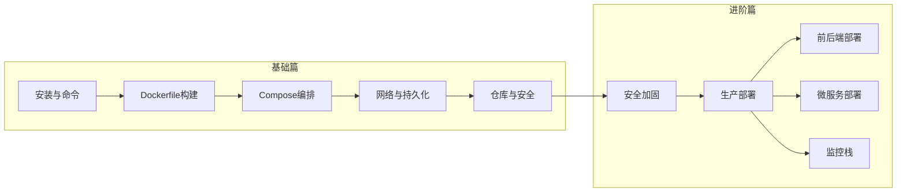

# Docker的开发与实践

## 前言

**C：** 本系列系统讲解 Docker 容器技术，从基础命令到生产部署，涵盖 Dockerfile 构建、Compose 编排、网络与数据持久化、私有仓库、安全加固与实战案例。无论你是刚接触容器还是想系统提升，都能在这里找到完整的知识体系。

<!-- more -->

## 本册内容范围

### 基础篇

- Docker 安装、核心概念与常用命令
- Dockerfile 语法、多阶段构建与镜像优化
- Docker Compose 编排、多环境配置与实战案例
- 网络模型、数据卷与日志管理
- 私有仓库搭建与镜像安全扫描

### 进阶篇

- 容器安全加固与最佳实践
- 生产环境部署指南
- 前后端分离应用部署
- 微服务架构部署
- 可观测性监控栈（Prometheus + Grafana + Loki + Tempo）

## 学习路线图

## 学习建议

- 动手时用非 root 用户组或 rootless 模式时，注意权限与挂载路径差异。
- 生产环境还需结合安全基线、镜像扫描与资源限制，本册以开发与自运维场景为主。

---

## 基础篇

### 第一组：常用命令与镜像安装

1. [个人常用 Docker 命令](/courses/docker/01-常用命令与镜像安装/01-个人常用Docker命令)
2. [Docker 安装 OpenLDAP](/courses/docker/01-常用命令与镜像安装/02-Docker安装OpenLDAP)
3. [Docker 安装 Consul](/courses/docker/01-常用命令与镜像安装/03-Docker安装Consul)
4. [Docker 安装 MinIO](/courses/docker/01-常用命令与镜像安装/04-Docker安装MinIO)
5. [CentOS 安装 Docker](/courses/docker/01-常用命令与镜像安装/05-CentOS安装Docker)

### 第二组：Dockerfile 与镜像构建

1. [Dockerfile 基础语法详解](/courses/docker/02-Dockerfile与镜像构建/01-Dockerfile基础语法详解)
2. [多阶段构建与镜像优化](/courses/docker/02-Dockerfile与镜像构建/02-多阶段构建与镜像优化)
3. [镜像构建进阶技巧](/courses/docker/02-Dockerfile与镜像构建/03-镜像构建进阶技巧)

### 第三组：Docker Compose 编排

1. [Docker Compose 基础入门](/courses/docker/03-Docker-Compose编排/01-Docker-Compose基础入门)
2. [Docker Compose 多环境与覆盖配置](/courses/docker/03-Docker-Compose编排/02-Docker-Compose多环境与覆盖配置)
3. [Docker Compose 实战编排案例](/courses/docker/03-Docker-Compose编排/03-Docker-Compose实战编排案例)

### 第四组：网络与数据持久化

1. [Docker 网络详解](/courses/docker/04-网络与数据持久化/01-Docker网络详解)
2. [Docker 数据卷与持久化](/courses/docker/04-网络与数据持久化/02-Docker数据卷与持久化)
3. [Docker 日志管理与监控](/courses/docker/04-网络与数据持久化/03-Docker日志管理与监控)

### 第五组：私有仓库与镜像分发

1. [Docker 私有仓库搭建与管理](/courses/docker/05-私有仓库与镜像分发/01-Docker私有仓库搭建与管理)
2. [镜像安全扫描与分发策略](/courses/docker/05-私有仓库与镜像分发/02-镜像安全扫描与分发策略)

---

## 进阶篇

### 第六组：容器安全与最佳实践

1. [容器安全最佳实践](/courses/docker/06-容器安全与最佳实践/01-容器安全最佳实践)
2. [Docker 生产环境部署指南](/courses/docker/06-容器安全与最佳实践/02-Docker生产环境部署指南)

### 第七组：实战部署案例

1. [实战：部署前后端分离应用](/courses/docker/07-实战部署案例/01-部署前后端分离应用)
2. [实战：部署微服务架构](/courses/docker/07-实战部署案例/02-部署微服务架构)
3. [实战：部署可观测性监控栈](/courses/docker/07-实战部署案例/03-部署可观测性监控栈)
