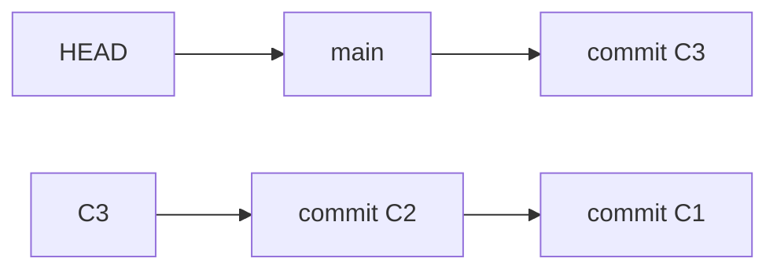
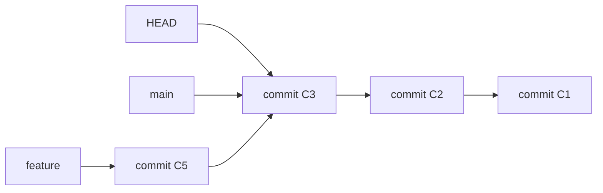
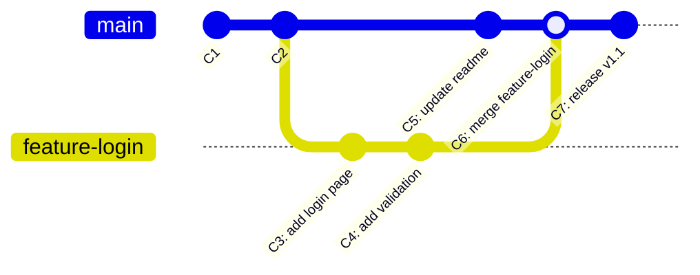

# Git 分支模型概述

## 前言

**C：** 分支是 Git 最强大的特性之一，理解分支模型是高效使用 Git 的基础。本文将从 Git 分支的底层实现讲起，梳理本地分支、远程分支和追踪分支之间的关系，帮助你在日常开发中更加自如地管理分支。

<!-- more -->

## Git 分支的本质

在 Git 中，分支其实只是一个指向某个提交对象的可变指针。当你创建一个新分支时，Git 只是新建了一个指针，并没有复制任何文件数据。这也是 Git 创建和切换分支速度极快的原因。



上图表示 `main` 分支指向提交 `C3`，而 `HEAD` 指向 `main`，说明当前工作在 `main` 分支上。

### 提交对象

每次 `git commit` 都会创建一个提交对象，包含：
- 指向树对象（项目快照）的指针
- 作者和提交者信息
- 提交信息
- 父提交指针（可以有多个，如合并提交）

## 本地分支

### 创建分支

```shell
# 创建分支但不切换
git branch feature-login

# 创建并切换到新分支（推荐）
git switch -c feature-login

# 等价的旧写法
git checkout -b feature-login
```

### 切换分支

```shell
# 切换到已有分支
git switch feature-login

# 旧写法
git checkout feature-login
```

::: tip 笔者说
`git switch` 是 Git 2.23 引入的命令，专门用于分支切换，语义比 `git checkout` 更清晰。推荐在新项目中使用 `switch` 和 `restore` 来替代 `checkout`。
:::

### 删除分支

```shell
# 删除已合并的分支
git branch -d feature-login

# 强制删除未合并的分支
git branch -D feature-login
```

### 查看分支

```shell
# 查看本地分支
git branch

# 查看所有分支（含远程）
git branch -a

# 查看分支及其最后提交
git branch -v

# 查看已合并到当前分支的分支
git branch --merged

# 查看未合并到当前分支的分支
git branch --no-merged
```

### 重命名分支

```shell
# 重命名当前分支
git branch -m new-name

# 重命名指定分支
git branch -m old-name new-name
```

## 远程分支

远程分支是远程仓库上分支的状态引用。它们以 `<remote>/<branch>` 的形式存在，例如 `origin/main`。

::: warning 注意
远程分支是只读的。你不能直接在 `origin/main` 上工作，Git 会在你尝试操作时给出提示。
:::

### 查看远程分支

```shell
# 查看远程仓库
git remote -v

# 查看远程分支
git branch -r
```

### 拉取远程分支信息

```shell
# 从远程仓库获取最新的分支信息（不合并）
git fetch origin

# 获取所有远程仓库的最新信息
git fetch --all
```

### 推送本地分支到远程

```shell
# 推送并设置上游追踪关系
git push -u origin feature-login

# 推送已建立追踪关系的分支
git push

# 推送本地分支到远程（不同名）
git push origin feature-login:remote-feature
```

### 删除远程分支

```shell
# 删除远程分支
git push origin --delete feature-login

# 旧写法
git push origin :feature-login
```

## 追踪分支

追踪分支（Tracking Branch）是与远程分支建立直接关联的本地分支。设置了追踪关系后，你可以直接使用 `git pull` 和 `git push` 而无需指定远程和分支名。

### 建立追踪关系

```shell
# 方法一：在推送时设置（推荐）
git push -u origin feature-login

# 方法二：在创建分支时设置
git switch -c feature-login origin/feature-login

# 方法三：为已有分支设置追踪
git branch --set-upstream-to=origin/feature-login feature-login

# 方法四：简写
git branch -u origin/feature-login
```

### 查看追踪关系

```shell
# 查看所有追踪分支及其状态
git branch -vv
```

输出示例：

```
  feature-login  3a2b1c0 [origin/feature-login: ahead 2] add login page
* main           1d2e3f4 [origin/main] initial commit
  old-feature    5c6d7e8 gone: remove stale tracking branch
```

- `ahead 2`：本地比远程多 2 个提交
- `behind 3`：本地比远程少 3 个提交
- `gone`：远程分支已被删除

### 清理失效的追踪分支

```shell
# 删除所有远程已不存在的追踪分支
git fetch --prune

# 或者
git remote prune origin
```

## HEAD 的含义

`HEAD` 是一个特殊指针，指向当前所在的本地分支。理解 `HEAD` 对于理解各种 Git 操作至关重要。

```shell
# 查看 HEAD 指向
cat .git/HEAD
# 输出：ref: refs/heads/main

# 查看当前提交
git rev-parse HEAD

# 查看当前分支名
git rev-parse --abbrev-ref HEAD
```

### 分离 HEAD 状态

当你检出某个提交而不是分支时，就会进入"分离 HEAD"（detached HEAD）状态：

```shell
# 检出某个提交
git checkout 3a2b1c0

# 此时 HEAD 直接指向提交，不指向任何分支
```



::: warning 注意
在分离 HEAD 状态下的提交，一旦切换分支就会被当作垃圾回收。如果需要保留，请先创建分支：
:::

```shell
# 在分离 HEAD 状态下创建了提交后
git switch -c save-my-work
```

## 分支关系图解

下面用一个完整的例子展示分支的创建、开发和合并过程：



## 实用技巧

### 基于另一个分支创建新分支

```shell
# 基于远程分支创建本地分支
git switch -c hotfix origin/main

# 基于某个提交创建分支
git switch -c hotfix 3a2b1c0

# 基于某个标签创建分支
git switch -c v1.1-support v1.1.0
```

### 查看所有分支的提交差异

```shell
# 查看所有分支及其最后提交信息
git branch -v --no-abbrev

# 以图形化方式查看分支关系
git log --oneline --graph --all
```

### 找出某分支独有的提交

```shell
# 查看 feature 分支有但 main 没有的提交
git log main..feature --oneline

# 查看 main 分支有但 feature 没有的提交
git log feature..main --oneline
```

## 小结

| 概念 | 说明 |
|------|------|
| 本地分支 | 可读写的分支指针，存储在 `.git/refs/heads/` |
| 远程分支 | 只读的远程状态引用，存储在 `.git/refs/remotes/` |
| 追踪分支 | 与远程分支关联的本地分支，简化 push/pull |
| HEAD | 指向当前分支（或提交）的特殊指针 |
| 分离 HEAD | HEAD 直接指向提交而非分支，提交可能丢失 |

理解了这些分支模型的基础概念后，下一篇我们将深入讨论 `merge` 和 `rebase` 这两种整合分支的方式，分析它们各自的优劣和适用场景。
