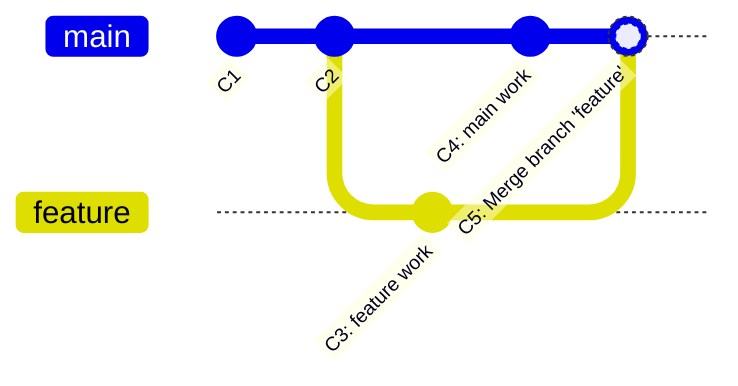
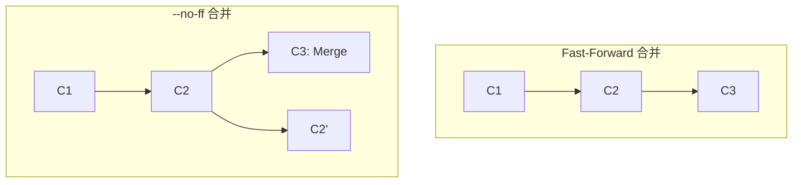
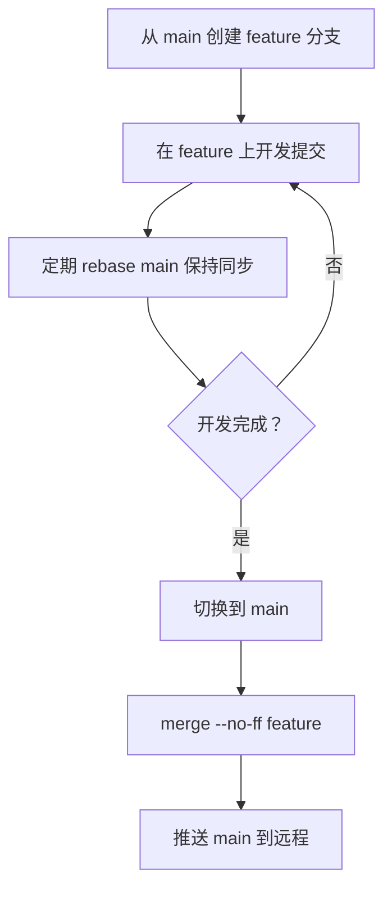

# merge 与 rebase 的取舍与实战

## 前言

**C：** 合并分支时你一定纠结过用 `git merge` 还是 `git rebase`。两者都能把分支整合到一起，但方式截然不同，选择不当可能导致混乱的提交历史。本文通过实际场景对比两者的差异，帮你找到适合团队的合并策略。

<!-- more -->

## 两种方式的基本原理

### git merge

`git merge` 会创建一个新的合并提交（merge commit），将两个分支的历史连接在一起：



合并后的提交历史保留了完整的分支拓扑，能够清楚地看到分支何时分叉、何时合并。

### git rebase

`git rebase` 则是"重新播放"你的提交，让它们基于目标分支的最新提交之上：


::: tip 笔者说
rebase 后的提交虽然是相同的内容，但它们的哈希值已经改变了。因为父提交变了，Git 会为每个提交生成新的 SHA-1。
:::

## 详细对比

| 特性 | merge | rebase |
|------|-------|--------|
| 提交历史 | 保留完整的分支拓扑，有合并记录 | 线性历史，看不到分支痕迹 |
| 合并提交 | 会产生额外的合并提交 | 不产生合并提交 |
| 冲突处理 | 一次性解决所有冲突 | 逐个提交解决冲突 |
| 安全性 | 不改变已有提交历史 | 改写提交历史（需谨慎） |
| 适用场景 | 公共分支、团队协作 | 个人本地分支、整合前清理 |
| 回滚难度 | 可以整体回滚一个合并提交 | 需要逐个提交回滚 |

## Fast-Forward 合并

当目标分支没有新的提交时，`git merge` 会执行快进合并（Fast-Forward），直接将分支指针移动到被合并分支的位置：

```shell
# fast-forward 合并（默认行为）
git merge feature

# 强制创建合并提交（即使可以快进）
git merge --no-ff feature

# 禁止快进合并
git merge --no-ff feature
```



::: tip 笔者说
在团队协作中，建议对重要分支使用 `--no-ff` 合并，这样能清楚地看到一个功能分支的完整生命周期（从创建到合并）。
:::

## merge 实战

### 基本合并

```shell
# 切换到目标分支
git switch main

# 合并 feature 分支
git merge feature
```

### 合并时发生冲突

```shell
# 合并时出现冲突
git merge feature
# Auto-merging index.html
# CONFLICT (content): Merge conflict in index.html
# Automatic merge failed; fix conflicts and then commit the result.
```

冲突标记格式：

```html
<<<<<<< HEAD
<main>
  <h1>当前分支的内容</h1>
</main>
=======
<main>
  <h1>feature 分支的内容</h1>
</main>
>>>>>>> feature
```

解决冲突的步骤：

```shell
# 1. 打开冲突文件，手动编辑解决冲突
# 2. 删除 <<<<<<< / ======= / >>>>>>> 标记
# 3. 将解决后的文件添加到暂存区
git add index.html

# 4. 完成合并提交
git commit -m "merge feature, resolve conflict in index.html"
```

### 合并后取消合并

```shell
# 如果合并后发现问题，取消合并（合并前的工作区是干净的）
git merge --abort

# 如果已经提交了合并，可以用 revert 撤销
git revert -m 1 HEAD
```

::: warning 注意
`-m 1` 选项指定保留哪个父提交。`1` 表示保留主分支（HEAD），将合并的修改撤销。
:::

## rebase 实战

### 基本变基

```shell
# 切换到需要变基的分支
git switch feature

# 将 feature 分支的提交变基到 main 上
git rebase main
```

### 变基时发生冲突

```shell
# 变基过程中出现冲突
git rebase main
# error: could not apply 3a2b1c0... feature commit 1
# Resolve all conflicts manually, mark them as resolved with
# "git add/rm <conflicted_files>", then run "git rebase --continue".

# 1. 解决冲突
# 2. 添加到暂存区
git add index.html

# 3. 继续变基（处理下一个提交）
git rebase --continue

# 如果想放弃变基
git rebase --abort
```

::: tip 笔者说
rebase 逐个提交处理，所以如果 5 个提交中有 3 个冲突，你可能需要解决 3 次冲突（尽管很多情况下 Git 会智能地减少重复冲突）。
:::

### 交互式变基

交互式变基让你可以精细控制提交的顺序和内容：

```shell
# 对最近 3 个提交进行交互式变基
git rebase -i HEAD~3
```

会打开编辑器，显示：

```
pick 3a2b1c0 feature commit 1
pick 4d5e6f1 feature commit 2
pick 7g8h9i2 feature commit 3
```

可用操作：

| 命令 | 说明 |
|------|------|
| `pick` | 保留该提交 |
| `reword` | 保留提交但修改提交信息 |
| `edit` | 保留提交但暂停以修改内容 |
| `squash` | 将该提交与前一个提交合并 |
| `fixup` | 类似 squash，但丢弃该提交信息 |
| `drop` | 丢弃该提交 |

交互式 rebase 的详细用法在下一篇会有更深入的讲解。

## 黄金法则

### 不要对公共分支执行 rebase

这是 Git 社区最重要的规则之一：

> **永远不要对已经推送到远程且被他人使用的分支执行 rebase。**


::: warning 严重警告
对公共分支 rebase 并 force push 会导致团队成员的本地分支与你产生分歧，需要手动修复。
:::

### 推荐的工作模式



个人分支可以用 rebase 保持与 main 同步：

```shell
# 在 feature 分支上定期同步 main 的最新代码
git fetch origin
git rebase origin/main
```

合并到 main 时使用 merge：

```shell
git switch main
git merge --no-ff feature
```

这样既保持了 main 分支历史的可读性（有合并记录），又让 feature 分支的提交历史整洁（线性）。

## 冲突预防技巧

### 频繁同步

```shell
# 每天开始工作前同步
git fetch origin
git rebase origin/main

# 或使用 merge 同步
git fetch origin
git merge origin/main
```

### 细粒度提交

将大功能拆分为小提交，这样：
- 冲突范围更小，更容易解决
- rebase 时每个提交的冲突更容易定位
- 出问题时可以用 `git bisect` 精确定位

### 使用工具辅助

```shell
# 图形化查看分支状态
git log --oneline --graph --all --decorate

# 查看两个分支的差异
git diff main...feature
```

## 小结

- **merge** 适合公共分支的整合，保留完整历史，安全可靠
- **rebase** 适合个人本地分支的整理，保持线性历史
- **黄金法则**：不要对已推送的公共分支 rebase
- **推荐模式**：个人分支用 rebase 同步，公共分支用 `--no-ff` merge 合并

掌握了 merge 和 rebase 的选择后，下一篇我们来讨论团队协作中常见的分支策略模型。
