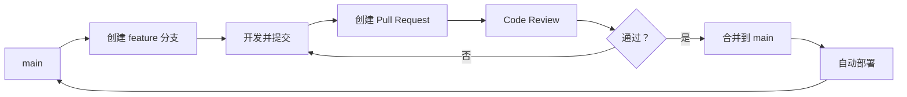

# 多人协作中的分支策略

## 前言

**C：** 两个人用 Git 和二十个人用 Git 是完全不同的体验。如果没有统一的分支策略，团队成员各写各的，最终合并时会一团糟。本文介绍几种业界主流的分支策略模型，帮你根据团队规模和项目特点选择合适的方案。

<!-- more -->

## 为什么需要分支策略

没有规范的分支管理会导致以下问题：
- 不知该从哪个分支拉代码开始开发
- 功能代码混杂在一起，难以追踪
- 发布时不知道哪些提交该上、哪些不该上
- 紧急修复难以插入正在开发的功能中

一个好的分支策略需要回答：
- **谁在什么分支上开发？**
- **代码怎么从开发分支到生产环境？**
- **紧急修复怎么处理？**

## Git Flow

Git Flow 是最经典的分支策略，由 Vincent Driessen 在 2010 年提出，适合发布周期较长的项目。

### 分支类型

| 分支 | 说明 | 生命周期 |
|------|------|----------|
| `main` / `master` | 生产环境代码，每次合并都打标签发布 | 永久 |
| `develop` | 开发主线，集成所有功能 | 永久 |
| `feature/*` | 功能开发 | 临时 |
| `release/*` | 发布准备 | 临时 |
| `hotfix/*` | 紧急修复 | 临时 |

### 工作流程

```mermaid
gitGraph
    commit id: "init"
    branch develop
    checkout develop
    commit id: "dev work"
    branch feature/login
    checkout feature/login
    commit id: "login 1"
    commit id: "login 2"
    checkout develop
    merge feature/login id: "merge login"
    branch release/1.0
    checkout release/1.0
    commit id: "bump version"
    commit id: "fix bug"
    checkout main
    merge release/1.0 id: "release 1.0" tag: "v1.0"
    checkout develop
    merge release/1.0 id: "back to dev"
    checkout main
    branch hotfix/fix-crash
    checkout hotfix/fix-crash
    commit id: "fix crash"
    checkout main
    merge hotfix/fix-crash id: "hotfix 1.0.1" tag: "v1.0.1"
    checkout develop
    merge hotfix/fix-crash id: "back to dev"
```

### 具体操作

```shell
# === 功能开发 ===
# 从 develop 创建功能分支
git switch -c feature/login develop

# 开发完成后合并回 develop
git switch develop
git merge --no-ff feature/login
git branch -d feature/login

# === 发布准备 ===
# 从 develop 创建 release 分支
git switch -c release/1.0 develop

# release 分支只修 Bug、更新版本号、更新文档
git commit -m "bump version to 1.0"

# 合并到 main 打标签
git switch main
git merge --no-ff release/1.0
git tag -a v1.0 -m "version 1.0"

# 合并回 develop
git switch develop
git merge --no-ff release/1.0
git branch -d release/1.0

# === 紧急修复 ===
# 从 main 创建 hotfix 分支
git switch -c hotfix/fix-crash main

# 修复后同时合并到 main 和 develop
git switch main
git merge --no-ff hotfix/fix-crash
git tag -a v1.0.1 -m "hotfix 1.0.1"

git switch develop
git merge --no-ff hotfix/fix-crash
git branch -d hotfix/fix-crash
```

### Git Flow 的优缺点

**优点：**
- 各分支职责明确，适合发布周期长的项目
- release 分支为发布前的测试和修复提供了缓冲区
- hotfix 分支让紧急修复可以绕过开发流程直接上线

**缺点：**
- 分支较多，流程复杂，对新人不太友好
- 功能开发完需要等待 release 才能上线，响应不够快
- 如果团队成员习惯不好，develop 分支也会变得混乱

## GitHub Flow

GitHub Flow 是更简洁的分支策略，适合持续部署的项目。

### 核心原则



**规则很简单：**
1. `main` 分支始终是可部署的
2. 任何功能开发都从 `main` 创建新分支
3. 通过 Pull Request 进行 Code Review
4. 合并后自动部署

### 具体操作

```shell
# 1. 从最新的 main 创建分支
git switch main
git pull
git switch -c feature/user-profile

# 2. 开发并频繁提交
git add .
git commit -m "add user profile page"

# 3. 推送到远程
git push -u origin feature/user-profile

# 4. 在 GitHub/GitLab 上创建 Pull Request
# 5. Code Review 通过后合并

# 6. 本地同步
git switch main
git pull
git branch -d feature/user-profile
```

### GitHub Flow 的优缺点

**优点：**
- 流程简单，上手快
- 与 CI/CD 配合紧密
- 适合快速迭代的 Web 项目

**缺点：**
- 没有 release 分支，不适合需要发布周期管理的项目
- 没有明确的 hotfix 流程（实际上任何修复都是 feature 分支）
- 如果没有强大的测试套件，main 分支的"始终可部署"很难保证

## GitLab Flow

GitLab Flow 是 Git Flow 和 GitHub Flow 的折中方案，增加了环境分支的概念。

### 环境分支


- `main`：开发环境的代码
- `staging`：预发布环境
- `production`：生产环境

代码通过合并从一个环境流向下一个环境，每个环境对应一个分支。

### 版本发布分支

对于需要版本管理的项目，还可以维护版本发布分支：

```
main → 2-3-stable → production
```

这样既能持续部署，又能为不同版本提供维护。

## 如何选择

| 项目特点 | 推荐策略 |
|---------|---------|
| Web 应用，持续部署 | GitHub Flow |
| 发布周期明确（如每月/季度） | Git Flow |
| 需要多环境部署 | GitLab Flow |
| 开源项目 | GitHub Flow |
| 嵌入式/移动端，版本管理严格 | Git Flow |
| 小团队（3-5人） | GitHub Flow |
| 大团队，多项目并行 | Git Flow 或 GitLab Flow |

::: tip 笔者说
没有银弹。很多团队用的是"简化版 Git Flow"：只保留 main、develop、feature 三种分支，不做 release 和 hotfix 的严格区分。够用就好，不要过度设计。
:::

## 通用最佳实践

无论选择哪种策略，以下实践都有帮助：

### 1. 分支命名规范

```shell
# 功能分支
feature/user-login
feature/add-export-csv

# 修复分支
fix/memory-leak
fix/typo-in-readme

# 紧急修复
hotfix/security-patch
hotfix/db-connection-timeout
```

### 2. 功能分支生命周期

```shell
# 功能分支存在时间不宜过长
# 如果超过两周还在开发，考虑拆分

# 定期同步主分支的更新
git fetch origin
git merge origin/main

# 开发完成后及时删除
git branch -d feature/xxx
```

### 3. 保持主分支稳定

```shell
# main/develop 分支应该始终能通过 CI
# 合并前确保测试通过
# 合并后及时通知团队成员拉取最新代码
```

### 4. 使用 .gitattributes 统一行为

```gitattributes
# 统一行尾
* text=auto eol=lf

# 特殊文件保持原有行尾
*.bat text eol=crlf
```

## 小结

- **Git Flow**：功能强大但复杂，适合发布周期长的项目
- **GitHub Flow**：简洁高效，适合持续部署的 Web 项目
- **GitLab Flow**：兼顾两者，适合多环境部署场景
- 选择策略的核心是匹配项目特点和团队规模
- 通用实践：规范命名、控制分支生命周期、保持主分支稳定

下一篇我们将讨论分支保护机制和强制推送的注意事项，这些是多人协作中保障代码安全的重要手段。
