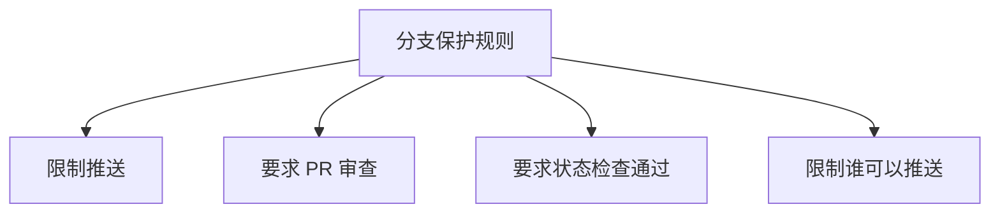
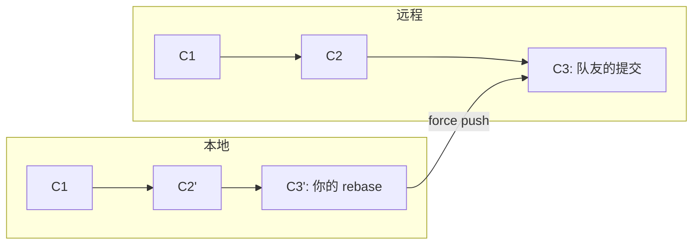
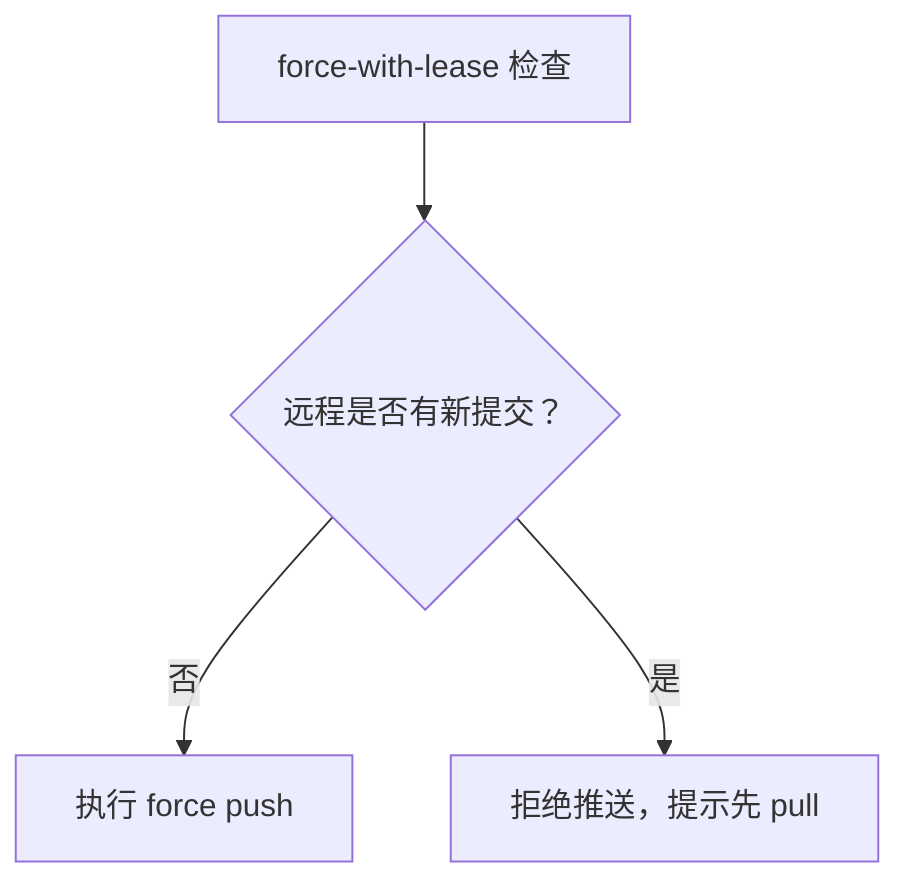

# 分支保护与强制推送的注意事项

## 前言

**C：** 一个人用 Git，怎么折腾都行；多人协作时，一顿 `push --force` 操作下去，队友的代码可能就全乱了。本文介绍远程仓库的分支保护机制和强制推送的安全用法，帮你守住团队协作的底线。

<!-- more -->

## 为什么需要分支保护

团队协作中，`main` 或 `develop` 这样的关键分支如果被随意推送，可能导致：

- 未经验证的代码直接进入主分支
- 有人误操作覆盖了别人的提交
- 历史被改写导致团队其他成员本地仓库状态混乱

分支保护规则可以在服务器端防止这些问题。

## GitHub/GitLab 分支保护设置

### GitHub 分支保护

在仓库的 **Settings → Branches → Branch protection rules** 中配置：



主要选项：

| 保护选项 | 说明 |
|---------|------|
| Require a pull request before merging | 必须通过 PR 合并，可设置最少审查人数 |
| Require status checks to pass | 必须通过 CI 检查（测试、构建等） |
| Require signed commits | 必须使用 GPG 签名提交 |
| Require linear history | 禁止合并提交，强制使用 rebase 或 squash |
| Include administrators | 管理员也受保护规则约束 |
| Restrict who can push to matching branches | 限制只有指定角色可以推送 |

### GitLab 分支保护

在仓库的 **Settings → Repository → Protected branches** 中配置：

| 保护选项 | 说明 |
|---------|------|
| Allowed to merge | 指定可以合并的角色 |
| Allowed to push | 指定可以推送的角色 |
| Allowed to merge and push | 合并和推送的权限 |
| Code Owners | 需要 CODEOWNERS 文件中指定的人审批 |

### 使用 CODEOWNERS 文件

CODEOWNERS 文件定义了代码的"所有者"，PR 必须经过所有者的审批才能合并：

```gitattributes
# CODEOWNERS 文件放在仓库根目录或 .github/ 目录下

# 所有文件需要 @team-lead 审批
* @team-lead

# src/api/ 目录下的变更需要 @api-team 审批
/src/api/ @api-team

# docs/ 目录下的变更需要 @docs-team 审批
/docs/ @docs-team
```

## 强制推送的危险性

### 什么是 force push

`git push --force` 会用本地分支覆盖远程分支，丢弃远程上但本地没有的提交：



### 灾难场景

```shell
# 你在本地 rebase 了 feature 分支
git rebase main

# 然后强制推送
git push --force origin feature

# 队友的仓库状态
# 他的本地 feature 分支还指向旧的 C3
# 但远程的 feature 分支已经是新的 C3' 了
# 下次 push 会产生冲突，pull 也可能混乱
```

::: warning 严重警告
在公共分支（如 main、develop）上执行 force push 几乎总是错误的做法。
:::

## 安全使用 force push

### 规则一：只对个人分支 force push

```shell
# ✅ 安全：自己的 feature 分支，还没人基于它开发
git push --force origin feature/my-feature

# ❌ 危险：公共分支，多人正在使用
git push --force origin develop
```

### 规则二：使用 --force-with-lease

```shell
# 比 --force 更安全
# 如果远程有新的提交（你不知道的），会拒绝推送
git push --force-with-lease origin feature
```

`--force-with-lease` 的工作原理：



::: tip 笔者说
养成用 `--force-with-lease` 代替 `--force` 的习惯。如果嫌太长，可以在全局 gitconfig 中设置别名：
:::

```shell
git config --global alias.push-force "push --force-with-lease"
```

### 规则三：通知团队成员

如果确实需要对共享分支 force push：

```shell
# 1. 先在团队群里通知
# 2. 执行 force push
git push --force-with-lease origin develop

# 3. 告诉队友同步
# 队友操作：
# git fetch origin
# git reset --hard origin/develop
```

## 常见危险操作与替代方案

### 危险操作：rebase 已推送的公共分支

```shell
# ❌ 危险
git rebase main develop
git push --force origin develop
```

**替代方案：** 使用 merge 代替 rebase

```shell
# ✅ 安全
git switch develop
git merge main
git push origin develop
```

### 危险操作：reset 已推送的提交

```shell
# ❌ 危险：删除了远程上的提交
git reset --hard HEAD~3
git push --force origin main
```

**替代方案：** 使用 revert

```shell
# ✅ 安全：创建一个新的提交来撤销
git revert HEAD~2..HEAD
git push origin main
```

### 危险操作：amend 已推送的提交

```shell
# ❌ 危险
git commit --amend -m "fix typo"
git push --force origin feature
```

**替代方案：** 如果只是修小问题，追加一个提交

```shell
# ✅ 安全
git commit -m "fix: typo in previous commit"
git push origin feature
```

## 配置别名防误操作

```shell
# 安全别名
git config --global alias.push-force "push --force-with-lease"

# 禁止直接使用 --force 的提醒
# 可以通过 pre-push hook 实现（见后文）
```

### 使用 pre-push hook 防止意外 force push

在仓库的 `.git/hooks/pre-push` 中添加：

```shell
#!/bin/sh

# 防止对 main 和 develop 分支执行 force push
protected_branches="main master develop"

current_branch=$(git rev-parse --abbrev-ref HEAD)

for branch in $protected_branches; do
    if [ "$current_branch" = "$branch" ]; then
        # 检查是否是 force push
        if echo "$@" | grep -q "\-\-force"; then
            echo "⛔ 错误：禁止对 $branch 分支执行 force push！"
            echo "请使用 merge 或 revert 代替。"
            exit 1
        fi
    fi
done

exit 0
```

```shell
# 给予执行权限
chmod +x .git/hooks/pre-push
```

## 撤销误操作的救命方法

### 撤销 force push（远程被覆盖后）

如果你不小心 force push 覆盖了远程分支，且队友已丢失了本地副本：

```shell
# 1. 队友检查 reflog 是否有旧提交
git reflog

# 2. 找到 force push 之前的提交
# 例如显示：a1b2c3d HEAD@{2}: commit: important work

# 3. 恢复到该提交
git switch main
git reset --hard a1b2c3d

# 4. 重新推送
git push --force-with-lease origin main
```

::: tip 笔者说
reflog 保留约 90 天的操作记录，是撤销误操作的救命稻草。但前提是队友没有清理过 reflog（默认配置下不会自动清理）。
:::

### 误删远程分支后恢复

```shell
# 误删远程分支
git push origin --delete feature-xxx

# 恢复方法：从本地分支重新推送
git push -u origin feature-xxx

# 如果本地分支也没了，从 reflog 找到并恢复
git reflog  # 找到 feature-xxx 分支的最后提交
git switch -c feature-xxx <commit-hash>
git push -u origin feature-xxx
```

## 小结

| 原则 | 说明 |
|------|------|
| 保护关键分支 | 使用 GitHub/GitLab 的分支保护规则 |
| 避免 force push 公共分支 | 只对个人分支使用 |
| 优先使用 `--force-with-lease` | 比 `--force` 更安全 |
| 通知团队 | 必须 force push 时提前沟通 |
| 用 revert 代替 reset | 撤销已推送的提交时更安全 |
| 利用 reflog | 它是你误操作后的最后一根救命稻草 |

下一篇我们将进入 Git 历史改写的高级操作，深入讲解交互式 rebase、cherry-pick、stash 等实用技巧。
