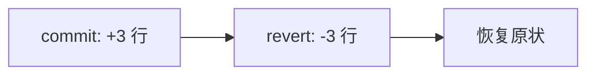
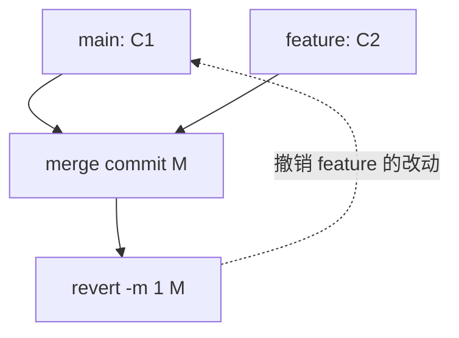
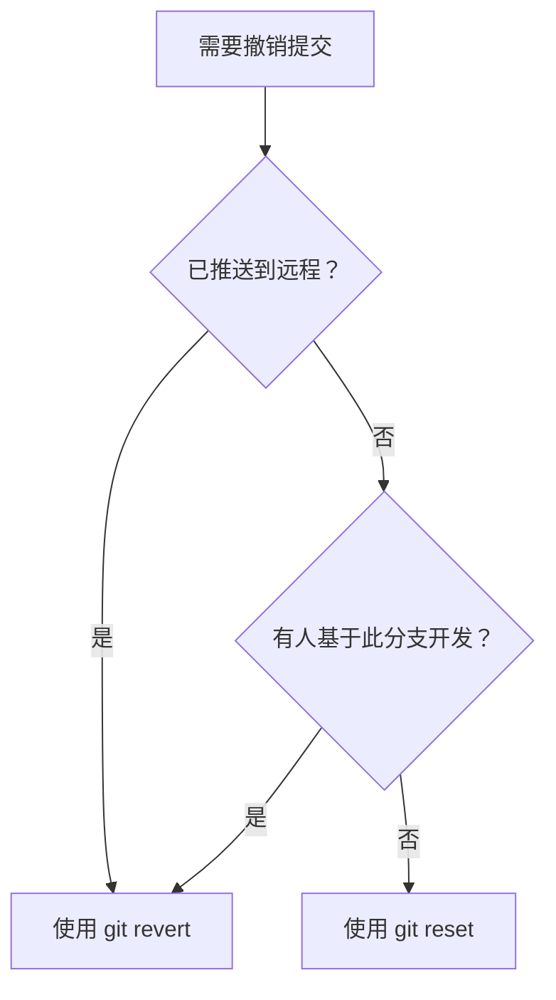

# revert 与 revert 冲突处理

## 前言

**C：** 代码提交了才发现有问题？想撤销某个提交但已经 push 了？`git revert` 是最安全的撤销方式——它不会改写历史，而是创建一个新的提交来"反向"之前的改动。本文详解 revert 的用法和冲突处理。

<!-- more -->

## revert 的基本原理

`git revert` 通过创建一个新提交，其内容是目标提交的**逆操作**：



::: tip 笔者说
revert 和 reset 的核心区别：reset 是"时光倒流"，直接删除提交；revert 是"添加一个撤销动作"，不改变已有历史。在公共分支上，应该始终使用 revert。
:::

## 基本用法

### 撤销单个提交

```shell
# 撤销最新的提交
git revert HEAD

# 撤销指定提交
git revert a1b2c3d
```

### 撤销多个提交

```shell
# 撤销最近 3 个提交（按从旧到新的顺序生成 3 个 revert 提交）
git revert HEAD~2 HEAD~1 HEAD

# 撤销一个范围内的提交（不含 start-commit）
git revert start-commit..end-commit

# 一次 revert 多个提交为一个合并提交
git revert --no-commit HEAD~3..HEAD
git commit -m "revert: undo last 3 commits"
```

### 撤销 merge commit

```shell
# revert 一个合并提交（有多个父提交）
git revert -m 1 <merge-commit-hash>
```

`-m 1` 表示以第一个父提交（通常是主分支）为基准进行撤销。 `-m 2` 则以第二个父提交（被合并的分支）为基准。



::: tip 笔者说
不确定用 `-m 1` 还是 `-m 2`？用 `git cat-file -p <merge-hash>` 查看父提交：
- `parent 1` 通常是 main 分支 → `-m 1` 保留 main，撤销 feature 的内容
- `parent 2` 通常是 feature 分支 → `-m 2` 保留 feature，撤销 main 的内容
:::

## 常用选项

| 选项 | 说明 |
|------|------|
| `--no-commit` | 只应用逆向改动，不自动创建提交 |
| `--no-edit` | 使用自动生成的提交信息，不打开编辑器 |
| `-e` / `--edit` | 允许编辑 revert 的提交信息（默认行为） |
| `-n` | 和 `--no-commit` 一样 |

## 实战场景

### 场景一：撤销已推送的错误提交

```shell
# 不小心推送了一个有 Bug 的提交
# 提交哈希：a1b2c3d

# 安全撤销（不影响历史）
git revert a1b2c3d
# 自动生成提交信息：
# Revert "feat: add broken feature"
# This reverts commit a1b2c3d.

git push origin main
```

### 场景二：撤销一个完整的 feature

如果整个 feature 分支被合并后发现问题，需要全部撤销：

```mermaid
gitGraph
    commit id: "C1: init"
    commit id: "C2: base"
    merge feature id: "M: merge feature"
    commit id: "C3: revert M"
```

```shell
# 查看 merge commit 的哈希
git log --oneline --merges
# a1b2c3d Merge branch 'feature'

# 撤销整个 feature merge
git revert -m 1 a1b2c3d
git push origin main
```

### 场景三：撤销 revert（还原撤销）

如果之后决定之前的 feature 其实是对的，可以"撤销 revert"：

```shell
# 查看 revert 提交
git log --oneline
# a1b2c3d Revert "feat: add feature X"
# d4e5f6g feat: add feature X

# 撤销 revert，相当于重新引入 feature
git revert a1b2c3d
```

这种 "revert a revert" 的模式常用于临时关闭功能后重新开启。

## revert 冲突处理

revert 时产生冲突的原因：在目标提交之后，相同的代码又被修改过。

```
时间线：
C1: 原始代码（第 10 行是 "hello"）
C2: 修改第 10 行为 "world"  ← 你想 revert 这个
C3: 修改第 10 行为 "universe"  ← 和 C2 冲突了
```

Git 不知道 revert C2 时应该恢复成 "hello" 还是保留 C3 的 "universe"。

### 冲突解决步骤

```shell
# 1. 执行 revert，出现冲突
git revert a1b2c3d
# CONFLICT (content): Merge conflict in some-file.js

# 2. 查看冲突
git status
git diff

# 3. 打开文件，理解冲突的含义
# <<<<<<< HEAD (当前代码)
# line 10 is "universe"
# ||||||| a1b2c3d (revert 前的代码)
# line 10 is "world"
# ======= (revert 后应该恢复的代码)
# line 10 is "hello"
# >>>>>>> parent of a1b2c3d

# 4. 根据实际情况选择保留哪个版本
#    如果 C3 的改动是独立的，保留 "universe"
#    如果 C3 的改动依赖 C2，恢复为 "hello"

# 5. 解决冲突
git add some-file.js

# 6. 继续 revert
git revert --continue

# 如果想放弃
git revert --abort
```

### 冲突处理策略

| 情况 | 处理方式 |
|------|---------|
| C3 独立于 C2 的改动 | 手动合并，保留两者的有效修改 |
| C3 依赖 C2 | 保留 C3 的改动（不要 revert C2，或连同 C3 一起 revert） |
| C3 修正了 C2 的问题 | 保留 C3，放弃 revert |

::: tip 笔者说
revert 冲突比 merge 冲突更难判断意图。遇到冲突时，先理解 C3 为什么改了同样的代码，再决定怎么解决。不要盲目地选择一边。
:::

### 批量 revert 中的冲突

```shell
# revert 一个范围内的提交，遇到冲突时
git revert HEAD~5..HEAD

# 第 2 个 revert 冲突了
# 选项 1：解决后继续
git add .
git revert --continue

# 选项 2：跳过这个提交
git revert --skip

# 选项 3：放弃整个操作
git revert --abort
```

## revert 与 reset 对比

| 特性 | `git revert` | `git reset` |
|------|-------------|-------------|
| 是否改写历史 | ❌ 不改写 | ✅ 改写 |
| 是否创建新提交 | ✅ 创建 | ❌ 不创建 |
| 对已推送的提交 | ✅ 安全 | ❌ 危险 |
| 对未推送的提交 | ✅ 安全 | ✅ 可用（更直接） |
| 适用场景 | 公共分支、团队协作 | 个人本地分支 |

### 选择指南



## 小结

- **revert** 是撤销提交的安全方式，创建新提交而非改写历史
- 已推送的提交始终用 revert 撤销
- revert merge commit 时使用 `-m 1` 或 `-m 2` 选择父提交
- revert 冲突需要理解后续提交的意图后再解决
- "revert a revert" 可以恢复之前撤销的功能

下一篇我们学习 `git stash`，它可以在不提交的情况下暂存工作区的修改。
