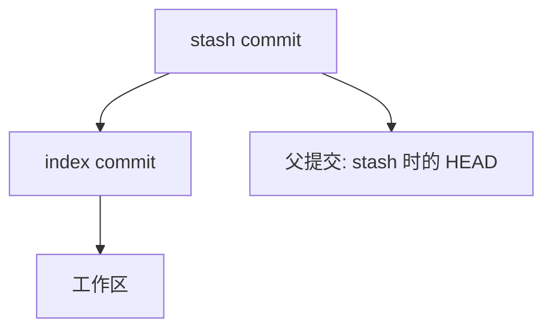

# stash 暂存工作区进阶用法

## 前言

**C：** 正在 feature 分支上写代码，突然被告知要修一个紧急 Bug。但当前修改还没写完，不想 commit 一半的代码怎么办？`git stash` 就是你的"暂停键"——把当前工作区的修改临时收起来，切到别的分支处理完，再回来"继续播放"。

<!-- more -->

## 基本用法

### 保存和恢复

```shell
# 保存当前工作区和暂存区的修改
git stash

# 查看保存的 stash 列表
git stash list

# 恢复最近的 stash（并删除该 stash 记录）
git stash pop

# 恢复最近的 stash（但不删除 stash 记录）
git stash apply
```

::: tip 笔者说
`pop` 和 `apply` 的区别：`pop` 恢复后自动删除该 stash，`apply` 恢复后保留。如果你不确定恢复后是否会冲突，先 `apply` 看看，确认没问题再 `drop`。
:::

### 带消息的 stash

```shell
# 给 stash 加一个描述消息，方便后续查找
git stash push -m "feature-login: 半完成的登录页面"
```

## stash 的存储结构

stash 本质上是一个特殊的提交（实际上包含 2-3 个提交）：



- **工作区提交**：工作区中未暂存的修改
- **index 提交**：已暂存的修改（`git add` 过的文件）
- **stash 提交**：父提交是执行 stash 时的 HEAD

这就是为什么 stash 能完整恢复工作区和暂存区的状态。

## 常用选项

### stash push（推荐写法）

```shell
# 保存工作区和暂存区（默认行为）
git stash push

# 只保存暂存区的修改（忽略未暂存的修改）
git stash push --staged

# 只保存指定文件
git stash push -m "save config" config.js .env

# 保存包含未追踪的新文件
git stash push -u

# 保存包含未追踪的新文件和忽略的文件
git stash push -a
```

::: tip 笔者说
默认的 `git stash` 不会保存新创建的未追踪文件。如果需要临时藏起来的是新文件，记得用 `-u`（`--include-untracked`）。
:::

### 查看 stash 内容

```shell
# 查看 stash 列表
git stash list
# stash@{0}: On feature-login: feature-login: 半完成的登录页面
# stash@{1}: WIP on main: a1b2c3d latest commit

# 查看 stash 中的具体修改
git stash show stash@{0}
#  config.js  | 10 +++++-----
#  index.html |  5 ++++-

# 查看详细的 diff
git stash show -p stash@{0}

# 查看某个 stash 的提交信息
git log -1 stash@{0}
```

### 操作指定 stash

```shell
# 恢复指定的 stash
git stash apply stash@{1}

# 恢复到不同的分支
git stash branch stash-fix stash@{0}
# 这会创建 stash-fix 分支，应用 stash，然后删除该 stash

# 删除指定 stash
git stash drop stash@{1}

# 清空所有 stash
git stash clear
```

## 实战场景

### 场景一：紧急修复 Bug

```shell
# 1. 正在 feature 分支上开发
git switch feature-login

# 2. 突然需要修紧急 Bug
git stash push -m "feature-login: WIP"

# 3. 切到 main 修 Bug
git switch main
git pull
# ... 修 Bug，提交，推送 ...

# 4. 切回 feature 分支，恢复工作
git switch feature-login
git stash pop
```

### 场景二：同步最新代码

```shell
# feature 分支开发很久了，需要同步 main 的最新代码
# 但当前有未提交的修改

# 1. 暂存修改
git stash push -u -m "WIP before rebase"

# 2. 同步 main
git fetch origin
git rebase origin/main

# 3. 恢复修改
git stash pop
```

### 场景三：在多个分支间穿梭

```shell
# 需要在多个分支上做小修改，不想每次都 commit

# 在分支 A 上改东西
git stash push -m "branch-A changes"

# 切到分支 B
git switch branch-B
git stash pop stash@{0}  # 恢复之前的修改
# ... 继续改 ...

# 再切到分支 C
git stash push -m "branch-B changes"
git switch branch-C
# ...
```

### 场景四：stash 冲突处理

```shell
# stash pop 时可能产生冲突
git stash pop
# Auto-merging index.html
# CONFLICT (content): Merge conflict in index.html

# 解决冲突
vim index.html
git add index.html

# 手动删除 stash（因为 pop 遇到冲突时不会自动删除）
git stash drop
```

## 高级技巧

### 创建分支应用 stash

```shell
# 从 stash 创建一个新分支
# 如果 stash 是基于旧版本创建的，可能会冲突
# 使用 branch 可以在一个干净的新分支上安全地应用

git stash branch fix-from-stash stash@{0}
```

这会：
1. 基于 stash 时的 HEAD 创建新分支 `fix-from-stash`
2. 应用 stash 的修改
3. 删除该 stash

### 部分应用 stash

```shell
# 默认 apply 会恢复所有文件
# 如果只想恢复某个文件：
git checkout stash@{0} -- config.js

# 或者使用 restore
git restore --source=stash@{0} config.js
```

### diff 比较两个 stash

```shell
# 比较 stash@{0} 和 stash@{1}
git diff stash@{0} stash@{1}
```

### stash 和 git worktree 的配合

如果你经常需要在不同分支间切换，`git worktree` 是比 stash 更优雅的方案：

```shell
# 为 main 分支创建一个独立的工作目录
git worktree add ../project-main main

# 现在你可以同时打开两个目录
# 当前目录：feature 分支
# ../project-main：main 分支
```

::: tip 笔者说
`git worktree` 是 Git 2.5+ 的功能，可以让你同时在多个分支上工作，完全不需要 stash。但它需要额外的磁盘空间，因为每个 worktree 都有完整的工作区文件。
:::

## 清理过期的 stash

```shell
# 查看 stash 列表
git stash list

# 删除指定 stash
git stash drop stash@{2}

# 清空所有
git stash clear
```

::: warning 注意
`git stash clear` 会清空所有 stash，不可恢复！操作前请确认不需要这些 stash 了。
:::

## stash 的注意事项

| 注意事项 | 说明 |
|---------|------|
| 不会被 push | stash 只存在于本地，不会推送到远程 |
| 不会被 GC 自动清理 | stash 会被保留，除非手动删除或 `git stash clear` |
| 冲突风险 | 如果应用 stash 时代码已经变化较大，可能冲突 |
| 不能 stash 空工作区 | 没有修改时 `git stash` 会提示 "No local changes to save" |
| 二进制文件 | 大文件和二进制文件的 stash 效率较低 |

## 小结

- `git stash` 是临时保存工作区修改的便捷工具
- 默认不保存未追踪文件，用 `-u` 可以包含
- `push -m` 加描述消息，方便管理多个 stash
- `pop` = 恢复 + 删除，`apply` = 只恢复不删除
- 冲突时 `pop` 不会自动删除 stash，需要手动 `drop`
- 频繁切换分支可以考虑 `git worktree` 替代 stash

下一篇我们来学习 `git bisect`，一个用二分法快速定位引入 Bug 的提交的强大工具。
