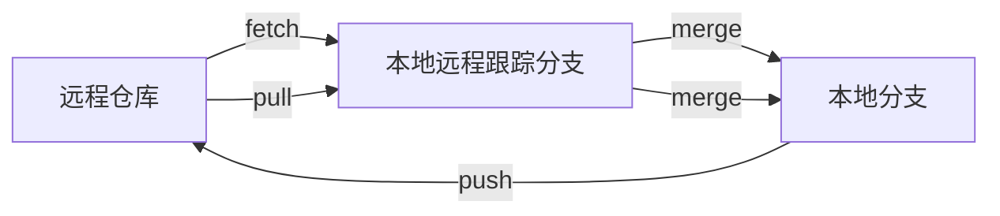
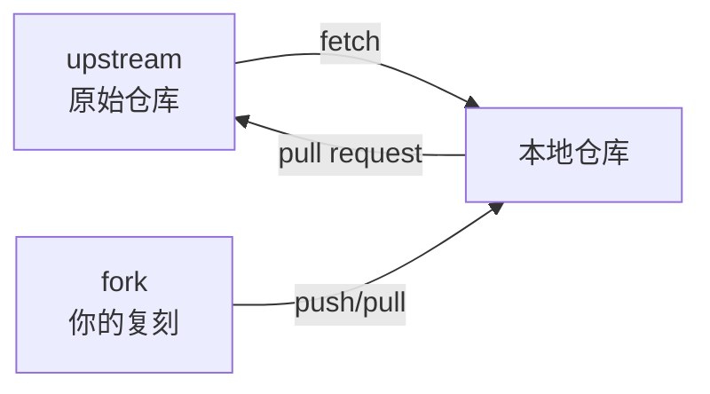

# 远程仓库管理

## 前言

**C：** Git 的强大在于分布式协作，而协作的核心就是远程仓库。你可能每天在用 `git push` 和 `git pull`，但你知道 `fetch`、`pull`、`push` 之间的细微区别吗？你知道怎么管理多个远程仓库吗？本文把这些细节讲清楚。

<!-- more -->

## 远程仓库基础

### 查看远程仓库

```shell
# 查看所有远程仓库
git remote -v
# origin  https://github.com/user/repo.git (fetch)
# origin  https://github.com/user/repo.git (push)

# 查看某个远程仓库的详细信息
git remote show origin
# * remote origin
#   Fetch URL: https://github.com/user/repo.git
#   Push  URL: https://github.com/user/repo.git
#   HEAD branch: main
#   Remote branches:
#     main    tracked
#     feature tracked
#   Local branches configured for 'git pull':
#     main   merges with remote main
#     feature merges with remote feature
#   Local refs configured for 'git push':
#     main    pushes to main    (up to date)
#     feature pushes to feature (fast-forwardable)
```

### 添加远程仓库

```shell
# 添加远程仓库
git remote add origin https://github.com/user/repo.git

# 添加多个远程仓库
git remote add upstream https://github.com/original/repo.git
git remote add fork https://github.com/user/fork-repo.git
```

### 修改远程仓库

```shell
# 修改远程仓库的 URL
git remote set-url origin https://github.com/user/new-repo.git

# 修改远程仓库名称
git remote rename old-name new-name
```

### 删除远程仓库

```shell
# 删除远程仓库引用
git remote rm origin
```

## fetch、pull 和 push 的区别



### git fetch

```shell
# 从远程获取最新数据（不改变工作区）
git fetch origin

# 获取所有远程仓库的最新数据
git fetch --all

# 获取特定分支
git fetch origin main

# 获取并创建本地分支
git fetch origin feature-branch:feature-branch
```

::: tip 笔者说
`git fetch` 只更新远程跟踪分支（如 `origin/main`），不会自动合并到你的本地分支。这让你可以先查看远程的改动，再决定是否合并。
:::

### git pull

```shell
# pull = fetch + merge
git pull origin

# 指定合并策略
git pull --rebase origin main
# 等价于：
# git fetch origin
# git rebase origin/main

# 使用 rebase 作为默认 pull 策略
git config pull.rebase true
# 或对当前仓库
git config --local pull.rebase true
```

### git push

```shell
# 推送当前分支到追踪的远程分支
git push

# 推送并设置上游追踪
git push -u origin feature-branch

# 推送所有分支
git push --all origin

# 推送所有标签
git push --tags origin

# 推送并删除远程分支
git push origin --delete feature-branch

# 删除远程标签
git push origin --delete v1.0.0
```

## 管理多个远程仓库

### 常见场景：Fork 仓库与上游仓库



```shell
# 克隆你的 fork
git clone https://github.com/user/fork-repo.git
cd fork-repo

# 添加上游仓库
git remote add upstream https://github.com/original/repo.git

# 从上游获取最新代码
git fetch upstream

# 将上游的 main 合并到你的 main
git switch main
git merge upstream/main

# 推送到你的 fork
git push origin main
```

### 推送到多个远程仓库

```shell
# 方法一：添加多个 remote，分别 push
git remote add origin1 https://github.com/user/repo.git
git remote add origin2 https://gitee.com/user/repo.git
git push origin1 main
git push origin2 main

# 方法二：为一个 remote 设置多个 push URL
git remote set-url --add --push origin https://github.com/user/repo.git
git remote set-url --add --push origin https://gitee.com/user/repo.git

# 现在每次 push origin 就会同时推送到两个地址
git push origin main
```

## 远程分支管理

### 查看远程分支

```shell
# 查看所有远程分支
git branch -r

# 查看所有分支（本地 + 远程）
git branch -a
```

### 基于远程分支创建本地分支

```shell
# 基于远程分支创建本地分支并追踪
git switch -c feature origin/feature

# 简写（如果远程分支名不存在歧义）
git switch feature

# 只检出（不创建追踪关系，分离 HEAD）
git checkout origin/feature
```

### 删除远程分支

```shell
# 删除远程分支
git push origin --delete feature-branch

# 清理本地已删除的远程跟踪分支
git fetch --prune
# 或
git remote prune origin
```

### 只推送当前分支

```shell
# 默认 push 只推送当前分支到追踪的远程分支
# 这是 Git 2.0+ 的默认行为
# 如果是旧版本，设置：
git config --global push.default current
```

## 裸仓库

裸仓库（bare repository）是没有工作区的仓库，通常用作远程服务器上的共享仓库。

```shell
# 创建裸仓库
git init --bare project.git

# 克隆裸仓库
git clone user@server:/path/to/project.git
```

::: tip 笔者说
GitHub、GitLab、Gitee 上的仓库本质上都是裸仓库。你 `git push` 时是把提交推送到一个没有工作区的裸仓库中。
:::

## 协议选择

| 协议 | 格式 | 适用场景 |
|------|------|---------|
| HTTPS | `https://github.com/user/repo.git` | 公共仓库、简单场景 |
| SSH | `git@github.com:user/repo.git` | 私有仓库、频繁操作 |
| Git | `git://github.com/user/repo.git` | 只读访问、匿名克隆 |
| 本地路径 | `/path/to/repo.git` | 同一台机器上的裸仓库 |

```shell
# 配置 SSH（一次性设置）
ssh-keygen -t ed25519 -C "your@email.com"
cat ~/.ssh/id_ed25519.pub
# 将公钥添加到 GitHub/GitLab 的 SSH Keys 设置中

# 测试 SSH 连接
ssh -T git@github.com
```

## 小结

- `fetch` 只获取不合并，`pull` = `fetch` + `merge`
- 推荐设置 `pull.rebase true` 使用 rebase 作为默认合并策略
- 多远程仓库管理是 Fork 协作模式的基础
- `--prune` 清理已删除的远程跟踪分支
- SSH 协议适合频繁操作，HTTPS 更简单

下一篇我们将讨论 Code Review 流程，包括 PR/MR 的创建、评审和合并最佳实践。
