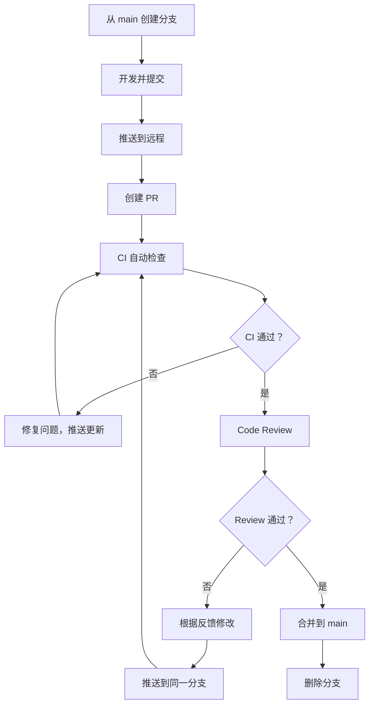

# Code Review 流程

## 前言

**C：** Code Review 是团队协作中保证代码质量的关键环节。无论是 GitHub 的 Pull Request 还是 GitLab 的 Merge Request，背后的流程是相通的。本文从实际操作角度出发，讲解如何规范地进行 Code Review。

<!-- more -->

## PR/MR 的基本概念

- **Pull Request (PR)**：GitHub、Bitbucket 的叫法
- **Merge Request (MR)**：GitLab 的叫法

两者本质相同：向目标分支请求合并你的修改，并在合并前进行讨论和审查。

## 创建高质量的 PR

### 分支命名

```shell
# 功能分支
feature/user-login

# 修复分支
fix/memory-leak-in-parser

# 重构分支
refactor/extract-service-layer

# 文档分支
docs/update-api-documentation
```

### PR 标题和描述

一个好的 PR 标题应该简洁明了地说明做了什么：

```
✅ 好的标题：
feat: add user login with JWT authentication
fix: resolve memory leak in JSON parser
refactor: extract service layer from controllers

❌ 不好的标题：
update code
fix bug
WIP
```

PR 描述模板：

```markdown
## 变更说明
简要描述本次修改的内容和原因。

## 变更类型
- [ ] 新功能 (feat)
- [ ] Bug 修复 (fix)
- [ ] 重构 (refactor)
- [ ] 文档更新 (docs)
- [ ] 性能优化 (perf)

## 测试
- [ ] 单元测试通过
- [ ] 集成测试通过
- [ ] 手动测试通过

## 关联 Issue
Closes #123
```

### 保持 PR 小而聚焦

| 特征 | 好的 PR | 不好的 PR |
|------|---------|----------|
| 改动行数 | 200-400 行以内 | 2000+ 行 |
| 涉及功能 | 单一功能 | 多个不相关的改动 |
| 文件数 | 5-10 个 | 30+ 个 |
| Review 时间 | 15-30 分钟 | 1+ 小时 |

::: tip 笔者说
如果一个 PR 超过 400 行，考虑拆分成多个小 PR。小的 PR 审查更快、更仔细，合并也更安全。
:::

### 提交历史整洁

在创建 PR 之前整理提交历史：

```shell
# 交互式 rebase 整理提交
git rebase -i origin/main

# 将零碎提交合并为有意义的提交
pick a1b2c3d feat: add login page
fixup d4e5f6g WIP: add form
fixup h7i8j9k WIP: add validation
```

## PR 操作流程

### 完整流程



### 命令行操作

```shell
# 1. 创建并切换到功能分支
git switch -c feature/user-login main

# 2. 开发并提交
git add .
git commit -m "feat: add user login with JWT"

# 3. 推送到远程
git push -u origin feature/user-login

# 4. 使用 GitHub CLI 创建 PR
gh pr create --title "feat: add user login" \
  --body "实现用户登录功能，使用 JWT 认证" \
  --reviewer teammate1,teammate2

# 5. 查看当前仓库的 PR 列表
gh pr list

# 6. 查看特定 PR 的详情
gh pr view 42

# 7. 合并 PR
gh pr merge 42 --squash
```

## Review 最佳实践

### 作为 Reviewer

**审查重点：**

| 审查维度 | 关注内容 |
|---------|---------|
| 正确性 | 逻辑是否正确，边界条件是否处理 |
| 可读性 | 代码是否容易理解，命名是否清晰 |
| 一致性 | 是否符合项目代码规范和已有风格 |
| 安全性 | 是否有安全漏洞（注入、XSS、权限等） |
| 性能 | 是否有明显性能问题 |
| 可维护性 | 是否易于修改和扩展 |

**评论格式建议：**

```markdown
# 必须修改（阻断合并）
🔴 必须修改：这里缺少输入验证，可能导致 SQL 注入。
建议使用参数化查询。

# 建议修改（不阻断）
🟡 建议：这个函数超过 50 行了，建议拆分为更小的函数。

# 提问（寻求理解）
🟢 提问：为什么选择在循环内创建连接而不是复用连接池？

# 赞赏
👍 这个抽象层的设计很清晰。
```

### 作为 PR 作者

```shell
# 根据反馈修改后推送
git add .
git commit -m "fix: add input validation for login form"
git push origin feature/user-login

# 如果 Reviewer 要求修改提交信息
git rebase -i origin/main
# 将 pick 改为 reword

# 强制更新 PR（已 push 过）
git push --force-with-lease origin feature/user-login
```

## 合并策略

### Squash Merge

```shell
# 将所有提交合并为一个
gh pr merge 42 --squash
```

**优点：** 主分支历史整洁，每个 PR 对应一个提交
**缺点：** 丢失了详细的提交历史

### Merge Commit

```shell
# 创建合并提交
gh pr merge 42 --merge
```

**优点：** 保留完整的提交历史和分支结构
**缺点：** 主分支历史不那么线性

### Rebase Merge

```shell
# 变基合并
gh pr merge 42 --rebase
```

**优点：** 线性历史，保留每个提交
**缺点：** 如果 PR 的提交很零碎，历史也会很零碎

::: tip 笔者说
大多数项目推荐使用 Squash Merge，这样主分支上每个功能对应一个整洁的提交。如果提交已经整理好了，Rebase Merge 也是好选择。
:::

## CI/CD 集成

### 通过分支保护规则设置 CI

在 GitHub 中：
1. **Settings → Branches → Branch protection rules**
2. 启用 **Require status checks to pass before merging**
3. 选择需要的 CI 检查项

```yaml
# .github/workflows/ci.yml 示例
name: CI
on:
  pull_request:
    branches: [main]
jobs:
  test:
    runs-on: ubuntu-latest
    steps:
      - uses: actions/checkout@v4
      - run: npm ci
      - run: npm test
      - run: npm run lint
```

### 本地运行相同的检查

```shell
# 在推送前运行和 CI 相同的检查
npm run lint
npm test
npm run build

# 使用 pre-push hook 自动运行
cat > .git/hooks/pre-push << 'EOF'
#!/bin/sh
echo "Running pre-push checks..."
npm run lint && npm test
if [ $? -ne 0 ]; then
    echo "❌ Pre-push checks failed. Push aborted."
    exit 1
fi
echo "✅ Pre-push checks passed."
EOF
chmod +x .git/hooks/pre-push
```

## 常见问题

### PR 冲突了怎么办

```shell
# 同步 main 的最新代码
git fetch origin
git rebase origin/main

# 如果有冲突，解决后继续
git rebase --continue

# 更新 PR
git push --force-with-lease origin feature/user-login
```

### PR 太大了怎么补救

```shell
# 方案一：拆分当前 PR
# 1. 创建新的分支用于第一部分
git switch -c feature/login-part1

# 2. 使用交互式 rebase 只保留部分提交
git rebase -i origin/main
# drop 不属于本次 PR 的提交

# 3. 推送并创建第一个 PR
git push -u origin feature/login-part1

# 方案二：逐个文件提交到不同分支
git switch -c feature/login-core
git checkout feature/user-login -- src/login/core.js
git commit -m "feat: add login core logic"
```

### 审查超时怎么办

- 使用 `CODEOWNERS` 文件指定必须审查的人
- 设置 PR 自动关闭的超时时间
- 在 Slack/钉钉/企业微信中配置通知

## 小结

- 保持 PR 小而聚焦，单个功能不超过 400 行
- PR 标题简洁，描述使用模板
- Review 关注正确性、可读性、安全性
- 推荐使用 Squash Merge 保持主分支整洁
- 配置 CI 自动检查，在推送前本地运行
- 使用 GitHub CLI (`gh`) 高效管理 PR

下一篇我们将讨论 Fork 协作模式与上游同步，这是开源项目贡献的核心工作流。
