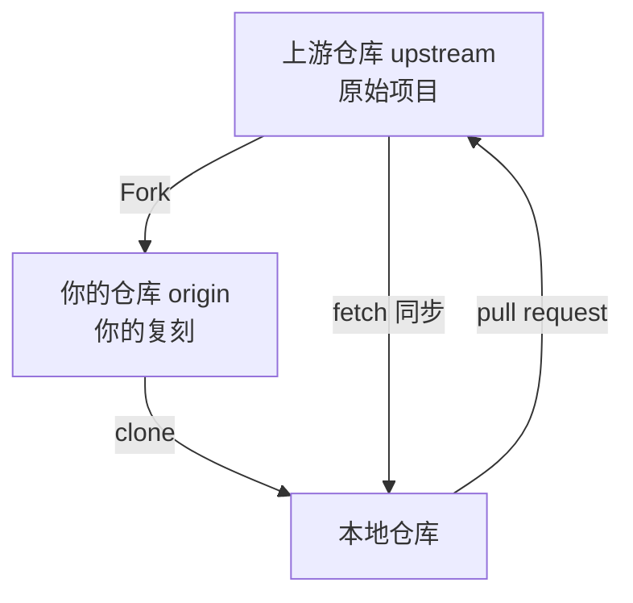

# Fork 协作模式与上游同步

## 前言

**C：** 参与开源项目时，你通常没有原仓库的推送权限。Fork 是 Git 平台提供的协作方案——把别人的仓库复制一份到自己的账号下，在自己的仓库上开发，然后通过 Pull Request 贡献回去。本文详解 Fork 协作的完整流程。

<!-- more -->

## Fork 模式概览



关键概念：
- **upstream**：上游仓库（原始项目）
- **origin**：你自己 Fork 的仓库
- 你只有 origin 的推送权限，对 upstream 只能提交 PR

## 完整的 Fork 工作流

### 第一步：Fork 仓库

在 GitHub/GitLab 页面上点击 **Fork** 按钮，将仓库复制到你的账号下。

### 第二步：克隆你的 Fork

```shell
# 克隆你 Fork 的仓库
git clone https://github.com/your-name/project.git
cd project

# 查看远程仓库
git remote -v
# origin  https://github.com/your-name/project.git (fetch)
# origin  https://github.com/your-name/project.git (push)
```

### 第三步：添加上游仓库

```shell
# 添加上游仓库
git remote add upstream https://github.com/original/project.git

# 确认配置
git remote -v
# origin    https://github.com/your-name/project.git (fetch)
# origin    https://github.com/your-name/project.git (push)
# upstream  https://github.com/original/project.git (fetch)
# upstream  https://github.com/original/project.git (push)
```

### 第四步：创建功能分支

```shell
# 同步上游最新代码
git fetch upstream

# 基于上游的 main 创建分支
git switch -c fix-memory-leak upstream/main

# 或者基于本地 main（确保已同步）
git switch main
git merge upstream/main
git switch -c fix-memory-leak
```

### 第五步：开发并提交

```shell
# 开发修改
vim src/parser.js

# 提交
git add src/parser.js
git commit -m "fix: resolve memory leak in JSON parser"

# 推送到你的 Fork
git push -u origin fix-memory-leak
```

### 第六步：创建 Pull Request

```shell
# 使用 GitHub CLI 创建 PR
gh pr create \
  --repo original/project \
  --title "fix: resolve memory leak in JSON parser" \
  --body "## 问题
JSON 解析器在处理大文件时存在内存泄漏。

## 解决方案
使用流式解析代替全量加载，限制内存使用。

## 测试
- 新增单元测试验证内存回收
- 100MB 文件测试通过" \
  --head your-name:fix-memory-leak \
  --base main
```

或者在 GitHub 网页上操作：
1. 打开你的 Fork 仓库页面
2. 点击 **Compare & pull request**
3. 确认目标仓库和分支
4. 填写描述，创建 PR

## 同步上游代码

### 一次性同步

```shell
# 获取上游最新代码
git fetch upstream

# 合并到本地 main
git switch main
git merge upstream/main

# 推送到你的 Fork（保持 origin 与 upstream 同步）
git push origin main
```

### 使用 rebase 同步

```shell
# 更简洁的方式
git fetch upstream
git rebase upstream/main

# 推送到 origin
git push --force-with-lease origin main
```

### 同步功能分支

如果功能分支需要更新上游代码：

```shell
# 切到功能分支
git switch fix-memory-leak

# 将上游的 main rebase 到当前分支
git fetch upstream
git rebase upstream/main

# 推送更新
git push --force-with-lease origin fix-memory-leak
```

::: tip 笔者说
Fork 仓库中你自己的功能分支使用 `--force-with-lease` 是安全的，因为这些分支只有你在使用。
:::

## 处理冲突的 PR

如果你的 PR 和上游的最新代码冲突了：

```shell
# 同步上游 main
git fetch upstream
git rebase upstream/main

# 解决冲突
# ... 编辑冲突文件 ...
git add .
git rebase --continue

# 强制推送更新 PR
git push --force-with-lease origin fix-memory-leak
```

PR 会自动更新，Reviewer 可以看到最新的代码。

## Fork 工作流的最佳实践

### 1. 保持分支干净

```shell
# 定期同步 main 分支
git fetch upstream
git switch main
git merge upstream/main --ff-only
git push origin main
```

### 2. 每个功能独立分支

```shell
# 不同功能在不同分支
git switch -c feature-a upstream/main
# ... 开发 feature-a ...
git push -u origin feature-a

git switch -c feature-b upstream/main
# ... 开发 feature-b ...
git push -u origin feature-b
```

### 3. 遵循项目贡献规范

大多数开源项目都有 `CONTRIBUTING.md` 文件：

```shell
# 查看贡献指南
cat CONTRIBUTING.md

# 常见要求：
# - 代码风格规范
# - 提交信息格式（如 Conventional Commits）
# - 测试要求
# - CLA（贡献者许可协议）
```

### 4. 使用 Conventional Commits

```shell
# 常用的提交信息格式
feat: add new feature
fix: resolve a bug
docs: update documentation
style: formatting changes
refactor: code restructuring
test: add or update tests
chore: build process or auxiliary changes
```

## 常见问题

### 上游仓库更新了但 PR 还没合并

```shell
# 你的 PR 基于旧的 main，上游已经有很多新提交
# 重新 rebase
git fetch upstream
git switch fix-memory-leak
git rebase upstream/main
git push --force-with-lease origin fix-memory-leak
```

### 想删除 Fork 仓库

```shell
# 在 GitHub 网页上操作：Settings → Delete this repository
# 或使用 GitHub CLI
gh repo delete your-name/project --yes
```

### Fork 和 Clone 的区别

| 操作 | Fork | Clone |
|------|------|-------|
| 发生位置 | 服务器端 | 本地 |
| 结果 | 创建一个新的远程仓库 | 创建一个本地副本 |
| 推送权限 | 有（自己的仓库） | 取决于协议 |
| 适用场景 | 参与开源项目贡献 | 日常开发 |
| 关联关系 | 保留与上游仓库的关联 | 无特殊关联 |

### 多个 PR 时的分支管理

```shell
# 查看你推送的所有分支
git branch -r | grep origin

# 清理已经合并的远程分支
# 在 GitHub 上合并的 PR，分支可能已删除
git fetch --prune

# 本地清理
git branch -d fix-memory-leak  # 已合并的分支
git branch -D old-experiment   # 强制删除未合并的
```

## GitHub CLI 快捷命令

```shell
# 查看上游仓库信息
gh repo view original/project

# 查看你提交的 PR 状态
gh pr list --repo original/project --author your-name

# 查看某个 PR 的评论和 review
gh pr view 42 --repo original/project --comments

# 查看项目的 Issue
gh issue list --repo original/project

# 创建 Issue
gh issue create --repo original/project \
  --title "Bug: ..." \
  --body "Description..."

# 查看 CI 状态
gh pr checks 42 --repo original/project
```

## 小结

- **Fork** 是参与开源项目的标准协作方式
- 配置 `upstream` 远程仓库跟踪原始项目
- 功能分支基于 `upstream/main` 创建，保持与上游同步
- PR 冲突时用 `rebase upstream/main` 解决
- 使用 `--force-with-lease` 更新功能分支
- 遵循项目的贡献规范和提交信息格式

下一篇我们将学习子模块（submodule）和子树合并（subtree），了解如何在项目中引用其他 Git 仓库。
