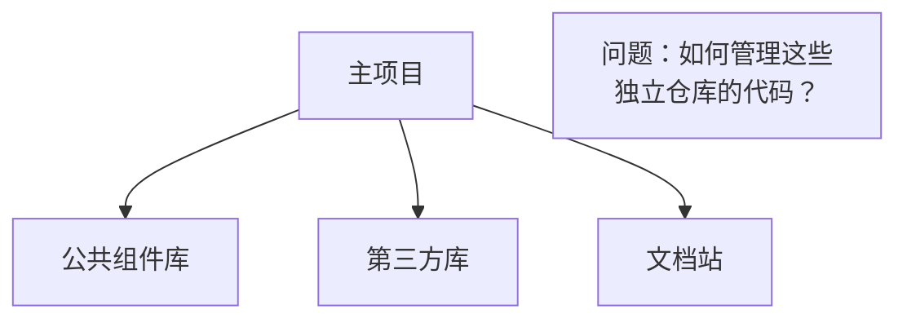
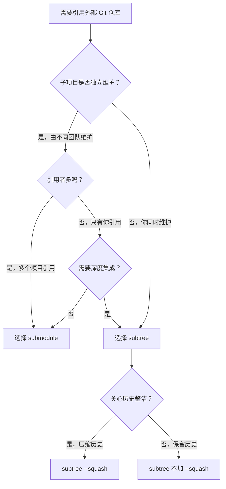

# 子模块与子树合并

## 前言

**C：** 当你的项目需要引用其他 Git 仓库的代码时——比如前端项目引用一个公共组件库——直接把代码复制进来会导致版本混乱。Git 提供了两种方案：子模块（submodule）和子树合并（subtree）。本文对比两者的优缺点，帮你做出合适的选择。

<!-- more -->

## 问题背景



你需要：
- 主项目和子项目各自独立维护版本
- 主项目能引用子项目的特定版本
- 更新子项目时主项目也能方便地同步

## 子模块（submodule）

### 基本概念

子模块是在主仓库中嵌入另一个 Git 仓库的引用。主仓库只记录子模块的提交哈希，不存储子模块的实际文件内容。


### 添加子模块

```shell
# 添加子模块
git submodule add https://github.com/user/common-lib.git libs/common-lib

# 这会：
# 1. 克隆子模块到 libs/common-lib 目录
# 2. 在 .gitmodules 文件中添加配置
# 3. 暂存子模块的引用
```

生成的 `.gitmodules` 文件：

```ini
[submodule "libs/common-lib"]
	path = libs/common-lib
	url = https://github.com/user/common-lib.git
```

### 克隆含子模块的项目

```shell
# 方法一：克隆后初始化子模块
git clone https://github.com/user/main-project.git
cd main-project
git submodule init
git submodule update

# 方法二：一步到位（推荐）
git clone --recurse-submodules https://github.com/user/main-project.git
```

### 更新子模块

```shell
# 更新所有子模块到远程最新提交
git submodule update --remote

# 更新指定子模块
git submodule update --remote libs/common-lib

# 进入子模块目录手动更新
cd libs/common-lib
git switch main
git pull origin main
cd ../..
# 主仓库会检测到子模块引用的变化
git add libs/common-lib
git commit -m "update common-lib to latest"
```

### 在子模块中开发

```shell
# 进入子模块
cd libs/common-lib

# 切换到开发分支
git switch -c fix/alignment-issue

# 修改代码
vim src/utils.js
git add .
git commit -m "fix: correct text alignment"

# 推送到子模块的远程仓库
git push -u origin fix/alignment-issue

# 回到主仓库，更新子模块引用
cd ../..
git add libs/common-lib
git commit -m "update common-lib: fix alignment issue"
```

### 常用命令

```shell
# 查看子模块状态
git submodule status
# +a1b2c3d libs/common-lib (heads/main)

# 列出所有子模块
git submodule

# 删除子模块
git submodule deinit libs/common-lib
git rm libs/common-lib
rm -rf .git/modules/libs/common-lib
```

### 子模块的痛点

| 问题 | 说明 |
|------|------|
| 克隆麻烦 | 需要 `--recurse-submodules` 或手动 `init` + `update` |
| 容易遗忘 | 切换分支后子模块可能处于不一致状态 |
| 修改不便 | 在子模块中开发需要额外的推送步骤 |
| 状态混乱 | `git status` 显示子模块有"脏"修改，新手容易困惑 |
| 历史断裂 | 子模块的提交历史与主仓库完全独立 |

## 子树合并（subtree）

### 基本概念

子树合并将外部仓库的代码直接合并到主仓库的一个子目录中，作为普通的文件和提交历史存在。


### 添加子树

```shell
# 添加远程仓库引用
git remote add common-lib https://github.com/user/common-lib.git

# 拉取并合并到子目录
git subtree add --prefix=libs/common-lib common-lib main --squash
```

::: tip 笔者说
`--squash` 选项将子项目的所有提交压缩为一个合并提交。不使用 `--squash` 则会保留子项目的完整提交历史（历史中会显示所有子项目的提交者）。
:::

### 更新子树

```shell
# 拉取子项目的最新代码
git fetch common-lib

# 合并更新到子目录
git subtree pull --prefix=libs/common-lib common-lib main --squash
```

### 从子目录推送修改

```shell
# 如果你在子目录中做了修改，推送到子项目
git subtree push --prefix=libs/common-lib common-lib main
```

### 提取子树的历史

```shell
# 将子目录的提交历史提取为一个独立分支
git subtree split --prefix=libs/common-lib -b common-lib-branch
```

### 子树合并的常用命令

```shell
# 添加子树
git subtree add --prefix=<目录> <远程仓库> <分支> [--squash]

# 拉取子树更新
git subtree pull --prefix=<目录> <远程仓库> <分支> [--squash]

# 从子目录推送修改
git subtree push --prefix=<目录> <远程仓库> <分支>

# 提取子树历史为分支
git subtree split --prefix=<目录> -b <分支名>
```

## submodule vs subtree 对比

| 特性 | submodule | subtree |
|------|-----------|---------|
| 存储方式 | 引用（哈希指针） | 直接包含文件 |
| 仓库大小 | 主仓库较小 | 主仓库较大 |
| 克隆复杂度 | 需要 `--recurse-submodules` | 普通 `git clone` |
| 版本管理 | 主仓库锁定子模块版本 | 合并后版本随主仓库走 |
| 子项目开发 | 独立仓库，在子目录中开发 | 可在子目录中直接开发 |
| 团队协作 | 需要培训成员了解 submodule | 无额外学习成本 |
| 历史记录 | 子模块有独立历史 | 可选择保留或压缩历史 |
| CI/CD | 需要额外配置 | 无需额外配置 |
| 适用场景 | 大型独立项目被多个项目引用 | 库较小，或需要紧密集成 |

## 选择建议



::: tip 笔者说
如果你的团队对 submodule 不熟悉，且子项目不大，推荐使用 subtree。它对工作流的侵入更小，团队成员不需要学习新概念。如果子项目很大（如几百 MB），使用 submodule 避免主仓库膨胀。
:::

## 常见问题

### submodule 检出后是空目录

```shell
# 克隆项目后子目录是空的
ls libs/common-lib/
# (空)

# 解决：初始化并更新子模块
git submodule update --init --recursive
```

### submodule 状态显示"脏修改"

```shell
# 子模块有未提交的修改
git status
# modified: libs/common-lib (new commits)

# 如果只是子模块引用变了（你更新了子模块），正常提交即可
git add libs/common-lib
git commit -m "update submodule"

# 如果子模块内有未提交的修改
cd libs/common-lib
git status
# 要么提交，要么丢弃
```

### subtree 合并冲突

```shell
# subtree pull 时出现冲突
git subtree pull --prefix=libs/common-lib common-lib main

# 解决方法和普通 merge 冲突相同
# 编辑冲突文件，解决后
git add .
git commit
```

## 小结

- **submodule** 适合大型独立项目、多项目共享
- **subtree** 适合需要深度集成、团队不熟悉 submodule 的场景
- submodule 需要额外的克隆和更新步骤
- subtree 代码直接在主仓库中，操作更简单
- 根据团队情况选择，没有绝对的好坏

到这里，远程协作与工作流章节就全部完成了。下一篇我们将深入 Git 的内部原理，理解对象模型等底层机制。
