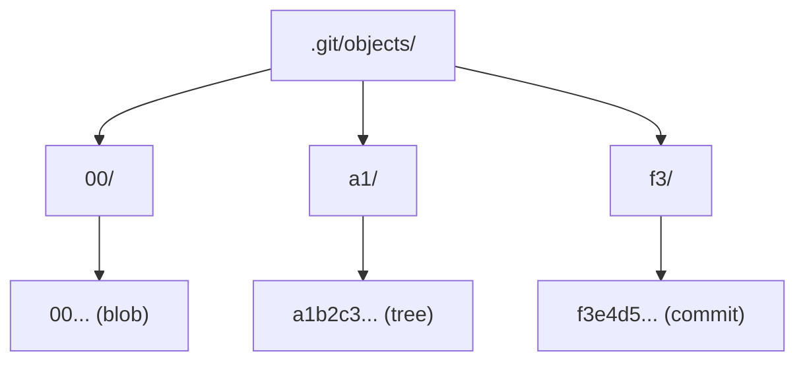
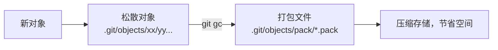

# Git 对象模型

## 前言

**C：** 理解 Git 的内部对象模型，就像理解数据库的表结构一样——它不会改变你日常的使用方式，但当你遇到诡异问题时，能帮你找到根本原因。本文将揭开 Git 存储层的工作原理。

<!-- more -->

## Git 的存储哲学

Git 是一个**内容寻址的文件系统**，所有的数据都以对象的形式存储在 `.git/objects/` 目录中。每个对象通过其内容的 SHA-1 哈希值来标识。



## 四种对象类型

| 类型 | 说明 | 示例 |
|------|------|------|
| blob | 文件内容（不含文件名） | 代码文件、配置文件的内容 |
| tree | 目录结构（文件名 + blob/tree 引用） | 类似文件系统的目录 |
| commit | 提交信息 + tree 引用 + 父提交 | 一次提交的快照 |
| tag | 标签信息（含签名等） | 版本标签 v1.0.0 |

### 对象之间的关系

```mermaid
flowchart TD
    A[commit] -->|指向| B[tree (根目录)]
    A -->|parent| C[上一个 commit]
    B -->|引用| D[blob: README.md]
    B -->|引用| E[blob: main.js]
    B -->|引用| F[tree: src/]
    F -->|引用| G[blob: utils.js]
    F -->|引用| H[tree: components/]
    H -->|引用| I[blob: Header.js]
```

## blob 对象

blob 存储文件的内容，**不包含文件名**。相同内容的文件共享同一个 blob。

```shell
# 查看 blob 的内容
git cat-file -p a1b2c3d4e5f6...

# 查看 blob 的类型
git cat-file -t a1b2c3d4e5f6...
# blob

# 查看 blob 的大小
git cat-file -s a1b2c3d4e5f6...
# 1234

# 计算文件内容的哈希（和 Git 存储的哈希一致）
echo "hello world" | git hash-object --stdin
# ce013625030ba8dba906f756967f9e9ca394464a

# 将文件写入 Git 对象库
echo "hello world" | git hash-object -w --stdin
# 写入 .git/objects/ce/013625030ba8dba906f756967f9e9ca394464a
```

::: tip 笔者说
因为 blob 不存储文件名，所以即使两个不同文件名的文件内容完全相同，它们也只占用一份存储空间。Git 的去重机制就在于此。
:::

## tree 对象

tree 对象表示目录结构，存储文件名到 blob（或子 tree）的映射。

```shell
# 查看根 tree 的内容
git cat-file -p HEAD^{tree}
# 100644 blob a1b2c3d    README.md
# 100644 blob d4e5f6g    main.js
# 040000 tree h7i8j9k    src

# 格式说明：
# 100644  - 文件模式（普通文件）
# 040000  - 文件模式（目录）
# blob    - 对象类型
# a1b2c3d - 对象哈希
# README.md - 文件名

# 查看子 tree
git cat-file -p h7i8j9k
# 100644 blob l0m1n2o    utils.js
# 040000 tree p3q4r5s    components
```

### 手动创建 tree 对象

```shell
# 创建一个包含单个文件的 tree
echo "hello" | git hash-object -w --stdin
# 计算得到哈希：ce01362...

# 创建 tree 对象
git mktree << EOF
100644 blob ce013625030ba8dba906f756967f9e9ca394464a	hello.txt
EOF
# 输出 tree 的哈希：f3e4d5...
```

## commit 对象

commit 对象包含：
- tree：项目根目录的 tree 对象哈希
- parent：父提交的哈希（可以有多个，如合并提交）
- author：作者信息
- committer：提交者信息
- message：提交信息

```shell
# 查看 commit 对象内容
git cat-file -p HEAD
# tree f3e4d5g7h8i9j0k1l2m3n4o5p6q7r8s9t0
# parent a1b2c3d4e5f6g7h8i9j0k1l2m3n4o5p6
# author EASYZOOM <email@example.com> 1713964800 +0800
# committer EASYZOOM <email@example.com> 1713964800 +0800

#     feat: add user login page

# 查看合并提交（两个 parent）
git cat-file -p <merge-commit>
# tree ...
# parent a1b2c3d   (第一个父提交，通常是你所在的分支)
# parent e5f6g7h   (第二个父提交，被合并的分支)
# author ...
```

### author 和 committer 的区别

| 字段 | 含义 | 何时不同 |
|------|------|---------|
| author | 原始作者 | 使用 `--amend` 或 `rebase` 时不变 |
| committer | 实际提交者 | 使用 `--amend` 或 `rebase` 时变为当前操作者 |

```shell
# 正常提交：author == committer
# rebase 后：author 保持原始值，committer 变为执行 rebase 的人
```

## tag 对象

轻量标签（lightweight tag）只是一个指向 commit 的引用：

```shell
# 轻量标签
git tag v1.0.0
# 不会创建 tag 对象，只是一个 refs/tags/v1.0.0 引用
```

附注标签（annotated tag）会创建一个 tag 对象：

```shell
# 附注标签
git tag -a v1.0.0 -m "release version 1.0.0"

# 查看 tag 对象
git cat-file -p v1.0.0
# object a1b2c3d4e5f6g7h8i9j0k1l2m3n4o5p6
# type commit
# tag v1.0.0
# tagger EASYZOOM <email@example.com> 1713964800 +0800

# release version 1.0.0
```

## 对象存储与压缩

### 内容寻址

Git 使用 SHA-1 哈希（未来将迁移到 SHA-256）作为对象标识：

```shell
# 计算任意内容的哈希
git hash-object README.md
```

相同内容 → 相同哈希 → 同一个对象 → 自动去重。

### 松散对象与打包



```shell
# 查看松散对象数量
find .git/objects -type f | grep -v pack | grep -v info | wc -l

# 查看打包文件
ls -la .git/objects/pack/

# 手动触发垃圾回收和打包
git gc

# 查看仓库大小
du -sh .git/objects/
```

### 引用（refs）

引用是指向对象哈希的指针，存储在 `.git/refs/` 中：

```shell
# 分支引用
cat .git/refs/heads/main
# a1b2c3d4e5f6...

# 标签引用
cat .git/refs/tags/v1.0.0
# a1b2c3d4e5f6...

# HEAD 引用
cat .git/HEAD
# ref: refs/heads/main
```

## 实用调试技巧

### 查找大文件

```shell
# 查看每个对象的大小
git rev-list --objects --all | git cat-file --batch-check='%(objecttype) %(objectname) %(objectsize) %(rest)' | awk '/^blob/ {print substr($0,6)}' | sort --numeric-sort --key=2 | tail -20
```

### 查找 dangling 对象

```shell
# 查找没有被任何引用指向的对象
git fsck --dangling

# dangling commit（被丢弃的提交）
git fsck --dangling 2>&1 | grep "dangling commit"

# dangling blob（未跟踪的文件内容）
git fsck --dangling 2>&1 | grep "dangling blob"
```

### 恢复 dangling commit

```shell
# 找到 dangling commit
git fsck --dangling 2>&1 | grep commit
# dangling commit a1b2c3d4e5f6...

# 查看该提交的内容
git show a1b2c3d4e5f6...

# 恢复为分支
git switch -c recovered-work a1b2c3d4e5f6
```

## 小结

| 对象 | 存储内容 | 特点 |
|------|---------|------|
| blob | 文件内容 | 相同内容共享存储 |
| tree | 目录结构 | 文件名 + blob/tree 引用 |
| commit | 提交元数据 | tree + parent + author + message |
| tag | 标签元数据 | commit + tagger + message |

- Git 是内容寻址的文件系统，SHA-1 哈希唯一标识每个对象
- 相同内容的文件只存储一次（去重）
- 松散对象会被 `git gc` 打包压缩
- `git fsck` 可以检查对象完整性和查找丢失的提交

理解了对象模型后，下一篇我们将学习 reflog 的详细用法，它是救回丢失提交的关键工具。
