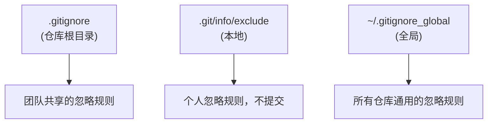
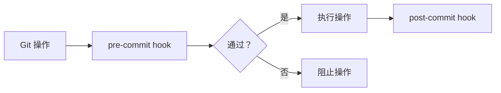

# gitignore 进阶与 hooks 实战

## 前言

**C：** `.gitignore` 和 Git hooks 是两个容易被忽视但非常实用的功能。`.gitignore` 管理什么文件不该被 Git 追踪，hooks 让你在 Git 操作的关键节点自动执行自定义脚本。用好它们，可以避免很多低级错误。

<!-- more -->

## .gitignore 进阶

### 基本语法

```gitignore
# 忽略所有 .log 文件
*.log

# 忽略所有 build 目录
build/

# 忽略特定文件
.env
secrets.json

# 但不忽略（取反）
!important.log
!important/build/

# 只忽略根目录下的 README.md
/README.md

# 忽略所有 doc 目录下的 PDF
doc/**/*.pdf

# 以 # 开头的是注释
# 以 ! 开头的是取反规则
```

### 模式语法

| 模式 | 说明 | 匹配示例 |
|------|------|---------|
| `*.log` | 匹配所有 .log 文件 | `app.log`, `logs/error.log` |
| `/build` | 只匹配根目录的 build | `/build/` ✅, `/src/build/` ❌ |
| `build/` | 匹配任何位置的 build 目录 | `/build/` ✅, `src/build/` ✅ |
| `**/node_modules` | 匹配任意层级的 node_modules | `node_modules/` ✅, `src/node_modules/` ✅ |
| `*.js.map` | 匹配所有 .js.map 文件 | `main.js.map` ✅ |
| `!keep.me` | 不忽略（取反） | 即使匹配前面的规则也不忽略 |

### 多级 gitignore

Git 支持多个层级的 ignore 文件：



```shell
# 全局 gitignore（适用于所有仓库）
git config --global core.excludesfile ~/.gitignore_global

# ~/.gitignore_global 内容示例：
# .DS_Store
# Thumbs.db
# .idea/
# .vscode/settings.json
```

::: tip 笔者说
`.gitignore` 是团队共享的，提交到仓库。`.git/info/exclude` 和全局 gitignore 是个人的，不会提交。IDE 配置文件、操作系统特定文件建议放在全局 gitignore 中。
:::

### 已跟踪的文件如何忽略

```shell
# 文件已经被 Git 跟踪了，添加到 .gitignore 不会生效
# 需要先从 Git 索引中移除

# 从索引中移除但保留文件
git rm --cached filename

# 移除整个目录
git rm -r --cached build/

# 然后提交
git commit -m "chore: remove tracked files from git"
```

### 排查 .gitignore 问题

```shell
# 检查某个文件是否被忽略，以及是被哪条规则忽略的
git check-ignore -v path/to/file
# .gitignore:3:*.log    path/to/file.log

# 查看所有被忽略的文件
git ls-files --others --ignored --exclude-standard
```

### 常用 .gitignore 模板

```gitignore
# === 依赖 ===
node_modules/
vendor/
.pnp
.pnp.js

# === 构建产物 ===
dist/
build/
out/
*.min.js
*.min.css

# === 环境配置 ===
.env
.env.local
.env.*.local

# === IDE ===
.idea/
.vscode/
*.swp
*.swo

# === 操作系统 ===
.DS_Store
Thumbs.db
desktop.ini

# === 日志 ===
*.log
logs/

# === 调试 ===
npm-debug.log*
yarn-debug.log*
yarn-error.log*

# === 测试覆盖率 ===
coverage/
.nyc_output/

# === 临时文件 ===
*.tmp
*.bak
*.swp
```

## Git Hooks 实战

### 什么是 Hooks

Git hooks 是在特定 Git 操作（commit、push、receive 等）发生前后自动执行的脚本。



### Hook 类型

| Hook | 触发时机 | 用途 |
|------|---------|------|
| `pre-commit` | commit 前 | 代码检查、格式化、测试 |
| `prepare-commit-msg` | 编辑提交信息前 | 自动填充提交信息模板 |
| `commit-msg` | 提交信息写完后 | 校验提交信息格式 |
| `post-commit` | commit 完成后 | 通知、日志记录 |
| `pre-push` | push 前 | 运行完整测试套件 |
| `post-merge` | merge 完成后 | 安装依赖、重建索引 |
| `pre-rebase` | rebase 前 | 检查是否可以安全 rebase |
| `post-checkout` | checkout 完成后 | 切换环境配置 |

### 查看 Hook 示例

```shell
# Git 提供的示例 hooks
ls .git/hooks/
# applypatch-msg.sample       post-update.sample
# commit-msg.sample           pre-applypatch.sample
# fsmonitor-watchman.sample   pre-commit.sample
# pre-push.sample             pre-rebase.sample
# ...

# 示例文件不能直接使用，需要去掉 .sample 后缀
cp .git/hooks/pre-commit.sample .git/hooks/pre-commit
chmod +x .git/hooks/pre-commit
```

### 实战一：pre-commit 代码检查

```shell
# .git/hooks/pre-commit
#!/bin/bash

echo "🔍 Running pre-commit checks..."

# 1. ESLint 检查
echo "Running ESLint..."
npx eslint src/ --max-warnings 0
if [ $? -ne 0 ]; then
    echo "❌ ESLint check failed. Please fix errors before committing."
    exit 1
fi

# 2. Prettier 格式检查
echo "Running Prettier check..."
npx prettier --check "src/**/*.{js,ts,css}"
if [ $? -ne 0 ]; then
    echo "❌ Prettier check failed. Run 'npx prettier --write src/' to fix."
    exit 1
fi

# 3. 检查是否有调试代码
echo "Checking for debug code..."
if git diff --cached | grep -q "console\.log"; then
    echo "⚠️  Warning: Found console.log in staged changes."
    echo "   Are you sure you want to commit debug code? (y/n)"
    read -r answer
    if [ "$answer" != "y" ]; then
        exit 1
    fi
fi

# 4. 检查是否有大文件
echo "Checking file sizes..."
git diff --cached --diff-filter=ACM | awk '/^---/{print $2}' | while read f; do
    if [ -f "$f" ]; then
        size=$(stat -f%z "$f" 2>/dev/null || stat -c%s "$f" 2>/dev/null)
        if [ "$size" -gt 1048576 ]; then
            echo "❌ File $f is larger than 1MB ($((size/1048576))MB)."
            exit 1
        fi
    fi
done

echo "✅ All pre-commit checks passed."
exit 0
```

### 实战二：commit-msg 校验提交信息

```shell
# .git/hooks/commit-msg
#!/bin/bash

# 读取提交信息文件
commit_msg=$(cat "$1")

# 校验 Conventional Commits 格式
# 格式：type(scope): subject
# type: feat|fix|docs|style|refactor|test|chore
if ! echo "$commit_msg" | grep -qE "^(feat|fix|docs|style|refactor|test|chore|perf|ci|build|revert)(\(.+\))?: .+"; then
    echo "❌ Invalid commit message format."
    echo ""
    echo "Expected format:"
    echo "  type(scope): subject"
    echo ""
    echo "Types: feat, fix, docs, style, refactor, test, chore, perf, ci, build, revert"
    echo ""
    echo "Examples:"
    echo "  feat: add user login page"
    echo "  fix(parser): resolve memory leak"
    echo "  docs(api): update endpoint documentation"
    echo ""
    exit 1
fi

# 检查提交信息长度
first_line=$(echo "$commit_msg" | head -1)
if [ ${#first_line} -gt 72 ]; then
    echo "❌ Commit message subject is too long (${#first_line} chars, max 72)."
    exit 1
fi

exit 0
```

### 实战三：pre-push 运行测试

```shell
# .git/hooks/pre-push
#!/bin/bash

echo "🧪 Running tests before push..."

# 运行测试
npm test
if [ $? -ne 0 ]; then
    echo "❌ Tests failed. Push aborted."
    echo "   Fix the failing tests and try again."
    exit 1
fi

echo "✅ All tests passed. Safe to push."
exit 0
```

### 实战四：post-merge 自动安装依赖

```shell
# .git/hooks/post-merge
#!/bin/bash

# 检查 package.json 是否有变化
if git diff-tree -r --name-only --no-commit-id ORIG_HEAD HEAD | grep --quiet "package.json\|package-lock.json\|pnpm-lock.yaml"; then
    echo "📦 Dependencies changed, installing..."
    npm install
    echo "✅ Dependencies updated."
fi
```

## 使用 Husky 管理 Hooks

手动管理 `.git/hooks/` 不方便团队共享（hooks 不会被 Git 跟踪）。推荐使用 **Husky**：

```shell
# 安装 Husky
npm install husky --save-dev

# 初始化
npx husky init

# 添加 hook
echo 'npm test' > .husky/pre-commit
chmod +x .husky/pre-commit
```

```json
// package.json
{
  "scripts": {
    "prepare": "husky"
  }
}
```

::: tip 笔者说
Husky 的优势是 hooks 脚本作为普通文件被 Git 跟踪，团队成员 clone 后自动生效。配合 `lint-staged` 可以只检查暂存的文件，大幅提升速度。
:::

### Husky + lint-staged

```shell
npm install lint-staged --save-dev
```

```json
// package.json
{
  "lint-staged": {
    "*.{js,ts}": ["eslint --fix", "prettier --write"],
    "*.{css,scss}": ["prettier --write"],
    "*.{md,json}": ["prettier --write"]
  }
}
```

```shell
# .husky/pre-commit
npx lint-staged
```

## 跳过 Hooks

```shell
# 跳过所有 hooks（谨慎使用）
git commit --no-verify -m "urgent fix"
git push --no-verify

# 或简写
git commit -n -m "urgent fix"
```

## 小结

- `.gitignore` 支持多级配置：仓库级、全局级、本地级
- 已跟踪的文件需要 `git rm --cached` 后才能忽略
- `git check-ignore -v` 排查忽略规则
- Hooks 在 Git 操作前后自动执行，用于检查和通知
- 推荐使用 Husky + lint-staged 管理团队共享的 hooks
- `--no-verify` 可以跳过 hooks，但应谨慎使用

到这里，Git 内部原理与故障排查章节全部完成。下一篇我们将进入最后一个章节：实用工具与配置优化。
