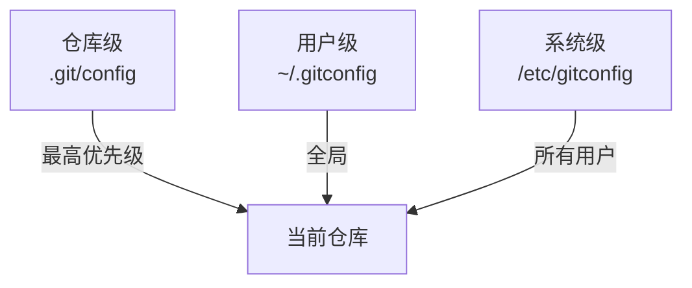

# Git 别名与自定义配置

## 前言

**C：** 每天输入长长的 Git 命令很烦？有些配置每次 clone 新仓库都要重新设置？Git 的别名和配置系统可以帮你解决这些问题。本文分享实用的别名和配置技巧，让你的 Git 使用效率提升一个档次。

<!-- more -->

## Git 别名

### 设置别名

```shell
# 方法一：git config 命令
git config --global alias.co checkout
git config --global alias.br branch
git config --global alias.ci commit
git config --global alias.st status

# 方法二：直接编辑配置文件
# ~/.gitconfig
```

### 推荐别名清单

```ini
# ~/.gitconfig

# === 缩写 ===
[alias]
    co = checkout
    br = branch
    ci = commit
    st = status
    sh = stash
    cp = cherry-pick
    rb = rebase
    mg = merge
    rs = reset
    rf = reflog

# === 快捷操作 ===
    # 带图形的 log
    lg = log --oneline --graph --all --decorate
    # 更详细的 log
    ll = log --oneline --graph --all --decorate --date=relative
    # 查看某个文件的修改历史
    fl = log --follow --oneline --
    # 查看暂存区的 diff
    dc = diff --cached
    # 撤销上次 commit（保留修改）
    undo = reset --soft HEAD~1
    # 修改上次 commit
    amend = commit --amend
    # 安全的 force push
    pushf = push --force-with-lease
    # 删除已合并的分支
    brd = "!git branch --merged | grep -v '\\*' | xargs -n 1 git branch -d"
    # 显示当前分支名
    cb = rev-parse --abbrev-ref HEAD

# === 实用工具 ===
    # 查看最近一次 push 和当前的区别
    unpushed = log @{u}..
    # 查看已 push 但未 merge 的提交
    unmerged = log --no-merges @{u}..
```

### 使用示例

```shell
# 原来的命令
git log --oneline --graph --all --decorate
# 现在只需要
git lg

# 原来的命令
git diff --cached
# 现在只需要
git dc

# 原来的命令
git push --force-with-lease origin feature
# 现在只需要
git pushf origin feature

# 查看当前分支名
git cb
# main
```

### 外部命令别名

别名不仅可以缩写 Git 命令，还可以调用外部命令：

```ini
# 用 ! 开头表示外部命令
[alias]
    # 用 vim 打开 .gitignore
    edit-ignore = "!vim .gitignore"
    # 显示当前仓库状态摘要
    info = "!echo 'Branch:' && git cb && echo 'Last commit:' && git log -1 --oneline && echo 'Unpushed:' && git unpushed --oneline | wc -l"
    # 统计代码行数
    stats = "!git log --shortstat --format='%h' | awk '{inserted+=$4; deleted+=$6} END {print \"Inserted:\", inserted, \"Deleted:\", deleted}'"
```

## Git 配置层级

Git 配置有三个层级，优先级从高到低：



```shell
# 查看所有配置（显示来源）
git config --list --show-origin

# 查看当前生效的配置
git config --list

# 查看某个配置值
git config user.name
```

## 实用配置

### 用户信息

```shell
# 全局用户信息
git config --global user.name "EASYZOOM"
git config --global user.email "email@example.com"
```

### 编辑器

```shell
# 设置默认编辑器
git config --global core.editor "vim"
# 或 VS Code
git config --global core.editor "code --wait"
# 或 nano
git config --global core.editor "nano"
```

### 默认分支名

```shell
# 设置默认分支名为 main（Git 2.28+）
git config --global init.defaultBranch main
```

### pull 默认策略

```shell
# pull 时使用 rebase 而不是 merge（推荐）
git config --global pull.rebase true
```

### push 默认行为

```shell
# 只推送当前分支
git config --global push.default current

# 推送时自动设置上游追踪
git config --global push.autoSetupRemote true
```

### 差异显示工具

```shell
# 使用 delta（更好的 diff 显示）
git config --global core.pager "delta"
git config --global interactive.diffFilter "delta --color-only"
git config --global delta.navigate true
git config --global delta.side-by-side true
```

### 凭证管理

```shell
# 缓存凭证（避免每次输入密码）
# 缓存 15 分钟（默认）
git config --global credential.helper cache

# 缓存 1 小时
git config --global credential.helper 'cache --timeout=3600'

# 永久存储（Mac）
git config --global credential.helper osxkeychain

# 永久存储（Linux）
git config --global credential.helper store
# 注意：store 会将凭证以明文保存在 ~/.git-credentials 中
```

## 条件包含（Conditional Includes）

Git 支持根据目录条件加载不同的配置：

```ini
# ~/.gitconfig
[includeIf "gitdir:~/work/"]
    path = ~/work/.gitconfig-work

[includeIf "gitdir:~/personal/"]
    path = ~/personal/.gitconfig-personal
```

```ini
# ~/work/.gitconfig-work
[user]
    name = Your Name
    email = work@company.com
[commit]
    gpgsign = true

# ~/personal/.gitconfig-personal
[user]
    name = Your Name
    email = personal@gmail.com
```

::: tip 笔者说
条件包含非常适合区分工作和个人项目的配置。不同仓库使用不同的邮箱、GPG 签名、push 策略等，无需每次手动切换。
:::

### 基于仓库目录名的条件

```ini
# 根据目录名匹配
[includeIf "gitdir:opensource/"]
    path = ~/.gitconfig-opensource

# 根据远程 URL 匹配（Git 2.36+）
[includeIf "hasconfig:remote.*.url:*github.com/your-company/*"]
    path = ~/.gitconfig-company
```

## 颜色与美化

```ini
# 颜色配置
[color]
    ui = auto

[color "branch"]
    current = yellow reverse
    local = green bold
    remote = cyan bold

[color "diff"]
    meta = yellow bold
    frag = magenta bold
    old = red bold
    new = green bold
    whitespace = red reverse

[color "status"]
    added = green bold
    changed = yellow bold
    untracked = red
```

## 完整的 .gitconfig 示例

```ini
[user]
    name = EASYZOOM
    email = email@example.com

[core]
    editor = vim
    pager = delta
    excludesfile = ~/.gitignore_global
    autocrlf = input
    quotepath = false

[pull]
    rebase = true

[push]
    default = current
    autoSetupRemote = true

[init]
    defaultBranch = main

[fetch]
    prune = true

[credential]
    helper = cache --timeout=3600

[diff]
    tool = vimdiff

[merge]
    tool = vimdiff

[rerere]
    enabled = true

[alias]
    co = checkout
    br = branch
    ci = commit
    st = status
    lg = log --oneline --graph --all --decorate --date=relative
    dc = diff --cached
    undo = reset --soft HEAD~1
    amend = commit --amend
    pushf = push --force-with-lease
    rb = rebase
    cp = cherry-pick
    sh = stash
    rf = reflog
    cb = rev-parse --abbrev-ref HEAD
    unpushed = log @{u}..

[includeIf "gitdir:~/work/"]
    path = ~/work/.gitconfig-work

[color]
    ui = auto
```

## rerere：自动重用冲突解决方案

```shell
# 启用 rerere（Reuse Recorded Resolution）
git config --global rerere.enabled true
```

`rerere` 会记住你之前解决冲突的方式，下次遇到相同的冲突时自动应用之前的解决方案。

::: tip 笔者说
如果你经常 rebase 同一个分支（如长期维护的功能分支），`rerere` 能帮你省去大量重复的冲突解决工作。
:::

## 小结

- 别名可以大幅减少重复输入，提高效率
- Git 配置分三级：仓库级、用户级、系统级
- 条件包含 (`includeIf`) 可以根据目录加载不同配置
- `pull.rebase true` 和 `push.autoSetupRemote true` 是推荐的全局配置
- `rerere` 可以自动记住冲突解决方案
- 好的 `.gitconfig` 是长期积累的效率工具

下一篇我们将讨论 Git 诊断与性能优化，包括 `git gc`、`git fsck` 和大文件处理。
