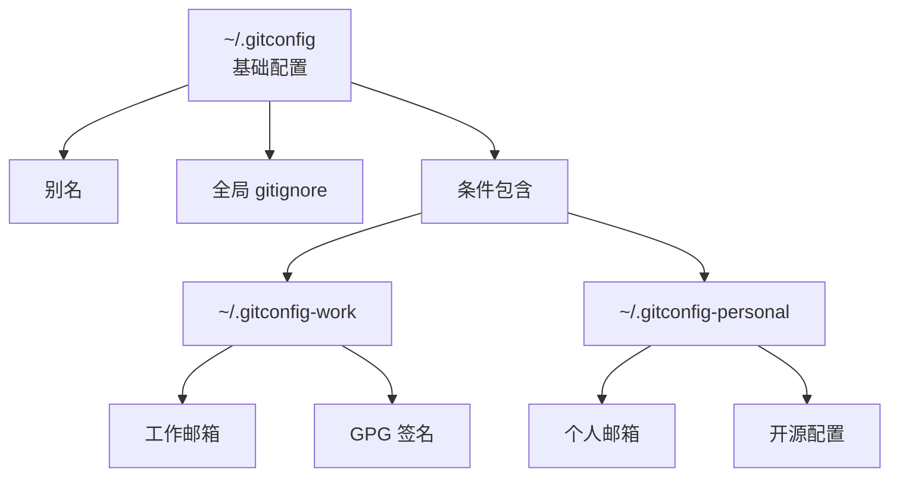

# gitconfig 高级配置与条件包含

## 前言

**C：** 上一篇我们介绍了别名和基础配置，本文深入探讨 `gitconfig` 的高级用法——条件包含、属性系统、多签名配置以及项目级定制。这些技巧能让你在不同项目间无缝切换，无需每次手动修改配置。

<!-- more -->

## 条件包含详解

### 基于目录的条件包含

这是最常用的场景——根据项目所在目录自动加载不同的配置：

```ini
# ~/.gitconfig

# 工作项目的配置
[includeIf "gitdir:~/projects/work/"]
    path = ~/.gitconfig-work

# 个人项目的配置
[includeIf "gitdir:~/projects/personal/"]
    path = ~/.gitconfig-personal

# 开源贡献的配置
[includeIf "gitdir:~/projects/opensource/"]
    path = ~/.gitconfig-opensource
```

```ini
# ~/.gitconfig-work
[user]
    name = Your Name
    email = you@company.com
[commit]
    gpgsign = true
    template = ~/.gitmessage-work
[push]
    autoSetupRemote = true
[pull]
    rebase = true
```

::: tip 笔者说
`gitdir:` 后面的路径末尾加 `/` 表示匹配目录下所有子目录。不加 `/` 则只匹配该确切路径。推荐始终加上 `/`。
:::

### 基于远程 URL 的条件包含（Git 2.36+）

```ini
# 公司 GitLab 仓库
[includeIf "hasconfig:remote.*.url:git@gitlab.company.com:*"]
    path = ~/.gitconfig-company

# GitHub 个人仓库
[includeIf "hasconfig:remote.*.url:git@github.com:yourname/*"]
    path = ~/.gitconfig-personal

# 特定组织的仓库
[includeIf "hasconfig:remote.*.url:*github.com/specific-org/*"]
    path = ~/.gitconfig-org
```

### 基于仓库特定配置

```shell
# 在特定仓库中设置本地配置
cd ~/projects/work/api-server
git config user.email "api-team@company.com"
git config commit.gpgsign true

# 配置存储在 .git/config 中，只对当前仓库生效
cat .git/config
# [core]
#     repositoryformatversion = 0
# [user]
#     email = api-team@company.com
# [commit]
#     gpgsign = true
```

## Git 属性系统

Git 属性（gitattributes）让你可以为特定路径设置特殊行为。

### .gitattributes 常用配置

```gitattributes
# === 行尾处理 ===
# 自动转换行尾（推荐）
* text=auto eol=lf

# Windows 特定文件保持 CRLF
*.bat text eol=crlf

# === 二进制文件检测 ===
*.png binary
*.jpg binary
*.gif binary
*.pdf binary
*.zip binary
*.woff binary
*.woff2 binary

# === 差异算法 ===
# 对特定文件使用不同的 diff 算法
*.css linguist-generated
*.min.js linguist-generated

# === 合并策略 ===
# 特定文件使用特定合并策略
package.json merge=ours
package-lock.json merge=ours
yarn.lock merge=ours

# === 导出忽略 ===
# 打包时忽略某些文件
.gitignore export-ignore
.gitattributes export-ignore
.editorconfig export-ignore
```

### 自定义 diff 驱动

```ini
# ~/.gitconfig
[diff "excel"]
    textconv = ssconvert --to=txt
    cachetextconv = true
```

```gitattributes
# .gitattributes
*.xlsx diff=excel
*.xls diff=excel
```

## 提交信息模板

```shell
# 设置提交信息模板
git config --global commit.template ~/.gitmessage

# ~/.gitmessage 内容示例：
# [type] scope: subject

# body

# footer
```

::: tip 笔者说
提交信息模板配合 commit-msg hook 使用，可以同时提供格式引导和强制校验。
:::

## GPG 签名

### 配置 GPG 签名

```shell
# 列出可用的 GPG 密钥
gpg --list-secret-keys --keyid-format=long
# sec   rsa4096/AABBCCDD 2026-01-01 [SC]
#       XXXXXXXXXXXXXXXXXXXXXXXXXXXXXXXXXXXXXXXX Your Name <email@example.com>

# 配置 Git 使用 GPG
git config --global user.signingkey AABBCCDD
git config --global commit.gpgsign true

# 为特定仓库启用
git config commit.gpgsign true
```

### 多签名密钥配置

```shell
# 工作项目使用工作密钥
# ~/.gitconfig-work
[user]
    signingkey WORK_GPG_KEY_ID
[commit]
    gpgsign = true

# 个人项目使用个人密钥
# ~/.gitconfig-personal
[user]
    signingkey PERSONAL_GPG_KEY_ID
[commit]
    gpgsign = true
```

### 验证签名

```shell
# 查看已签名的提交
git log --show-signature

# 验证标签签名
git tag -v v1.0.0
```

## 配置调试

### 查看配置来源

```shell
# 查看所有配置及其来源
git config --list --show-origin
# file:/home/user/.gitconfig    user.name=EASYZOOM
# file:/home/user/.gitconfig    user.email=email@example.com
# file:.git/config              core.repositoryformatversion=0

# 查看特定配置的来源
git config --show-origin user.email
# file:/home/user/.gitconfig-work    user.email=work@company.com

# 查看配置是否被正确包含
git config --get user.email
```

### 查看配置帮助

```shell
# 查看所有可用的配置项
git config --help

# 查看特定配置的帮助
git help config
```

## 配置管理最佳实践

### 1. 分层管理



### 2. 使用 version control 管理 gitconfig

```shell
# 将 gitconfig 纳入版本管理
mkdir -p ~/dotfiles
cp ~/.gitconfig ~/dotfiles/
cp ~/.gitconfig-work ~/dotfiles/
cp ~/.gitconfig-personal ~/dotfiles/
cp ~/.gitmessage ~/dotfiles/
cp ~/.gitignore_global ~/dotfiles/

# 使用符号链接
ln -sf ~/dotfiles/.gitconfig ~/.gitconfig
ln -sf ~/dotfiles/.gitignore_global ~/.gitignore_global
```

### 3. 跨平台兼容

```ini
# 根据操作系统加载不同配置
[includeIf "gitdir:C:/Users/"]
    path = ~/AppData/Git/gitconfig-windows

[includeIf "gitdir:/home/"]
    path = ~/.gitconfig-linux
```

## 常见问题

### 条件包含没有生效

```shell
# 检查路径是否匹配
git config --show-origin --list | grep user

# 确保 gitdir 路径末尾有 /
# 错误：gitdir:~/work
# 正确：gitdir:~/work/
```

### 配置被覆盖

```shell
# 配置优先级：仓库级 > 用户级 > 系统级
# 使用 --show-origin 排查
git config --show-origin user.email
```

## 小结

- 条件包含（`includeIf`）是实现多环境配置的核心
- 基于 `gitdir:` 或 `hasconfig:remote.*.url:` 匹配不同场景
- Git 属性（`.gitattributes`）控制行尾、二进制处理、合并策略
- GPG 签名增强提交和标签的可信度
- 使用 `--show-origin` 排查配置来源
- 将 dotfiles 纳入版本管理，跨设备同步配置

最后一篇我们将讨论 Git 诊断与性能优化。
