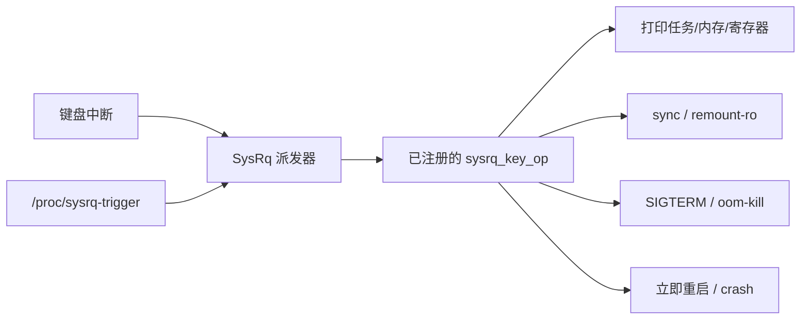

# SysRq 魔法组合键实战

## 前言

**C：** 当一台 Linux 机器"卡住"时，你通常有两种选择：一是按电源键硬重启，二是祈祷 SSH 还能连上。前者会丢现场，后者大多不可行。SysRq（Magic System Request Key）就是为这种场景而生的——它是一条绕过大部分内核子系统、直接跟内核"说话"的小路径，让我们即便在调度器都近乎瘫痪的情况下，还能回收现场、平稳落地。

<!-- more -->

## SysRq 到底是什么

SysRq 是内核内建的一个特殊按键处理通道，最初来自 PC 键盘上那颗几乎被人遗忘的 `Print Screen / SysRq` 键。它的关键特性是：

- 由键盘中断直接派发，**尽量少依赖用户态和上层子系统**；
- 触发的是一系列预注册的内核回调，比如 sync、remount-ro、打印任务栈、oom-kill、重启等；
- 在系统看似失去响应（但中断仍工作）时，往往还能救你一命。

换句话说：**SysRq 不是给业务用的，是给你在排障/救援时用的。**



## 开启 SysRq

SysRq 的总开关在 `kernel.sysrq`，可通过 `sysctl` 或 `/proc/sys/kernel/sysrq` 查询与设置：

```bash
# 查看当前状态
cat /proc/sys/kernel/sysrq

# 临时打开所有功能（调试阶段常用）
echo 1 | sudo tee /proc/sys/kernel/sysrq

# 永久打开：写入 /etc/sysctl.d/99-sysrq.conf
echo 'kernel.sysrq = 1' | sudo tee /etc/sysctl.d/99-sysrq.conf
sudo sysctl --system
```

`kernel.sysrq` 的取值不只是 0/1，它其实是一个**位掩码**，不同 bit 对应不同功能：

| 值 | 含义 |
| -- | -- |
| 0 | 完全关闭 SysRq |
| 1 | 打开全部功能 |
| 2 | 允许控制台日志级别调整 |
| 4 | 允许键盘控制（包括按键回显切换） |
| 8 | 允许 dump 进程和内存信息 |
| 16 | 允许 sync |
| 32 | 允许 remount-ro |
| 64 | 允许信号进程（term、kill、oom-kill） |
| 128 | 允许 reboot / poweroff |
| 256 | 允许调整 nice 值 |

例如 `178 = 128 + 32 + 16 + 2`，表示只允许"改日志级别、sync、remount-ro、reboot"，是一种**发行版保守策略**，Debian/Ubuntu 默认即类似取值。生产环境建议按需组合，调试环境直接用 `1`。

::: warning 安全提示
开启全部 SysRq 功能意味着**任何能物理访问键盘的人都可以强制重启或关机**。远程服务器可以放心开；桌面/公开机位请谨慎。
:::

## 触发 SysRq 的三种方式

### 1. 物理键盘

最经典的方式：

```text
Alt + SysRq + <命令字符>
```

例如：`Alt + SysRq + b` 表示立即 reboot（不 sync、不 umount，真的立即）。

在大多数笔记本上 `SysRq` 和 `Print Screen` 是同一颗键，必要时可能还要配合 `Fn`。

### 2. 通过 `/proc/sysrq-trigger`

这是**远程 / 脚本场景的首选**，只需一行命令：

```bash
# 查看所有阻塞在 D 状态的任务
echo w | sudo tee /proc/sysrq-trigger

# 立即同步磁盘
echo s | sudo tee /proc/sysrq-trigger

# 紧急 remount-ro
echo u | sudo tee /proc/sysrq-trigger
```

写入的字符会被内核的 `write_sysrq_trigger()` 解析并转发到对应 op，效果与按下 `Alt + SysRq + <char>` 一致（但不受 `kernel.sysrq` 掩码中"键盘控制位"的限制，**只受"某功能是否允许"这一层限制**）。

### 3. 串口 / SSH 下的 `BREAK`

在串口控制台或某些 SSH 客户端里，可以发送 `BREAK` 序列（`Ctrl-A f` in GNU screen、`~B` in OpenSSH 等）后再按命令字符，等同于 SysRq。这在嵌入式调试时非常常用。

## 最常用的命令字符速记

下表是日常调试最高频的命令，建议背熟：

| 字符 | 作用 | 典型场景 |
| :--: | :-- | :-- |
| `h` | 打印帮助 | 忘了按什么时先来一条 |
| `l` | 打印所有 CPU 的调用栈 | 怀疑内核死循环/软死锁 |
| `t` | 打印所有任务的内核栈 | 查看哪些线程在哪段代码 |
| `w` | 打印 D 状态（不可中断睡眠）任务栈 | IO hang、锁卡死定位 |
| `p` | 打印当前 CPU 寄存器和标志 | 指令级现场保留 |
| `m` | 打印内存统计 | 内存压力/OOM 前奏 |
| `9`/`0`..`7` | 调整控制台日志级别 | 让 printk 能显示出来 |
| `s` | `sync` 所有已挂载文件系统 | 紧急保存数据 |
| `u` | 所有文件系统 remount-ro | 紧急只读，防止进一步损坏 |
| `e` | 向所有进程（除 init）发送 SIGTERM | 温和回收现场 |
| `i` | 向所有进程（除 init）发送 SIGKILL | e 搞不定时用 |
| `f` | 触发 oom-kill | 内存爆表救急 |
| `b` | **立即** reboot（不 sync 不 umount） | 最后手段 |
| `o` | **立即** poweroff | 远端强行下电 |
| `c` | 触发 crash（oops 并走 kdump） | 抓 vmcore 做事后分析 |

助记顺口溜：**REISUB**（Reboot 前的优雅序列）

```text
r - e - i - s - u - b
```

含义：

1. `r`：把键盘从 X 抢回给内核（Raw → XLATE）
2. `e`：SIGTERM 给所有进程
3. `i`：SIGKILL 给所有进程
4. `s`：sync 磁盘
5. `u`：remount-ro
6. `b`：reboot

这是系统严重卡死但中断还活着时，**把数据损失降到最小**的标准救援流程。倒过来念（BUSIER）也能记住。

## 实战案例

### 案例一：定位"某个进程 D 住了"

现象：`ps` 看到进程卡在 `D` 状态、`kill -9` 也无效。

```bash
# 打开完整 SysRq
echo 1 | sudo tee /proc/sys/kernel/sysrq

# 打印所有 D 状态任务栈
echo w | sudo tee /proc/sysrq-trigger

# 从 dmesg 里看结果
sudo dmesg | tail -n 200
```

`dmesg` 里会出现类似：

```text
sysrq: Show Blocked State
task:dd              state:D stack:    0 pid: 1234 ...
Call Trace:
 __schedule+0x...
 schedule+0x...
 io_schedule+0x...
 wait_on_page_bit_common+0x...
 ...
```

据此就能顺着调用栈看是卡在哪个 IO、哪把锁、哪个 wait_queue 上，远比干看日志有效。

### 案例二：系统"卡住"但 SSH 还能连

这种情况下 shell 还能执行，但业务全挂：

```bash
echo l | sudo tee /proc/sysrq-trigger   # 看每颗 CPU 在干什么
echo m | sudo tee /proc/sysrq-trigger   # 看内存是否快满
echo t | sudo tee /proc/sysrq-trigger   # 看所有线程栈（量大）
```

先看 CPU 和内存轮廓，有嫌疑再抓全量线程栈。

### 案例三：磁盘/内核已经很病态，需要紧急落地

键盘下标准 REISUB：

```text
按住 Alt + SysRq，然后依次敲：r e i s u b
```

远程机器上等价做法：

```bash
for c in e i s u b; do
  echo $c | sudo tee /proc/sysrq-trigger
  sleep 2
done
```

`r` 在远程下无意义，跳过即可；`b` 一旦发出立刻重启，**后面的命令不会再执行**。

### 案例四：主动制造一次 kernel panic 验证 kdump

在验证 kdump/crashkernel 配置时经常需要主动触发崩溃：

```bash
echo c | sudo tee /proc/sysrq-trigger
```

这会调用 `handle_sysrq('c')` → `sysrq_handle_crash()`，直接解引用空指针触发 panic，正好走 kdump 链路，非常适合做灾备演练。

## 在驱动开发中加一个自定义 SysRq

内核提供 `register_sysrq_key()` / `unregister_sysrq_key()`，可以给自己的子系统加一条"一键 dump"快捷键。示意写法：

```c
#include <linux/sysrq.h>

static void my_sysrq_dump(u8 key)
{
    pr_info("my driver state: foo=%d bar=%d\n", foo, bar);
    /* 这里想打印寄存器、FIFO、ring buffer 都行 */
}

static const struct sysrq_key_op my_sysrq_op = {
    .handler        = my_sysrq_dump,
    .help_msg       = "dump-my-driver(y)",
    .action_msg     = "Dump my driver state",
    .enable_mask    = SYSRQ_ENABLE_DUMP,
};

static int __init my_drv_init(void)
{
    return register_sysrq_key('y', &my_sysrq_op);
}

static void __exit my_drv_exit(void)
{
    unregister_sysrq_key('y', &my_sysrq_op);
}
```

注册之后，`echo y > /proc/sysrq-trigger` 就会打印驱动内部状态。这是**嵌入式设备现场调试**的利器——尤其当你没有 gdb、也不方便动态加 trace 的时候。

::: tip 选字符时注意避让
内核本身已经占用了 `a`–`z`、`0`–`9` 的大部分，注册前建议 `grep -r register_sysrq_key` 看一下谁在用哪个字母，避免冲突。
:::

## SysRq 不能做什么

SysRq 并不是万能的，它的工作前提至少要求：

- **中断系统是活的**（否则键盘/串口根本送不到 CPU）；
- **某些路径的锁没有被 hold 到打死**（例如做 sync 的前提是 VFS 还能走）；
- `/proc/sysrq-trigger` 这条通道需要系统调用、进程调度还能工作。

所以如果机器已经"连中断都处理不过来了"（例如硬件异常、NMI 风暴、完全跑飞），即便按 SysRq 也没有反应。这时你只能：

- 看串口有没有打印（NMI watchdog、hardlockup detector 可能还会吐几行）；
- 或者等 watchdog 超时重启；
- 最差的情况，只能物理断电。

## 小结

- `kernel.sysrq` 是位掩码，生产按需开，调试直接 `1`。
- 三种触发方式：键盘 `Alt+SysRq+x`、`/proc/sysrq-trigger`、串口 `BREAK`。
- 必记命令：`h l t w m s u e i f b c`，必记流程：**REISUB**。
- 驱动可以通过 `register_sysrq_key()` 注册自己的热键，做现场 dump。
- SysRq 是"中断还活着时的最后一根救命稻草"，而不是平时调优的手段。

::: tip 延伸阅读

- 内核文档：`Documentation/admin-guide/sysrq.rst`
- 源码路径：`drivers/tty/sysrq.c`
- 配套调试手段：`kdump`、`ftrace`、`kgdb`，后续章节再展开。

:::
