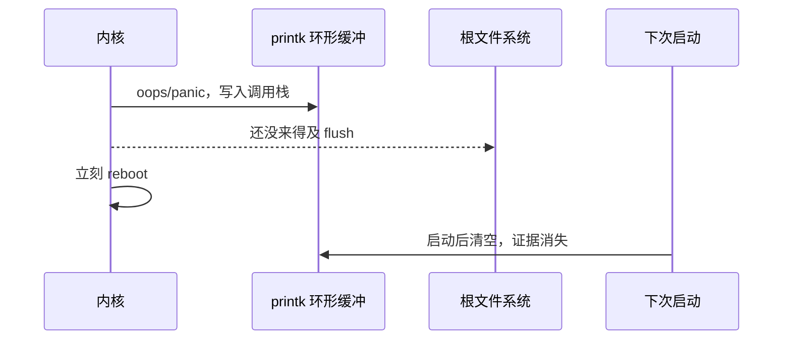
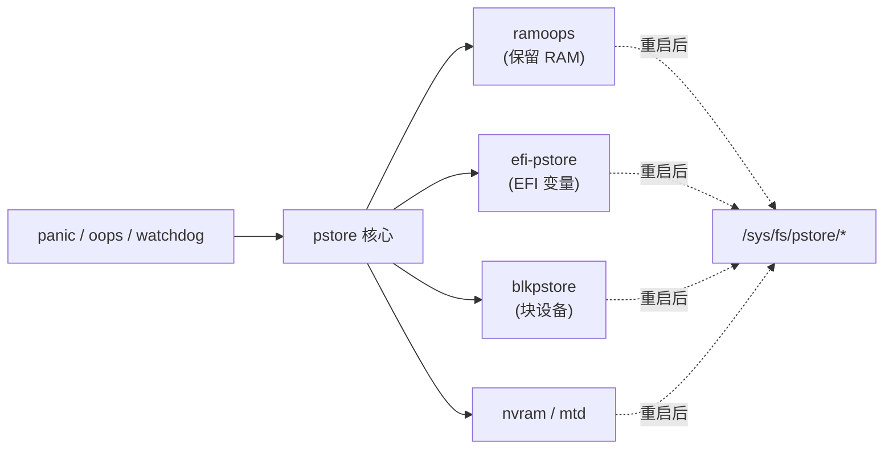

# pstore 持久化崩溃日志

## 前言

**C：** 内核一旦 panic/oops，串口没接、SSH 已断、dmesg 也被新一轮重启抹掉——这种"崩在现场却没留证据"的场景，是嵌入式和服务器都逃不掉的痛。`pstore`（Persistent Store）就是 Linux 内核用来"在死之前把遗言写到一块不会丢的介质上"的框架：下次启动后，我们再以文件的形式把它读出来，变成一次可复盘的崩溃现场。

<!-- more -->

## pstore 解决的问题

一次典型的"丢现场"链路是这样的：



pstore 的思路是：在内核里预留一块**即使断电/重启也不会丢**的存储（RAM 保留区、NVRAM、EFI 变量、块设备等），崩溃路径在最后一刻把日志写进去；下次启动时，pstore 文件系统把这些遗言以文件形式挂到 `/sys/fs/pstore/`，让我们能像读普通文件一样读取。



## 架构速览

pstore 是一个**前后端分离**的框架：

- **前端（pstore 核心 + pstore filesystem）**：提供统一注册接口、`/sys/fs/pstore/` 挂载、文件命名与生命周期管理。
- **后端（backend）**：负责真正的持久化介质读写。常见有：
  - `ramoops`：在物理内存里保留一块 reserved region，靠 DRAM 在"软重启"时内容不立即丢失来做持久化。嵌入式最常用。
  - `efi-pstore`：借用 EFI Variable 区域。x86 服务器/笔记本常用。
  - `erst`：ACPI Error Record Serialization Table（高端服务器）。
  - `blkpstore`：在 5.x 之后引入的块设备后端。
  - `mtdpstore` / `nvram`：嵌入式 NOR/NAND/NVRAM。

pstore 支持的"记录类型"也不止 panic 日志，常见有：

| 类型 (frontend) | 含义 |
| -- | -- |
| `dmesg-ramoops-N` | panic/oops 时的内核日志 |
| `console-ramoops-N` | 正常运行期间的串口 console 日志 |
| `ftrace-ramoops-N` | function tracer 环形缓冲 |
| `pmsg-ramoops-N` | 用户态通过 `/dev/pmsg0` 写入的自定义日志 |

## 最常用的后端：ramoops

绝大多数嵌入式项目都在用 ramoops，核心原理是：

1. 在 DTS 或内核命令行里**划出一段物理内存不让内核当普通 RAM 用**。
2. 崩溃时把日志塞进这段 RAM。
3. 重启过程是"软复位 + 内存刷新不彻底"，这段 DRAM 内容在毫秒级重启内仍然有效。
4. 启动后 ramoops 驱动从这段内存里把日志读出来，喂给 pstore 文件系统。

::: warning 冷启动 ≠ 软重启
ramoops 依赖的是"DRAM 断电前残留"。**真正的冷启动/长时间断电**会让 DRAM 内容丢失，这种现场 ramoops 救不了——得上 `efi-pstore` 或 NVRAM/MTD 后端。
:::

### 设备树配置（嵌入式 ARM 常见）

典型 DTS 写法：

```c
/ {
    reserved-memory {
        #address-cells = <1>;
        #size-cells = <1>;
        ranges;

        ramoops@8f000000 {
            compatible = "ramoops";
            reg = <0x8f000000 0x100000>;     /* 1MB 保留内存 */
            record-size    = <0x20000>;       /* 单条 dmesg  128KB */
            console-size   = <0x20000>;       /* console     128KB */
            ftrace-size    = <0x20000>;       /* ftrace      128KB */
            pmsg-size      = <0x20000>;       /* pmsg        128KB */
            max-reason     = <2>;             /* 见下文 */
            ecc-size       = <16>;            /* 开启 ECC，防比特翻转 */
        };
    };
};
```

几个参数需要理解：

- `reg`：保留内存起止，**要和 `memreserve` / cmdline 的 `mem=` 协调**，避免被系统当普通 RAM 分配。
- `record-size`：一条 dmesg 记录的最大长度；太小会截断调用栈，一般至少 64KB。
- `console-size` / `ftrace-size` / `pmsg-size`：分别给 console 日志、ftrace、pmsg 用，不需要的置 0 即可。
- `max-reason`：控制哪些 reason 会触发写入，常见值见下一节。
- `ecc-size`：打开后每条记录末尾追加 ECC，能修正偶发位翻转；**强烈建议开**。

### 通过模块参数配置（x86/通用场景）

如果不用设备树，可以走模块参数或内核命令行：

```bash
# 方式 A：开机命令行
ramoops.mem_address=0x8f000000 ramoops.mem_size=0x100000 \
ramoops.record_size=0x20000 ramoops.console_size=0x20000 \
ramoops.ftrace_size=0x20000 ramoops.pmsg_size=0x20000 \
ramoops.ecc=1

# 方式 B：modprobe 加载
sudo modprobe ramoops mem_address=0x8f000000 mem_size=0x100000 \
    record_size=0x20000 console_size=0x20000 ecc=1
```

前提是这段物理内存已经通过 `memmap=` 或平台方式预留出来，否则加载会失败。

### `max_reason` / `dump_oops`

ramoops 里真正决定"哪种崩溃要记"的是 `max_reason`（旧接口叫 `dump_oops`）。对应 `enum kmsg_dump_reason`：

| 值 | 含义 |
| -- | -- |
| `KMSG_DUMP_UNDEF` (0) | 未定义，当作 panic 处理 |
| `KMSG_DUMP_PANIC` (1) | 只记 panic |
| `KMSG_DUMP_OOPS` (2) | panic + oops（**推荐**） |
| `KMSG_DUMP_EMERG` (3) | panic + oops + emerg printk |
| `KMSG_DUMP_SHUTDOWN` (4) | 含正常 shutdown |
| `KMSG_DUMP_MAX` (5) | 含全部 reason |

生产上常用 `max_reason = 2`，既抓 panic 也抓 oops，又不会被正常重启刷爆记录槽。

## 使用 pstore：一条完整链路

### 1. 打开 pstore 并指定后端

内核配置保证打开：

```text
CONFIG_PSTORE=y
CONFIG_PSTORE_RAM=y            # ramoops 后端
CONFIG_PSTORE_CONSOLE=y        # 把 console 也写进去
CONFIG_PSTORE_FTRACE=y         # 可选，抓 ftrace
CONFIG_PSTORE_PMSG=y           # 可选，允许用户态写 pmsg
CONFIG_PSTORE_COMPRESS=y       # 压缩后存，建议打开
```

### 2. 挂载 `/sys/fs/pstore`

大多数发行版已自动挂载，嵌入式里可能要自己加一条：

```bash
mount -t pstore pstore /sys/fs/pstore
```

或者 fstab：

```text
pstore  /sys/fs/pstore  pstore  defaults  0 0
```

### 3. 主动触发一次崩溃来验证

在测试环境下验证链路是否通：

```bash
# 需要 sysrq 开启（见上一章）
echo 1 | sudo tee /proc/sys/kernel/sysrq
echo c | sudo tee /proc/sysrq-trigger   # 主动制造 panic
```

系统自动重启后：

```bash
ls /sys/fs/pstore/
# dmesg-ramoops-0  console-ramoops-0
cat /sys/fs/pstore/dmesg-ramoops-0
```

如果能看到刚才触发的 panic 调用栈，说明 pstore + ramoops 已经通了。

### 4. 清理与归档

`/sys/fs/pstore/` 下的文件是**内核虚拟文件**，`rm` 它就等价于告诉后端"这条记录我读完了，你可以擦掉了"：

```bash
# 归档后删除，腾出后端空间
cp /sys/fs/pstore/dmesg-ramoops-0 /var/log/pstore/$(date +%F_%H%M%S)-dmesg.log
sudo rm /sys/fs/pstore/dmesg-ramoops-0
```

实际项目里通常有一个 init 脚本在开机早期做这件事，把 pstore 里的残骸搬到正式日志目录，方便后续收敛到日志平台。

## 用户态 pmsg：让应用也能写"黑匣子"

`pmsg` 是 pstore 提供给用户态的一条通道，设备节点是 `/dev/pmsg0`：

```bash
echo "app crashed before reboot: state=$STATE" > /dev/pmsg0
```

写入的内容会作为 `pmsg-ramoops-N` 文件在下次启动后出现。典型用法：

- 关键服务在捕获到自己即将异常退出时写一条摘要；
- 看门狗守护进程在喂狗失败前留最后一条记号；
- OTA 升级过程中的关键步骤打点。

相比写文件，它的优势在于**不依赖文件系统的完整性**，就算此时 FS 已经挂起、磁盘已经坏块，日志仍能落到保留 RAM 里。

## 定位崩溃的实战套路

假设线上一台机器反复重启，`dmesg -T` 里看不到重启前的痕迹，做这几步：

### Step 1：确认 pstore 配置生效

```bash
zcat /proc/config.gz | grep -E 'CONFIG_PSTORE|CONFIG_PSTORE_RAM'
cat /proc/cmdline | tr ' ' '\n' | grep ramoops
mount | grep pstore
```

三件事都要确认：内核选项开了、ramoops 区域给了、pstore 挂上了。

### Step 2：重启一次，看是否有残骸

```bash
ls -la /sys/fs/pstore/
```

看到 `dmesg-ramoops-*` 就有戏。时间戳越早的那条，往往是**最早一次 panic**——这才是根因，后面的重复重启大多是被诱发的。

### Step 3：读调用栈

```bash
sudo cat /sys/fs/pstore/dmesg-ramoops-0 | less
```

重点看：

- `Kernel panic - not syncing:` 后面的一行（panic 原因）
- `RIP:` / `PC is at` / `pc :`（出事指令地址）
- `Call Trace:` / `Backtrace:`（调用栈）
- 前几十行是否有"已知告警"，比如 `BUG: unable to handle`、`BUG: KASAN`、`watchdog: BUG: soft lockup`

### Step 4：结合符号反查

如果栈里是裸地址，用 `vmlinux` 做反解：

```bash
# 假设栈里有 ffffffff81234abc
addr2line -e vmlinux -f -i ffffffff81234abc
# 或者：
./scripts/decode_stacktrace.sh vmlinux < /sys/fs/pstore/dmesg-ramoops-0
```

嵌入式上，务必保留**和出事镜像一一对应的 `vmlinux` + 符号表**，否则地址再准也翻译不出来。

### Step 5：归档，清空，准备下一次

确认根因并留档后：

```bash
sudo rm /sys/fs/pstore/*
```

否则下次再崩，新的记录可能因为槽位不够被丢弃。

## 常见坑与经验

1. **ramoops 内存和 DMA 冲突**  
   保留区不能和 DMA、其他驱动的保留区撞地址，否则启动就挂。规划内存图时务必先画好。

2. **压缩打开了却看不到内容**  
   `CONFIG_PSTORE_COMPRESS=y` 后，`/sys/fs/pstore/dmesg-ramoops-0.enc.z` 之类的文件需要用 `zcat` 或 pstore 自带解压读取。较新内核下 pstorefs 已自动透明解压，老内核上注意这一点。

3. **console-ramoops 被刷得太快**  
   如果开着 `CONFIG_PSTORE_CONSOLE` 又在做高频日志，`console-size` 设小了会被覆盖。建议至少 256KB，debug 阶段可拉到 1MB。

4. **record-size 过小导致调用栈截断**  
   小于 32KB 容易只看到顶部几层栈。推荐 ≥ 64KB。

5. **冷启动丢数据**  
   长时间掉电、冷启动都可能让 RAM 全 0。对可靠性要求高的场景，加一个 NVRAM/MTD 后端做补充。

6. **ECC 未开，偶发位翻转**  
   高温、电磁环境差时 DRAM 偶尔翻转一两 bit 会让 pstore 记录校验失败而被丢弃。`ecc-size=16` 成本极低、收益大，默认就开。

7. **与 kdump 的关系**  
   pstore 记的是"**人类可读的遗言**"（dmesg、栈）；kdump 记的是"**完整 vmcore 内存快照**"。两者互补：pstore 便宜、几乎必装；kdump 重型、查疑难 bug 时再上。

## 小结

- pstore 是内核的"黑匣子"框架，前端统一、后端可插拔。
- 嵌入式首选 ramoops，x86 服务器可用 efi-pstore，高端机用 ERST。
- DTS 或 cmdline 划一块保留 RAM，配合 `record-size / console-size / pmsg-size / ecc-size / max_reason`。
- 下次启动后 `/sys/fs/pstore/` 里就能以文件方式读出崩溃现场。
- 用户态可以通过 `/dev/pmsg0` 写自定义关键信息，形成应用级黑匣子。
- 定位流程：**确认挂载 → 读最早一条记录 → 符号反查 → 归档 → 清空**。

::: tip 延伸阅读

- 内核文档：`Documentation/admin-guide/ramoops.rst`、`Documentation/admin-guide/pstore-blk.rst`
- 源码路径：`fs/pstore/`、`fs/pstore/ram.c`
- 配套工具链：`decode_stacktrace.sh`、`addr2line`、`crash`、`kdump`
- 与前一章 `SysRq` 配合：可用 `echo c > /proc/sysrq-trigger` 专门验证 pstore 链路。

:::
