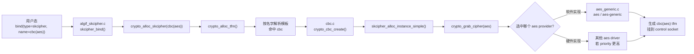
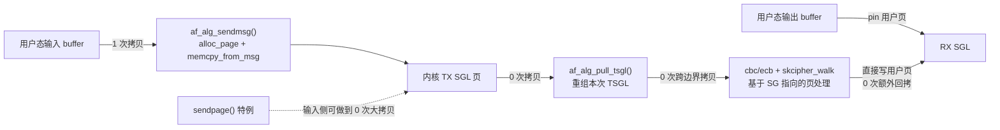

# `algif_skcipher.c` 是怎么走到 `aes_generic.c` 的

> 结论先说在前面:
>
> `kernel/kernel-5.10/crypto/algif_skcipher.c` **不会直接调用**
> `kernel/kernel-5.10/crypto/aes_generic.c`。
>
> 真正的链路是:
>
> `algif_skcipher.c`
> -> `crypto_alloc_skcipher("cbc(aes)")` / `crypto_skcipher_encrypt()`
> -> `cbc.c` 或 `ecb.c` 这样的 `skcipher template`
> -> `skcipher_alloc_instance_simple()` 绑定到底层 `cipher`
> -> `crypto_cipher_alg(cipher)->cia_encrypt`
> -> `aes_generic.c` 里的 `crypto_aes_encrypt()`
>
> 所以它们之间是 **"Crypto API 按算法名和类型做动态绑定"** 的关系，不是源码里一条硬编码的直接调用。

---

## 1. 先把角色分清楚

这一条链路里有 4 层角色:

1. `algif_skcipher.c`
   负责 `AF_ALG` 的用户态 socket 接口，接收 `sendmsg/recvmsg` 请求。
2. `skcipher`
   负责“对外暴露一个对称加解密接口”，例如 `cbc(aes)`、`ecb(aes)`、`ctr(aes)`。
3. `template`
   负责模式本身，例如 `cbc.c`、`ecb.c`。它们实现 CBC/ECB 的流程控制。
4. `cipher`
   负责最底层单块加解密，例如 `aes_generic.c` 里的 `aes`。

`algif_skcipher` 面向的是 `skcipher`。

`aes_generic` 提供的是 `cipher`。

中间必须有一个“模式层”把两者接起来。

---

## 2. 绑定阶段: `algif_skcipher` 先拿到一个 `skcipher tfm`

`algif_skcipher.c` 自己并不认识 AES，它只认识“按名字申请一个 `skcipher` 变换对象”。

先看一张总览图:



控制 socket `bind()` 时会走到:

```c
static void *skcipher_bind(const char *name, u32 type, u32 mask)
{
    return crypto_alloc_skcipher(name, type, mask);
}
```

这里的 `name` 通常就是用户态传入的算法名，例如:

- `cbc(aes)`
- `ecb(aes)`
- `ctr(aes)`

也就是说，`algif_skcipher` 在这里做的事只是:

- 接收字符串算法名
- 调 `crypto_alloc_skcipher()`
- 把返回的 `struct crypto_skcipher *tfm` 存到 control socket 私有区

它并没有写死“去找 AES”。

---

## 3. `crypto_alloc_skcipher("cbc(aes)")` 怎么解析

`crypto_alloc_skcipher()` 本身只是一个薄封装:

```c
struct crypto_skcipher *crypto_alloc_skcipher(const char *alg_name,
                                              u32 type, u32 mask)
{
    return crypto_alloc_tfm(alg_name, &crypto_skcipher_type, type, mask);
}
```

继续往下看，`crypto_alloc_tfm()` 最终会进入 `crypto_alloc_tfm_node()`:

```c
alg = crypto_find_alg(alg_name, frontend, type, mask);
tfm = crypto_create_tfm_node(alg, frontend, node);
```

这一步的意义是:

1. 先按名字和前端类型找算法
2. 找到后创建对应的 `tfm`
3. 如果是模板算法，还可能触发“按需实例化”

对 `cbc(aes)` 来说，它不是一个普通静态名字，而是:

- 外层模板名: `cbc`
- 内层底层算法名: `aes`

所以这里会走到 `cbc` 模板的创建逻辑。

---

## 4. `cbc.c` 负责把 `"cbc(aes)"` 变成一个真正可执行的 `skcipher`

`cbc.c` 在初始化时注册了一个模板:

```c
static struct crypto_template crypto_cbc_tmpl = {
    .name = "cbc",
    .create = crypto_cbc_create,
    .module = THIS_MODULE,
};
```

也就是说，当 Crypto API 看到 `"cbc(...)"` 时，会转到 `crypto_cbc_create()`。

`crypto_cbc_create()` 的核心是:

```c
inst = skcipher_alloc_instance_simple(tmpl, tb);
...
inst->alg.encrypt = crypto_cbc_encrypt;
inst->alg.decrypt = crypto_cbc_decrypt;
...
err = skcipher_register_instance(tmpl, inst);
```

这几行很关键:

- `skcipher_alloc_instance_simple()`:
  申请一个新的 `skcipher instance`
- `inst->alg.encrypt = crypto_cbc_encrypt`:
  规定这个 instance 的加密入口就是 `cbc.c` 里的 CBC 实现
- `skcipher_register_instance()`:
  把这个新实例注册为一个真正可分配的 `skcipher`

所以 `cbc(aes)` 的“外壳”是在这里建起来的。

---

## 5. `skcipher_alloc_instance_simple()` 在这里把底层绑成 `aes`

真正把 `cbc` 和 `aes` 粘起来的，是 `crypto/skcipher.c` 里的
`skcipher_alloc_instance_simple()`:

```c
err = crypto_check_attr_type(tb, CRYPTO_ALG_TYPE_SKCIPHER, &mask);
...
err = crypto_grab_cipher(spawn, skcipher_crypto_instance(inst),
                         crypto_attr_alg_name(tb[1]), 0, mask);
...
cipher_alg = crypto_spawn_cipher_alg(spawn);
...
inst->alg.setkey = skcipher_setkey_simple;
inst->alg.init = skcipher_init_tfm_simple;
inst->alg.exit = skcipher_exit_tfm_simple;
```

这里要注意两个点。

### 5.1 它抓的不是 `skcipher`，而是 `cipher`

这里调用的是 `crypto_grab_cipher()`，不是 `crypto_grab_skcipher()`。

这说明:

- `cbc` 这种 simple mode template
- 下面绑定的是一个 `CRYPTO_ALG_TYPE_CIPHER`
- 也就是单块 cipher，比如 `aes`

这正是 `cbc(aes)` 能成立的原因:

- 外层是 `skcipher`
- 内层是 `cipher`

### 5.2 底层 `cipher` 名字就是 `aes`

`crypto_attr_alg_name(tb[1])` 取出来的就是模板参数里的 `"aes"`。

也就是说，对于 `cbc(aes)`，这里实际做的是:

```c
crypto_grab_cipher(..., "aes", ...);
```

然后把抓到的底层 cipher 保存到这个 instance 的上下文里。

---

## 6. `aes_generic.c` 就是在这里被选为底层 `cipher` 候选之一

`aes_generic.c` 注册的是一个 `cipher` 类型算法:

```c
static struct crypto_alg aes_alg = {
    .cra_name           =   "aes",
    .cra_driver_name    =   "aes-generic",
    .cra_priority       =   100,
    .cra_flags          =   CRYPTO_ALG_TYPE_CIPHER,
    ...
    .cra_u              =   {
        .cipher = {
            .cia_setkey     =   crypto_aes_set_key,
            .cia_encrypt    =   crypto_aes_encrypt,
            .cia_decrypt    =   crypto_aes_decrypt
        }
    }
};
```

模块初始化时:

```c
static int __init aes_init(void)
{
    return crypto_register_alg(&aes_alg);
}
```

所以 `aes_generic.c` 提供给 Crypto API 的其实是:

- 算法名: `aes`
- driver 名: `aes-generic`
- 类型: `CRYPTO_ALG_TYPE_CIPHER`
- 真正的单块函数指针:
  - `cia_encrypt = crypto_aes_encrypt`
  - `cia_decrypt = crypto_aes_decrypt`

当 `cbc` 模板去 `grab_cipher("aes")` 时，如果当前系统选中的实现是
`aes-generic`，那最终拿到的底层就是这里。

如果系统里还有别的更高优先级实现，比如硬件 AES driver，那么这里也可能选中别的 `aes` provider，而不是 `aes_generic.c`。

所以更精确的说法是:

- `algif_skcipher.c` 不是“走到 `aes_generic.c`”
- 而是“走到名为 `aes` 的底层 `cipher` 实现”
- 当该实现恰好是 `aes-generic` 时，最终才会落到 `aes_generic.c`

---

## 7. 运行阶段: `recvmsg()` 才真正触发加密

`sendmsg()` 只是把数据堆到 TX SGL；真正执行加密是在 `recvmsg()`。

先把运行期主干画出来:

```mermaid
flowchart TD
    U1["用户态<br/>sendmsg()"] --> S1["af_alg_sendmsg()<br/>把输入数据堆进 TX SGL"]
    S1 --> S2["ctx->tsgl_list<br/>全局 TX SGL"]

    U2["用户态<br/>recvmsg()"] --> R1["_skcipher_recvmsg()"]
    S2 --> R1
    R1 --> R2["af_alg_get_rsgl()<br/>把输出 buffer 变成 RX SGL"]
    R2 --> R3["af_alg_pull_tsgl()<br/>摘出本次 request 的 TSGL"]
    R3 --> R4["skcipher_request_set_tfm()<br/>skcipher_request_set_crypt()"]
    R4 --> R5["crypto_skcipher_encrypt()<br/>或 decrypt()"]
    R5 --> R6{"当前 tfm 是什么?"}
    R6 -->|cbc(aes)| C1["cbc.c<br/>crypto_cbc_encrypt()"]
    R6 -->|ecb(aes)| E1["ecb.c<br/>crypto_ecb_encrypt()"]
    C1 --> F1["crypto_cipher_alg(cipher)->cia_encrypt"]
    E1 --> F1
    F1 --> G1["aes_generic.c<br/>crypto_aes_encrypt()<br/>或其他 aes provider"]
    G1 --> H1["结果写入 RX SGL<br/>指向的用户页"]
```

`algif_skcipher.c` 里的关键路径是:

```c
skcipher_request_set_tfm(&areq->cra_u.skcipher_req, tfm);
skcipher_request_set_crypt(&areq->cra_u.skcipher_req, areq->tsgl,
                           areq->first_rsgl.sgl.sg, len, ctx->iv);

err = ctx->enc ?
    crypto_skcipher_encrypt(&areq->cra_u.skcipher_req) :
    crypto_skcipher_decrypt(&areq->cra_u.skcipher_req);
```

这里的 `tfm`，就是前面 `crypto_alloc_skcipher("cbc(aes)")` 拿到的那个对象。

也就是说:

- `algif_skcipher` 只负责准备 request
- 真正调用哪套加密实现，由 `tfm` 决定

---

## 8. `crypto_skcipher_encrypt()` 进到的是 `cbc.c` 的 `.encrypt`

因为前面 `cbc` 模板创建 instance 时做了:

```c
inst->alg.encrypt = crypto_cbc_encrypt;
inst->alg.decrypt = crypto_cbc_decrypt;
```

所以当 request 上挂的是 `cbc(aes)` 这个 tfm 时，
`crypto_skcipher_encrypt()` 最终调到的就是:

- `cbc.c: crypto_cbc_encrypt()`

如果绑定的是 `ecb(aes)`，则会进入:

- `ecb.c: crypto_ecb_encrypt()`

也就是说，从 `algif_skcipher` 到 `aes_generic` 中间至少隔着一层 mode template。

---

## 9. `cbc.c` 怎么继续下钻到底层 AES

`cbc.c` 的加密核心很直接:

```c
cipher = skcipher_cipher_simple(skcipher);
tfm = crypto_cipher_tfm(cipher);
fn = crypto_cipher_alg(cipher)->cia_encrypt;

do {
    crypto_xor(iv, src, bsize);
    fn(tfm, dst, iv);
    memcpy(iv, dst, bsize);
    ...
} while (...);
```

这几行基本就是全链路的最后一跳。

它做了三件事:

1. `skcipher_cipher_simple(skcipher)`
   从当前 `skcipher` 里取出底层 `cipher`
2. `crypto_cipher_alg(cipher)->cia_encrypt`
   取到底层 cipher 的单块加密函数指针
3. `fn(tfm, dst, iv)`
   真正调用这个函数指针

如果当前底层选中的就是 `aes-generic`，那这里的:

```c
fn = crypto_cipher_alg(cipher)->cia_encrypt;
```

最终就等价于:

```c
fn = crypto_aes_encrypt;
```

然后 `fn(...)` 就进入 `aes_generic.c`。

解密同理，只不过用的是 `cia_decrypt`。

---

## 10. 用一句话串起来整条调用链

假设用户态绑定的是 `salg_name = "cbc(aes)"`，并且系统最终选中的底层
AES provider 是 `aes-generic`，那么调用链可以写成:

```text
user bind("skcipher", "cbc(aes)")
-> algif_skcipher.c: skcipher_bind()
-> crypto_alloc_skcipher("cbc(aes)")
-> crypto_alloc_tfm()
-> cbc.c: crypto_cbc_create()
-> skcipher.c: skcipher_alloc_instance_simple()
-> crypto_grab_cipher(..., "aes", ...)
-> 选中 aes_generic.c 注册的 "aes" / "aes-generic"

user recvmsg()
-> algif_skcipher.c: _skcipher_recvmsg()
-> crypto_skcipher_encrypt(req)
-> cbc.c: crypto_cbc_encrypt()
-> cbc.c: crypto_cipher_alg(cipher)->cia_encrypt
-> aes_generic.c: crypto_aes_encrypt()
```

如果是 `ecb(aes)`，中间的 `cbc.c` 换成 `ecb.c`:

```text
algif_skcipher.c
-> crypto_skcipher_encrypt()
-> ecb.c: crypto_ecb_encrypt()
-> crypto_cipher_alg(cipher)->cia_encrypt
-> aes_generic.c: crypto_aes_encrypt()
```

---

## 11. 整条链路从用户态到内核态一共拷贝几次

如果讨论的是最常见这条路径:

- 用户态 `sendmsg()` 提交明文/密文
- `AF_ALG` + `algif_skcipher`
- 内核里跑 `cbc(aes)` / `ecb(aes)`
- 用户态 `recvmsg()` 取回结果

那么对 **主 payload** 来说，常规情况可以记成一句话:

> **整条链路通常只有 1 次真正的数据拷贝，而且发生在输入侧 `sendmsg()`。**

如果只盯“payload 在哪一步真的被复制”，可以直接看这张图:



### 11.1 第 1 次拷贝: `sendmsg()` 把用户 buffer 拷进内核 TX page

`af_alg_sendmsg()` 里最关键的是这几行:

```c
sg_assign_page(sg + i, alloc_page(GFP_KERNEL));
...
err = memcpy_from_msg(page_address(sg_page(sg + i)), msg, plen);
```

这里发生的事非常直接:

1. 内核先 `alloc_page()` 分配 page
2. 再用 `memcpy_from_msg()` 把用户态数据拷进这张 page
3. 最后把这张 page 挂进 `ctx->tsgl_list`

所以:

- 用户态输入数据 -> 内核 TX SGL
- 这里是 **1 次真实拷贝**

### 11.2 TX SGL -> 本次 request TSGL: 不拷贝，只挪页引用

`_skcipher_recvmsg()` 在真正发起加密前，会调用:

```c
af_alg_pull_tsgl(sk, len, areq->tsgl, 0);
```

而 `af_alg_pull_tsgl()` 里干的是:

```c
get_page(page);
sg_set_page(dst + j, page, plen - dst_offset, sg[i].offset + dst_offset);
```

这一步的本质是:

- 复用原来的 page
- 增加页引用计数
- 重新组织 scatterlist

并没有再来一遍 `memcpy`。

所以:

- 全局 TX SGL -> 本次 request 的 TX SGL
- **0 次 payload 拷贝**

### 11.3 crypto 层处理时:通常也不再新增一次用户态/内核态拷贝

`cbc.c` / `ecb.c` 看到的是 scatterlist。

`skcipher_walk_virt()` 会把这些 SG entry 映射成可访问地址，然后直接在这些页上做读写。对常规快路径来说，它不是:

- 先复制到一个新的大内核缓冲
- 算完再复制回去

而是:

- 直接基于 SG 指向的页做处理

所以在“用户态 <-> 内核态边界”这个问题上，这一层 **不额外增加一次跨边界拷贝**。

### 11.4 `recvmsg()` 输出侧:通常不是回拷，而是直接写用户页

`_skcipher_recvmsg()` 里先调:

```c
err = af_alg_get_rsgl(sk, msg, flags, areq, ctx->used, &len);
```

而 `af_alg_get_rsgl()` 继续调用:

```c
err = af_alg_make_sg(&rsgl->sgl, &msg->msg_iter, seglen);
```

`af_alg_make_sg()` 里关键路径是:

```c
n = iov_iter_get_pages(iter, sgl->pages, len, ALG_MAX_PAGES, &off);
...
sg_set_page(sgl->sg + i, sgl->pages[i], plen, off);
```

这说明输出侧做的是:

- 把用户态 `recvmsg()` 给出的目标 buffer 所在页 pin 住
- 直接把这些页挂成 RX scatterlist
- 后面的 cipher 结果直接写进这些用户页

它不是这种模式:

- 先写一个内核结果 buffer
- 再 `copy_to_user()`

所以:

- 内核结果 -> 用户态输出 buffer
- 常规情况下 **0 次额外回拷**

### 11.5 最实用的结论

如果你问的是 **主 payload**:

- 只看“用户态 -> 内核态”输入方向: **1 次**
- 看“用户态 -> 内核处理 -> 回到用户态”整条端到端: **通常还是 1 次**

也就是:

```text
sendmsg:   1 次拷贝
crypto:    0 次跨边界拷贝
recvmsg:   0 次额外回拷
-------------------------
合计:      通常 1 次
```

### 11.6 两个容易忽略的补充

#### 补充 A:`ALG_SET_KEY` / `ALG_SET_IV` 也会有小拷贝

这些不是主 payload，但它们确实会拷贝:

- `ALG_SET_KEY`: `copy_from_sockptr()` 把 key 拷到内核缓冲
- `ALG_SET_IV`: `memcpy(ctx->iv, ...)` 把 IV 拷进内核上下文

所以如果你问的是“所有控制数据加起来有没有拷贝”，答案当然是有。

#### 补充 B:经由 `sendpage` 路径时,输入侧那 1 次可以省掉

`algif_skcipher` 的 `proto_ops` 里确实挂了 `.sendpage = af_alg_sendpage`。也就是说,**当请求经由 sendpage 路径进入这个 socket** 时,会走:

```c
.sendpage = af_alg_sendpage,
```

对应实现里核心是:

```c
get_page(page);
sg_set_page(sgl->sg + sgl->cur, page, size, offset);
```

这里是直接引用 page，不做 `memcpy_from_msg()`。

所以在合适前提下:

- 输入侧也可以做到 **0 次大拷贝**
- 真正接近零拷贝

但要注意两点:

1. 这说的是 **经由 `sendpage` 路径进入 `AF_ALG` socket** 的情况,不是本文主线里的普通 `sendmsg/recvmsg`
2. 对大多数用户态示例和日常使用来说,你看到的仍然是 `sendmsg/recvmsg` 主路径

### 11.7 严格一点的 caveat:慢路径里可能有内核内部 bounce copy

`skcipher_walk` 在对齐不满足、页布局不合适等情况下，可能进入
`SKCIPHER_WALK_SLOW` 或 `SKCIPHER_WALK_COPY` 路径，内部会做一次块级临时拷贝。

不过要注意:

1. 这不是 `AF_ALG` 主路径固定发生的事
2. 它通常是 **内核内部 bounce copy**
3. 它不改变“跨用户态/内核态边界的主 payload 通常只有 1 次拷贝”这个结论

所以在讲整体架构时，记住“**常规 `sendmsg/recvmsg` 路径通常 1 次**”就够用了。

---

## 12. 为什么源码里看不到 “直接调用 `crypto_aes_encrypt()`”

因为内核 Crypto API 故意把这一层做成了“名字 + 类型 + 函数指针分发”。

这样有几个好处:

1. `algif_skcipher` 不需要知道底层是软件还是硬件
2. `cbc` / `ecb` 模板可以复用任意满足条件的 block cipher
3. 同一套上层接口可以自动切换到底层更高优先级实现

所以你在 `algif_skcipher.c` 里看到的是:

- `crypto_alloc_skcipher("cbc(aes)")`
- `crypto_skcipher_encrypt(req)`

而不是:

- `crypto_aes_encrypt(...)`

因为真正的目标函数是在运行时由 Crypto API 选出来的。

---

## 13. 看代码时最容易搞混的点

### 13.1 `skcipher` 和 `cipher` 不是一回事

- `skcipher`: 面向模式后的对称加解密接口
- `cipher`: 面向单块 block cipher 接口

`cbc(aes)` 的本质就是:

- 外层 `skcipher`
- 内层 `cipher(aes)`

### 13.2 `algif_skcipher` 不负责模式实现

`algif_skcipher.c` 只做:

- socket 协议适配
- SGL 组织
- request 构造
- 调用 Crypto API

CBC/ECB/XTS 这些模式逻辑不在这里。

### 13.3 最后一跳是函数指针，不是直接符号引用

真正从 mode template 落到底层 block cipher 的方式是:

```c
crypto_cipher_alg(cipher)->cia_encrypt
crypto_cipher_alg(cipher)->cia_decrypt
```

这是理解整条链路最关键的一点。

---

## 14. 最后给一个最短答案

如果你只想记最核心的一句，可以记这个:

> `algif_skcipher.c` 先通过 `crypto_alloc_skcipher("cbc(aes)")` 拿到一个
> `cbc` 模板实例；`recvmsg()` 时调用 `crypto_skcipher_encrypt()` 进入
> `cbc.c`；`cbc.c` 再通过 `crypto_cipher_alg(cipher)->cia_encrypt` 间接调用
> 到底层 `aes` 的实现；当底层 `aes` 实现正好是 `aes-generic` 时，最终就落到
> `aes_generic.c` 的 `crypto_aes_encrypt()`。

---

## 15. 建议配套阅读

- `kernel/kernel-5.10/crypto/algif_skcipher.c`
- `kernel/kernel-5.10/crypto/skcipher.c`
- `kernel/kernel-5.10/crypto/cbc.c`
- `kernel/kernel-5.10/crypto/ecb.c`
- `kernel/kernel-5.10/crypto/aes_generic.c`

