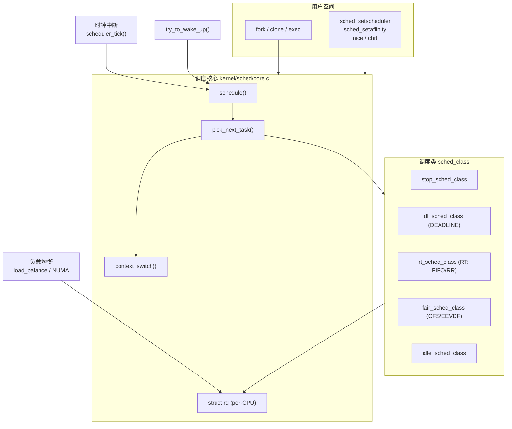
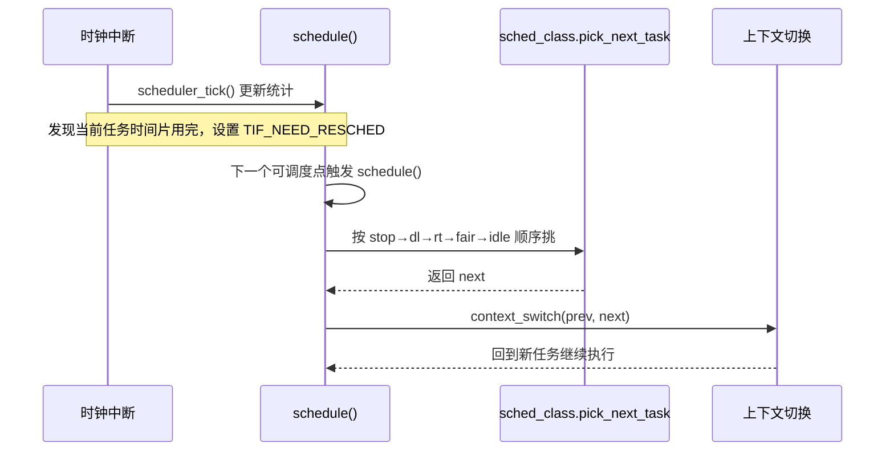

# Linux 调度系统总览与核心抽象

## 前言

**C：** "把合适的进程在合适的时间放到合适的 CPU 上跑"——这句话几乎就是 Linux 调度器的全部任务。听起来简单，实现却牵涉到数据结构、时间精度、多核负载、实时性、公平性、cgroup 与电源管理。这一篇先把整个调度系统的**边界、层次、核心抽象**讲清楚，后续章节再逐个展开 CFS、RT、DEADLINE、负载均衡、抢占与调优。

<!-- more -->

## 调度器要解决的问题

从任何操作系统教材里我们都会看到一个类似的清单，Linux 也不例外：

- **公平性**：普通任务之间不应有人饿死；
- **响应性**：交互式任务要尽快被调度，让用户感觉"流畅"；
- **吞吐量**：CPU 不能空转，计算型任务要尽可能压满；
- **实时性**：硬实时任务必须能在 deadline 之前跑完；
- **可扩展性**：从单核嵌入式到上百核 NUMA 服务器都要能用；
- **可控性**：通过 `nice`、`cgroup`、`chrt`、`taskset` 等给用户预期。

这些目标彼此是**冲突**的。Linux 的做法不是做一个包打天下的算法，而是把调度拆成多个"调度类"（scheduling class），每一类只对一类负载负责，再由一个薄薄的主框架把它们串起来。

## 从一张大图开始



这张图里有几个信息是后面反复会用到的：

1. **每个 CPU 一个 `struct rq`（run queue）**——所有调度行为最终都要落到某个 CPU 的 rq 上；
2. **调度类是一条链表**，`pick_next_task()` 按优先级从 stop → dl → rt → fair → idle 依次尝试；
3. **触发调度的来源只有几种**：时钟 tick、唤醒、主动 yield、返回用户态前检查 `TIF_NEED_RESCHED`；
4. **负载均衡在调度核心之外**，它只是调整"哪个任务挂在哪个 rq"，但不直接选任务。

## 核心抽象一：task_struct 里的调度字段

`task_struct` 是 Linux 里描述一个可调度实体的主结构体，它很大，但真正跟调度直接相关的字段并不多：

```c
struct task_struct {
    // ... 很多其它字段 ...

    int              prio;            // 当前动态优先级(含 PI/boost)
    int              static_prio;     // 静态优先级(来自 nice)
    int              normal_prio;     // 正常情况下的优先级
    unsigned int     rt_priority;     // RT 任务的实时优先级 1-99

    const struct sched_class *sched_class;   // 当前归属的调度类
    struct sched_entity      se;              // CFS 专用(被内嵌)
    struct sched_rt_entity   rt;              // RT 专用
    struct sched_dl_entity   dl;              // DEADLINE 专用

    unsigned int     policy;          // SCHED_NORMAL/FIFO/RR/DEADLINE/BATCH/IDLE
    cpumask_t        cpus_mask;       // 允许跑的 CPU 集合(taskset)

    // 与 NEED_RESCHED 交互
    struct thread_info  thread_info;  // 含 flags，TIF_NEED_RESCHED 就在这里
};
```

几个要点：

- 一个任务**任意时刻只属于一个调度类**，但可以通过 `sched_setscheduler()` 在运行时切换；
- `se / rt / dl` 是三套互不兼容的"调度实体"，每个调度类只看自己的那一份；
- `cpus_mask` 既给用户（taskset/cgroup cpuset）用，也给负载均衡用——任务不能被迁到不允许的 CPU 上；
- `TIF_NEED_RESCHED` 是一个线程级标志，置位后在下一个"可调度点"（抢占返回、中断返回、`cond_resched()` 等）会触发 `schedule()`。

## 核心抽象二：per-CPU 的 struct rq

每颗 CPU 都有一份 run queue：

```c
struct rq {
    raw_spinlock_t lock;

    unsigned int  nr_running;        // 当前 rq 上所有调度类的总可运行数
    u64           clock;             // rq 时钟(单调,有跳过idle的变种)
    u64           clock_task;

    struct task_struct *curr;        // 正在这颗 CPU 上跑的任务
    struct task_struct *idle;        // 这颗 CPU 的 swapper/idle 任务
    struct task_struct *stop;        // migration thread 等

    struct cfs_rq cfs;               // CFS 的运行队列(红黑树等)
    struct rt_rq  rt;                // RT 的运行队列
    struct dl_rq  dl;                // DEADLINE 的运行队列

    unsigned long cpu_capacity;      // 这颗 CPU 的算力(big.LITTLE 会不同)
    struct sched_domain __rcu *sd;   // 负载均衡用的调度域树
    // ...
};
```

你可以把 rq 理解为"CPU 的工位看板"——上面挂着这颗 CPU 当前在跑什么，还有多少在排队，属于哪个调度类。`schedule()` 做的本质工作就是：

1. 拿当前 CPU 的 rq 锁；
2. 从 rq 里按调度类优先级挑出下一个任务；
3. 如果跟 `curr` 不是同一个，就做上下文切换。

## 核心抽象三：sched_class 调度类链

Linux 的"多策略"是通过一条静态链表实现的：

```c
const struct sched_class stop_sched_class;
const struct sched_class dl_sched_class;
const struct sched_class rt_sched_class;
const struct sched_class fair_sched_class;
const struct sched_class idle_sched_class;
```

调度类之间的优先级是固定的（从高到低）：

| 调度类 | 用途 | 典型策略 |
|--------|------|----------|
| stop | 迁移线程、热插拔 | 内核内部使用 |
| dl | 硬实时，基于 deadline/period/runtime | `SCHED_DEADLINE` |
| rt | 传统实时，1–99 优先级 | `SCHED_FIFO`、`SCHED_RR` |
| fair | 普通分时任务 | `SCHED_NORMAL`、`SCHED_BATCH`、`SCHED_IDLE` |
| idle | 真正什么都跑不了的时候 | 跑 swapper/idle 线程 |

每个调度类实现一组回调：`enqueue_task / dequeue_task / pick_next_task / put_prev_task / task_tick / set_cpus_allowed / balance` 等。`schedule()` 就是按调度类链"从上到下"调用这些回调。

这也是 Linux 调度器**扩展性的关键**：想加一个新调度类，原则上只需实现一组 `sched_class` 回调，然后把它插入链表合适的位置。EEVDF 在 6.6 合并进 CFS 时，就是在 fair 这一类里**替换**掉了原来的 vruntime+红黑树算法，其它类和 core.c 基本不用动。

## 调度策略一览

用户态可以通过 `sched_setscheduler(2)` / `chrt(1)` 来切换调度策略：

```bash
# 查看进程的策略与优先级
chrt -p <pid>

# 设成 SCHED_FIFO，优先级 50
sudo chrt -f -p 50 <pid>

# 设成 SCHED_DEADLINE, runtime=10ms, deadline=30ms, period=30ms
sudo chrt -d -T 10000000 -D 30000000 -P 30000000 0 /path/to/program
```

常用策略映射：

| `SCHED_*` | 调度类 | 典型用法 |
|-----------|--------|----------|
| `SCHED_NORMAL` (0) | fair | 绝大多数进程，受 nice 控制 |
| `SCHED_BATCH` (3)  | fair | CPU 密集后台任务，抢占更友好 |
| `SCHED_IDLE` (5)   | fair | 真正的"空闲时才跑" |
| `SCHED_FIFO` (1)   | rt   | 实时任务，不被同级抢占 |
| `SCHED_RR` (2)     | rt   | 实时任务，同级按时间片轮转 |
| `SCHED_DEADLINE` (6) | dl | 严格 deadline/period/runtime 约束 |

## 一次完整的调度流程（宏观）

从宏观角度看，一次"切换到某个任务"大致会经历：



几个容易被忽略的细节：

- **中断返回前不直接调度**：中断路径只是"打标"，真正的切换发生在抢占点；
- **`TIF_NEED_RESCHED` 设上后不代表立刻切**：如果当前在持自旋锁，则要等锁释放；
- **pick 可能快路径**：如果 CFS 上只有一个任务且没有其它类的任务，内核会走 `pick_next_task_fair()` 的 fast path，不用遍历整条类链；
- **idle 不是"什么都不做"**：它是一个真正的任务，运行 `cpuidle`，决定进入哪个 C-state。

## 触发调度的几个入口

从源码角度，`schedule()` 会在下列路径上被调用：

| 入口 | 谁触发 | 常见场景 |
|------|--------|----------|
| `scheduler_tick()` | 时钟中断 | 每 tick 更新统计、可能设 `NEED_RESCHED` |
| `try_to_wake_up()` | 唤醒路径 | `wake_up()`、信号量 up、条件变量等 |
| `preempt_schedule()` / `preempt_schedule_irq()` | 抢占点 | 从中断/内核抢占返回 |
| `cond_resched()` | 长路径主动让出 | 内核代码里显式调用 |
| 系统调用返回用户态 | 用户态返回前检查 flags | `exit_to_user_mode_loop()` |
| 主动阻塞 | `schedule_timeout()`、`wait_event()` | I/O、睡眠 |

理解这张表非常重要——"为什么我的 RT 任务没被调度到"、"为什么 cond_resched 少的地方会出现调度延迟"这类问题，追的其实就是这些入口。

## 和其它子系统的边界

调度器并不孤立，它跟这几个子系统关系特别紧：

- **时间子系统**：`sched_clock()`、`hrtimer`、`tick_nohz_*` 决定了调度器"看到的时间"是否精确、是否连续；
- **中断与抢占**：`preempt_count`、`local_irq_*` 直接决定了何时可以切换；
- **内存管理**：`context_switch()` 要切页表、flush TLB，NUMA 还要考虑内存局部性；
- **cgroup**：`cpu`、`cpuset`、`cpuacct` 控制器把调度粒度从"任务"升级到"任务组"；
- **电源管理**：`schedutil` CPUFreq governor、EAS（Energy Aware Scheduling）、cpuidle 都跟调度器深度耦合。

后面各章节会各自展开，但在脑子里先留一个印象：**调度器不是一个纯粹的算法模块，而是内核里的"总指挥"**。

## 本章小结

- Linux 调度器的骨架 = per-CPU `struct rq` + 一条 `sched_class` 链 + `task_struct` 里的调度字段；
- `schedule()` 做的只是**选一个任务并切上去**，策略差异全在调度类内部；
- 触发调度的路径就那么几种：时钟 tick、唤醒、主动让出、抢占返回、系统调用返回；
- `SCHED_*` 策略直接对应到调度类，`chrt`/`nice`/`taskset`/`cgroup` 是给用户的控制面。

下一篇我们走进 `sched_class` 的接口定义，看看内核是用什么样的"抽象类"把 CFS/RT/DL 串起来的。
