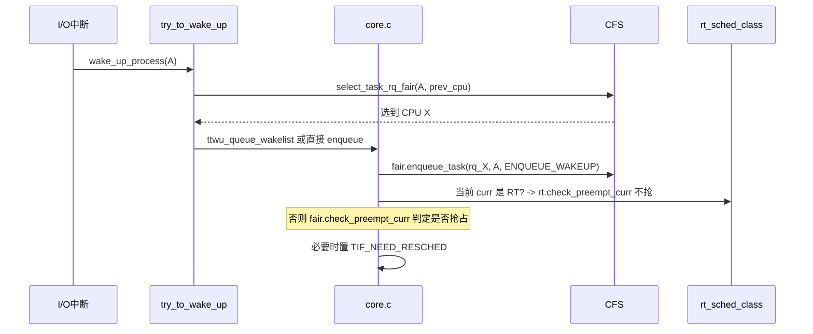

# 调度类框架与 sched_class

## 前言

**C：** 上一篇我们说 Linux 调度器的核心抽象之一是"调度类链"——从 stop 到 idle 的一条静态链表，每一类负责一种负载。这一章我们就钻到这个框架里，把 `struct sched_class` 的字段一个个讲清楚，然后跟着一次 `schedule()` 的过程看它们是怎么被串起来的。读完这一篇，你再去看 `kernel/sched/core.c`、`fair.c`、`rt.c`、`deadline.c`，会觉得它们只是"同一个接口的不同实现"。

<!-- more -->

## 为什么要搞"调度类"

90 年代早期的 Linux 调度器是个大一统的 `O(n)` 循环；2.6 初引入了 `O(1)` 调度器，但把 RT 和普通任务写成了一坨；2.6.23 之后 Ingo Molnár 引入了 **CFS**，同时配套了一个**可插拔的调度类框架**。动机很直白：

- 不同负载的"公平"定义根本不同，RT 要的是**不公平**（高优先级必须压低优先级），CFS 要的是公平；
- 新策略（如 DEADLINE、EEVDF）应该可以**独立演进**，而不用改动核心；
- `schedule()` 希望不关心"是哪一类的任务"，只关心"挑下一个任务"。

于是就有了 `struct sched_class`：一组函数指针，每个调度类都实现一份，核心代码只调接口。

## sched_class 的全貌

在 5.10 / 6.x 上 `struct sched_class` 的定义大约是这样（我按功能分了组）：

```c
struct sched_class {
    // ---- 任务进/出 rq ----
    void (*enqueue_task) (struct rq *rq, struct task_struct *p, int flags);
    void (*dequeue_task) (struct rq *rq, struct task_struct *p, int flags);
    void (*yield_task)   (struct rq *rq);
    bool (*yield_to_task)(struct rq *rq, struct task_struct *p);

    // ---- 选任务/切任务 ----
    void (*check_preempt_curr)(struct rq *rq, struct task_struct *p, int flags);
    struct task_struct *(*pick_next_task)(struct rq *rq);
    void (*put_prev_task)(struct rq *rq, struct task_struct *p);
    void (*set_next_task)(struct rq *rq, struct task_struct *p, bool first);

    // ---- SMP / 迁移 / 负载均衡 ----
#ifdef CONFIG_SMP
    int  (*balance)(struct rq *rq, struct task_struct *prev, struct rq_flags *rf);
    int  (*select_task_rq)(struct task_struct *p, int prev_cpu, int wake_flags);
    void (*migrate_task_rq)(struct task_struct *p, int new_cpu);
    void (*task_woken)(struct rq *this_rq, struct task_struct *task);
    void (*set_cpus_allowed)(struct task_struct *p,
                             const struct cpumask *newmask, u32 flags);
    void (*rq_online)(struct rq *rq);
    void (*rq_offline)(struct rq *rq);
#endif

    // ---- 生命周期与参数变更 ----
    void (*task_tick)(struct rq *rq, struct task_struct *p, int queued);
    void (*task_fork)(struct task_struct *p);
    void (*task_dead)(struct task_struct *p);
    void (*switched_from)(struct rq *rq, struct task_struct *p);
    void (*switched_to)  (struct rq *rq, struct task_struct *p);
    void (*prio_changed) (struct rq *rq, struct task_struct *p, int oldprio);

    unsigned int (*get_rr_interval)(struct rq *rq, struct task_struct *task);

    void (*update_curr)(struct rq *rq);

    // ---- 任务组 / cgroup 支持 ----
#ifdef CONFIG_FAIR_GROUP_SCHED
    void (*task_change_group)(struct task_struct *p, int type);
#endif
};
```

一眼看上去字段很多，但可以按**三个问题**来组织：

1. **什么时候这个任务在我这类手上？**（enqueue / dequeue / switched_to/from）
2. **当有机会跑时，我选谁？**（pick_next_task / set_next_task / check_preempt_curr）
3. **跨 CPU 时怎么办？**（balance / select_task_rq / migrate_task_rq）

## 回调一览：按生命周期理一遍

### 入队 / 出队

```c
void enqueue_task(struct rq *rq, struct task_struct *p, int flags);
void dequeue_task(struct rq *rq, struct task_struct *p, int flags);
```

这是**所有调度活动的起点**。任何让一个任务"可运行"的动作——新建、唤醒、被迁移进来——最终都会走 `activate_task()` → `enqueue_task()`；反过来则是 `deactivate_task()` → `dequeue_task()`。

`flags` 里常见的：

- `ENQUEUE_WAKEUP`：这次 enqueue 是由唤醒引起的；
- `ENQUEUE_MIGRATED`：是因为负载均衡迁过来的；
- `ENQUEUE_RESTORE`：保存/恢复类操作，不改变公平性统计。

CFS 里，enqueue 时会重新计算 `vruntime`、更新 `sched_entity` 在红黑树中的位置；RT 里则是挂到 100 条优先级链表中的一条。

### pick_next_task：核心调度循环

真正让 `schedule()` 挑人是这段逻辑（简化）：

```c
static inline struct task_struct *
__pick_next_task(struct rq *rq, struct task_struct *prev, struct rq_flags *rf)
{
    const struct sched_class *class;
    struct task_struct *p;

    // 快速路径: 若 rq 上只有 fair 类任务，直接走 CFS
    if (likely(prev->sched_class <= &fair_sched_class &&
               rq->nr_running == rq->cfs.h_nr_running)) {
        p = pick_next_task_fair(rq, prev, rf);
        if (likely(p))
            return p;
        goto restart;
    }

restart:
    put_prev_task_balance(rq, prev, rf);

    for_each_class(class) {
        p = class->pick_next_task(rq);
        if (p)
            return p;
    }

    BUG();  // idle 总能给出一个任务
}
```

几个关键信息：

- `for_each_class` 的顺序 = stop → dl → rt → fair → idle；
- 每一类的 `pick_next_task` 只看自己的队列；
- **快速路径**针对最常见情况（一堆普通进程 + 偶尔一个 idle）做了优化，不用遍历整条链；
- `put_prev_task_balance()` 会调用 `prev->sched_class->put_prev_task()`，给"前任"一个做统计、重新入队等后续动作的机会。

### set_next_task / put_prev_task：交接班

你可以把它们理解成"**接班时要做的事**"和"**下班时要做的事**"：

- `put_prev_task()`：更新 vruntime/exec_time、把任务放回红黑树（如果还 runnable）、取消一些 per-task 的 timer；
- `set_next_task()`：标记 `rq->curr = p`、更新 CFS 的 `cfs_rq->curr`、开启 per-task 的 hrtick 等。

CFS 的 `set_next_task_fair()` 里最重要的一步就是**把 `next` 从红黑树里摘下来**——runnable 但不在 tree 里的任务就是"当前正在跑的那个"。

### check_preempt_curr：要不要抢占

每当新任务被 enqueue（尤其是唤醒路径），会调用：

```c
rq->curr->sched_class->check_preempt_curr(rq, new_task, flags);
```

每个调度类对"应不应该抢占当前任务"的判断逻辑完全不同：

| 调度类 | 抢占规则（简化） |
|--------|------------------|
| dl     | 新任务的 deadline 比 curr 近就抢 |
| rt     | 新任务 rt 优先级更高就抢；同级 FIFO 不抢，RR 看时间片 |
| fair   | 新任务的 vruntime 明显小于 curr 且过了最小保护间隔 |

如果判定要抢，会设置 `TIF_NEED_RESCHED`；真正切换还是要等到下一个调度点。

### task_tick：每个 tick 的"体检"

时钟中断会走 `scheduler_tick()`：

```c
void scheduler_tick(void)
{
    struct rq *rq = this_rq();
    struct task_struct *curr = rq->curr;

    update_rq_clock(rq);
    curr->sched_class->task_tick(rq, curr, 0);
    // ...
    trigger_load_balance(rq);
}
```

`task_tick` 的典型责任：

- **累计运行时间**（CFS: `update_curr()` 增加 vruntime；RT: 递减时间片）；
- **时间片到期判定**（RT RR、CFS sched_slice 超出）；
- **设置 `NEED_RESCHED`**；
- **触发带宽限流检查**（CFS bandwidth、DL throttle）。

### SMP 相关：select_task_rq / balance

在多核上，还需要回答"这个任务应该跑在哪颗 CPU 上"。

```c
int select_task_rq(struct task_struct *p, int prev_cpu, int wake_flags);
```

调用时机主要是**唤醒**和**fork**。实现差别很大：

- **CFS**：`select_task_rq_fair()` 走 wake_affine、寻找最空闲的 LLC/SMT sibling；
- **RT**：找一个能容纳这个 RT 优先级的 CPU，优先保留 RT 热度；
- **DL**：找一个 `dl_bw` 预算够、deadline 最松的 CPU。

`balance` 则是在 CPU 即将进入 idle 前拉一把：

```c
int balance(struct rq *rq, struct task_struct *prev, struct rq_flags *rf);
```

如果返回 1，表示这一类成功从其它 CPU 拉到了任务，可以继续调度；返回 0 说明这一类没事可做，轮到下一类或 idle。

### switched_to / switched_from / prio_changed

这些是"**从 A 类切到 B 类**"或者"**优先级变了**"时的钩子。典型触发：

- `sched_setscheduler(SCHED_FIFO)` 把一个普通任务升成 RT；
- PI boost：互斥锁持有者被临时 boost 到等待者的优先级；
- cgroup 把任务移到新的组。

实现要干的事情是：把旧调度类里的状态清理好（如 CFS 的 `se` 从红黑树摘除、更新 `load`），给新调度类做初始化。

## 源码里的实例：CFS 的 sched_class 定义

以 5.10 为例：

```c
DEFINE_SCHED_CLASS(fair) = {
    .enqueue_task       = enqueue_task_fair,
    .dequeue_task       = dequeue_task_fair,
    .yield_task         = yield_task_fair,
    .yield_to_task      = yield_to_task_fair,

    .check_preempt_curr = check_preempt_wakeup,

    .pick_next_task     = __pick_next_task_fair,
    .put_prev_task      = put_prev_task_fair,
    .set_next_task      = set_next_task_fair,

#ifdef CONFIG_SMP
    .balance            = balance_fair,
    .select_task_rq     = select_task_rq_fair,
    .migrate_task_rq    = migrate_task_rq_fair,

    .rq_online          = rq_online_fair,
    .rq_offline         = rq_offline_fair,

    .task_dead          = task_dead_fair,
    .set_cpus_allowed   = set_cpus_allowed_common,
#endif

    .task_tick          = task_tick_fair,
    .task_fork          = task_fork_fair,

    .prio_changed       = prio_changed_fair,
    .switched_from      = switched_from_fair,
    .switched_to        = switched_to_fair,

    .get_rr_interval    = get_rr_interval_fair,

    .update_curr        = update_curr_fair,

#ifdef CONFIG_FAIR_GROUP_SCHED
    .task_change_group  = task_change_group_fair,
#endif
};
```

`DEFINE_SCHED_CLASS(fair)` 这个宏会把结构体放到一个特殊的 section 里，让它们在最终二进制中**按照声明顺序排列**，`for_each_class` 其实就是在这段内存里按地址遍历，这正是"调度类按优先级排序"的物理实现。

## 从一次唤醒看调度类如何协作

假设有一个普通进程 `A` 在睡眠，一个 I/O 完成事件把它唤醒：



这里体现了调度类框架的优雅之处：`try_to_wake_up` 本身根本不用知道 `A` 是 CFS、RT 还是 DL，它只调 `A->sched_class->xxx`，正确的实现自动就被分派了。

## 写一个调度类要做什么（思想实验）

假设你想在 CFS 和 idle 之间塞一个"低优先级 batch 调度类"（真实的 `SCHED_BATCH` 已经在 fair 里实现，这里只当练手）：

1. 定义 `struct batch_rq` 嵌入 `struct rq`；
2. 实现一组回调（enqueue/dequeue/pick/put/tick…）；
3. `DEFINE_SCHED_CLASS(batch)` 放在 fair 和 idle 之间；
4. `task_struct` 里加一个 `struct batch_entity`；
5. 在 `__setscheduler()` 里识别新的 `SCHED_*` 值；
6. 处理 cgroup/负载均衡/优先级变更的边界。

光是列出来就已经能看出：**"加一个调度类"本身不难，难的是跟其它子系统的兼容**。社区长期以来的惯例是：除非你要解决的问题真的不能在已有类里表达，否则就在已有类内部加 feature（比如 `SCHED_IDLE` 其实还是 CFS 的一个"极低权重"分支）。

## 本章小结

- `struct sched_class` 是 Linux 调度器的核心抽象：一组函数指针，一种负载一份实现；
- 调度类之间的优先级是**编译期固定**的：stop > dl > rt > fair > idle；
- 核心路径只关心"调接口"，策略差异全部在回调里；
- 读源码的正确姿势：先把这 20 几个回调看懂，再进具体调度类时就会轻松很多。

下一篇我们深入 CFS/EEVDF，看 `vruntime`、红黑树、sched slice 这些术语到底是什么。
