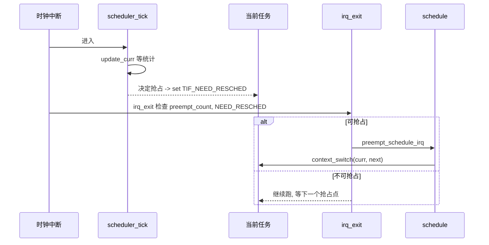

# 抢占、上下文切换与调度时机

## 前言

**C：** 前面几章我们讲了"调度器如何挑任务"，但还有一个同样关键的问题：**什么时候允许切、切的时候到底切了什么**。这一篇我们走一遍抢占模型、`TIF_NEED_RESCHED` 的生命周期、`context_switch()` 的底层操作，最后聊一下内核抢占的几种配置（PREEMPT_NONE / VOLUNTARY / DYNAMIC / RT）以及它们带来的延迟差异。

<!-- more -->

## 抢占的两个世界

Linux 里"抢占"（preemption）这个词经常引起混淆，因为它发生在两个层面：

- **用户态抢占**：用户态代码执行时被内核剥夺 CPU。这个**一直都有**，从 1.0 就存在；
- **内核态抢占**：内核代码执行时也可以被另一个任务（通常是更高优先级）剥夺 CPU。这个是 2.6 之后才有，并且受 `CONFIG_PREEMPT_*` 控制。

为什么分两层？因为"在内核里运行"意味着可能正持有锁、正在访问 per-CPU 结构、正处在关中断临界区——这些地方**被抢占**会引入错误。于是内核提供了精细的控制：用 `preempt_count` 记录"当前是否允许抢占"，用 `TIF_NEED_RESCHED` 标记"有人想抢占我"。

## preempt_count：是否允许切换

`preempt_count` 是一个 per-task 的整数，但它其实是一个**分段计数器**：

```
bit  0-7   preempt (显式 preempt_disable)
bit  8-15  softirq
bit 16-23  hardirq
bit 24-27  nmi
bit 28     PREEMPT_NEED_RESCHED (反码)
```

意义：

- `preempt_disable() / preempt_enable()` 只动最低 8 位；
- 在软中断/硬中断/NMI 上下文时各自字段会非零；
- **只要整个 preempt_count 非 0，就不能被抢占**——因为你可能持锁或在中断里。

加快判断是否可抢的宏 `preemptible()` 基本就是 `preempt_count() == 0 && !irqs_disabled()`。

## TIF_NEED_RESCHED：请求抢占的信号

当调度器认为"当前任务应该让出"时（例如时间片用完、更高优先级任务唤醒），它不会立刻切，而是：

```c
static inline void resched_curr(struct rq *rq)
{
    struct task_struct *curr = rq->curr;
    set_tsk_need_resched(curr);     // TIF_NEED_RESCHED = 1
    // 如果 curr 在别的 CPU, 发 IPI 让它尽快响应
    if (cpu_of(rq) != smp_processor_id())
        smp_send_reschedule(cpu_of(rq));
}
```

`TIF_NEED_RESCHED` 是一个线程级 flag，存放在 `thread_info->flags`。置位之后，内核会在**几个明确的"抢占点"**检查它：

- 硬中断返回到用户态；
- 硬中断返回到内核态（且 preemptible）；
- 系统调用返回用户态；
- 抢占 enable 时（`preempt_enable()` 的末尾）；
- 主动调用 `cond_resched()` / `schedule()`；
- 唤醒路径返回前。

**只有**在这些点上，`schedule()` 才会被真正调用。

## 一次抢占流程图



几个容易忽略的细节：

- **中断上下文里不能直接 `schedule()`**，会 BUG_ON；
- 中断路径做的只是"标一下 NEED_RESCHED"，真正的切发生在 irq_exit；
- **NMI 永远不能抢占**，即使你看到 NEED_RESCHED。

## context_switch：切了什么

`context_switch(prev, next)` 在 core.c 里，分两步：

### 第一步：切地址空间（switch_mm）

```c
// 简化
if (!next->mm) {
    // next 是内核线程, 借用 prev 的 mm (lazy TLB)
    enter_lazy_tlb(prev->active_mm, next);
} else {
    switch_mm_irqs_off(prev->active_mm, next->mm, next);
}
```

对 x86 来说 `switch_mm` 会写 CR3（改页表根）；对 ARM 是 TTBR0/1。这一步带来的代价：

- **TLB 刷新**（除非开 PCID/ASID 能保留条目）；
- **页表走缓存失效**；
- 如果 `next` 是内核线程，完全可以跳过这步（借用 prev 的 mm，叫 lazy TLB）。

### 第二步：切栈和寄存器（switch_to）

```c
#define switch_to(prev, next, last)         \
    ((last) = __switch_to_asm(prev, next))
```

这是每个架构各自实现的汇编。x86_64 的 `__switch_to_asm` 大致做：

1. 保存 `prev` 的寄存器到它的内核栈；
2. 把 `rsp` 切到 `next->thread.sp`；
3. 从 `next` 的内核栈恢复寄存器；
4. 返回——但此时"这个 C 函数的返回地址"已经是 `next` 当初被切走时的 PC。

浮点和向量寄存器（SSE/AVX/AArch64 FPU）是**懒切换**的：切走时不立刻保存，设一个"拥有 FPU"的标志，真正有其它任务用到时才保存旧状态。

### 为什么 `switch_to` 有三个参数

```c
switch_to(prev, next, prev)
```

第三个 `prev` 是返回值：因为切换之后，当前代码其实是在 `next`（可能下一次再被切回来），所以"刚才我切走的那个"需要用返回值传回来。看着怪，但物理上必须这样。

## 开销在哪里

一次上下文切换的典型代价（现代 x86_64，同进程 vs 跨进程，冷/热 cache）：

| 场景 | 周期数量级 |
|------|------------|
| 同一进程内线程切换 | ~1500 cycles |
| 跨进程（需换 mm） | ~3000 cycles |
| 冷 cache 后实际业务恢复 | 可高达 10 万 cycles |

所以**大部分上下文切换的代价不是切本身，而是 cache miss**。这也是 CFS 的 `sched_min_granularity` 存在的意义——防止切换太频繁，让任务有足够时间"热起来"。

## 抢占模型（CONFIG_PREEMPT_*）

内核编译时必须选一种抢占模型，这决定了内核代码是否可抢占。

### PREEMPT_NONE（server）

- 内核代码**不可抢占**；
- 用户态抢占正常；
- 吞吐最好，延迟最差；
- 典型最大内核延迟：几十毫秒（扫大量内存、长 syscall）。

### PREEMPT_VOLUNTARY（desktop）

- 内核在 `might_sleep()` 点主动 `cond_resched()`；
- 内核仍不可真正抢占，但显式让出点更多；
- 延迟改善但不保证。

### PREEMPT（full preempt, low-latency desktop）

- 内核代码**可被抢占**，只要 `preempt_count == 0`；
- 吞吐略降，延迟显著改善；
- 需要所有内核代码正确处理被抢占的情况。

### PREEMPT_DYNAMIC（5.12+）

- 运行时在 NONE/VOLUNTARY/FULL 之间切换；
- 通过 `preempt=` 启动参数或 `/sys/kernel/debug/sched/preempt`；
- 本质上是把 `cond_resched()` 和抢占点做成 static_call，按需 patch。

```bash
cat /sys/kernel/debug/sched/preempt
# none voluntary (full)      <- 圆括号是当前

# 运行时切到 full
echo full | sudo tee /sys/kernel/debug/sched/preempt
```

### PREEMPT_RT（6.10 主线完成）

- 把绝大多数 `spinlock_t` 转成可抢占的 `rtmutex`；
- 硬中断全部线程化（`irqthread`）；
- 支持优先级继承；
- 延迟可压到几十微秒级。

一个经验对照：

| 模型 | 典型调度延迟 |
|------|--------------|
| PREEMPT_NONE | 几十 ms |
| PREEMPT_VOLUNTARY | 几 ms |
| PREEMPT | 几百 us |
| PREEMPT_RT | 几十 us |

## cond_resched：内核代码的自觉让出

长循环的内核代码（文件系统扫描、大内存清零、网络 RX burst）需要**定期**让出 CPU。惯用法：

```c
while (work_pending()) {
    do_some_work();
    cond_resched();       // 如果 NEED_RESCHED 置位就让出, 否则什么都不做
}
```

在 PREEMPT_NONE 下 `cond_resched()` 是实打实的让出；在 FULL PREEMPT 下它基本是 no-op（因为已经可以被抢占）。PREEMPT_DYNAMIC 会根据当前模式运行时决定。

## 调度延迟怎么测

### latency/scheduler trace

```bash
# 开调度延迟追踪
echo 1 | sudo tee /proc/sys/kernel/sched_schedstats
sudo trace-cmd record -e sched:sched_wakeup -e sched:sched_switch -- sleep 10
sudo trace-cmd report --comm <your_task>
```

关注 `sched_wakeup` 到 `sched_switch` 之间的时间，这就是**唤醒延迟**。

### cyclictest（最经典的延迟工具）

```bash
sudo cyclictest -p 80 -t 4 -i 200 -n -m
# -p 80: 用 SCHED_FIFO 80
# -t 4 : 开 4 线程
# -i 200: 每 200us 唤醒一次
# -m  : 锁内存
```

会打印 min/avg/max 延迟。一台干净的桌面机 PREEMPT_RT 内核能看到 max < 50us，PREEMPT_NONE 普通内核可能 ms 级。

### bcc 里的 runqlat

```bash
sudo runqlat-bpfcc 5 3
```

直接给你 run queue 等待时间的直方图——这是"可运行到被调度"之间的延迟分布，比总延迟更有指导性。

## 常见场景与诊断

### 问题：某个高优先级任务总是被延迟

排查顺序：

1. 是不是在持锁的 CPU 上被阻塞？`perf lock record`；
2. 中断关得太久？`ftrace` 看 `irq-off` 事件；
3. PREEMPT 模式不够激进？切 PREEMPT_DYNAMIC full；
4. 是不是 SMT sibling 被占？`taskset` 避开。

### 问题：上下文切换率飙高

`vmstat 1` 的 cs 列突然涨几倍，常见原因：

- 大量线程在 mutex 上争用，唤醒风暴；
- `pipe` / `eventfd` 被作为频繁唤醒点；
- futex `PI` 链长。

用 `perf sched record` + `perf sched map` 能直观看到谁在切谁。

### 问题：内核线程抢不到 CPU

看看 isolcpus / nohz_full 是不是把太多核排除了。内核线程通常需要至少一颗 housekeeping 核。

## 本章小结

- 调度切换的两个触发量：`preempt_count == 0` 时 allow，`TIF_NEED_RESCHED == 1` 时 need；
- `context_switch` = 切 mm + 切栈寄存器，代价大头在 cache/TLB 冷启；
- 抢占模型从 NONE 到 RT 是**延迟 - 吞吐**的五档档位，PREEMPT_DYNAMIC 让你运行时选；
- `cond_resched()` 是长内核路径的"礼貌让出"，在 NONE 下尤其重要；
- 诊断工具链：`trace-cmd`、`cyclictest`、`perf sched`、`bcc runqlat`。

下一篇我们上到用户面：cgroup v2 的 CPU 控制器是怎么和调度器对接的，`cpu.weight`、`cpu.max`、`cpu.idle` 又各自意味着什么。
