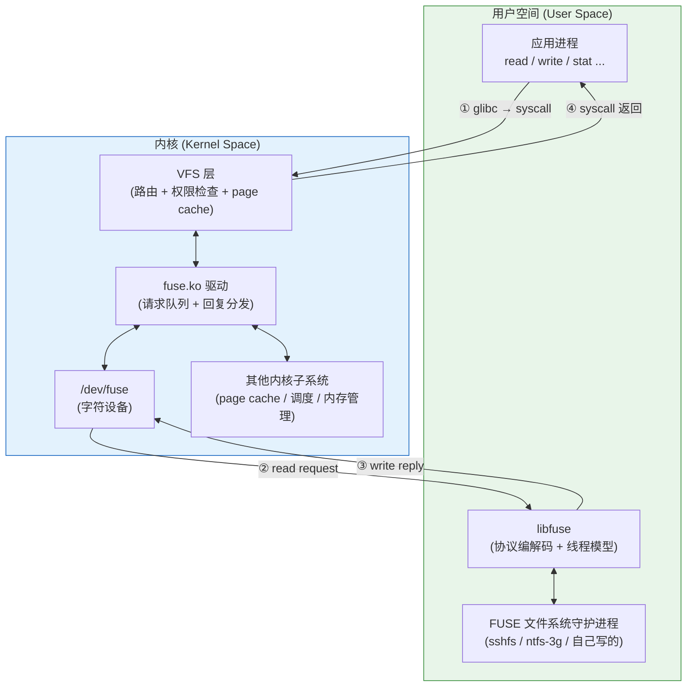
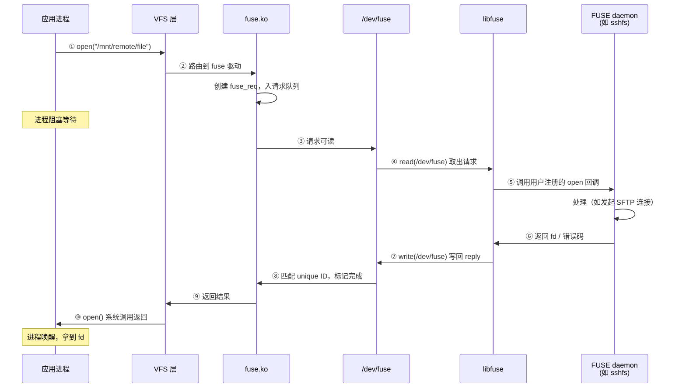

# FUSE 是什么：用户态文件系统的定位与应用

## 前言

**C：** 写一个真正的文件系统（ext4、xfs、btrfs 那种）意味着你要直接和页缓存、VFS、日志、回写、锁、崩溃一致性打交道，调试一个 oops 就够喝一壶。而大多数人实际需要的只是"把 S3/SFTP/压缩包/数据库里的数据，挂载成一个目录用 `ls`、`cat` 访问"。为此 Linux 提供了 **FUSE（Filesystem in Userspace）**——让文件系统的核心逻辑跑在**用户态进程**里，内核只做转发和 VFS 兼容。这一章先把 FUSE 的定位、历史、适用场景讲清楚，后面几章再进协议和开发。

<!-- more -->

## 前置概念速查

如果你对以下术语还不太熟，先在脑子里建个粗模型，后面读起来会轻松很多：

- **VFS（Virtual File System）**：Linux 内核里的"文件系统接口层"。所有 FS（ext4、xfs、FUSE …）都向 VFS 注册一组回调，应用的 `open/read/write` 先到 VFS，VFS 再分发给具体 FS。
- **inode**：内核用来描述"一个文件或目录"的结构体，包含大小、权限、时间等元数据。一个 inode 对应一个唯一编号。
- **page cache（页缓存）**：内核为了加速文件 I/O，在内存里缓存文件内容的那层。`read` 命中缓存就不用再去磁盘/用户态。
- **suid（Set User ID）**：可执行文件上的一个权限位，运行时会临时获得文件**属主**的权限（比如 root）。`fusermount3` 就是靠 suid 来帮普通用户调用 `mount(2)`。

不用全部记住，遇到不懂的回来查即可。

## 一句话定位

**FUSE = 内核里一条 VFS 适配器 + 用户态一个处理进程 + 两者之间的消息协议。**

想象一下 VFS 层原本应该调用 ext4 的 `read_iter` 来读一个文件，FUSE 的做法是：

1. VFS 把请求交给 `fuse` 模块；
2. `fuse` 把它序列化成一条消息，塞进 `/dev/fuse`；
3. 用户态进程（比如 `sshfs`）从 `/dev/fuse` 读出消息，真正去处理（比如发 SFTP 请求）；
4. 用户态把结果写回 `/dev/fuse`；
5. 内核把结果返还给最初的 `read(2)` 调用者。

用户空间的进程完全像在实现一个普通的"文件系统对象"，只不过它运行在用户态，崩了也就崩它自己，内核不会跟着一起倒。

## 为什么需要它

一个文件系统的工作量粗略有三件事：

- **命名空间**：目录、文件名、权限、inode；
- **数据读写**：页缓存、回写、预读；
- **持久化与一致性**：日志、barrier、崩溃恢复。

如果你的目标是把某个既有数据源"**映射**"成目录，只有第一件事是硬任务，后两件通常能复用上游。把文件系统写进内核，代价太高：

- 需要 C + 内核编程规范，不能随便 malloc / 睡觉；
- 崩溃就是整机重启；
- 发布需要重新编内核或做签名模块；
- 跨发行版兼容 VFS 变动很痛苦。

FUSE 把这些全部挪到用户态：你可以用 Go / Rust / Python / C++，用任何库，崩了就 kill 了重来。代价是**多一次用户-内核切换和内存拷贝**——这是 FUSE 的核心 trade-off，后面性能那章会详细讲。

## 历史简述

- **2003 年**：Miklos Szeredi 发起 FUSE 项目，初衷就是 SSHFS；
- **2.6.14 (2005)**：`fuse.ko` 进入 Linux 主线；
- **之后十余年**：libfuse 稳定演进，协议版本从 7.x 一路加特性；
- **2019**：virtiofs 把 FUSE 协议搬到虚拟机里，成为 KVM 共享宿主目录的标准方案；
- **2023–2024**：`fuse-over-io_uring`、`fuse passthrough` 等路径开始落地，大幅抬升性能上限；
- **2025**：FUSE 协议版本已到 7.4x（不同内核不同），支持 writeback cache、splice、idmap、BPF 加速等。

FUSE 早就不是"玩具文件系统"——你的 NAS、你的云盘客户端、容器运行时的 lazy image pulling（如 nydus、stargz-snapshotter）、你的 QEMU/KVM 的共享目录，背后都有它的影子。

## 典型应用场景

### 1. 协议适配（把远程/异构存储挂成目录）

- **sshfs**：SFTP → 目录；
- **rclone mount**：S3 / OneDrive / Google Drive → 目录；
- **smbfs-fuse**、**fuse-nfs**：用户态实现的 SMB/NFS 客户端；
- **s3fs-fuse / goofys**：直接挂 S3 bucket。

特点：网络 I/O 为主，延迟大，FUSE 的开销微不足道。

### 2. 文件格式挂载

- **archivemount**：把 `.tar.gz`、`.zip` 挂成目录；
- **squashfuse**：用户态 SquashFS 读取；
- **rar2fs**：把 RAR 压缩包当目录浏览；
- **fuseiso**：ISO 镜像免 loop 挂载。

特点：本地 I/O，但多为只读或顺序访问。

### 3. 翻译与加密层

- **encfs / gocryptfs / cryfs**：加密文件系统；
- **bindfs**：重映射权限/uid；
- **mergerfs**：多目录合并成一个逻辑目录；
- **unionfs-fuse**：早期的分层合并。

这类"中间层"的优点是**可以放在任何底层 FS 之上**，不挑 ext4 还是 xfs。

### 4. 数据库/对象存储当文件系统

- **GlusterFS** 客户端（libgfapi + FUSE）；
- **Ceph CephFS** 客户端（kernel 和 FUSE 两种都有，FUSE 更新更快）；
- **JuiceFS / SeaweedFS**：把对象存储 + 元数据服务包装成 POSIX；
- **MooseFS / BeeGFS**：分布式文件系统的 FUSE 客户端。

特点：底层是集群，用户不需要管协议，只要 `ls` 一下就行。

### 5. 非原生文件系统兼容层

Linux 内核不一定原生支持所有外来文件系统格式，FUSE 提供了一种零内核补丁的解决方案：

- **ntfs-3g**：Linux 上最常用的 NTFS 读写实现。插入 U 盘、双系统挂载 Windows 分区，背后几乎都是它。支持完整的读写、权限映射、日志保护，性能经过多年优化已经很成熟；
- **exfat-fuse**：在内核 5.4 之前，Linux 没有原生 exFAT 驱动，SD 卡和大容量 U 盘的 exFAT 全靠它。如今虽然内核已合入原生驱动，但 exfat-fuse 在老内核上仍然是唯一选择；
- **ntfs3**（题外话）：Linux 5.15 合入了 Paragon 捐赠的内核原生 NTFS3 驱动，对于新内核可以替代 ntfs-3g，但 ntfs-3g 在旧发行版上仍是事实标准。

这类 FUSE 实现的价值在于：**不需要等内核社区合入驱动，用户态就能先用起来**。

### 6. 桌面集成

- **gvfs-fuse**：GNOME 桌面的虚拟文件系统后端。当你在文件管理器里点击"其他位置"连 SMB/FTP/WebDAV/MTP 设备时，gvfs 会在 `~/.gvfs/` 或 `/run/user/$UID/gvfs/` 下用 FUSE 挂载一个目录，让你像操作本地文件一样拖拽复制；
- **KIO FUSE**：KDE 桌面的等价方案，把 KIO slaves 暴露为 FUSE 挂载点，供不支持 KIO 的应用访问。

这意味着你每天在 Linux 桌面上"连接到服务器"的操作，大概率就在用 FUSE——只是你没注意到。

### 7. 虚拟机/容器共享

- **virtiofs**：QEMU/KVM 宿主-客户机共享目录，协议就是 FUSE（跑在 virtio 总线上，不走 `/dev/fuse`）；
- **9p fuse**：老一点的 VM 共享方案；
- **container rootfs 层**：一些容器运行时用 FUSE 实现 lazy pulling 和增量镜像。

### 8. 调试/测试/花式玩具

- **gdbfs、procfs-fuse**：把调试信息暴露成目录；
- **mp3fs**：把 flac 目录"挂"成 mp3 目录，读一次转码一次；
- **youtube-fs**：一首歌对应一个"文件"（纯娱乐）。

## FUSE 的能力边界

什么 FUSE **做得好**：

- 任何需要"自定义命名空间 + POSIX 访问"的场景；
- 只读、顺序、少量元数据的工作负载；
- 跨语言开发（不限 C）；
- 配合 `uid_map` / rootless container 的非特权挂载。

什么 FUSE **做得不好**（至少默认配置下）：

- 随机小文件高 IOPS（每个 I/O 都要上下文切换，延迟 5–20us 起步）；
- 内存映射 + `msync` 的复杂语义；
- 需要保证 atomic rename 跨目录的复杂锁；
- 需要非常精确的 `mtime/ctime` 粒度（FUSE 协议有缓存和截断）。

这些限制中，**很多在新内核上已经在改善**：writeback cache、splice、多线程、io_uring、passthrough——但要充分用上这些特性，必须了解协议的细节，这正是后几章的主题。

## FUSE vs 原生内核文件系统

| 维度 | 原生内核 FS | FUSE |
|------|-------------|------|
| 开发语言 | C（受限） | 任意 |
| 部署 | 内核模块/签名 | 用户可执行程序 |
| 崩溃影响 | panic / 只读 | 进程退出 |
| 性能上限 | 极高（零拷贝） | 中高（有优化手段） |
| 权限 | root 或签名模块 | 可非特权（`fusermount3`） |
| 调试 | printk / ftrace | 普通用户态工具链 |
| 典型延迟（小 I/O） | <1us | 5-20us |

一个常用的类比：**原生 FS 像编译型语言，FUSE 像脚本语言**——灵活性和开发速度的胜利，性能上的退让。对绝大多数业务来说，这个 trade-off 是划算的。

## FUSE 架构一瞥

先放一张总览（信息量参考经典论文 *"To FUSE or Not to FUSE"* [FAST '17] 的 Figure 1），后面章节会每一块展开：



上图的请求生命周期（以 `open()` 为例，对应  中蓝/黄箭头流程图）：



关键信息：

- `/dev/fuse` 是一个字符设备，每一次 `open("/dev/fuse")` 创建一条全新的"连接"；
- 一个挂载点对应一条连接，连接关闭 = 挂载断开；
- **应用进程在整个过程中是阻塞的**——从它发起 syscall 到 FUSE daemon 处理完并写回 reply，这段时间就是 FUSE 的额外延迟来源；
- libfuse 封装了协议细节，绝大多数项目都用它，不必直接读写 `/dev/fuse`；
- virtiofs 的位置是替换掉 `/dev/fuse` 那条线——消息走 virtio，但 `fuse.ko` 的逻辑还是那一套。

> **延伸阅读**：Vangoor et al., *"To FUSE or Not to FUSE: Performance of User-Space File Systems"*, USENIX FAST '17。[论文 PDF](https://www.usenix.org/system/files/conference/fast17/fast17-vangoor.pdf) 是理解 FUSE 内部实现和性能特征的最佳参考。

## 快速体验：挂一个 sshfs

在任何主流发行版上：

```bash
# 安装
sudo apt install sshfs   # Debian/Ubuntu
sudo dnf install sshfs   # Fedora

# 挂载远程目录
mkdir ~/remote
sshfs user@host:/home/user ~/remote

# 随便用
ls -la ~/remote
echo "hi from fuse" > ~/remote/test.txt

# 卸载
fusermount3 -u ~/remote
```

几个细节：

- **不需要 root**：`fusermount3` 是 suid 小工具，把挂载权授给了普通用户。默认只有挂载者自己能访问挂载点；如果需要让其它用户也能访问，要加 `-o allow_other` 并在 `/etc/fuse.conf` 里启用 `user_allow_other`；
- **挂载点在 `/proc/self/mountinfo` 里能看到**，fstype 是 `fuse.sshfs`；
- **进程列表**里有个 `sshfs` 进程，kill 它就相当于拔线，挂载点会自动变成"Transport endpoint is not connected"。

## 什么时候不要用 FUSE

工程上遇到下面的场景，先考虑别的方案：

- **持久化且高性能本地存储**：直接 ext4/xfs/btrfs；
- **需要 POSIX ACL 精确语义**：有些 FUSE 实现对 ACL / xattr 支持不全；
- **超高频小 I/O 数据库**：哪怕开了 writeback cache，每次 `fdatasync` 还是要下到用户态；
- **追求绝对零拷贝**：默认 FUSE 有拷贝，新特性能缓解但不消除；
- **需要 fsck / 日志恢复**：FUSE 本身没有这个概念，得你自己实现。

## 本章小结

- FUSE = 内核转发 + 用户态处理 + 两者间的协议，让你用任意语言写"文件系统"；
- 典型应用分八类：协议适配、格式挂载、翻译层、分布式存储客户端、非原生 FS 兼容、桌面集成、VM/容器共享、玩具；
- 它在灵活性 / 开发效率上完胜内核 FS，在绝对性能上有退让（但在持续缩小）；
- 下一章我们深入架构：`fuse.ko`、`/dev/fuse`、`libfuse` 三者的职责边界。

::: tip 动手试一试
装好 sshfs 后，用 `sshfs -d user@host: ~/remote` 挂载一个远程目录（`-d` 会打印每一条 FUSE 协议消息到终端）。随便 `ls`、`cat` 几下，对照着输出看看有哪些消息，建立第一印象。
:::

如果你只是想"把某个数据源挂出来用"，FUSE 十有八九是你要的答案。
