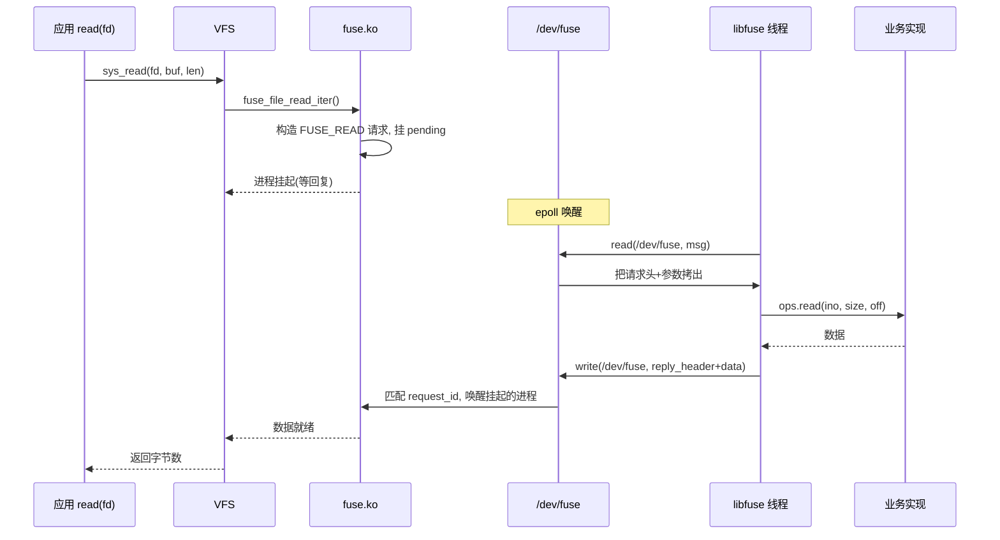

# FUSE 架构：内核模块、/dev/fuse 与 libfuse

## 前言

**C：** 上一章我们从 40000 英尺鸟瞰了 FUSE——"内核转发，用户态处理"。这一章我们降到 1000 英尺：把参与方**一一放到桌子上**，看 `fuse.ko` 里的 superblock/inode、`/dev/fuse` 这个字符设备、`fusermount3` 这个 suid 小工具和 libfuse 各自做什么。理解这张"分工图"是后面看协议和源码的基础。

::: tip 术语统一说明
本系列中 **HL API** = High-Level API（高层 API，以路径为参数）；**LL API** = Low-Level API（低层 API，以 inode 编号为参数）。后续篇章不再重复解释。
:::

<!-- more -->

## 参与者一览

一次 FUSE 挂载真正运行起来，至少有 4 个参与者：

```
┌─────────────────────────────────────────────────┐
│ 用户态                                           │
│  ┌──────────────┐     ┌─────────────────┐       │
│  │ 业务 FS 进程  │◄──► │   libfuse.so    │       │
│  │ (sshfs, ...) │     │ (HL / LL API)   │       │
│  └──────┬───────┘     └────────┬────────┘       │
│         │                      │                │
│         │ fusermount3 -o ...   │ read/write     │
│         │  (suid)              │ /dev/fuse      │
└─────────┼──────────────────────┼────────────────┘
          │                      │
┌─────────▼──────────────────────▼────────────────┐
│ 内核                                             │
│  mount(2)                  ┌──────────┐          │
│                            │ /dev/fuse│          │
│  ┌────────────────────────▼──────────▼───┐     │
│  │               fuse.ko                  │     │
│  │  super_block / fuse_conn / fuse_inode │     │
│  │  VFS 对接 / 请求队列 / 回复分发        │     │
│  └──────────┬────────────────────────────┘     │
│             │                                   │
│          ┌──▼──┐                                │
│          │ VFS │                                │
│          └──▲──┘                                │
│             │                                   │
│         应用的 read/write/stat 等 syscall       │
└─────────────────────────────────────────────────┘
```

四个关键对象：

1. `fuse.ko`：内核里的"FUSE 文件系统类型"；
2. `/dev/fuse`：协议通道；
3. `fusermount3`：非特权挂载的 suid 辅助；
4. libfuse：用户态协议实现 + 开发 API。

> 这张分工图的更正式版本可参考 Vangoor et al., *"To FUSE or Not to FUSE: Performance of User-Space File Systems"* (USENIX [FAST '17](https://www.usenix.org/system/files/conference/fast17/fast17-vangoor.pdf)) 的 Figure 1。下面我们逐个展开。

## fuse.ko：内核里的 VFS 适配器

### 它是一个 "文件系统驱动"

和 ext4 一样，`fuse.ko` 向 VFS 注册了一个 `file_system_type`：

```c
static struct file_system_type fuse_fs_type = {
    .owner       = THIS_MODULE,
    .name        = "fuse",
    .init_fs_context = fuse_init_fs_context,
    .parameters  = fuse_fs_parameters,
    .kill_sb     = fuse_kill_sb_anon,
    .fs_flags    = FS_HAS_SUBTYPE,
};
```

以及 `fuseblk`（块设备上的 FUSE，较少见）、`fusectl`（`/sys/fs/fuse/connections/` 的控制面）。

### 核心数据结构

打开一个 FUSE 挂载后，内核里会有：

```c
struct fuse_conn {
    spinlock_t           lock;
    refcount_t           count;
    atomic_t             dev_count;       // 打开 /dev/fuse 的 fd 数(多线程)
    struct list_head     pending;         // 待发给用户态的请求队列
    struct list_head     processing[FUSE_PQ_HASH_SIZE];
    struct list_head     io;
    struct fuse_iqueue   iq;
    u32                  max_write;
    u32                  max_read;
    u32                  proto_major;
    u32                  proto_minor;
    unsigned int         minor;
    unsigned int         abort:1;
    unsigned int         allow_other:1;
    unsigned int         writeback_cache:1;
    // ... 很多 feature bit
};

struct fuse_inode {
    struct inode         inode;
    u64                  nodeid;          // 用户态可见的 inode 编号
    u64                  nlookup;         // lookup 计数(FORGET 用)
    struct list_head     write_files;
    struct mutex         mutex;
    unsigned long        state;
    // ...
};
```

几个要点：

- **一个 fuse_conn 就是一条"连接"**，对应一次挂载；
- **nodeid** 是 FUSE 协议里 inode 的标识（不等于 VFS 的 ino，但一一对应），1 是根；
- **pending / processing 队列**是协议消息的核心——进来的 VFS 调用被封装成请求挂到 pending，用户态从 `/dev/fuse` 读走后挪到 processing，回复到达后再出队。

### 支持的 VFS 操作

`fuse_dir_inode_operations`、`fuse_file_operations`、`fuse_dir_operations` 实现了 VFS 关心的几乎所有回调：

```c
const struct file_operations fuse_file_operations = {
    .llseek      = fuse_file_llseek,
    .read_iter   = fuse_file_read_iter,
    .write_iter  = fuse_file_write_iter,
    .mmap        = fuse_file_mmap,
    .open        = fuse_open,
    .release     = fuse_release,
    .fsync       = fuse_fsync,
    .lock        = fuse_file_lock,
    .splice_read = fuse_splice_read,
    // ...
};
```

每一个 VFS 回调的实现**都走同一套模板**：

1. 构造一个 `fuse_req`，填好 opcode、参数；
2. 塞进 pending 队列；
3. 等待用户态处理完后唤醒；
4. 解析回复，返回给 VFS。

这一步也可能**异步发出**，比如写回（writeback）会攒一批再送。

## /dev/fuse：协议通道

### 它只是一个字符设备

`misc_register()` 注册的一个 misc device，major = 10，minor = 229：

```c
static const struct file_operations fuse_dev_operations = {
    .owner         = THIS_MODULE,
    .open          = fuse_dev_open,
    .llseek        = no_llseek,
    .read_iter     = fuse_dev_read,
    .splice_read   = fuse_dev_splice_read,
    .write_iter    = fuse_dev_write,
    .splice_write  = fuse_dev_splice_write,
    .poll          = fuse_dev_poll,
    .release       = fuse_dev_release,
    .fasync        = fuse_dev_fasync,
    .unlocked_ioctl= fuse_dev_ioctl,
};
```

可以 `open/read/write/poll/splice`。**open 它不会立即创建一条 FUSE 连接**——要等到这个 fd 被作为 `mount(2)` 的参数传下去：

```c
// fusermount3 或 libfuse 做的事情:
fd = open("/dev/fuse", O_RDWR);
mount("fuse", "/mnt/point", "fuse",
      MS_NOSUID | MS_NODEV,
      "fd=<fd>,rootmode=40000,user_id=1000,group_id=1000");
```

`fd=...` 参数把这个 fd 交给了 `fuse.ko`，此后所有发往 `/mnt/point` 的 VFS 操作都变成通过这个 fd 发送的消息。

### 为什么这样设计

- 用 fd 作为连接句柄是 Unix 的标准做法；
- 挂载它的那个进程**可以 fork**，子进程继续持有 fd，父进程退出没关系；
- 关闭 fd = 断开连接，内核会自动把所有 pending 请求以 `-ENOTCONN` 返回；
- 支持 SCM_RIGHTS：把这个 fd 通过 Unix socket 传给别的进程（libfuse 在 daemon 化时正是用这个）。

### 多线程分发

从 Linux 4.2 起支持 `FUSE_DEV_IOC_CLONE`：一个 FUSE 连接可以有多个 `/dev/fuse` fd，每个 fd 独立一套"处理队列"：

```c
int clone_fd = open("/dev/fuse", O_RDWR);
ioctl(clone_fd, FUSE_DEV_IOC_CLONE, &master_fd);
```

之后不同线程在不同 fd 上 read，就能实现**无锁分发**——这是高性能 FUSE 文件系统（virtiofsd、新版 libfuse）的标准做法。

### 一条请求的完整旅程

把 fuse.ko 和 /dev/fuse 串起来，以应用调用 `open("/mnt/fuse/file")` 为例，一条请求的完整生命周期如下（参考  的调用流程图）：

| 步骤 | 发生在 | 动作 |
|------|--------|------|
| ① | 应用进程 | 调用 glibc `open()`，触发 `sys_open` 系统调用 |
| ② | VFS | 识别挂载点属于 fuse 类型，将操作路由给 `fuse.ko` |
| ③ | fuse.ko | 分配 `fuse_req`，填入 opcode=`FUSE_OPEN` + inode + flags，放入请求队列 |
| ④ | fuse.ko | 将调用者进程置为 **D 状态（不可中断睡眠）**，等待 reply |
| ⑤ | /dev/fuse | FUSE daemon 的 `read()` 返回，拿到 ③ 中的请求 |
| ⑥ | libfuse | 解码请求头，派发到用户注册的 `open` 回调 |
| ⑦ | FUSE daemon | 执行实际处理（如建立 SFTP 连接、打开本地代理文件等） |
| ⑧ | libfuse | 将结果（fd / 错误码）编码为 reply，`write()` 回 `/dev/fuse` |
| ⑨ | fuse.ko | 通过 `unique` ID 匹配到对应的 `fuse_req`，标记 completed，唤醒 ④ 的进程 |
| ⑩ | VFS → 应用 | `open()` 系统调用返回，应用拿到 fd 继续执行 |

**此时执行操作的进程会被阻塞**——从 ④ 到 ⑨ 这段时间就是 FUSE 的额外延迟来源。理解这一点对后续的性能优化章节至关重要。

## fusermount3：非特权挂载的"中间人"

`mount(2)` 系统调用在 Linux 上默认是 root 专属（在没有 user namespace 的场景）。为了让普通用户也能跑 sshfs，libfuse 附带一个 **suid** 小工具 `fusermount3`（之前叫 `fusermount` / `fusermount2`）：

```bash
which fusermount3
# /usr/bin/fusermount3
ls -l /usr/bin/fusermount3
# -rwsr-xr-x root root ...  ← suid
```

它做的事：

1. 校验当前用户是不是挂载点的所有者（或属于 `fuse` 组，受 `/etc/fuse.conf` 约束）；
2. 打开 `/dev/fuse`，拿到 fd；
3. 调用 `mount(2)`（这是它需要 suid 的唯一原因）；
4. 通过 `SCM_RIGHTS` 把 fd 传回调用者（libfuse）；
5. 自己退出。

卸载走的是 `fusermount3 -u /mnt/point`，本质是调 `umount2()`。

`/etc/fuse.conf` 里的两项很重要：

```
# 允许 user_allow_other 选项(让其它用户也能访问挂载点)
user_allow_other

# 最大允许的 FUSE 挂载数
mount_max = 1000
```

没加 `user_allow_other` 时，`-o allow_other` 被禁用——这是为了防止用户挂一个假的 `/etc/passwd` 骗别的用户。

## libfuse：用户态协议栈

libfuse 是事实标准的用户态 FUSE 库，用 C 写成，主流语言都有绑定。它实际上提供了**两套 API**：

### 高层 API（High-Level, HL）

以路径为中心：

```c
static struct fuse_operations ops = {
    .getattr = my_getattr,   // stat(path)
    .readdir = my_readdir,   // 读目录
    .open    = my_open,
    .read    = my_read,
    .write   = my_write,
    // ...
};

int main(int argc, char *argv[]) {
    return fuse_main(argc, argv, &ops, NULL);
}
```

libfuse 在内部维护 "nodeid ↔ 完整路径" 的映射，帮你把协议里的 inode 回滚成路径，绝大多数 hobby/原型项目用这一层就够了。

### 低层 API（Low-Level, LL）

以 inode 为中心：

```c
static struct fuse_lowlevel_ops ops = {
    .lookup  = my_lookup,
    .getattr = my_getattr,
    .read    = my_read,
    .write   = my_write,
    .forget  = my_forget,
    // ...
};
```

LL API 暴露了 FUSE 协议的原貌——lookup/forget、inode 生命周期、批量回复（`fuse_reply_buf`、`fuse_reply_iov`）、异步完成（`fuse_req_t` 单独保存、随后 reply）。工业级 FS（virtiofsd、CephFS FUSE、JuiceFS）都用这一层，因为：

- 少了一次路径反查；
- 能精确控制缓存语义；
- 能实现 FUSE 的高级特性（writeback、splice、io_uring）。

### 线程模型

libfuse 默认提供几种循环：

- `fuse_loop()`：单线程；
- `fuse_loop_mt()`：多线程（每个请求分给一个 worker）；
- 低层 API 可以自己写 epoll/io_uring 循环。

高性能实现通常把"**每个 `/dev/fuse` clone fd + 固定线程 + 请求绑核**"做成一个套餐。

### 它并不只是一个 lib

libfuse 源码树里还包含：

- `fusermount3` 这个 suid 工具；
- `mount.fuse3` 这个 `mount(8)` helper（让你 `mount -t fuse.sshfs user@host: /mnt`）；
- 一堆示例：`hello.c`、`passthrough.c`、`passthrough_ll.c`、`passthrough_hp.cc`（C++ 高性能版）。

读这些例子是学习 FUSE 最快的方式。

## 一次 `read()` 的完整旅程



每条箭头大概就是一次上下文切换或一次内存拷贝。你能数出至少：

- **2 次用户-内核切换**（进入 read、出去）；
- **2 次数据拷贝**（内核 → `/dev/fuse`、`/dev/fuse` → 用户 buffer；回来同理）；

这就是"为什么 FUSE 天生比内核 FS 慢"的物理原因。后面性能章里会讲如何把拷贝降到 0、把切换降到 1。

## virtiofs：同一套协议的另一个载体

2019 年合入的 virtiofs 做了一件聪明事：**FUSE 协议照搬，但把 `/dev/fuse` 这个通道换成 virtio-queue**。结构变成：

```
Guest 应用
  └── VFS
       └── virtiofs.ko  (fuse 协议的 client, 走 virtio ring)
              │
           virtio transport
              │
Host: virtiofsd (daemon)  ← 和 libfuse 十分相似
```

这样一来：

- guest 不需要 `/dev/fuse`，连接靠 virtio；
- 通道跨 VM 边界，绕开了 9p 的 bug 和性能坑；
- 同样的 libfuse ops 接口，换个 loop 就能当 virtiofsd 用。

再加上 DAX（直接把 host page cache 映射到 guest），virtiofs 在小 I/O 上甚至能胜过某些块设备 + ext4 方案。

## 关键 feature 协商

连接建立时内核会先发一个 `FUSE_INIT`：

```c
struct fuse_init_in {
    uint32_t major;         // 协议主版本
    uint32_t minor;
    uint32_t max_readahead;
    uint32_t flags;         // feature bits
    uint32_t flags2;
};
```

用户态回一个 `FUSE_INIT_OUT`，里面是"我支持哪些 feature"：

| FUSE_* | 含义 |
|--------|------|
| ASYNC_READ | 并行发送多个 read |
| POSIX_LOCKS | 支持 flock / posix 锁 |
| ATOMIC_O_TRUNC | open(O_TRUNC) 原子 |
| EXPORT_SUPPORT | 导出给 NFS 使用 |
| BIG_WRITES | 写大于 4K |
| DONT_MASK | 不自动应用 umask |
| SPLICE_WRITE / SPLICE_READ | 零拷贝 splice |
| FLOCK_LOCKS | BSD flock |
| WRITEBACK_CACHE | 打开写回缓存 |
| PARALLEL_DIROPS | 并行目录操作 |
| POSIX_ACL | POSIX ACL |
| MAX_PAGES | 协商 max_write/read 超过 128K |
| NO_OPENDIR_SUPPORT | 目录不用 open |
| EXPLICIT_INVAL_DATA | 主动失效页缓存 |
| MAP_ALIGNMENT | mmap 对齐 |
| SUBMOUNTS | 子挂载 |
| HANDLE_KILLPRIV_V2 | 保留 suid 细粒度控制 |
| SETXATTR_EXT | 64 位 xattr 大小 |
| INIT_EXT | 支持 flags2 |
| SECURITY_CTX | SELinux 上下文 |
| PASSTHROUGH | 透传到另一个 fd（新特性） |
| NO_EXPORT_SUPPORT | 禁用 NFS 导出 |

实现一个 FS 时，你必须在 `init` 回调里**明确地 opt-in** 想要的 feature。

## 本章小结

- `fuse.ko` 是 VFS 适配器，维护 `fuse_conn`、`fuse_inode`、请求队列；
- `/dev/fuse` 是协议通道，一个 fd 对应一个挂载，支持 `CLONE` 多线程分发；
- `fusermount3` 是 suid 小工具，负责 `mount(2)` 和 fd 传递，让普通用户能挂载；
- libfuse 提供高层和低层两套 API，工业级用 LL + `/dev/fuse` clone + 多线程；
- virtiofs 把同一套协议搬到 virtio 上，实现跨 VM 的共享文件系统；
- 连接建立靠 `FUSE_INIT` 协商 feature bits，能力几乎全部是 opt-in 的。

::: tip 自测：你能回答这些吗？
1. FUSE 一条 I/O 在内核和用户态之间最少要跨几次边界？
2. `/dev/fuse` 上做的是 `read/write`，还是 `ioctl`？
3. 为什么 `fusermount3` 需要 suid 权限？
4. HL API 和 LL API 的核心区别是什么？

答不上来也没关系——继续往下读然后回来看，效果更好。
:::

下一章我们把协议本身拆开来看：opcode 有哪些、请求和回复的二进制布局、缓存和 lookup 怎么协同工作。
