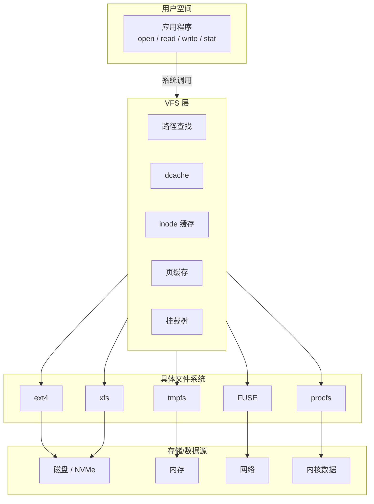
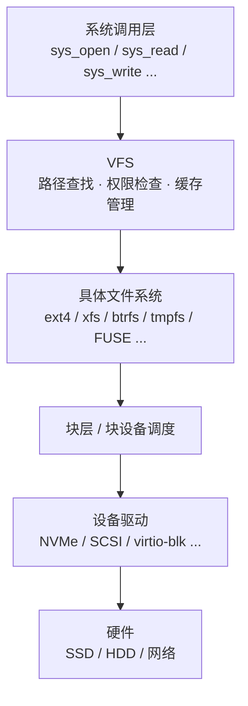
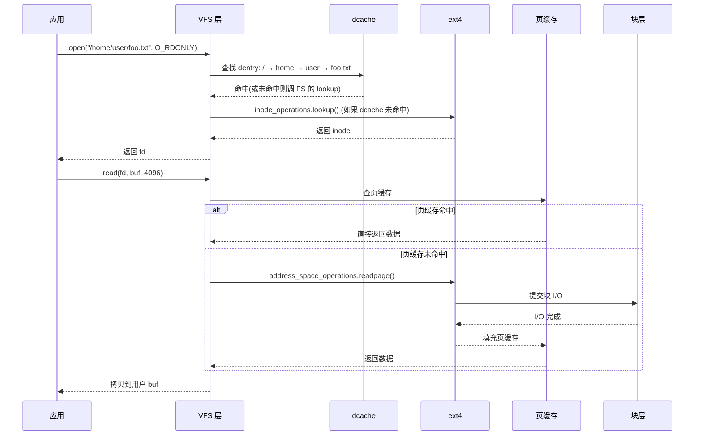

# VFS 是什么：Linux 文件系统的统一接口层

## 前言

**C：** 你可能已经习惯了在 Linux 上 `ls /` 就能看到一棵统一的目录树——ext4 的 `/home`、tmpfs 的 `/tmp`、proc 的 `/proc`、sysfs 的 `/sys`——它们背后的存储介质和实现原理完全不同，但对用户和应用来说只有 `open`、`read`、`write`、`stat` 这一套接口。把这些截然不同的文件系统"焊"成同一棵树的那层胶水，就是 **VFS（Virtual File System，虚拟文件系统）**。这一章先把 VFS 的定位、设计哲学和全局脉络讲清楚，后面几章再逐个下钻到数据结构、路径查找、挂载、页缓存等深水区。

<!-- more -->

## "一切皆文件"从哪里来

Unix 有一句著名的设计格言：**Everything is a file**。在 Linux 上，这不只是说法：

- 普通文件、目录——这是传统意义的"文件"；
- 块设备 `/dev/sda`、字符设备 `/dev/tty`——硬件也是文件；
- `/proc/cpuinfo`——内核运行时数据也是文件；
- `/sys/class/net/eth0/statistics/rx_bytes`——硬件属性还是文件；
- 管道、socket、eventfd——IPC 机制也通过文件描述符暴露。

这一切的共同点是：用户空间通过 **文件描述符（fd）** + **系统调用（open/read/write/close/ioctl/…）** 来操作它们。VFS 就是内核里**让这一切成为可能的中间层**。

## 一句话定位

**VFS = 内核里的"文件系统接口标准" + 一套公共基础设施（缓存、命名空间、权限检查）。**

它定义了每个文件系统必须实现的一组回调接口（`super_operations`、`inode_operations`、`file_operations`、`dentry_operations`），并提供了所有文件系统共享的公共服务：

- **路径查找（pathname lookup / path walk）**：把 `/home/user/foo.txt` 一级一级解析成最终的 inode；
- **目录项缓存（dcache）**：把"路径名 → inode"的映射关系缓存起来，避免每次都问底层 FS；
- **inode 缓存（icache）**：把 inode 对象缓存在内存里；
- **页缓存（page cache）**：把文件内容缓存在内存页里，加速读写；
- **挂载树（mount tree）**：管理哪个文件系统挂在哪个目录上。

每个具体文件系统（ext4、xfs、btrfs、tmpfs、proc、FUSE …）只需要**填充回调**，VFS 负责编排和调度。

## 为什么需要 VFS

想象一下没有 VFS 的世界：

1. 应用想读一个 ext4 文件，调 `ext4_read()`；
2. 应用想读一个 xfs 文件，调 `xfs_read()`；
3. 应用想读 `/proc/cpuinfo`，调 `proc_read()`；
4. `cp` 要从 ext4 拷到 NFS，得同时链接两个 FS 的私有 API。

这就是**没有抽象层的代价**——每种组合都要特殊处理。VFS 把差异藏在了"回调表"后面：



应用只跟 VFS 层打交道，完全不关心下面挂的是什么。

## VFS 的设计哲学

### 面向对象（用 C 实现）

VFS 是 Linux 内核里**最经典的面向对象设计**——用 C 语言的结构体 + 函数指针表模拟了继承和多态：

| 对象 | 结构体 | 操作表 | 语义 |
|------|--------|--------|------|
| 超级块 | `struct super_block` | `super_operations` | 一个已挂载的文件系统实例 |
| 索引节点 | `struct inode` | `inode_operations` | 一个文件/目录的元数据 |
| 目录项 | `struct dentry` | `dentry_operations` | 路径中的一个分量（如 `home`、`user`、`foo.txt`） |
| 文件对象 | `struct file` | `file_operations` | 一次打开操作的上下文（fd 对应的东西） |

每个具体文件系统注册自己的操作表，VFS 通过函数指针分发。这和 C++ 的虚函数表本质是一回事。

### 惰性绑定

VFS 的很多机制都是**惰性**的：

- inode 只在第一次访问时从磁盘读入（`iget`）；
- dentry 只在路径查找经过时创建并缓存；
- 页缓存只在实际读写时分配。

这保证了挂载一个有千万文件的分区不会一次性把内存撑爆。

### 缓存优先

Linux 内核的文件访问路径极度依赖缓存：

1. **dcache**：路径查找 90%+ 的命中率意味着不用下到底层 FS；
2. **icache**：同一个 inode 不会重复从磁盘读取；
3. **page cache**：热文件直接从内存返回，不走块设备 I/O。

理解 VFS，很大程度上就是理解**这三层缓存是如何协同的**。

## VFS 在内核中的位置



注意几点：

- **不是所有 FS 都经过块层**：tmpfs 直接操作内存，procfs 直接读内核数据，FUSE 把请求转到用户态——它们走 VFS 但不走块层；
- **VFS 和页缓存是一体的**：`address_space` 挂在 inode 上，由 VFS 统一管理；
- **权限检查在 VFS 层完成**：`inode_permission()` 会先查 POSIX 权限、ACL、SELinux，通过了才调底层 FS。

## 一次 open + read 的简化流程

先建一个直觉，细节留到后面的章节：



几个关键点：

1. **路径查找（open 阶段）** 会走 dcache，大多数情况下根本不需要问底层 FS；
2. **数据读取（read 阶段）** 会走页缓存，热数据直接从内存返回；
3. 只有在**缓存未命中**时，才会真正触发磁盘 I/O。

这就是为什么 Linux 文件系统性能好——**大量操作在 VFS 层就已经完成了**，底层 FS 只处理冷路径。

## VFS 支撑的关键特性

| 特性 | VFS 提供的支持 |
|------|----------------|
| 统一命名空间 | 挂载树 + 路径查找 |
| 文件权限与安全 | `inode_permission()` + LSM hook |
| 内存映射 (`mmap`) | `vm_operations` + 页缓存 |
| 文件锁 | `file_lock` 框架 |
| `inotify` / `fanotify` | VFS 层的 fsnotify 框架 |
| `sendfile` / `splice` | `pipe_to_file` / `splice_read` |
| mount namespace | `struct mnt_namespace` + `mount(2)` |
| overlayfs | 在 VFS 层叠加多个 FS |

这些机制的共同点是：**底层文件系统不需要单独实现它们**，VFS 会在合适的时机调用它们的回调，其余逻辑由 VFS 自己搞定。

## 快速体验：观察 VFS 的存在

### 查看当前挂载的文件系统类型

```bash
mount | column -t | head -20
```

你会看到 ext4、tmpfs、sysfs、proc、devtmpfs、cgroup2 等各种文件系统，它们都通过 VFS 注册并挂载到目录树上。

### 查看文件系统注册信息

```bash
cat /proc/filesystems
```

带 `nodev` 前缀的是不需要块设备的文件系统（如 tmpfs、proc）；不带的需要块设备（如 ext4、xfs）。

### 查看 dcache 命中率

```bash
# 使用 perf 观察 dcache 命中情况
sudo perf stat -e 'dentry:*' -a sleep 5

# 或者查看 slabinfo
cat /proc/slabinfo | grep dentry
```

### 查看页缓存使用

```bash
free -h
# Buff/cache 那一列就是页缓存 + buffer cache 的总和

# 更精确的
cat /proc/meminfo | grep -E 'Cached|Buffers|Active\(file\)|Inactive\(file\)'
```

## VFS 的学习路线

本系列从入门到进阶，按以下顺序展开：

| 章节 | 主题 | 你会学到 |
|------|------|----------|
| 本篇 | VFS 总览 | 定位、设计哲学、全局视图 |
| 02 | 核心数据结构 | `super_block`、`inode`、`dentry`、`file` 四大对象 |
| 03 | 路径查找与 dcache | 从字符串路径到 inode 的完整过程 |
| 04 | 文件操作全链路 | `open` → `read` → `write` → `close` 在内核里的每一步 |
| 05 | 挂载机制 | `mount(2)`、mount namespace、bind mount、pivot_root |
| 06 | 页缓存与 address_space | VFS 与内存子系统的交汇，回写、预读、mmap |
| 07 | 实战：最小内核 FS | 写一个可以 `insmod` 的文件系统模块 |
| 08 | 性能观测与调优 | ftrace、bpftrace、perf 在 VFS 上的实战 |

建议按顺序阅读。如果你已经有一定内核基础，可以直接跳到感兴趣的章节。

## 本章小结

- VFS 是 Linux 内核里"一切皆文件"的实现层——它把不同文件系统的差异藏在回调表后面，给用户和应用一套统一的接口；
- VFS 的核心 = 四大对象（super_block、inode、dentry、file）+ 三层缓存（dcache、icache、page cache）+ 挂载树；
- 应用的 `open/read/write` 先到 VFS，VFS 做路径查找、权限检查、缓存查询，缓存未命中才下到具体 FS；
- 理解 VFS 是理解 Linux 文件系统（包括 ext4、FUSE、overlayfs 等）的前提和基础。

下一篇我们走进 VFS 的四大核心数据结构，看看 `super_block`、`inode`、`dentry`、`file` 各自长什么样、怎么串起来。
