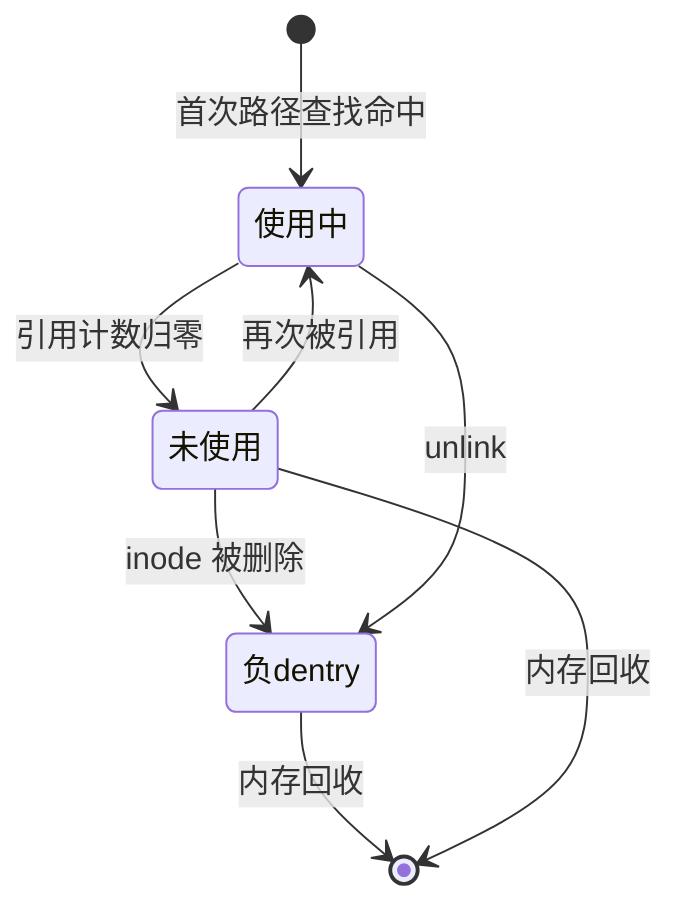

# VFS 核心数据结构：super_block、inode、dentry、file

## 前言

**C：** 上一篇我们讲了 VFS 是什么、为什么需要它。这一篇进入 VFS 的"骨架"——四个核心数据结构。Linux 内核里几乎所有和文件相关的操作，最终都要落到这四个结构体和它们的操作表上。把它们的字段、生命周期、相互关系搞清楚，后面看路径查找、挂载、页缓存就会顺畅很多。

<!-- more -->

## 四大对象总览

```mermaid
flowchart LR
  subgraph 磁盘/存储
    SB_DISK["超级块<br/>(磁盘上的 FS 元数据)"]
    INODE_DISK["inode 表<br/>(磁盘上的文件元数据)"]
    DATA["数据块"]
  end

  subgraph 内存（VFS 对象）
    SB["struct super_block"]
    INODE["struct inode"]
    DENTRY["struct dentry"]
    FILE["struct file"]
  end

  subgraph 用户空间
    FD["fd (文件描述符)"]
  end

  SB_DISK -.->|mount 时读入| SB
  INODE_DISK -.->|首次访问时读入| INODE
  SB --- INODE
  INODE --- DENTRY
  DENTRY --- FILE
  FILE --- FD
```

简单来说：

- **super_block**：一个已挂载文件系统的"全局信息"——块大小、总块数、根 inode、操作方法；
- **inode**：一个文件或目录的"身份证"——大小、权限、时间戳、数据块位置；
- **dentry**：目录树中的一个"路牌"——把路径名的每个分量（如 `home`、`user`）和 inode 关联起来；
- **file**：一次 `open()` 调用产生的"会话"——记录当前偏移、打开模式、关联的 dentry/inode。

## struct super_block

### 核心字段

```c
struct super_block {
    struct list_head    s_list;          // 全局超级块链表
    dev_t               s_dev;           // 设备号
    unsigned char       s_blocksize_bits;
    unsigned long       s_blocksize;     // 块大小(字节)
    loff_t              s_maxbytes;      // 文件大小上限
    struct file_system_type *s_type;     // 文件系统类型(ext4/xfs/...)

    const struct super_operations *s_op; // 操作表

    unsigned long       s_flags;         // 挂载标志(MS_RDONLY 等)
    unsigned long       s_magic;         // 魔数(如 ext4 = 0xEF53)
    struct dentry       *s_root;         // 根目录的 dentry

    struct list_head    s_inodes;        // 这个 FS 的所有 inode
    struct list_head    s_dirty;         // 脏 inode 列表
    struct block_device *s_bdev;         // 底层块设备(如果有)

    void                *s_fs_info;      // FS 私有数据(ext4_sb_info 等)
    // ...
};
```

### super_operations

```c
struct super_operations {
    struct inode *(*alloc_inode)(struct super_block *sb);
    void (*destroy_inode)(struct inode *);
    void (*dirty_inode)(struct inode *, int flags);
    int (*write_inode)(struct inode *, struct writeback_control *wbc);
    void (*evict_inode)(struct inode *);
    void (*put_super)(struct super_block *);
    int (*sync_fs)(struct super_block *, int wait);
    int (*statfs)(struct dentry *, struct kstatfs *);
    int (*remount_fs)(struct super_block *, int *, char *);
    int (*show_options)(struct seq_file *, struct dentry *);
    // ...
};
```

几个重点回调：

| 回调 | 调用时机 | 典型实现 |
|------|----------|----------|
| `alloc_inode` | 需要新 inode 时 | 分配 `ext4_inode_info`（包含 `struct inode`） |
| `write_inode` | inode 脏了需要回写 | 写回磁盘上的 inode 表 |
| `evict_inode` | inode 从内存淘汰 | 释放 inode 关联的块映射 |
| `statfs` | `df` / `statfs(2)` | 返回可用空间 |
| `sync_fs` | `sync` / `fsync` | 刷写所有脏数据 |

### 生命周期

1. **创建**：`mount(2)` → VFS 调用 `file_system_type.mount()` → 底层 FS 读超级块 → 返回填好的 `super_block`；
2. **使用**：VFS 通过 `s_op` 来分配 inode、写回脏数据、同步；
3. **销毁**：`umount(2)` → `put_super()` → 释放私有数据 → 释放 `super_block`。

## struct inode

### 核心字段

```c
struct inode {
    umode_t             i_mode;          // 文件类型 + 权限(S_IFREG|0644)
    unsigned short      i_opflags;
    kuid_t              i_uid;           // 属主
    kgid_t              i_gid;           // 属组
    unsigned int        i_flags;         // 标志(S_IMMUTABLE 等)

    const struct inode_operations   *i_op;    // inode 操作表
    const struct file_operations    *i_fop;   // 默认的 file 操作表
    struct super_block              *i_sb;    // 所属的超级块
    struct address_space            *i_mapping; // 页缓存

    unsigned long       i_ino;           // inode 号
    const unsigned int  i_nlink;         // 硬链接数
    loff_t              i_size;          // 文件大小(字节)
    struct timespec64   __i_atime;       // 访问时间
    struct timespec64   __i_mtime;       // 修改时间
    struct timespec64   __i_ctime;       // 变更时间
    dev_t               i_rdev;          // 设备号(如果是设备文件)
    unsigned long       i_blocks;        // 占用的 512B 块数

    struct address_space i_data;         // 内嵌的 address_space
    struct list_head    i_sb_list;       // super_block 的 inode 列表
    struct hlist_node   i_hash;          // inode 哈希表节点

    atomic_t            i_count;         // 引用计数
    void                *i_private;      // FS 私有(ext4_inode_info 用容器宏关联)
    // ...
};
```

### 磁盘 inode vs 内存 inode

这是新手最容易混淆的地方：

| | 磁盘 inode | 内存 inode (`struct inode`) |
|---|------------|--------------------------|
| 位置 | 磁盘的 inode 表 | 内核内存（slab 分配器） |
| 内容 | 大小、权限、块映射等 | 磁盘 inode 的超集 + VFS 字段 |
| 格式 | FS 私有（ext4 和 xfs 格式不同） | 统一的 `struct inode` |
| 何时产生 | `mkfs` 时 | 首次访问时从磁盘读入 |

具体文件系统通常用一个更大的"包装结构体"来容纳自己的私有字段：

```c
struct ext4_inode_info {
    __le32 i_data[15];           // 块映射/extent 树
    __u32  i_dtime;
    // ... 很多 ext4 私有字段 ...
    struct inode vfs_inode;      // 内嵌 VFS inode
};
```

通过 `container_of()` 宏可以从 `struct inode` 反推出 `ext4_inode_info`：

```c
static inline struct ext4_inode_info *EXT4_I(struct inode *inode)
{
    return container_of(inode, struct ext4_inode_info, vfs_inode);
}
```

这是 Linux 内核的经典设计模式——**嵌入式继承**。

### inode_operations

```c
struct inode_operations {
    struct dentry *(*lookup)(struct inode *, struct dentry *, unsigned int);
    int (*create)(struct mnt_idmap *, struct inode *, struct dentry *, umode_t, bool);
    int (*link)(struct dentry *, struct inode *, struct dentry *);
    int (*unlink)(struct inode *, struct dentry *);
    int (*symlink)(struct inode *, struct dentry *, const char *);
    int (*mkdir)(struct inode *, struct dentry *, umode_t);
    int (*rmdir)(struct inode *, struct dentry *);
    int (*rename)(struct mnt_idmap *, struct inode *, struct dentry *,
                  struct inode *, struct dentry *, unsigned int);
    int (*permission)(struct mnt_idmap *, struct inode *, int);
    int (*getattr)(struct mnt_idmap *, const struct path *,
                   struct kstat *, u32, unsigned int);
    int (*setattr)(struct mnt_idmap *, struct dentry *, struct iattr *);
    // ...
};
```

`inode_operations` 主要处理**元数据操作**——创建文件、删除文件、查找子目录项、改权限、改属性。实际的数据读写不在这里，而在 `file_operations` 和 `address_space_operations`。

## struct dentry

### 核心字段

```c
struct dentry {
    unsigned int        d_flags;
    seqcount_spinlock_t d_seq;
    struct hlist_bl_node d_hash;         // dcache 哈希表
    struct dentry       *d_parent;       // 父目录的 dentry
    struct qstr         d_name;          // 这个分量的名字

    struct inode        *d_inode;        // 关联的 inode（可能为 NULL = 负缓存）

    unsigned char       d_iname[DNAME_INLINE_LEN]; // 短名字内联存储
    struct lockref      d_lockref;       // 引用计数 + 自旋锁
    const struct dentry_operations *d_op;
    struct super_block  *d_sb;
    void                *d_fsdata;       // FS 私有数据

    struct list_head    d_child;         // 在父 dentry 子列表中的节点
    struct list_head    d_subdirs;       // 子 dentry 列表
    // ...
};
```

### dentry 的三种状态



| 状态 | `d_inode` | 引用计数 | 含义 |
|------|-----------|----------|------|
| **使用中** | 非 NULL | > 0 | 路径名到 inode 的有效映射，正在被某个进程使用 |
| **未使用** | 非 NULL | = 0 | 映射有效，但暂时没人用，留在 dcache 里等复用 |
| **负缓存** | NULL | ≥ 0 | 路径名对应的文件**不存在**，缓存这个"不存在"以避免重复查找 |

负缓存是一个重要的优化：如果你 `stat("/tmp/nonexist")` 返回 `ENOENT`，dcache 会缓存一个"这个名字不存在"的 dentry，下次再查就不用去问底层 FS 了。

### 为什么 dentry 和 inode 是分离的

一个文件可以有**多个硬链接**——也就是多个名字指向同一个 inode。如果把名字放进 inode 里，就没法表达硬链接。分离之后：

```
/home/user/a.txt  →  dentry(a.txt) → inode #12345
/home/user/b.txt  →  dentry(b.txt) → inode #12345  (硬链接)
```

两个 dentry，同一个 inode。`ls -i` 可以验证它们的 inode 号相同。

## struct file

### 核心字段

```c
struct file {
    struct path         f_path;          // {vfsmount, dentry}
    struct inode        *f_inode;        // 快捷指针
    const struct file_operations *f_op;  // 文件操作表

    atomic_long_t       f_count;         // 引用计数
    unsigned int        f_flags;         // O_RDONLY / O_NONBLOCK 等
    fmode_t             f_mode;          // FMODE_READ | FMODE_WRITE
    loff_t              f_pos;           // 当前偏移
    struct fown_struct  f_owner;         // 异步 I/O 所有者
    struct mutex        f_pos_lock;      // f_pos 的锁

    struct address_space *f_mapping;     // 页缓存映射
    void                *private_data;   // FS/驱动私有数据
    // ...
};
```

### file 与 inode 的关系

`struct file` 是**进程视角**的——每次 `open()` 产生一个新的 `struct file`，多个进程可以同时打开同一个文件：

```
进程 A: fd 3 → struct file (offset=100) ──┐
                                           ├──→ inode #12345
进程 B: fd 5 → struct file (offset=200) ──┘
```

两个 `struct file` 各自维护自己的偏移、打开标志，但指向同一个 inode。

### file_operations

```c
struct file_operations {
    struct module *owner;
    loff_t (*llseek)(struct file *, loff_t, int);
    ssize_t (*read)(struct file *, char __user *, size_t, loff_t *);
    ssize_t (*write)(struct file *, const char __user *, size_t, loff_t *);
    ssize_t (*read_iter)(struct kiocb *, struct iov_iter *);
    ssize_t (*write_iter)(struct kiocb *, struct iov_iter *);
    int (*iterate_shared)(struct file *, struct dir_context *);
    __poll_t (*poll)(struct file *, struct poll_table_struct *);
    long (*unlocked_ioctl)(struct file *, unsigned int, unsigned long);
    int (*mmap)(struct file *, struct vm_area_struct *);
    int (*open)(struct inode *, struct file *);
    int (*flush)(struct file *, fl_owner_t id);
    int (*release)(struct inode *, struct file *);
    int (*fsync)(struct file *, loff_t, loff_t, int datasync);
    ssize_t (*splice_read)(struct file *, loff_t *,
                           struct pipe_inode_info *, size_t, unsigned int);
    // ...
};
```

这是你最常接触的操作表——字符设备驱动的 `cdev` 也是填这个。

## 四大对象的关系图

```mermaid
flowchart TB
  subgraph process[进程]
    fd_table["fd 表<br/>fd 0: stdin<br/>fd 1: stdout<br/>fd 3: struct file *"]
  end

  subgraph vfs_objects[VFS 对象]
    file["struct file<br/>f_pos, f_flags<br/>f_op"]
    dentry["struct dentry<br/>d_name='foo.txt'<br/>d_parent, d_inode"]
    inode["struct inode<br/>i_mode, i_size<br/>i_ino, i_op, i_fop"]
    sb["struct super_block<br/>s_blocksize, s_op<br/>s_root, s_type"]
    addr["struct address_space<br/>页缓存<br/>a_ops"]
  end

  fd_table -->|fd_table[fd]| file
  file -->|f_path.dentry| dentry
  file -->|f_inode| inode
  dentry -->|d_inode| inode
  dentry -->|d_sb| sb
  inode -->|i_sb| sb
  inode -->|i_mapping| addr
```

这张图是理解 VFS 的"罗塞塔石碑"——几乎所有的 VFS 操作都在这几个对象之间穿梭。

## 引用计数与生命周期管理

VFS 对象的生命周期由引用计数驱动：

| 对象 | 引用计数字段 | 何时增加 | 何时减少 |
|------|--------------|----------|----------|
| `super_block` | `s_active` | mount | umount |
| `inode` | `i_count` | open / 路径查找 | close / dentry 释放 |
| `dentry` | `d_lockref` | 路径查找命中 | 使用完毕 |
| `file` | `f_count` | open / dup / fork | close |

当 `file` 的引用计数归零，`release()` 被调用；当 `inode` 的引用计数归零且没有硬链接（`i_nlink == 0`），`evict_inode()` 回收磁盘空间。

## 实际观察：从 /proc 看 VFS 对象

### 查看打开的文件

```bash
# 查看当前 shell 的 fd
ls -la /proc/$$/fd

# 查看系统当前打开文件数
cat /proc/sys/fs/file-nr
# 输出: 已分配  未用  最大值
```

### 查看 inode 和 dentry 缓存

```bash
# slab 分配器统计
sudo slabtop -o | grep -E 'dentry|inode'
```

典型输出：

```
 OBJS ACTIVE  USE OBJ SIZE  SLABS OBJ/SLAB CACHE SIZE NAME
312576 245689  78%    0.19K  14884       21     59536K dentry
 85120  71424  83%    1.07K   2660       32     85120K ext4_inode_cache
```

`dentry` 的对象数量通常很大——因为你访问过的每一级路径分量都会留在 dcache 里。

### 查看文件的 inode 号

```bash
ls -i /etc/passwd
stat /etc/passwd
```

## 本章小结

- VFS 的骨架是四大对象：`super_block`（FS 实例）→ `inode`（文件身份）→ `dentry`（路径分量）→ `file`（打开会话）；
- 每个对象都有一张操作表（`*_operations`），具体文件系统通过填充回调来实现差异化；
- `inode` 和 `dentry` 的分离使得硬链接、挂载叠加等特性成为可能；
- `file` 是进程维度的——同一个 inode 可以被多个 `file` 引用，各自维护偏移和标志；
- 嵌入式继承（`container_of`）是内核实现 VFS 多态的核心技巧。

下一篇我们看路径查找和 dcache——当你敲下 `cat /home/user/foo.txt` 时，内核是怎么一级一级把字符串变成 inode 的。
