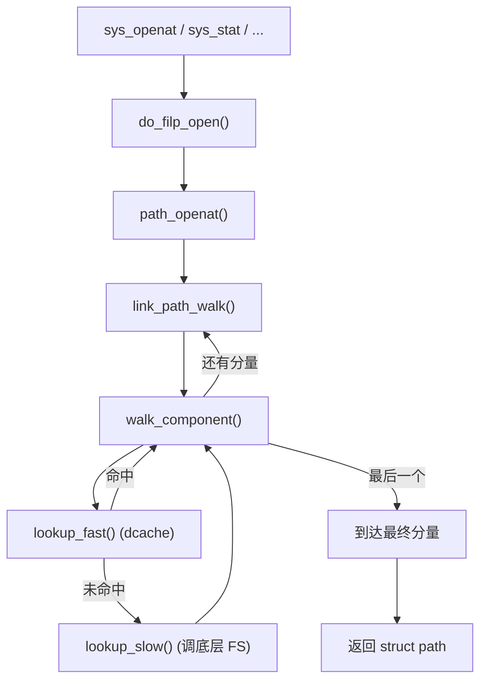
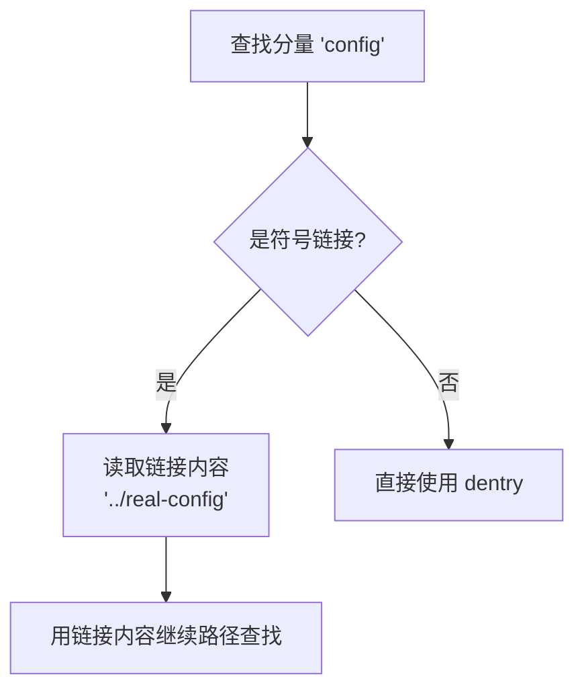
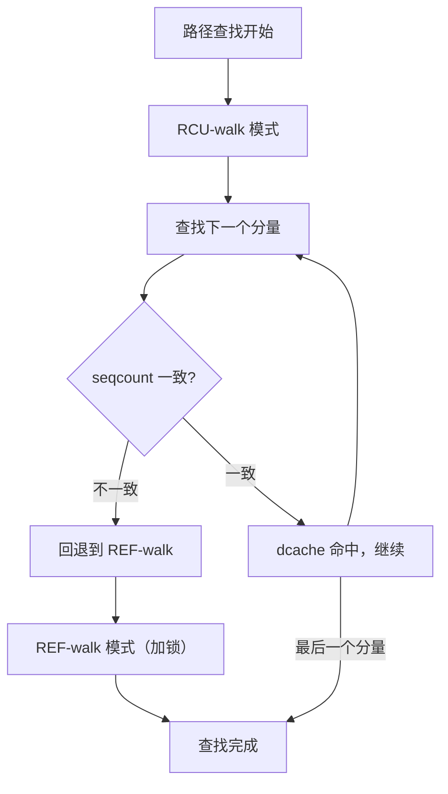

# 路径查找与 dcache：从路径名到 inode

## 前言

**C：** 你在终端敲下 `cat /home/user/notes.txt`，内核要做的第一件事不是读文件内容，而是把这个**字符串路径**翻译成一个 **inode**。这个过程叫 **pathname lookup**（路径查找，也叫 namei），它是 VFS 里最复杂、最性能敏感的子系统之一。本篇把路径查找的完整流程——从起点选择、逐级分量解析、到 dcache 命中/未命中处理、符号链接跟随——一层一层拆解清楚。

<!-- more -->

## 路径查找要解决的问题

输入是一个字符串 `/home/user/notes.txt`，输出是一个 `struct path`（包含 `vfsmount` + `dentry`），最终能拿到 `inode`。

看似简单，但中间要处理的事情非常多：

- **绝对路径 vs 相对路径**：从 `/` 开始还是从 `cwd` 开始？
- **挂载点穿越**：`/home` 可能是一个独立的文件系统；
- **符号链接跟随**：路径中间可能有 symlink，要递归解析；
- **权限检查**：每经过一个目录都要检查 `x`（搜索/执行）权限；
- **`.` 和 `..`**：当前目录和父目录；
- **RCU 模式**：热路径上不能拿锁，要用 RCU 做 lock-free 查找；
- **mount namespace**：不同进程可能看到不同的挂载树。

## 核心函数调用链



核心代码在 `fs/namei.c`，这个文件将近 5000 行，是 VFS 的心脏。

## 逐步拆解

### 第一步：确定起点

```c
static struct filename *getname(const char __user *filename);
```

首先把用户空间的路径字符串拷到内核空间。然后根据路径的第一个字符决定起点：

| 条件 | 起点 |
|------|------|
| 路径以 `/` 开头 | 当前进程的根目录 `current->fs->root` |
| 路径不以 `/` 开头 | 当前工作目录 `current->fs->pwd` |
| `openat(dirfd, ...)` | `dirfd` 对应的目录 |

::: tip AT_FDCWD
`openat()` 系统调用的 `dirfd` 参数如果是特殊值 `AT_FDCWD`（-100），等价于用 `cwd` 作为起点。现代的 glibc `open()` 其实就是 `openat(AT_FDCWD, ...)`。
:::

### 第二步：分量拆分

路径被拆成一个个"分量"（component）：

```
/home/user/notes.txt
 ^^^^  ^^^^  ^^^^^^^^^
 分量1 分量2   分量3(最终分量)
```

`link_path_walk()` 负责遍历前面的分量（不包括最后一个），每一步做：

1. 跳过连续的 `/`；
2. 处理 `.`（不动）和 `..`（回到父目录）；
3. 对当前目录做权限检查（`x` 权限 = 搜索权限）；
4. 调 `walk_component()` 查找下一级。

### 第三步：dcache 查找（快路径）

`walk_component()` 先走 **`lookup_fast()`**——在 dcache 里查找：

```c
static struct dentry *__d_lookup_rcu(const struct dentry *parent,
                                      const struct qstr *name,
                                      unsigned *seqp)
```

dcache 是一个**哈希表**，key 是 `(父 dentry 指针, 名字字符串)` 的哈希：


查找过程：

1. 计算 `hash(parent_dentry, "user")`；
2. 在对应桶里遍历，用 `d_name` 比较；
3. 命中 → 直接拿到 `dentry`（及其 `d_inode`）；
4. 如果是**负缓存**（`d_inode == NULL`），直接返回 `ENOENT`，不用问底层 FS。

dcache 命中率在常见工作负载下轻松超过 **95%**——这意味着大多数路径查找根本不需要访问磁盘。

### 第四步：底层 FS 查找（慢路径）

如果 dcache 未命中，走 **`lookup_slow()`**：

1. 在父目录的 `inode->i_op->lookup()` 回调中查找；
2. 底层 FS（如 ext4）读磁盘上的目录块，找到名字对应的 inode 号；
3. 通过 `iget()` 读入 inode 到内存；
4. 创建新的 dentry，关联 inode，插入 dcache。

```c
// ext4 的 lookup 大致流程
static struct dentry *ext4_lookup(struct inode *dir,
                                   struct dentry *dentry,
                                   unsigned int flags)
{
    struct inode *inode = NULL;
    ino_t ino = ext4_inode_by_name(dir, &dentry->d_name);
    if (ino)
        inode = ext4_iget(dir->i_sb, ino);
    return d_splice_alias(inode, dentry);
}
```

`d_splice_alias()` 把 inode 和 dentry 关联起来并插入 dcache——下次再查同一个名字就能命中了。

### 第五步：挂载点穿越

如果某一级目录是一个挂载点，路径查找需要"跳"到新文件系统的根 dentry：

```c
static bool __follow_mount_rcu(struct nameidata *nd,
                                struct path *path)
```

例如 `/home` 是一个独立分区：

```
查找 /home/user
  ① 从 rootfs 的 root dentry 开始
  ② 找到 dentry "home"
  ③ 发现 "home" 是挂载点 → 跳到 ext4 分区的 root dentry
  ④ 在 ext4 分区里找 dentry "user"
```

每个挂载点在内核里有一个 `struct mount`，记录了"覆盖关系"。

### 第六步：符号链接处理

如果某个分量是符号链接：

1. 读取链接内容（`inode->i_op->get_link()`）；
2. 把链接内容当作新路径，递归进入路径查找；
3. 为防止无限递归，内核限制最多跟 **40 层**符号链接（`MAXSYMLINKS`）。



## RCU 模式：无锁路径查找

路径查找是**最频繁的内核操作之一**——每个 `open`、`stat`、`access`、`readlink` 都要走一遍。如果每一步都拿 `dentry->d_lock`，多核扩展性会很差。

Linux 从 2.6.38 开始引入了 **RCU-walk（也叫 path walk in RCU mode）**：

### 两种模式

| 模式 | 特点 | 何时使用 |
|------|------|----------|
| **RCU-walk** | 不拿任何锁，用 seqcount 检测竞争 | 默认尝试 |
| **REF-walk** | 拿 dentry/inode 引用计数和锁 | RCU-walk 失败时回退 |

RCU-walk 的流程：

1. 在 `rcu_read_lock()` 保护下遍历；
2. 每一步用 `d_seq` 检查 dentry 是否在遍历期间被修改；
3. 如果检测到竞争（seqcount 变了），**回退到 REF-walk** 重新来过；
4. 到达终点后，尝试把 RCU 引用升级为真引用。



在没有竞争的常见情况下（99%+），整个路径查找从头到尾**不拿任何自旋锁**，只有 `rcu_read_lock/unlock` 和 seqcount 检查，性能极高。

## dcache 的内部机制

### 哈希表结构

```c
static struct hlist_bl_head *dentry_hashtable __ro_after_init;
```

哈希表在启动时按内存大小动态计算桶数，通常有百万级桶。key 的计算：

```c
static unsigned int d_hash(const struct dentry *parent, unsigned int hash)
{
    hash += (unsigned long)parent / L1_CACHE_BYTES;
    return hash + (hash >> d_hash_shift);
}
```

### LRU 回收

当内存紧张时，内核通过 `shrink_dcache_sb()` / `prune_dcache_sb()` 回收未使用的 dentry：

1. 引用计数为 0 的 dentry 被放到 LRU 链表上；
2. 内存回收器扫描 LRU，释放最久未用的 dentry；
3. 对应的 inode 如果也没有其它引用，一并释放。

可以通过 `/proc/sys/fs/dentry-state` 查看 dcache 状态：

```bash
cat /proc/sys/fs/dentry-state
# 输出: nr_dentry  nr_unused  age_limit  want_pages  nr_negative  dummy
```

### 名字比较

dcache 默认用**大小写敏感**的精确比较。但有些文件系统（如 NTFS、FAT、某些 ext4 casefold 配置）需要大小写不敏感，这时 `dentry_operations.d_compare` 回调就派上用场了。

## 特殊路径处理

### `.` 和 `..`

- `.` 直接跳过，当前 dentry 不变；
- `..` 需要回到父目录：
  - 如果当前 dentry 是挂载点的根，需要先"跳回"到上一个文件系统的挂载目录；
  - 如果当前 dentry 是进程的根（`chroot` 环境），不允许再往上走。

### `/proc/self/...` 等"魔法"路径

procfs 的 `lookup` 回调会根据当前进程动态生成 dentry——`/proc/self` 实际上是一个符号链接，指向 `/proc/<current_pid>`。这完全由 procfs 的 `inode_operations.lookup` 控制，VFS 不需要特殊对待。

## 性能观测

### 用 bpftrace 追踪路径查找

```bash
# 统计 lookup_fast 命中 vs lookup_slow
sudo bpftrace -e '
kprobe:lookup_fast { @fast = count(); }
kprobe:lookup_slow { @slow = count(); }
interval:s:5 { print(@fast); print(@slow); clear(@fast); clear(@slow); }
'
```

典型结果中，`lookup_fast` 的计数会比 `lookup_slow` 高 1-2 个数量级。

### 用 perf 观察 dcache 热点

```bash
sudo perf top -g -p <pid>
# 在高 I/O 元数据负载下，你会看到 d_lookup、__d_lookup_rcu 排在前面
```

### dcache 统计

```bash
# dentry slab 使用情况
sudo slabtop -s c | head -5

# dcache 整体压力
cat /proc/sys/fs/dentry-state
```

## 常见问题

### 为什么 `ls` 一个大目录第一次慢、第二次快？

第一次 `ls` 时，目录里的 dentry 都不在 dcache 里，每个条目都要走 `lookup_slow`，触发磁盘 I/O 读目录块。第二次所有 dentry 都在 dcache 里了，全部走 `lookup_fast`，内存操作。

### 为什么删除大量文件会导致 dcache 压力？

每个 `unlink` 不会立刻从 dcache 删除 dentry——它会变成负缓存。如果目录里有百万文件被删除，dcache 里会积累百万个负 dentry，占用可观的内存。可以通过 `echo 2 > /proc/sys/vm/drop_caches` 手动释放。

### 为什么 NFS/FUSE 的路径查找比本地慢？

NFS 和 FUSE 的 `lookup` 回调需要网络请求（NFS）或用户态往返（FUSE），延迟是微秒到毫秒级，远高于本地磁盘。而且它们的 dcache 条目需要配合 revalidate（`d_revalidate`），因为远端数据可能已经变了。

## 本章小结

- 路径查找是 VFS 最核心的操作，负责把字符串路径翻译成 `struct path`（vfsmount + dentry）；
- 查找过程逐级拆分路径分量，每一步先查 dcache（快路径），未命中再调底层 FS 的 `lookup`（慢路径）；
- dcache 命中率通常 95%+，这是 Linux 文件系统性能的关键；
- RCU-walk 模式让路径查找在无竞争时完全无锁，极大提升多核扩展性；
- 挂载点穿越、符号链接跟随、`.` / `..` 处理都在路径查找框架内完成。

下一篇我们沿着路径查找的结果继续往下，看一个完整的 `open` → `read` → `write` → `close` 在内核里的每一步。
