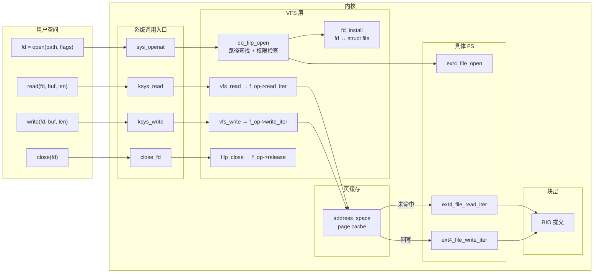
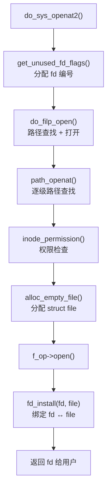
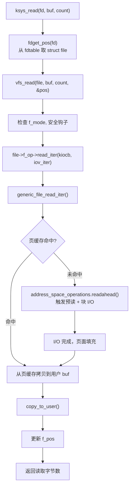
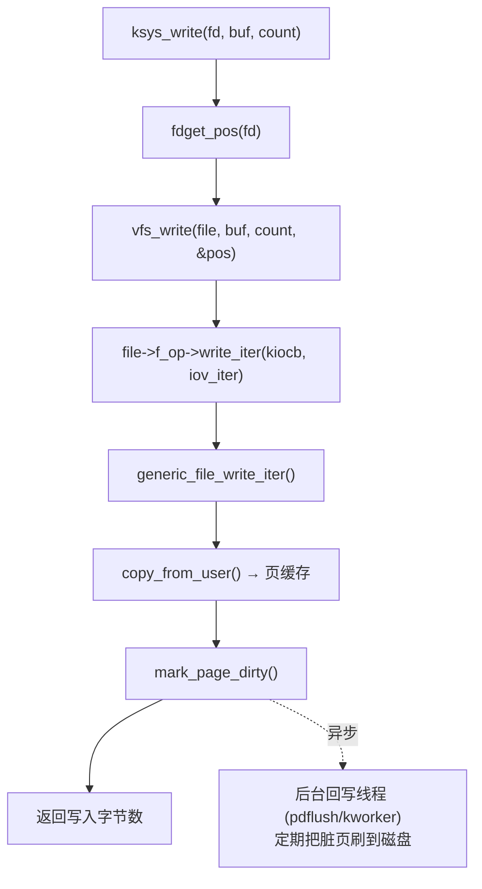
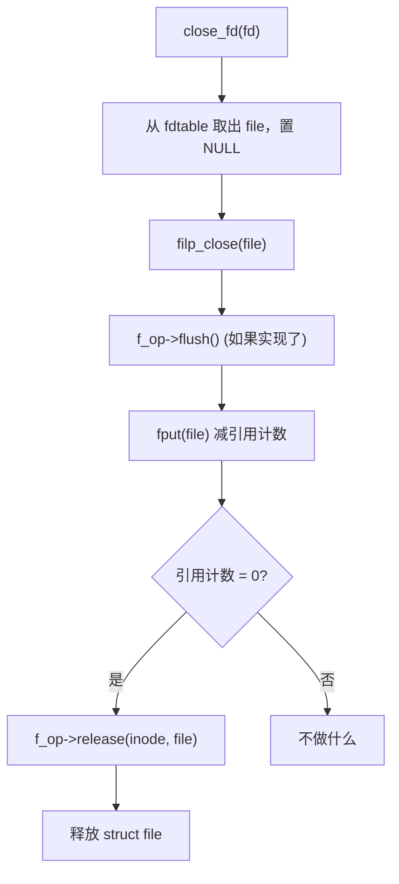

# 文件操作的一生：open、read、write、close 全链路

## 前言

**C：** 前两篇我们认识了 VFS 的四大对象和路径查找机制。这一篇把视角切换到**应用开发者最熟悉的四个系统调用**——`open`、`read`、`write`、`close`——完整追踪它们在内核里从入口到出口的每一个关键步骤。理解这条链路之后，你对文件 I/O 的认知将不再是"调个 API 就完了"，而是清楚地知道数据在内核里走过了哪些路。

<!-- more -->

## 全景图



## open：从路径到文件描述符

### 系统调用入口

现代 Linux 上，`open()` 实际上是 `openat(AT_FDCWD, path, flags, mode)`：

```c
SYSCALL_DEFINE4(openat, int, dfd, const char __user *, filename,
                int, flags, umode_t, mode)
{
    return do_sys_openat2(dfd, filename,
                          &(struct open_how){ .flags = flags, .mode = mode });
}
```

### 关键步骤



详细拆解：

1. **分配 fd 编号**：`get_unused_fd_flags()` 从当前进程的 `fd_table` 里找到最小可用编号（通常是 bitmap 扫描）；

2. **路径查找**：`do_filp_open()` → `path_openat()` → `link_path_walk()`——上一篇详细讲过；

3. **权限检查**：`inode_permission()` 检查 DAC（`rwx` 权限、ACL）和 LSM（SELinux/AppArmor）；

4. **分配 struct file**：`alloc_empty_file()` 从 slab 分配器获取一个 `struct file`，初始化偏移为 0、设置 `f_flags`、`f_mode`、`f_op`；

5. **调底层 FS 的 open**：`f_op->open(inode, file)`——大多数本地 FS 这里做的事不多（ext4 会检查加密和 verity），但 FUSE 会在这里发一条 `FUSE_OPEN` 消息到用户态；

6. **绑定 fd 和 file**：`fd_install(fd, file)` 把 `struct file *` 放进进程的 `fdtable[fd]`，从此 `fd` 就可用了。

### O_CREAT 的特殊处理

如果带了 `O_CREAT` 标志：

- 路径查找到达最后一个分量时，如果文件不存在，走 `vfs_create()` → `dir->i_op->create()`；
- 底层 FS 在磁盘上分配 inode，创建目录项；
- 然后继续正常的 open 流程。

## read：从文件描述符到数据

### 系统调用入口

```c
SYSCALL_DEFINE3(read, unsigned int, fd, char __user *, buf, size_t, count)
{
    return ksys_read(fd, buf, count);
}
```

### 关键步骤



核心路径分析：

1. **fdget_pos(fd)**：从 `current->files->fdt` 取出 `struct file *`，同时获取 `f_pos_lock`（如果需要）；

2. **vfs_read()**：做安全检查（`security_file_permission`）、验证 `FMODE_READ`；

3. **f_op->read_iter()**：大多数本地 FS 用 `generic_file_read_iter()`——这是 VFS 提供的通用实现：

```c
ssize_t generic_file_read_iter(struct kiocb *iocb,
                                struct iov_iter *iter)
{
    if (iocb->ki_flags & IOCB_DIRECT)
        return mapping->a_ops->direct_IO(iocb, iter); // O_DIRECT
    return filemap_read(iocb, iter, 0);                // 普通读
}
```

4. **filemap_read()**：这是页缓存读取的核心——在 `address_space` 的 **xarray（页树）** 里查找页面：

   - **命中**：直接 `copy_to_user()`，微秒级完成；
   - **未命中**：触发 `readahead`（预读），提交块 I/O 请求，等待完成，然后拷贝。

5. **预读（readahead）** 是一个重要优化：当检测到顺序读模式时，内核不只读请求的那一个页，而是提前读入后续多个页面（窗口大小动态调整，典型 128KB–512KB）。

### O_DIRECT 路径

如果用 `O_DIRECT` 打开，数据**绕过页缓存**，直接从磁盘到用户缓冲区：

```
用户 buf ← DMA ← 块设备
```

好处是避免双重缓存（如数据库自己有 buffer pool），坏处是失去预读和缓存复用。

## write：从数据到存储

### 关键步骤



1. **generic_file_write_iter()**：VFS 的通用写实现；

2. **写入页缓存**：数据从用户 buf 拷贝到页缓存的页面里（如果页面不存在就分配）；

3. **标记脏页**：`mark_page_dirty()` 标记这个页面需要回写；

4. **返回**：`write()` 在数据进入页缓存后就返回了——**并没有真正写到磁盘**；

5. **异步回写**：后台的 `writeback` 线程会在以下条件下把脏页刷到磁盘：
   - 脏页存在超过 `dirty_expire_centisecs`（默认 30 秒）；
   - 系统脏页比例超过 `dirty_background_ratio`（默认 10%）；
   - 用户调用 `sync`/`fsync`/`fdatasync`。

### write 的一致性语义

| 调用 | 保证 |
|------|------|
| `write()` | 数据到页缓存（断电可能丢失） |
| `fdatasync(fd)` | 数据 + 必要元数据到磁盘 |
| `fsync(fd)` | 数据 + 所有元数据到磁盘 |
| `sync()` | 所有文件系统的脏数据刷到磁盘 |
| `O_SYNC` | 每次 `write` 都等效 `fsync` |
| `O_DSYNC` | 每次 `write` 都等效 `fdatasync` |

数据库选择 `O_DIRECT` + `fdatasync` 是因为：跳过页缓存（避免双重缓存）+ 精确控制持久化时机。

## close：收尾与释放

### 关键步骤

```c
SYSCALL_DEFINE1(close, unsigned int, fd)
{
    return close_fd(fd);
}
```



几个关键点：

1. **close 不保证数据落盘**：`close()` 只是释放 fd 和 `struct file`，脏数据仍在页缓存里等回写；

2. **flush vs release**：
   - `flush()` 在每次 `close()` 时调用（即使还有其它 fd 指向同一个 file）——NFS 用它来在 close 时同步；
   - `release()` 只在最后一个引用消失时调用——FUSE 用它发 `FUSE_RELEASE` 消息；

3. **延迟释放**：`fput()` 通常把实际的 `release` 放到任务队列里异步执行，避免在系统调用返回路径上做太多工作。

### fork 和 dup 的影响

```
进程 A:  fd 3 → struct file (refcount=2) ──→ inode
         ↑
进程 B:  fd 3 ──┘  (fork 后继承)
```

`fork()` 后子进程继承了 fd 表，`struct file` 的引用计数加 1。父进程 `close(3)` 不会触发 `release()`——要等子进程也 close 才行。

## 综合示例：追踪一次完整的文件 I/O

```c
int fd = open("/tmp/test.txt", O_CREAT | O_RDWR, 0644);
write(fd, "hello", 5);
lseek(fd, 0, SEEK_SET);
char buf[16];
read(fd, buf, 5);
close(fd);
```

对应的内核事件序列：

| 步骤 | 用户态 | 内核路径 |
|------|--------|----------|
| 1 | `open()` | 路径查找 `/tmp/test.txt`（dcache 命中 `/tmp`）→ `O_CREAT` 创建新 inode → 分配 fd=3 |
| 2 | `write()` | fd=3 → `struct file` → `generic_file_write_iter` → 分配页面 → `copy_from_user("hello")` → 标脏 |
| 3 | `lseek()` | `f_pos = 0`（纯内存操作，几乎零开销） |
| 4 | `read()` | `filemap_read` → 页缓存命中 → `copy_to_user("hello")` |
| 5 | `close()` | 释放 fd=3 → `fput` → `release()` |
| 6 | (异步) | writeback 线程把脏页刷到 tmpfs 的内存后端（或磁盘 FS 的块设备） |

注意第 4 步：刚写入的数据还在页缓存里，所以 `read` **不需要任何磁盘 I/O**。

## 用 strace 和 ftrace 观测

### strace 观测系统调用

```bash
strace -e trace=open,openat,read,write,close cat /etc/hostname
```

输出类似：

```
openat(AT_FDCWD, "/etc/hostname", O_RDONLY) = 3
read(3, "myhost\n", 131072)            = 7
write(1, "myhost\n", 7)                = 7
close(3)                                = 0
```

### ftrace 追踪内核函数

```bash
# 追踪 vfs_read 的调用链
echo vfs_read > /sys/kernel/debug/tracing/set_ftrace_filter
echo function_graph > /sys/kernel/debug/tracing/current_tracer
echo 1 > /sys/kernel/debug/tracing/tracing_on
cat /etc/hostname > /dev/null
echo 0 > /sys/kernel/debug/tracing/tracing_on
cat /sys/kernel/debug/tracing/trace
```

你会看到 `vfs_read` → `generic_file_read_iter` → `filemap_read` → ... 的完整调用链。

## 本章小结

- `open` = 路径查找 + 权限检查 + 分配 `struct file` + 绑定 fd；
- `read` = 查页缓存 → 命中则拷贝 → 未命中则触发块 I/O 和预读；
- `write` = 数据拷入页缓存 → 标脏 → 异步回写（`write` 返回 ≠ 数据落盘）；
- `close` = 释放 fd → 减 `struct file` 引用 → 最后一个引用消失时调 `release`；
- 页缓存是 `read`/`write` 性能的核心——热数据的读写完全在内存中完成；
- `fsync`/`fdatasync` 是用户控制"数据何时落盘"的唯一可靠手段。

下一篇我们看挂载机制——`mount(2)` 是怎么把一个文件系统"焊"到目录树上的，以及 mount namespace 如何让不同进程看到不同的目录树。
