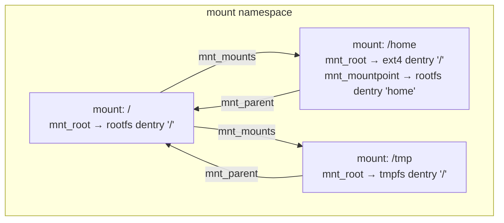
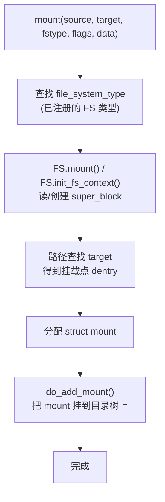
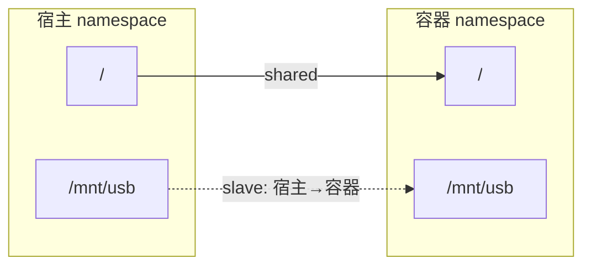
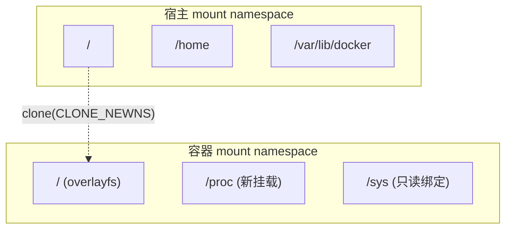

# 挂载机制与 mount 命名空间

## 前言

**C：** 你在 `/etc/fstab` 里写一行 `/dev/sda2 /home ext4 defaults 0 2`，重启后 `/home` 就变成了一块独立分区——这件"理所当然"的事，背后是 VFS 挂载子系统在工作。更进一步，容器技术（Docker/Podman）能让每个容器看到完全不同的根文件系统，靠的是 **mount namespace**。这一篇把挂载的数据结构、mount 系统调用的流程、bind mount、propagation（传播）、mount namespace 一次讲清楚。

<!-- more -->

## 挂载的本质

从 VFS 的视角看，**挂载 = 在目录树的某个节点上"盖一层新的文件系统"**。

未挂载时：

```
/  (rootfs)
├── home/    (rootfs 的一个普通目录)
├── tmp/
└── ...
```

挂载 `/dev/sda2` 到 `/home` 后：

```
/  (rootfs)
├── home/    ← 这个目录被"遮盖"，现在看到的是 ext4 分区的根
│   ├── user1/
│   └── user2/
├── tmp/
└── ...
```

原来 rootfs 里 `/home` 下面的内容被"遮住"了（还在，只是路径查找不会走到它）。

## 核心数据结构

### struct mount

```c
struct mount {
    struct hlist_node   mnt_hash;        // 挂载点哈希表
    struct mount        *mnt_parent;     // 父挂载
    struct dentry       *mnt_mountpoint; // 挂载点的 dentry
    struct vfsmount     mnt;             // 内嵌的 vfsmount

    struct list_head    mnt_mounts;      // 子挂载列表
    struct list_head    mnt_child;       // 在父挂载的子列表中
    struct list_head    mnt_instance;    // super_block 的挂载实例列表

    struct mnt_namespace *mnt_ns;        // 所属的 mount namespace
    int                 mnt_id;          // 唯一 ID
    int                 mnt_group_id;    // peer group ID (propagation)
    int                 mnt_expiry_mark; // 过期标记(autofs)
    // ...
};
```

### struct vfsmount

```c
struct vfsmount {
    struct dentry       *mnt_root;       // 这个 FS 的根 dentry
    struct super_block  *mnt_sb;         // 超级块
    int                 mnt_flags;       // MNT_NOSUID, MNT_NODEV 等
};
```

### struct mnt_namespace

```c
struct mnt_namespace {
    struct ns_common    ns;
    struct mount        *root;           // 根挂载
    struct rb_root      mounts;          // 这个 ns 里的所有挂载
    unsigned int        nr_mounts;       // 挂载计数
    unsigned int        pending_mounts;
    // ...
};
```

### 关系图



## mount 系统调用

### 调用接口

```c
// 传统接口
int mount(const char *source, const char *target,
          const char *filesystemtype, unsigned long mountflags,
          const void *data);

// 新接口 (Linux 5.2+)
int fsopen(const char *fsname, unsigned int flags);
int fsconfig(int fd, unsigned int cmd, ...);
int fsmount(int fd, unsigned int flags, unsigned int attr_flags);
int move_mount(int from_dfd, const char *from_path,
               int to_dfd, const char *to_path, unsigned int flags);
```

新接口把"创建文件系统实例"和"挂到目录树上"拆成了两步，更灵活也更安全。

### 挂载流程



1. **查找文件系统类型**：在全局 `file_systems` 链表里找到 `file_system_type`（如 `ext4_fs_type`）；

2. **创建/获取 super_block**：
   - 如果是新挂载，调 FS 的 `mount()` 或 `init_fs_context()` + `get_tree()`；
   - FS 读磁盘超级块，创建内存中的 `struct super_block`；
   - 如果同一个设备已经挂过，复用已有的 `super_block`；

3. **路径查找挂载点**：对 `target` 做路径查找，得到目标 dentry；

4. **创建并安装 mount**：`alloc_vfsmnt()` → 设置 `mnt_root`、`mnt_mountpoint`、`mnt_parent` → 插入挂载树。

## 常见挂载类型

### bind mount

把一个目录"映射"到另一个位置，不涉及块设备：

```bash
mount --bind /var/log /tmp/logs
# 现在 /tmp/logs 和 /var/log 看到的是同一份数据
```

内核实现：创建一个新的 `struct mount`，但复用原来的 `super_block` 和 `dentry` 子树。

### tmpfs

内存文件系统，没有后端设备：

```bash
mount -t tmpfs -o size=1G tmpfs /mnt/ramdisk
```

数据只存在于页缓存里，重启即消失。

### overlayfs

在多个目录之上叠加出一个合并视图：

```bash
mount -t overlay overlay \
  -o lowerdir=/lower,upperdir=/upper,workdir=/work \
  /merged
```

容器镜像的分层文件系统就是靠它实现的。overlayfs 本身也是一个注册到 VFS 的文件系统，它的 `lookup` 会同时查 upper 和 lower 层。

### remount

修改已有挂载的选项而不卸载：

```bash
mount -o remount,ro /home
```

内核里调用 `super_operations.remount_fs()`，不会重新创建 super_block。

## 挂载传播（Mount Propagation）

挂载传播是 mount namespace 能工作的基础——它决定了一个 namespace 里的挂载事件是否"传播"到其它 namespace。

### 四种传播类型

| 类型 | 标志 | 行为 |
|------|------|------|
| **shared** | `MS_SHARED` | 挂载事件在 peer group 内双向传播 |
| **slave** | `MS_SLAVE` | 单向接收 master 的事件，不反向传播 |
| **private** | `MS_PRIVATE` | 不传播也不接收 |
| **unbindable** | `MS_UNBINDABLE` | private + 不能被 bind mount |

```bash
# 查看传播类型
cat /proc/self/mountinfo | grep shared

# 设置为 shared
mount --make-shared /mnt

# 设置为 private
mount --make-private /mnt
```

### 容器中的典型配置



宿主机插入 USB，`/mnt/usb` 的挂载自动传播到容器；但容器里的挂载操作不影响宿主。

## mount namespace

### 是什么

mount namespace 是 Linux 的 6 种命名空间之一（另外 5 种是 PID、NET、UTS、IPC、USER/CGROUP）。每个 mount namespace 拥有自己独立的挂载树视图。

```bash
# 创建新的 mount namespace
unshare --mount bash
# 在新 namespace 里的挂载/卸载不影响外面
```

### 创建方式

| 方式 | 用途 |
|------|------|
| `clone(CLONE_NEWNS)` | 创建新进程时指定 |
| `unshare(CLONE_NEWNS)` | 当前进程进入新 namespace |
| `setns(fd, CLONE_NEWNS)` | 加入已有的 namespace |

### 容器如何使用

Docker/containerd 创建容器时：

1. `clone(CLONE_NEWNS | ...)` 创建新的 mount namespace；
2. `pivot_root()` 把容器的 rootfs 切换为新的根目录；
3. 容器内部看到的整棵目录树和宿主完全不同。



### pivot_root vs chroot

| | `chroot` | `pivot_root` |
|---|----------|-------------|
| 改变的 | 进程的根目录 | 进程的根挂载点 |
| 旧根 | 仍然可达 | 被移走 |
| 安全性 | 容易逃逸 | 更安全 |
| 使用场景 | 简单隔离 | 容器 |

容器运行时（runc）使用 `pivot_root` 而非 `chroot`，因为 `chroot` 可以通过 `..` 逃逸。

## /proc 中的挂载信息

### /proc/self/mountinfo

```bash
cat /proc/self/mountinfo
```

输出格式（每行一个挂载）：

```
36 1 8:2 / /home rw,relatime shared:1 - ext4 /dev/sda2 rw,stripe=32
```

各字段含义：

| 字段 | 含义 |
|------|------|
| 36 | mount ID |
| 1 | parent mount ID |
| 8:2 | major:minor 设备号 |
| / | FS 中的根路径 |
| /home | 挂载点 |
| rw,relatime | per-mount 选项 |
| shared:1 | propagation 信息 |
| ext4 | FS 类型 |
| /dev/sda2 | 设备/源 |
| rw,stripe=32 | per-super_block 选项 |

### findmnt

```bash
# 树形显示所有挂载
findmnt --tree

# 查看某个路径属于哪个挂载
findmnt -T /home/user/file.txt

# 查看 propagation 类型
findmnt -o TARGET,PROPAGATION
```

## 常见操作

### lazy umount

```bash
# 正常 umount（如果有进程在用会失败）
umount /mnt/data

# lazy umount：立刻从目录树移除，等最后一个引用释放后真正卸载
umount -l /mnt/data
```

`umount -l` 在内核里把 mount 从挂载树摘下（`mnt_detach`），但不立即销毁 super_block。正在使用的进程看到的是一个"孤立"的挂载，关闭所有 fd 后自动清理。

### remount readonly

```bash
# 紧急把文件系统变只读（防止进一步写入损坏）
mount -o remount,ro /

# 容器里常用：只读绑定
mount --bind -o ro /host/path /container/path
```

### 递归绑定

```bash
# 只绑定目录本身
mount --bind /src /dst

# 递归绑定（包含 /src 下面的所有子挂载）
mount --rbind /src /dst
```

## 本章小结

- 挂载 = 在目录树的某个节点上叠加一个新的文件系统，VFS 通过 `struct mount` 组织挂载树；
- `mount(2)` 的核心流程：查找 FS 类型 → 创建 super_block → 路径查找挂载点 → 安装 mount；
- bind mount、tmpfs、overlayfs、remount 是常用的挂载变体；
- 挂载传播（shared/slave/private）决定了挂载事件在 namespace 间的可见性；
- mount namespace 让不同进程看到不同的挂载树，是容器隔离的基础；
- `pivot_root` 比 `chroot` 更安全，是容器运行时的标准做法。

下一篇我们进入 VFS 与内存子系统的交汇——页缓存和 `address_space`，这是理解文件 I/O 性能的核心。
