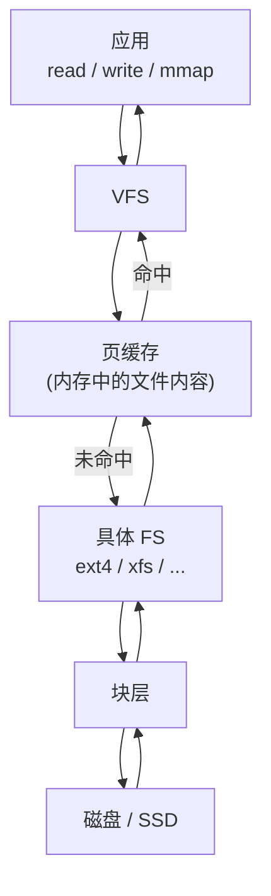
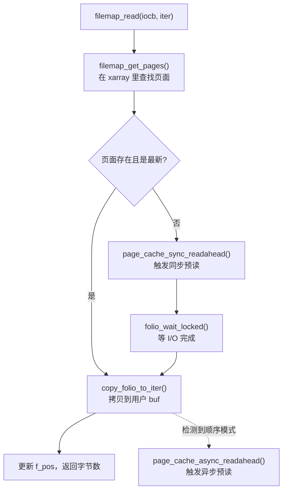
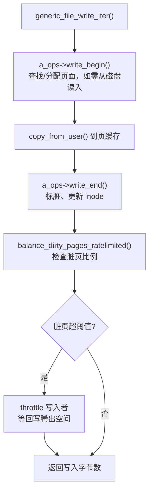
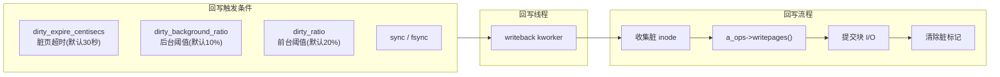
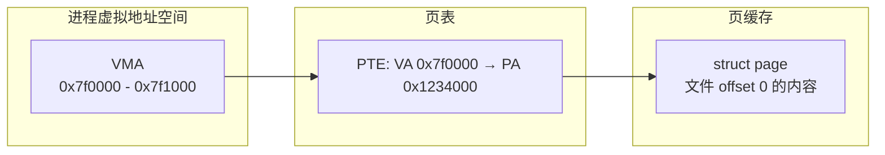
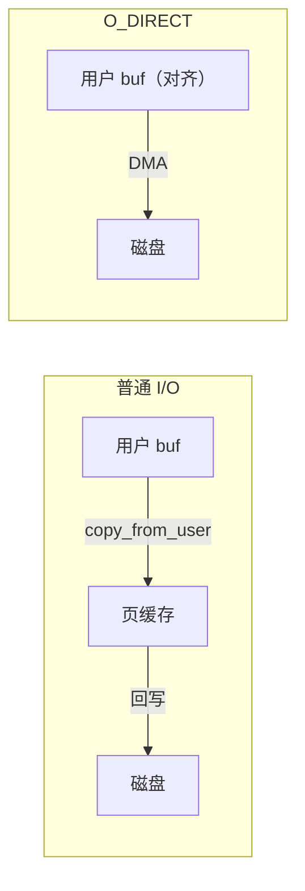
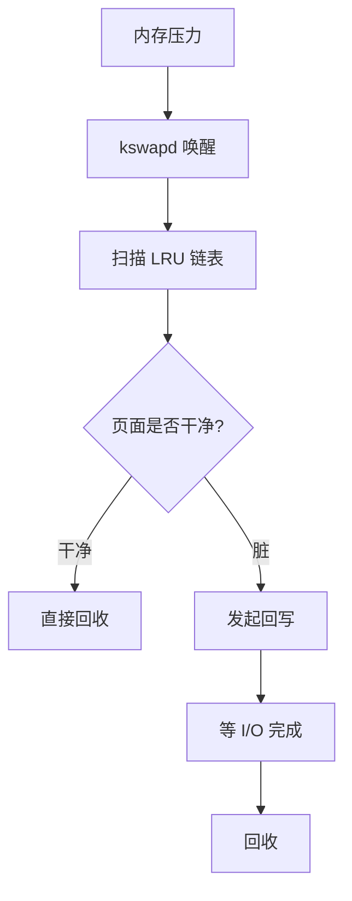

# 页缓存与 address_space：VFS 与内存的交汇

## 前言

**C：** 前几篇我们反复提到"页缓存命中则直接返回数据"——但这个"缓存"到底是怎么组织的？谁来决定预读多少？脏页什么时候回写？`mmap` 和 `read` 看到的是同一份缓存吗？这些问题的答案都在 VFS 的 **页缓存（page cache）** 和 **address_space** 子系统里。这一篇把它们拆解清楚——这是理解 Linux 文件 I/O 性能的最后一块拼图。

<!-- more -->

## 页缓存的定位



页缓存就是**内核用物理内存页来缓存文件内容**的一层。它的好处：

- **读加速**：热数据直接从内存返回，不走磁盘；
- **写缓冲**：`write()` 只写到页缓存就返回，异步回写；
- **共享**：多个进程 `mmap` 同一个文件，看到同一份页缓存；
- **预读**：检测顺序读模式，提前把后续页面拉进缓存。

## struct address_space

每个 inode 有一个 `address_space`（通常就是 `inode->i_data`），它是**这个文件的页缓存管理器**：

```c
struct address_space {
    struct inode        *host;           // 所属的 inode
    struct xarray       i_pages;         // 页面索引(xarray = radix tree 升级版)
    rwlock_t            invalidate_lock;
    gfp_t               gfp_mask;        // 内存分配标志
    atomic_t            i_mmap_writable; // 可写 mmap 计数
    struct rb_root_cached i_mmap;        // mmap 的 VMA 树
    unsigned long       nrpages;         // 缓存的页面数
    pgoff_t             writeback_index; // 回写进度
    const struct address_space_operations *a_ops; // 操作表
    unsigned long       flags;
    // ...
};
```

### 页面索引：xarray

页缓存用 **xarray**（以前是 radix tree）来索引页面，key 是**页面偏移**（`pgoff_t`，文件偏移 / PAGE_SIZE）：

```
文件: |page 0|page 1|page 2|page 3|....|page N|

xarray:
  index 0 → struct page (file offset 0–4095)
  index 1 → struct page (file offset 4096–8191)
  index 2 → NULL (未缓存)
  index 3 → struct page (file offset 12288–16383)
```

查找一个页面就是 `xa_load(&mapping->i_pages, index)`——O(log n) 的树查找。

### address_space_operations

```c
struct address_space_operations {
    int (*writepage)(struct page *page, struct writeback_control *wbc);
    int (*readpage)(struct file *, struct page *);
    int (*writepages)(struct address_space *, struct writeback_control *);
    void (*readahead)(struct readahead_control *);
    int (*write_begin)(struct file *, struct address_space *, loff_t,
                       unsigned, struct page **, void **);
    int (*write_end)(struct file *, struct address_space *, loff_t,
                     unsigned, unsigned, struct page *, void *);
    int (*dirty_folio)(struct address_space *, struct folio *);
    ssize_t (*direct_IO)(struct kiocb *, struct iov_iter *);
    // ...
};
```

关键回调：

| 回调 | 用途 |
|------|------|
| `readpage` / `readahead` | 从磁盘读入页面到页缓存 |
| `writepage` / `writepages` | 把脏页写回磁盘 |
| `write_begin` / `write_end` | `write()` 写入页缓存的前后钩子 |
| `dirty_folio` | 标记页面为脏 |
| `direct_IO` | O_DIRECT 路径 |

## 读路径详解

### filemap_read

`generic_file_read_iter()` 对于非 O_DIRECT 的读，最终调用 `filemap_read()`：



### 预读（readahead）

预读是页缓存最重要的优化之一。内核用 `struct file_ra_state` 跟踪每个 fd 的读取模式：

```c
struct file_ra_state {
    pgoff_t start;           // 当前预读窗口起始
    unsigned int size;       // 当前窗口大小
    unsigned int async_size; // 异步预读的大小
    unsigned int ra_pages;   // 最大预读页数
    // ...
};
```

算法要点：

1. **初始预读**：第一次顺序读，预读窗口从小值（如 4 页）开始；
2. **窗口增长**：每次确认是顺序读，窗口翻倍，直到 `ra_pages`（默认 128KB = 32 页）；
3. **异步预读**：当读到预读窗口的后半部分时，触发下一个窗口的异步预读——这样当前的读不用等 I/O；
4. **随机读检测**：如果偏移不连续，重置预读状态。

```bash
# 查看/设置预读大小
cat /sys/block/sda/queue/read_ahead_kb   # 默认 128
echo 256 > /sys/block/sda/queue/read_ahead_kb
```

## 写路径详解

### write 到页缓存



### 脏页回写

脏页的回写由内核的 **writeback** 框架管理：



关键参数：

| 参数 | 默认值 | 含义 |
|------|--------|------|
| `dirty_background_ratio` | 10% | 脏页占可用内存比例超此值，后台开始回写 |
| `dirty_ratio` | 20% | 脏页超此值，写入进程被阻塞等回写 |
| `dirty_expire_centisecs` | 3000 (30s) | 脏页存活超此时间必须回写 |
| `dirty_writeback_centisecs` | 500 (5s) | 回写线程的唤醒间隔 |

```bash
# 查看当前脏页状态
cat /proc/vmstat | grep -E 'nr_dirty|nr_writeback'

# 调整参数
sysctl vm.dirty_background_ratio=5
sysctl vm.dirty_ratio=10
```

## mmap 与页缓存

`mmap()` 一个文件时，进程的虚拟地址空间直接映射到页缓存的物理页上：



关键行为：

- **读取**：首次访问触发 page fault → `filemap_fault()` → 在页缓存里找页面（未命中则读磁盘）→ 建立页表映射；
- **写入（MAP_SHARED）**：修改直接反映在页缓存里，页面被标脏，后续回写到磁盘；
- **写入（MAP_PRIVATE）**：触发 COW（copy-on-write），分配新页面，修改不影响页缓存；
- **一致性**：`read()` 和 `mmap` 看到的是**同一份页缓存**——不会出现两份不同的数据。

```c
// 典型的 mmap 使用
int fd = open("data.bin", O_RDWR);
void *addr = mmap(NULL, size, PROT_READ | PROT_WRITE,
                  MAP_SHARED, fd, 0);
// 直接通过指针读写文件内容
memcpy(addr + offset, data, len);
msync(addr, size, MS_SYNC);  // 刷到磁盘
munmap(addr, size);
close(fd);
```

## folio：页缓存的现代化

从 Linux 5.16 开始，内核逐步用 **folio**（可以理解为"可能是多页的页面"）替代裸 `struct page`：

```c
struct folio {
    struct {
        unsigned long flags;
        struct list_head lru;
        struct address_space *mapping;
        pgoff_t index;
        unsigned long private;
        atomic_t _mapcount;
        atomic_t _refcount;
    };
    // ... 额外字段用于大页(compound page)
};
```

folio 的好处：

- **类型安全**：区分"文件页面"和"匿名页面"；
- **大页友好**：一个 folio 可以包含多个物理页（如 64KB 大页），减少管理开销；
- **减少歧义**：`struct page` 既可以是独立页又可以是 compound page 的子页，容易出错。

## O_DIRECT：绕过页缓存



O_DIRECT 的要求：

- 用户缓冲区地址必须**页对齐**（或扇区对齐）；
- 读写大小必须是扇区（512B）的倍数；
- 绕过页缓存，直接在用户 buf 和磁盘之间 DMA 传输。

使用场景：数据库（MySQL InnoDB 的 `innodb_flush_method=O_DIRECT`）、分布式存储引擎（它们自己管缓存）。

::: tip O_DIRECT 和页缓存的混用
如果一个文件同时被 O_DIRECT 和普通 I/O 访问，可能出现数据不一致。内核会尽量在 O_DIRECT 前 invalidate 页缓存，但不保证完美——最佳实践是一个文件只用一种模式。
:::

## 缓存回收

当系统内存紧张时，内核需要回收页缓存中的页面：



页缓存的回收使用**双链 LRU**（active/inactive）：

- 新页面进入 **inactive** 列表；
- 被再次访问时提升到 **active** 列表；
- 回收从 inactive 列表的尾部开始。

查看状态：

```bash
cat /proc/meminfo | grep -E 'Active\(file\)|Inactive\(file\)'
# Active(file):     1234560 kB
# Inactive(file):    567890 kB
```

手动清理（仅调试用，不建议生产环境）：

```bash
# 释放页缓存
echo 1 > /proc/sys/vm/drop_caches
# 释放 dentry + inode 缓存
echo 2 > /proc/sys/vm/drop_caches
# 全部释放
echo 3 > /proc/sys/vm/drop_caches
```

## 性能观测

### 查看页缓存命中率

```bash
# 使用 cachestat (bpfcc-tools)
sudo cachestat 1
# 输出每秒的 hits / misses / read_hit% / write_hit%
```

### vmstat 观察 I/O 压力

```bash
vmstat 1
# bi/bo 列分别是块设备读入/写出(KB/s)
# 如果 bi 很低而应用读很多 → 页缓存在起作用
```

### 查看文件的缓存状态

```bash
# 使用 vmtouch
vmtouch /var/log/syslog
# 输出：文件有多少页在缓存中

# 强制把文件拉入缓存
vmtouch -t /var/log/syslog

# 把文件踢出缓存
vmtouch -e /var/log/syslog
```

## 本章小结

- 页缓存是 VFS 的性能核心——它用内存页缓存文件内容，让热数据的读写完全在内存中完成；
- `address_space` 是每个 inode 的页缓存管理器，用 xarray 索引页面，通过 `a_ops` 与底层 FS 交互；
- 预读机制自动检测顺序读模式，提前拉入后续页面，是顺序 I/O 性能高的关键；
- `write()` 只写到页缓存就返回，脏页由 writeback 框架异步刷盘；
- `mmap` 直接映射页缓存的物理页，和 `read()` 看到的是同一份数据；
- O_DIRECT 绕过页缓存，由应用自己管缓存，适合数据库等场景；
- folio 是页缓存的现代化升级，提供类型安全和大页支持。

下一篇我们动手——写一个最小的内核文件系统模块，把前面学到的 VFS 概念串联成可运行的代码。
