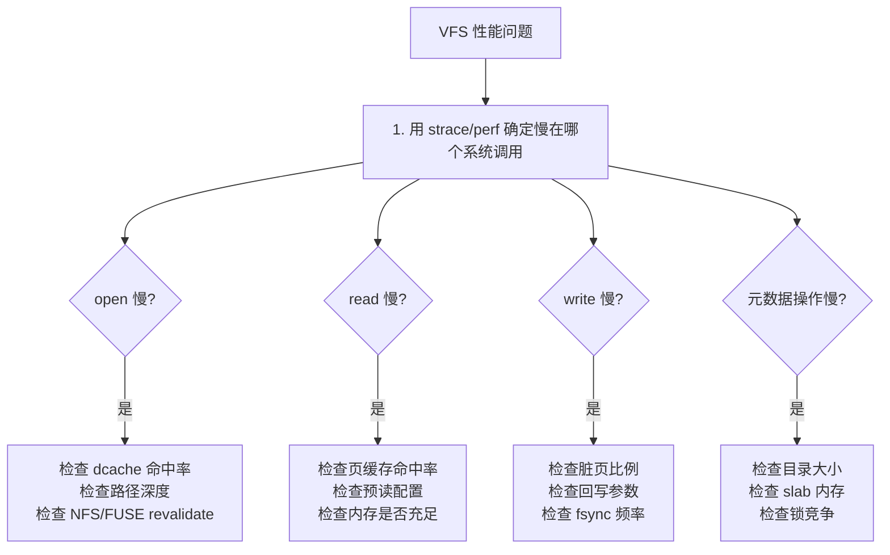

# VFS 性能观测与调优

## 前言

**C：** 前七篇把 VFS 的概念和实现讲完了，但"知道怎么回事"和"能解决实际性能问题"之间还差最后一步——**观测与调优**。这一篇用 ftrace、perf、bpftrace 等工具，系统整理 VFS 相关的性能分析方法：从识别瓶颈到精准定位，从内核参数到应用层策略。

<!-- more -->

## VFS 性能问题的常见表现

| 现象 | 可能的 VFS 瓶颈 |
|------|------------------|
| 文件访问延迟高 | dcache 未命中、页缓存未命中、慢路径查找 |
| `iowait` 高 | 页缓存不够、回写风暴、预读失效 |
| 元数据操作慢（ls、find） | dcache 压力、大目录线性扫描 |
| 多进程并发写同一文件卡顿 | `f_pos_lock` 竞争、inode 锁竞争 |
| `open` 系统调用延迟大 | 深路径查找、NFS/FUSE 慢 lookup |
| 内存占用持续增长 | dcache/icache 膨胀、页缓存不回收 |

## 工具速查

| 工具 | 用途 | 安装 |
|------|------|------|
| `perf` | 采样分析、tracepoint | `linux-tools-$(uname -r)` |
| `ftrace` | 内核函数追踪 | 内核自带 |
| `bpftrace` | eBPF 脚本化追踪 | `bpftrace` 包 |
| `strace` | 系统调用追踪 | `strace` 包 |
| `vmtouch` | 页缓存探查 | `vmtouch` 包 |
| `slabtop` | slab 缓存观察 | `procps` |
| `cachestat` | 页缓存命中率 | `bpfcc-tools` |

## 一、dcache 性能分析

### 问题：路径查找是否成为瓶颈？

#### perf top 快速定位

```bash
sudo perf top -g
```

如果 `d_lookup`、`__d_lookup_rcu`、`lookup_fast`、`walk_component` 等 VFS 函数排名靠前，说明路径查找是热点。

#### bpftrace 统计 dcache 命中率

```bash
sudo bpftrace -e '
kprobe:lookup_fast { @fast = count(); }
kprobe:lookup_slow { @slow = count(); }
interval:s:5 {
    $total = @fast + @slow;
    if ($total > 0) {
        printf("dcache hit rate: %d%%  (fast=%d, slow=%d)\n",
               @fast * 100 / $total, @fast, @slow);
    }
    clear(@fast); clear(@slow);
}
'
```

如果命中率低于 90%，值得深入分析：

- 是否有大量首次访问（冷启动）；
- 是否频繁 `drop_caches`；
- 是否有 NFS/FUSE 的 revalidate 导致 dcache 失效。

#### dcache 内存占用

```bash
# 查看 dentry slab
sudo slabtop -o -s c | head -10

# 查看 dcache 状态
cat /proc/sys/fs/dentry-state
```

### 调优手段

| 手段 | 场景 |
|------|------|
| 减少路径深度 | 很深的目录层级（如 `/a/b/c/d/e/f/g`）每一级都要查找 |
| 避免频繁 `drop_caches` | 生产环境不要定时清缓存 |
| `negative_dentry_limit` | 控制负缓存数量（部分内核版本） |
| 减少大目录 | 单目录百万文件 → dcache 和目录项遍历都慢 |

## 二、页缓存性能分析

### 页缓存命中率

```bash
# cachestat (bpfcc-tools)
sudo cachestat 1
```

输出：

```
    HITS   MISSES  DIRTIES  HITRATIO   BUFFERS_MB  CACHED_MB
   45678     1234      567    97.37%         128       2048
```

如果 HITRATIO 低：

- 工作集大于可用内存；
- 有其它进程在竞争内存；
- 使用了 O_DIRECT（不走页缓存）。

### 查看文件级缓存

```bash
# 某个文件有多少在缓存中
vmtouch /path/to/large/file

# 批量查看
vmtouch /var/lib/mysql/
```

### 观察脏页和回写

```bash
# 实时观察脏页数量
watch -n 1 'grep -E "Dirty:|Writeback:" /proc/meminfo'

# bpftrace 追踪回写延迟
sudo bpftrace -e '
kprobe:wb_writeback { @start[tid] = nsecs; }
kretprobe:wb_writeback /@start[tid]/ {
    @writeback_us = hist((nsecs - @start[tid]) / 1000);
    delete(@start[tid]);
}
'
```

### 调优参数

```bash
# 降低后台回写阈值（更早开始写，避免积压）
sysctl vm.dirty_background_ratio=5

# 降低前台阈值（减少写入者被阻塞的时间）
sysctl vm.dirty_ratio=10

# 缩短脏页过期时间
sysctl vm.dirty_expire_centisecs=1500

# 增大预读窗口（顺序 I/O 场景）
echo 512 > /sys/block/sda/queue/read_ahead_kb

# 对于 SSD，减小预读可能更好
echo 64 > /sys/block/nvme0n1/queue/read_ahead_kb
```

## 三、系统调用级分析

### strace 延迟统计

```bash
# 统计各系统调用的耗时
strace -c -p <pid>

# 追踪慢的 open/read/write
strace -T -e trace=openat,read,write -p <pid> 2>&1 | awk '$NF > 0.001'
```

### bpftrace 追踪慢 open

```bash
sudo bpftrace -e '
tracepoint:syscalls:sys_enter_openat {
    @start[tid] = nsecs;
    @name[tid] = args->filename;
}
tracepoint:syscalls:sys_exit_openat /@start[tid]/ {
    $dur_us = (nsecs - @start[tid]) / 1000;
    if ($dur_us > 1000) {
        printf("slow open (%d us): %s [%s]\n",
               $dur_us, @name[tid], comm);
    }
    delete(@start[tid]);
    delete(@name[tid]);
}
'
```

### perf trace

```bash
# 追踪特定进程的 VFS 相关系统调用
sudo perf trace -e openat,read,write,close -p <pid> --duration 1
```

## 四、ftrace 深入内核路径

### 追踪函数调用图

```bash
cd /sys/kernel/debug/tracing

# 追踪 vfs_read 的调用链
echo vfs_read > set_ftrace_filter
echo function_graph > current_tracer
echo 1 > tracing_on

# 执行操作
cat /etc/hostname > /dev/null

echo 0 > tracing_on
cat trace
```

输出类似：

```
 0)               |  vfs_read() {
 0)               |    generic_file_read_iter() {
 0)               |      filemap_read() {
 0)   0.234 us    |        filemap_get_pages();
 0)   0.156 us    |        copy_page_to_iter();
 0)   1.890 us    |      }
 0)   2.345 us    |    }
 0)   3.012 us    |  }
```

### 追踪特定文件系统的操作

```bash
# 追踪 ext4 的 lookup
echo ext4_lookup > set_ftrace_filter
echo function > current_tracer
echo 1 > tracing_on
# ...
```

### 使用 tracepoint

```bash
# 列出 VFS 相关的 tracepoint
sudo perf list 'writeback:*'
sudo perf list 'filemap:*'

# 追踪回写事件
sudo perf trace -e 'writeback:*' --duration 0 sleep 10
```

## 五、锁竞争分析

### inode 锁（i_rwsem）

文件系统的 `read`/`write` 通常要拿 `inode->i_rwsem`——读操作拿共享锁，写操作拿独占锁。并发写同一个文件会产生锁竞争。

```bash
# bpftrace 追踪 i_rwsem 等待时间
sudo bpftrace -e '
kprobe:inode_lock { @start[tid] = nsecs; }
kretprobe:inode_lock /@start[tid]/ {
    @lock_wait_us = hist((nsecs - @start[tid]) / 1000);
    delete(@start[tid]);
}
'
```

### f_pos_lock

多线程共享同一个 fd 时，`f_pos` 的更新需要 `f_pos_lock`。解决方法：每个线程用自己的 fd（各自 `open`），或使用 `pread/pwrite`。

### 用 perf lock 分析

```bash
sudo perf lock record -p <pid> -- sleep 10
sudo perf lock report
```

## 六、常见调优场景

### 场景 1：大量小文件读取

**问题**：百万小文件的 `stat` / `readdir` 很慢。

**分析**：

```bash
# 检查 dcache 命中率
# 检查底层 FS 的目录结构（ext4 的 htree 有数量限制）
sudo debugfs -R 'htree_dump /path/to/dir' /dev/sda1
```

**调优**：
- 减少单目录文件数（分层目录，如 `aa/bb/cc/`）；
- 确保 ext4 的 `dir_index` 已开启；
- 考虑用 `ls -f`（不排序）替代 `ls`。

### 场景 2：数据库 I/O 优化

**问题**：数据库 `fsync` 延迟高。

**分析**：

```bash
# bpftrace 追踪 fsync 延迟
sudo bpftrace -e '
kprobe:vfs_fsync_range { @start[tid] = nsecs; }
kretprobe:vfs_fsync_range /@start[tid]/ {
    @fsync_us = hist((nsecs - @start[tid]) / 1000);
    delete(@start[tid]);
}
'
```

**调优**：
- 数据库用 `O_DIRECT`（跳过页缓存，避免双缓冲）；
- 使用 `fdatasync` 替代 `fsync`（少一次元数据刷写）；
- SSD 确认 write cache 开启且有电容保护；
- 文件系统挂载选项：`nobarrier`（仅在电容保护的设备上）。

### 场景 3：日志文件写入优化

**问题**：高频日志写入导致 CPU 高。

**分析**：

```bash
strace -c -p <logger_pid>
# 看 write 调用频率和耗时
```

**调优**：
- 应用层攒批写入（bufio），减少系统调用次数；
- 使用 `writev`（scatter/gather I/O）代替多次 `write`；
- 考虑 tmpfs / tmpfs+logrotate 方案（日志先写内存，定期转存）。

### 场景 4：NFS/FUSE 元数据慢

**问题**：`ls` 在 NFS 挂载点上要几秒。

**分析**：

```bash
# 检查 attribute cache 过期时间
mount | grep nfs
# 看 actimeo / acregmax / acdirmax 参数
```

**调优**：
- 增大 NFS attribute cache 超时：`mount -o actimeo=60`；
- FUSE 增大 entry/attr timeout：`-o entry_timeout=60 -o attr_timeout=60`；
- 减少 `readdirplus` 的返回量。

## 七、性能检查清单

针对 VFS 相关性能问题的系统化排查流程：



## 八、内核参数汇总

| 参数 | 路径 | 默认值 | 说明 |
|------|------|--------|------|
| `dirty_background_ratio` | `/proc/sys/vm/` | 10 | 脏页后台回写阈值(%) |
| `dirty_ratio` | `/proc/sys/vm/` | 20 | 脏页前台阈值(%) |
| `dirty_expire_centisecs` | `/proc/sys/vm/` | 3000 | 脏页过期时间(厘秒) |
| `dirty_writeback_centisecs` | `/proc/sys/vm/` | 500 | 回写线程唤醒间隔 |
| `vfs_cache_pressure` | `/proc/sys/vm/` | 100 | dcache/icache 回收激进度 |
| `drop_caches` | `/proc/sys/vm/` | — | 手动释放缓存(仅调试) |
| `file-max` | `/proc/sys/fs/` | 动态 | 系统最大打开文件数 |
| `nr_open` | `/proc/sys/fs/` | 1048576 | 单进程最大 fd 数 |
| `read_ahead_kb` | `/sys/block/*/queue/` | 128 | 预读大小(KB) |

`vfs_cache_pressure` 是一个容易被忽略但很有用的参数：

- **< 100**：更倾向保留 dcache/icache（适合元数据密集型负载）；
- **> 100**：更激进地回收 dcache/icache（适合大文件、少元数据的场景）。

```bash
# 元数据密集场景（如文件服务器）
sysctl vm.vfs_cache_pressure=50

# 大文件流式场景（如视频服务器）
sysctl vm.vfs_cache_pressure=200
```

## 本章小结

- VFS 性能分析的核心工具链：strace（系统调用）→ perf（采样）→ ftrace（内核函数）→ bpftrace（自定义追踪）；
- dcache 命中率和页缓存命中率是 VFS 性能的两个关键指标；
- 脏页回写参数（`dirty_*`）直接影响写延迟和吞吐量的权衡；
- 不同场景有不同的调优策略：数据库用 O_DIRECT，日志用批量写，NFS/FUSE 调 cache timeout；
- `vfs_cache_pressure` 控制 dcache/icache 回收激进度，是容易被忽略的调优杠杆。

::: tip 系列完结

到这里，VFS 虚拟文件系统系列就完成了——从"VFS 是什么"到核心数据结构、路径查找、文件操作全链路、挂载机制、页缓存、动手写 FS 模块、最后到性能调优。希望这条学习路径能帮你建立起对 Linux 文件系统的**结构化认知**，在遇到实际问题时知道该往哪里看。

:::
