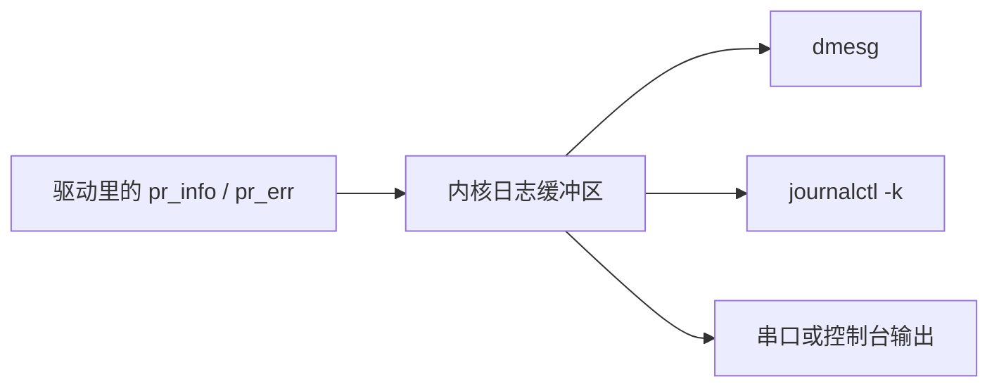

# 内核日志调试与常用工具

## 前言

**C：** 写用户态程序时，出问题了可以 `printf`、可以打断点、可以直接看进程退出码；可一旦进入内核态，这些手段就不再像以前那样顺手了。驱动开发里最基础也最重要的调试能力，就是：**把日志打出来、把日志看明白、把排查路径走顺**。本篇先不追求复杂调试器，而是把最常用的一套基础工具讲扎实。

<!-- more -->

## 日志观测路径图



## 为什么日志在驱动开发里如此重要

驱动运行在内核态，意味着：

- 代码一旦异常，可能直接把系统打挂。
- 很多问题并不会像用户态程序那样优雅报错。
- 真实硬件现场往往只有串口日志、`dmesg` 或系统日志可看。

所以对驱动工程师来说，日志不是“辅助品”，而是最基础的观测手段。

## 最常用的日志接口

### `printk`

内核里最经典的日志接口是 `printk`：

```c
printk(KERN_INFO "hello_lkm: init\n");
```

它和用户态的 `printf` 有点像，但：

- 有日志级别
- 最终进入的是内核日志缓冲区
- 输出是否出现在控制台，还会受到当前日志级别控制

### `pr_info` / `pr_err` / `pr_warn`

日常写驱动时，更推荐这一类宏：

```c
pr_info("hello_lkm: init\n");
pr_warn("hello_lkm: something unusual happened\n");
pr_err("hello_lkm: failed to request irq\n");
```

它们更简洁，也更容易统一风格。

::: tip 笔者说
写驱动日志时，建议统一带上模块或设备前缀，例如 `mydrv:`、`sensor0:`，后续排日志时会省很多事。
:::

## 从哪里看内核日志

### `dmesg`

最常用的就是：

```bash
dmesg
```

如果想让时间更可读：

```bash
dmesg -T
```

如果你想实时观察日志变化：

```bash
dmesg -w
```

这在你另一个终端执行 `insmod` / `rmmod` 时尤其好用。

### `journalctl -k`

在使用 systemd 的系统中，也可以用：

```bash
journalctl -k
```

如果只看本次启动的内核日志：

```bash
journalctl -k -b
```

它和 `dmesg` 都能看内核日志，但具体格式与时间展示会略有差异。

## 先学会看“当前发生了什么”

结合上一节的最小模块，你至少应该能熟练执行下面几件事：

```bash
sudo insmod hello.ko
dmesg -T | tail -n 20
sudo rmmod hello
dmesg -T | tail -n 20
```

这里的重点不是命令本身，而是要建立一种习惯：

1. 执行动作
2. 立刻看日志
3. 对照代码里的打印点
4. 确认程序到底走到哪一步了

驱动排错很多时候就是不断重复这个闭环。

## 日志级别是怎么回事

Linux 内核日志有不同级别，例如：

- `KERN_EMERG`
- `KERN_ALERT`
- `KERN_CRIT`
- `KERN_ERR`
- `KERN_WARNING`
- `KERN_NOTICE`
- `KERN_INFO`
- `KERN_DEBUG`

你不需要一开始全背下来，只要先记住这条简单规则：

- 普通流程信息：`pr_info`
- 可疑但未失败：`pr_warn`
- 失败路径：`pr_err`
- 高频调试细节：`pr_debug`

其中 `pr_debug` 默认不一定会显示，这和编译配置、动态调试机制有关。

## 查看当前控制台日志级别

你可以看看当前系统日志级别配置：

```bash
cat /proc/sys/kernel/printk
```

输出通常是几个数字，例如：

```text
4 4 1 7
```

初学阶段不必深究每一个数字的含义，但要知道：

- 这会影响某些日志是否直接打印到控制台
- 即使控制台不显示，日志通常仍会留在内核缓冲区里

因此“屏幕上没看到”并不等于“日志没打出来”。

## 常用辅助工具

### `lsmod`

看当前加载了哪些模块：

```bash
lsmod | head
```

若你想确认自己的模块是否还在：

```bash
lsmod | grep hello
```

### `modinfo`

查看模块元数据：

```bash
modinfo hello.ko
```

可以看到：

- 作者
- 许可证
- 描述
- 依赖关系
- 参数信息

### `/proc` 和 `/sys`

很多内核状态会通过这两个伪文件系统暴露出来。

例如：

```bash
ls /proc
ls /sys
```

后续学驱动时，你会经常接触：

- `/proc/devices`
- `/sys/class/`
- `/sys/module/`
- `/sys/kernel/debug/`

它们本质上都是观察内核状态的重要窗口。

## 一个基础排错套路

当驱动“看起来没工作”时，不要立刻乱改代码，先按下面这条线路排：

### 第一步：模块到底有没有加载成功

```bash
sudo insmod your_driver.ko
echo $?
lsmod | grep your_driver
```

### 第二步：日志里走到了哪一步

```bash
dmesg -T | tail -n 50
```

### 第三步：用户态看到的入口有没有出来

例如字符设备场景，检查：

```bash
ls -l /dev
cat /proc/devices
```

### 第四步：区分“驱动没跑”还是“驱动跑了但逻辑有误”

这一步非常重要。  
如果 `probe` / `init` 压根没执行到，那就不是业务逻辑问题，而是匹配、加载、构建或依赖问题。

## 一个简单的日志实验

可以把上一篇的最小模块略微改造一下：

```c
static int __init hello_init(void)
{
	pr_info("hello_lkm: init begin\n");
	pr_warn("hello_lkm: this is a warning demo\n");
	pr_err("hello_lkm: this is an error demo\n");
	pr_info("hello_lkm: init end\n");
	return 0;
}
```

重新编译、加载：

```bash
make
sudo insmod hello.ko
dmesg -T | tail -n 20
```

这样你就能直观看到不同级别日志的输出风格。

## 验证步骤

建议把下面几条命令都亲手跑一遍：

```bash
dmesg -T | tail -n 20
journalctl -k -b | tail -n 20
lsmod | head
modinfo hello.ko
cat /proc/sys/kernel/printk
```

然后再做一次模块加载实验：

```bash
sudo insmod hello.ko
dmesg -w
```

另开一个终端执行卸载：

```bash
sudo rmmod hello
```

通过这种方式，能更直观地感受到日志是“实时变化”的。

## 常见问题

### `dmesg: read kernel buffer failed: Operation not permitted`

通常是权限限制。  
先试试：

```bash
sudo dmesg
```

### 为什么日志打了，但终端没有立刻看到？

因为日志先进入内核缓冲区，是否同步打印到控制台还取决于当前日志级别与系统配置。  
这时应优先去查 `dmesg` 或 `journalctl -k`。

### 我是不是应该一开始就上 gdb、kgdb、ftrace？

不用。  
这些高级工具很有价值，但基础没打牢前，最划算的仍然是先把日志和最小排错闭环练熟。

## 小结

驱动调试的第一能力，不是会多少高级工具，而是会不会把最基础的日志能力用顺：**知道打什么、去哪里看、怎么看出执行路径、如何区分“没跑到”和“跑歪了”**。把这套习惯养好，后面无论写字符设备、平台驱动，还是处理中断与并发问题，都会轻松很多。
