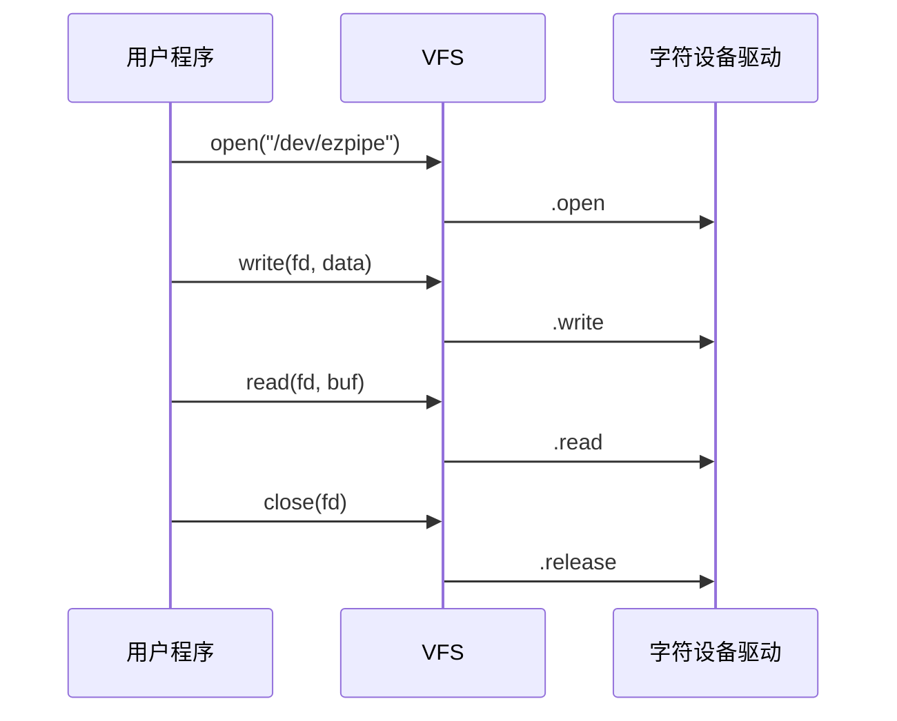

# open、read、write、release 的最小实现

## 前言

**C：** 上一篇我们把字符设备的骨架搭起来了，但那时 `/dev/xxx` 还只是“能打开的空壳”。真正让它像一个设备的，是 `open`、`read`、`write`、`release` 这几个最基础的回调。本篇就写一个最小可运行的字符设备驱动：内核里维护一块缓冲区，用户态可以把字符串写进去，再从设备节点读出来。

<!-- more -->

## 用户态到驱动侧的调用流程



## 先把调用链想清楚

用户空间执行：

```c
open("/dev/ezpipe", O_RDWR);
write(fd, "hello", 5);
read(fd, buf, sizeof(buf));
close(fd);
```

内核里大致会走到这些回调：

- `open` -> `.open`
- `write` -> `.write`
- `read` -> `.read`
- `close` -> `.release`

所以 `file_operations` 本质上就是用户态系统调用在驱动侧的落点。

## 一个最小字符设备示例

下面这份示例代码故意保持简单，只做这几件事：

- 在内核里准备一块固定大小缓冲区
- 用户态 `write` 时拷贝进来
- 用户态 `read` 时再拷贝出去
- `open` / `release` 只打印日志，帮助我们观察流程

::: tip 配套源码
本文对应的完整实验目录在 `examples/linuxdev/02-ezpipe/`，里面同时包含了驱动代码、用户态测试程序和 Makefile，适合直接照着跑一遍。
:::

```c
#include <linux/module.h>
#include <linux/fs.h>
#include <linux/cdev.h>
#include <linux/device.h>
#include <linux/uaccess.h>
#include <linux/mutex.h>

#define DEV_NAME "ezpipe"
#define EZPIPE_BUF_SIZE 256

static dev_t ez_devno;
static struct cdev ez_cdev;
static struct class *ez_class;

static char ez_buf[EZPIPE_BUF_SIZE];
static size_t ez_len;
static DEFINE_MUTEX(ez_lock);

static int ez_open(struct inode *inode, struct file *filp)
{
	pr_info("ezpipe: open\n");
	return 0;
}

static int ez_release(struct inode *inode, struct file *filp)
{
	pr_info("ezpipe: release\n");
	return 0;
}

static ssize_t ez_read(struct file *filp, char __user *buf,
		       size_t count, loff_t *ppos)
{
	size_t avail;
	size_t to_copy;

	mutex_lock(&ez_lock);

	if (*ppos >= ez_len) {
		mutex_unlock(&ez_lock);
		return 0;
	}

	avail = ez_len - *ppos;
	to_copy = min(count, avail);

	if (copy_to_user(buf, ez_buf + *ppos, to_copy)) {
		mutex_unlock(&ez_lock);
		return -EFAULT;
	}

	*ppos += to_copy;
	mutex_unlock(&ez_lock);
	return to_copy;
}

static ssize_t ez_write(struct file *filp, const char __user *buf,
			size_t count, loff_t *ppos)
{
	size_t to_copy;

	mutex_lock(&ez_lock);

	to_copy = min(count, (size_t)(EZPIPE_BUF_SIZE - 1));
	if (copy_from_user(ez_buf, buf, to_copy)) {
		mutex_unlock(&ez_lock);
		return -EFAULT;
	}

	ez_buf[to_copy] = '\0';
	ez_len = to_copy;
	*ppos = 0;

	mutex_unlock(&ez_lock);
	return to_copy;
}

static const struct file_operations ez_fops = {
	.owner = THIS_MODULE,
	.open = ez_open,
	.read = ez_read,
	.write = ez_write,
	.release = ez_release,
};

static int __init ez_init(void)
{
	int ret;

	ret = alloc_chrdev_region(&ez_devno, 0, 1, DEV_NAME);
	if (ret)
		return ret;

	cdev_init(&ez_cdev, &ez_fops);
	ez_cdev.owner = THIS_MODULE;

	ret = cdev_add(&ez_cdev, ez_devno, 1);
	if (ret)
		goto err_unregister;

	/*
	 * 新内核常见单参数 class_create()，旧一些的 5.x/LTS 内核
	 * 往往仍需要 class_create(THIS_MODULE, name) 形式。
	 */
#if LINUX_VERSION_CODE >= KERNEL_VERSION(6, 4, 0)
	ez_class = class_create(DEV_NAME "_class");
#else
	ez_class = class_create(THIS_MODULE, DEV_NAME "_class");
#endif
	if (IS_ERR(ez_class)) {
		ret = PTR_ERR(ez_class);
		goto err_cdev;
	}

	device_create(ez_class, NULL, ez_devno, NULL, DEV_NAME);
	mutex_init(&ez_lock);
	ez_len = 0;

	pr_info("ezpipe: major=%d minor=%d\n", MAJOR(ez_devno), MINOR(ez_devno));
	return 0;

err_cdev:
	cdev_del(&ez_cdev);
err_unregister:
	unregister_chrdev_region(ez_devno, 1);
	return ret;
}

static void __exit ez_exit(void)
{
	device_destroy(ez_class, ez_devno);
	class_destroy(ez_class);
	cdev_del(&ez_cdev);
	unregister_chrdev_region(ez_devno, 1);
}

module_init(ez_init);
module_exit(ez_exit);

MODULE_LICENSE("GPL");
```

## 关键点逐个解释

### `open` 和 `release`

这两个回调看起来很简单，但别小看它们：

- `open`：常用于初始化一次打开所需的上下文
- `release`：常用于清理这次打开相关的资源

在最小示例里，我们先只打印日志，让你能看清 `open -> release` 的成对关系。

### `read`

`read` 回调里最重要的两件事：

1. 不能直接把内核指针丢给用户态
2. 要正确维护 `*ppos`

所以要用：

```c
copy_to_user(...)
```

这表示把数据从**内核空间复制到用户空间**。

同时，`*ppos` 用来表示当前文件偏移。  
如果已经读到末尾了，就要返回 `0`，这在用户态通常意味着“读到 EOF”。

### `write`

`write` 回调里则反过来，要用：

```c
copy_from_user(...)
```

表示把用户态传来的内容拷贝到内核缓冲区里。

这里我们做了两点简化：

- 每次写入都从缓冲区开头覆盖
- 最大只接受 `EZPIPE_BUF_SIZE - 1` 个字节，并人为补一个 `'\0'`

这样做不一定适合真实业务，但非常适合教学。

### 为什么要加 `mutex`

因为用户空间可能并发访问这个设备。  
即使你现在只开一个进程测试，也应尽早养成“共享状态要保护”的习惯。

这里的共享状态包括：

- `ez_buf`
- `ez_len`

所以在 `read` / `write` 里都用 `mutex_lock` / `mutex_unlock` 做保护。

## 用户态测试程序

下面这段程序可以直接配合驱动验证：

```c
#include <fcntl.h>
#include <stdio.h>
#include <string.h>
#include <unistd.h>

int main(void)
{
	int fd;
	ssize_t n;
	char buf[128] = {0};

	fd = open("/dev/ezpipe", O_RDWR);
	if (fd < 0) {
		perror("open");
		return 1;
	}

	n = write(fd, "hello driver\n", 13);
	printf("write returned: %zd\n", n);

	n = read(fd, buf, sizeof(buf) - 1);
	printf("read returned: %zd, buf=%s", n, buf);

	close(fd);
	return 0;
}
```

## 验证步骤

### 第一步：编译并加载驱动

```bash
make
sudo insmod ezpipe.ko
```

### 第二步：确认设备节点存在

```bash
ls -l /dev/ezpipe
```

### 第三步：编译用户态程序

```bash
gcc user_ezpipe.c -o user_ezpipe
```

### 第四步：运行测试

```bash
./user_ezpipe
```

### 第五步：观察日志

```bash
dmesg -T | tail -n 30
```

正常情况下，你应能看到：

- `open`
- `release`

以及用户程序打印出来的读写返回值。

## 常见问题

### 为什么 `read` 一直返回 0

通常说明当前位置 `*ppos` 已经到末尾了。  
如果你后续把驱动改成支持连续多次读取，就要认真考虑文件偏移的维护策略，以及是否需要实现 `.llseek`。

### 为什么不能直接 `memcpy(buf, ez_buf, to_copy)`

因为 `buf` 是用户空间地址，不属于内核可随便直接访问的普通内存。  
应使用 `copy_to_user` / `copy_from_user` 这一类专门接口。

### 为什么这里用 `mutex`，不用 `spinlock`

因为当前 `read` / `write` 都运行在进程上下文里，而且可能睡眠。  
这种场景下 `mutex` 是更自然的选择。

### 为什么我的 `class_create` 在这里编不过

如果你使用的是较老的内核版本，`class_create` 可能仍要求 `THIS_MODULE` 作为第一个参数。  
正文代码已经给出了一个按内核版本切换的写法，照着调整即可。

## 小结

字符设备的最小可用闭环，就是把 `open`、`read`、`write`、`release` 这四个基础回调真正跑起来。你需要重点记住两件事：**用户空间和内核空间的数据交互必须显式拷贝**，以及**共享状态应尽早考虑同步保护**。下一篇，我们在这个基础上再补上 `ioctl`，把“数据通道”和“控制通道”都建起来。
