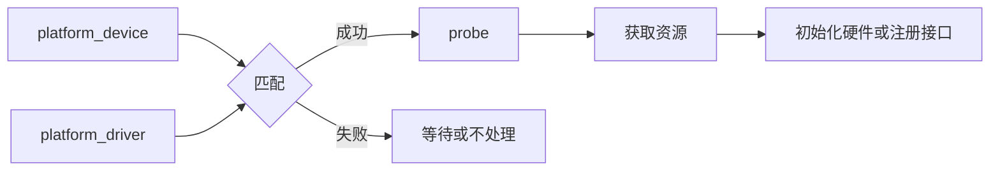

# 平台总线 platform_driver 与 probe 流程

## 前言

**C：** 当你从“教学用字符设备”走向“真实板级驱动”时，很快就会遇到一个问题：设备不是你手工凭空注册的，它本来就挂在 SoC 里，或者由板级描述告诉内核它应该存在。这个时候，平台总线和 `platform_driver` 就会变得非常重要。很多新手第一次看 `probe()` 时总觉得抽象，其实只要把“设备从哪来、驱动怎么匹配、资源何时可用”这三件事理顺，它就没那么神秘。

<!-- more -->

## 匹配到 `probe()` 的流程图



## 为什么会有平台总线

Linux 内核里，并不是所有设备都像 USB、PCIe 那样能被标准总线自动枚举。  
在嵌入式 SoC 场景下，大量外设本来就是芯片内部固定存在的，例如：

- UART
- I2C 控制器
- SPI 控制器
- GPIO 控制器
- 定时器

这些设备通常没有“插上去再枚举”的过程，但内核又必须知道它们存在，于是就有了 **platform bus** 这类抽象。

可以先把它理解为：

::: tip 笔者说
平台总线，本质上是 Linux 用来承载“板级固定设备”与其驱动匹配关系的一套设备模型。
:::

## `platform_device` 和 `platform_driver` 分别是什么

### `platform_device`

表示：**这里有一个设备实例**。  
它通常带有一些资源信息，例如：

- 内存资源（寄存器地址范围）
- 中断号
- 设备名

### `platform_driver`

表示：**我会驱动某一类平台设备**。  
它最核心的两个回调是：

- `probe`
- `remove`

## `probe()` 到底是什么时机

很多人第一次看 `probe()`，容易误以为“模块一加载，`probe()` 就一定会执行”。  
其实不是。

`probe()` 的调用前提是：

1. 设备对象存在
2. 驱动对象存在
3. 两者匹配成功

一旦匹配成功，内核才会调用 `probe()`。  
所以你可以把 `probe()` 理解为：

**“这个设备现在正式交给你负责了，你可以开始初始化它了。”**

## 一个最小 `platform_driver` 长什么样

先看最小骨架：

```c
#include <linux/module.h>
#include <linux/platform_device.h>

static int ez_probe(struct platform_device *pdev)
{
	dev_info(&pdev->dev, "ez_platform: probe called\n");
	return 0;
}

static int ez_remove(struct platform_device *pdev)
{
	dev_info(&pdev->dev, "ez_platform: remove called\n");
	return 0;
}

static struct platform_driver ez_driver = {
	.probe = ez_probe,
	.remove = ez_remove,
	.driver = {
		.name = "ez-platform-demo",
	},
};

module_platform_driver(ez_driver);

MODULE_LICENSE("GPL");
```

这段代码的重点不在于功能，而在于结构：

- `probe`：匹配成功后执行初始化
- `remove`：设备解绑或模块卸载时执行清理
- `driver.name`：参与匹配

## 设备和驱动怎么匹配

最基础的一种匹配方式，是名字匹配。

如果存在一个 `platform_device` 的名字也是：

```c
"ez-platform-demo"
```

那么内核就可能让它和上面的 `platform_driver` 匹配成功，随后调用 `probe()`。

这也是为什么很多教程里会有一个教学用示例：一边注册 `platform_device`，另一边注册 `platform_driver`，名字写成一样，然后观察 `probe()` 是否被调用。

## 教学场景下的最小配套 `platform_device`

在 x86 或普通实验环境里，你未必一开始就有真实设备树节点，因此可以先用代码注册一个教学设备：

```c
#include <linux/module.h>
#include <linux/platform_device.h>

static struct resource ez_resources[] = {
	{
		.start = 0x10000000,
		.end   = 0x100000ff,
		.flags = IORESOURCE_MEM,
	},
};

static struct platform_device ez_device = {
	.name = "ez-platform-demo",
	.id = -1,
	.num_resources = ARRAY_SIZE(ez_resources),
	.resource = ez_resources,
};

static int __init ez_dev_init(void)
{
	return platform_device_register(&ez_device);
}

static void __exit ez_dev_exit(void)
{
	platform_device_unregister(&ez_device);
}

module_init(ez_dev_init);
module_exit(ez_dev_exit);

MODULE_LICENSE("GPL");
```

如果这个教学设备和前面的 `platform_driver` 同时存在且名字一致，那么 `probe()` 就有机会被调到。

## `probe()` 里通常做哪些事

真实驱动里，`probe()` 往往是最核心的一段逻辑。  
常见事情包括：

1. 获取资源  
   例如寄存器地址、中断号、时钟资源等。

2. 申请和初始化私有数据结构  
   一般会为每个设备实例准备一个私有结构体，保存运行状态。

3. 建立用户空间接口或注册到某个内核子系统  
   比如字符设备、input 子系统、网络子系统等。

4. 硬件初始化  
   例如复位设备、配置默认寄存器、使能中断。

## 一个稍微真实一点的 `probe()` 片段

例如，获取内存资源的思路可能是：

```c
static int ez_probe(struct platform_device *pdev)
{
	struct resource *res;

	res = platform_get_resource(pdev, IORESOURCE_MEM, 0);
	if (!res)
		return -ENODEV;

	dev_info(&pdev->dev, "mem resource start=%pa end=%pa\n",
		 &res->start, &res->end);

	return 0;
}
```

这里先不用深究寄存器映射细节，重要的是建立一个概念：

- 资源不是凭空来的
- 资源由设备对象携带
- 驱动在 `probe()` 里把这些资源接过来使用

## `remove()` 为什么也很重要

很多初学者只盯着 `probe()`，忽略 `remove()`。  
但一个驱动能不能写稳，往往也体现在清理路径上。

`remove()` 里一般要做：

- 注销用户空间接口
- 释放中断
- 释放非自动管理资源
- 停止硬件工作

如果 `probe()` 里分配了一堆资源，`remove()` 却什么都不做，后面就很容易出资源泄漏或状态残留问题。

## x86 学习环境和嵌入式项目的差异

这一点要特别说明：  
在普通 PC 或虚拟机环境里，你能练到的更多是 **平台驱动模型本身**，而不是完整的板级真实外设流程。

原因是：

- 真实嵌入式项目常通过设备树描述 SoC 外设
- PC 环境下很多设备并不走这条路径
- 你更容易用“代码注册教学设备”的方式来验证框架行为

所以学习时应把两件事分开：

- 先学会 `platform_driver` 的模型和 `probe()` 心智
- 再在设备树文章里补上“设备从板级描述里来”的那部分

## 验证步骤

你可以做一个最小实验：

1. 注册一个名字为 `ez-platform-demo` 的 `platform_device`
2. 注册一个同名的 `platform_driver`
3. 加载模块后看日志

如果匹配成功，应能在日志里看到：

```text
ez_platform: probe called
```

可以用下面的方式观察：

```bash
sudo insmod xxx.ko
dmesg -T | tail -n 30
```

卸载时则看 `remove()` 是否执行：

```bash
sudo rmmod xxx
dmesg -T | tail -n 30
```

## 常见问题

### 模块加载了，但 `probe()` 没执行

这通常说明“驱动对象在”，但“匹配没成功”。优先检查：

- `platform_device` 是否真的存在
- 名字或 `compatible` 是否一致
- 设备是不是根本没注册出来

### `probe()` 一定只调用一次吗

不一定。  
如果系统里有多个同类设备实例，`probe()` 可能被调用多次，每个设备实例一次。

### `probe()` 里能不能做很重的事

能做初始化，但不要无节制堆逻辑。  
越复杂的 `probe()`，越要注意错误回滚和资源释放顺序。

## 小结

平台驱动的核心，不是某个 API，而是一整套匹配与初始化模型：**设备出现 -> 驱动注册 -> 匹配成功 -> `probe()` 初始化**。只要你把这条链路想明白，再去看设备树、资源获取、中断申请这些动作，就不会觉得它们是凭空冒出来的“黑魔法”。
