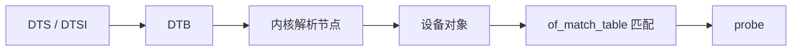

# 设备树基础与驱动匹配实战

## 前言

**C：** 平台驱动那篇里我们说过，驱动要想进入 `probe()`，前提是“设备存在且匹配成功”。在很多嵌入式项目里，这个“设备存在”的信息，恰恰就是通过设备树告诉内核的。很多同学第一次看设备树，容易把它当作一份普通配置文件，结果越看越乱。其实设备树最核心的价值只有一句话：**向内核描述硬件拓扑和资源，让驱动知道应该和谁匹配、该从哪里取资源。**

<!-- more -->

## 设备树到驱动匹配的关系图



## 设备树到底是什么

设备树（Device Tree）可以简单理解为：  
**由固件或启动阶段交给内核的一份硬件描述。**

它解决的是这样一个问题：

- 内核镜像本身尽量通用
- 板卡和 SoC 上外设的分布、地址、中断、兼容信息各不相同
- 那么这些差异信息不能全都硬编码进驱动里

于是，设备树就承担了“描述硬件长什么样”的角色。

## DTS、DTB 和运行时节点的关系

初学阶段把它拆成三层最容易理解：

1. **DTS / DTSI**  
   人类可读的源文件

2. **DTB**  
   编译后的二进制设备树 blob

3. **内核运行时对象**  
   内核解析 DTB 后，形成设备节点与设备对象

所以驱动真正面对的，并不是一段 `.dts` 文本，而是内核解析后的结果。

## 最关键的属性：`compatible`

如果只允许你先记住一个设备树属性，那就是：

```txt
compatible = "vendor,device-name";
```

它的作用非常关键：

- 设备树用它告诉内核：我是什么设备
- 驱动用它告诉内核：我支持什么设备

两边匹配成功，驱动才会有机会进入 `probe()`

## 驱动侧如何声明自己支持哪些设备

平台驱动里常见写法如下：

```c
static const struct of_device_id ez_of_match[] = {
	{ .compatible = "easyzoom,ez-demo" },
	{ }
};
MODULE_DEVICE_TABLE(of, ez_of_match);

static struct platform_driver ez_driver = {
	.probe = ez_probe,
	.remove = ez_remove,
	.driver = {
		.name = "ez-demo",
		.of_match_table = ez_of_match,
	},
};
```

其中最关键的是：

```c
.of_match_table = ez_of_match
```

这表示这个驱动支持设备树里 `compatible = "easyzoom,ez-demo"` 的设备。

## 一个最小设备树节点长什么样

下面是一个教学意义上的最小节点示例：

```txt
ez_demo@10000000 {
	compatible = "easyzoom,ez-demo";
	reg = <0x10000000 0x100>;
	interrupts = <5>;
	status = "okay";
};
```

你可以先这样理解这些字段：

- `compatible`：匹配驱动
- `reg`：寄存器地址范围
- `interrupts`：中断信息
- `status = "okay"`：表示设备可用

## 设备树和平台驱动是怎么串起来的

把这条链路串起来，其实并不复杂：

1. 设备树里写了一个节点
2. 内核解析后，基于这个节点创建相应设备对象
3. 平台驱动注册后，用 `compatible` 去和这个节点匹配
4. 匹配成功，进入 `probe()`

所以你以后遇到“为什么 `probe()` 没进”，就应该自然想到排查两端：

- 设备树节点在不在
- `compatible` 对不对

## `reg` 和资源获取怎么对应

驱动里经常会看到：

```c
struct resource *res;

res = platform_get_resource(pdev, IORESOURCE_MEM, 0);
if (!res)
	return -ENODEV;
```

为什么能拿到 `IORESOURCE_MEM`？  
因为设备树节点里有：

```txt
reg = <...>;
```

设备树里的 `reg`，最终会变成平台设备的资源信息，驱动在 `probe()` 里再把它取出来。

所以不要把设备树和驱动代码分开孤立去看，它们本来就是一条链上的两端。

## 一个最小 `probe()` 片段

下面这段代码适合作为理解资源获取与匹配的最小例子：

```c
static int ez_probe(struct platform_device *pdev)
{
	struct resource *res;

	res = platform_get_resource(pdev, IORESOURCE_MEM, 0);
	if (!res) {
		dev_err(&pdev->dev, "failed to get mem resource\n");
		return -ENODEV;
	}

	dev_info(&pdev->dev, "matched, mem start=%pa end=%pa\n",
		 &res->start, &res->end);
	return 0;
}
```

如果设备树和驱动匹配成功，日志里就会出现这类信息。

## 如何查看系统里设备树是否真的生效

在支持设备树的系统里，常见的观察路径包括：

```bash
ls /proc/device-tree
```

或者直接查某个节点：

```bash
find /proc/device-tree -name "*ez*"
```

也可以通过日志判断驱动是否匹配成功：

```bash
dmesg -T | grep -i ez
```

## x86 学习环境里的限制

这一点非常重要。  
如果你在 PC 或普通 x86 虚拟机上做实验，要知道：

- 很多设备并不依赖设备树，而更偏向 ACPI 等机制
- 你未必能像 ARM 开发板那样自然地增删一个 DTS 节点
- 所以在 x86 上，设备树更适合“理解机制”，而不是完整复现实板流程

这并不代表设备树不重要，而是说明：

- **驱动模型**可以先在通用环境理解
- **设备树实战**更适合结合 ARM64 板卡、QEMU virt 等环境深入

## 验证步骤

如果你手头有支持设备树的开发环境，可以按下面思路验证：

1. 在设备树里加入一个教学节点，写上：

```txt
compatible = "easyzoom,ez-demo";
```

2. 在驱动里准备同样的 `of_match_table`
3. 编译并加载驱动
4. 看日志：

```bash
dmesg -T | tail -n 50
```

5. 如有需要，查看运行时设备树：

```bash
find /proc/device-tree -name "*ez*"
```

若设备树与驱动匹配成功，应能看到 `probe()` 打出来的日志。

## 常见问题

### 修改了 DTS，为什么驱动还是没变化

很多时候不是驱动代码问题，而是设备树根本没真正更新到运行环境里。  
要逐个确认：

- DTS 是否重新编译成 DTB
- 启动时加载的是不是新的 DTB
- 运行中的系统是不是你以为的那份设备树

### `compatible` 看起来一样，但就是不匹配

先逐字符检查。  
设备树匹配对字符串非常敏感，厂商前缀、大小写、连字符都不能想当然。

### 没有设备树就不能写平台驱动吗

也不是。  
教学或某些平台上，设备也可以通过代码或其它固件机制注册出来。  
但在嵌入式 Linux 项目里，设备树依然是非常常见和重要的一条主线。

## 小结

设备树的关键，不在于把所有语法全背下来，而在于明白它在驱动匹配中的位置：**它负责描述设备，驱动负责声明支持哪些设备，`compatible` 负责把两边连起来**。只要把这条关系看懂，后面再去学资源获取、中断配置、板级调试，难度就会明显下降。
