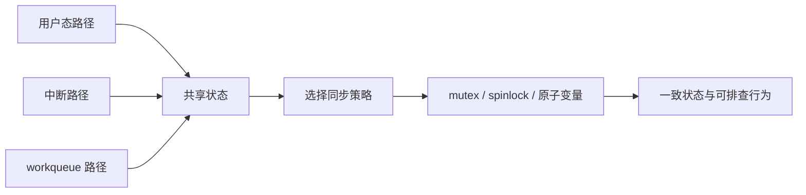

# 驱动中的并发控制与问题排查

## 前言

**C：** 很多驱动代码看起来逻辑不复杂，但一旦进入真实运行环境，就会出现一些特别让人头疼的问题：偶发崩溃、日志顺序错乱、设备状态莫名其妙、同样的测试有时通过有时失败。这类问题里，有相当一部分并不是“业务逻辑写错了”，而是并发没有处理好。驱动里的并发来源比普通应用更多，也更隐蔽，所以这一篇我们专门把并发控制和排查思路单独讲清楚。

<!-- more -->

## 并发来源与保护思路图



## 驱动里的并发从哪里来

很多人一说并发，第一反应就是多线程。  
但在驱动里，并发来源远不止这一种。

常见来源包括：

- 多个用户进程同时打开并访问同一个设备
- 同一个进程的多个线程并发调用 `read` / `write` / `ioctl`
- 中断上下文和进程上下文同时访问同一份状态
- 工作队列和用户态路径同时修改共享数据

所以驱动里的并发问题，本质上是在问：

**同一份共享状态，会不会在多个执行上下文里被同时访问？**

## 共享状态是并发问题的核心

先不要急着上锁，先学会找共享状态。  
例如一个字符设备驱动里，常见共享状态可能有：

- 设备缓冲区
- 当前数据长度
- 设备开关状态
- 统计计数
- 环形队列读写指针

如果这些变量可能被不同路径同时读写，那就要认真考虑同步问题。

## 为什么“看起来没问题”不等于真的没问题

并发 bug 最讨厌的地方就在于它不稳定。

有时你跑 100 次都没问题，第 101 次突然挂掉；有时在单核或低负载环境中几乎看不出异常，但到真机、多核、高频中断环境里就开始暴露。

所以驱动里的并发不能靠“我试了几次没复现”来证明正确，而要靠：

- 共享状态识别
- 上下文分析
- 正确的同步手段

## `mutex` 适合什么场景

`mutex` 最适合保护**进程上下文里的共享资源**。  
例如一个字符设备的 `read` / `write` / `ioctl` 都可能访问同一块缓冲区，这时用 `mutex` 就很自然。

一个简单示例：

```c
static DEFINE_MUTEX(ez_lock);
static char ez_buf[256];
static size_t ez_len;

static ssize_t ez_write(struct file *filp, const char __user *buf,
			size_t count, loff_t *ppos)
{
	size_t to_copy;

	mutex_lock(&ez_lock);

	to_copy = min(count, (size_t)255);
	if (copy_from_user(ez_buf, buf, to_copy)) {
		mutex_unlock(&ez_lock);
		return -EFAULT;
	}

	ez_buf[to_copy] = '\0';
	ez_len = to_copy;

	mutex_unlock(&ez_lock);
	return to_copy;
}
```

在这个场景里，`mutex` 的意义很明确：

- 保证同一时刻只有一个执行路径修改缓冲区
- 避免数据长度和缓冲区内容不一致

## `spinlock` 适合什么场景

当共享状态会在**中断上下文**里被访问时，情况就不一样了。  
因为中断上下文限制很多，不适合直接用 `mutex`。

这时更常见的思路是使用自旋锁 `spinlock`。

一个简化示例：

```c
static spinlock_t ez_lock;
static int irq_count;

static irqreturn_t ez_irq_handler(int irq, void *dev_id)
{
	unsigned long flags;

	spin_lock_irqsave(&ez_lock, flags);
	irq_count++;
	spin_unlock_irqrestore(&ez_lock, flags);

	return IRQ_HANDLED;
}
```

这段代码表达的是：

- 这份状态可能被中断路径修改
- 临界区很短
- 需要用更适合该上下文的同步手段

## 怎么选 `mutex` 还是 `spinlock`

可以先记一条非常实用的粗粒度规则：

- **进程上下文、可能睡眠的路径**：优先考虑 `mutex`
- **中断上下文或极短临界区**：优先考虑 `spinlock`

当然，真实驱动会更复杂，但对入门者来说，这条规则已经非常有帮助。

## 不要一上来就“全局大锁”

新手常见做法是：  
“反正怕乱，那我就拿一把大锁把所有逻辑都包起来。”

这在短期内有时确实能挡住一些问题，但副作用也很明显：

- 锁范围太大，性能差
- 逻辑耦合度上升
- 更难分析哪部分状态真正需要保护
- 一不小心还会引出死锁

更稳妥的方式是：

1. 先识别共享状态
2. 再决定锁保护哪些数据
3. 尽量让临界区保持短小明确

## 一个典型竞态场景

假设驱动里有两个路径：

- 用户态 `write` 正在更新缓冲区
- 工作队列正在读取同一块缓冲区准备做后续处理

如果没有同步，可能出现这种情况：

1. `write` 刚写了一半
2. workqueue 就开始读取
3. 最终拿到的是一份“半旧半新”的数据

这类问题往往不会直接编译报错，但会让行为变得非常诡异。

## 排查并发问题的一个实用套路

### 第一步：先列出共享状态

不要一上来怀疑所有代码。  
先把共享状态列出来，例如：

- 哪些全局变量被多个路径访问
- 哪些设备私有结构会被中断和用户态同时碰到

### 第二步：标出访问路径

对每一份共享状态，问自己：

- 谁会读它
- 谁会写它
- 这些访问是否可能同时发生

### 第三步：观察日志和触发条件

并发问题通常和时序相关，所以日志非常重要。  
建议在关键位置打印：

- 当前路径是什么
- 是否拿到锁
- 当前状态值是多少

例如：

```c
pr_info("ezdrv: before write, len=%zu\n", ez_len);
```

### 第四步：缩小复现条件

如果问题只在高频场景出现，就要尽量做出更接近真实的压力测试，例如：

- 多开几个线程同时读写设备
- 高频触发某个 `ioctl`
- 反复 open/close

## 一个简单的用户态压力测试思路

可以先写个很粗粒度的多进程 / 多线程测试，不求复杂，但能帮助你观察竞态：

```bash
for i in $(seq 1 20); do
  echo "worker-$i" > /dev/ezpipe &
done
wait
```

或者用多线程程序同时 `write` 和 `ioctl`。  
只要共享状态保护得不好，这类测试就更容易把问题放大出来。

## x86 学习环境里的一个误区

在低负载、低频率、单用户测试环境里，很多并发问题根本不会暴露。  
所以你可能会产生错觉：

“我跑了几次都没出问题，说明没事。”

这其实很危险。  
真实板级环境里，中断更频繁、并发更激烈、时序更复杂，问题往往才会真正显现出来。

因此在驱动开发里，**正确性优先于侥幸**。

## 验证步骤

你可以用下面这套思路给自己的驱动做一次并发体检：

1. 列出驱动里的共享状态
2. 对每份共享状态标明访问上下文
3. 检查是否有对应同步手段
4. 做一次简单压力测试，例如：

```bash
for i in $(seq 1 10); do
  ./user_ezpipe &
done
wait
```

5. 观察日志，确认没有明显错乱、崩溃或异常返回

## 常见问题

### 为什么我加了锁还是偶发异常

可能的原因包括：

- 锁保护范围不对
- 并不是所有访问路径都加了锁
- 有的共享状态在中断上下文访问，但你用了不合适的锁
- 生命周期管理有问题，例如对象已释放但仍被后台路径访问

### 一个驱动里能同时出现 `mutex` 和 `spinlock` 吗

完全可能。  
不同共享状态、不同上下文，可能对应不同同步策略。关键不在于“锁越少越高级”，而在于“你是否清楚每把锁在保护什么”。

### 怎么判断问题是不是并发导致的

如果问题具有这些特征，就要高度怀疑并发：

- 偶发
- 难稳定复现
- 加日志后现象变化
- 压力越大越容易出问题

## 小结

驱动里的并发问题，核心不在于你会多少种锁，而在于你是否能先识别共享状态，再根据上下文选择合适的同步方式。对于入门阶段来说，只要先把 **“共享状态 -> 访问路径 -> 选锁保护”** 这条思路建立起来，就已经跨过了并发问题里最重要的一道门槛。
