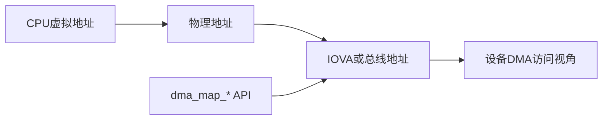

# DMA基础、物理地址、虚拟地址与总线地址

## 前言

**C：** 很多驱动“能跑”却跑不稳，根源不是寄存器写错，而是**地址和所有权理解错了**。CPU 看到的是虚拟地址，设备发起 DMA 时看到的是总线地址；加上 IOMMU、cache、一致性域这些概念后，初学者很容易把“能解引用的地址”和“设备能访问的地址”混为一谈。本篇不谈花哨优化，先把 DMA 世界里最容易搞错的几类地址和基本映射链路讲清楚。

<!-- more -->

## 一图看懂 DMA 地址链路



## 为什么“拿到指针”不等于“设备可访问”

在用户态和普通内核代码里，我们习惯了“有指针就能访问”。  
但 DMA 的参与者有两个：

- CPU
- 外设或 DMA 控制器

CPU 和设备看到的地址空间未必相同。于是驱动要先回答两个问题：

1. CPU 现在手里的地址是什么类型？
2. 设备真正要被配置进去的地址又是什么？

如果这两件事没分清，常见结果就是：

- 设备搬运到错误地址
- DMA 超时
- 数据看起来偶尔正确、偶尔损坏
- 只在某些平台或某些内核配置下出问题

## 四类最常见的地址

### CPU 虚拟地址

这是驱动最常接触到的地址类型。  
例如 `kmalloc()`、`kzalloc()` 返回的指针，就是 CPU 可以直接解引用的内核虚拟地址。

### 物理地址

物理地址表示真实内存位置，但**并不意味着设备一定直接使用它**。  
在没有 IOMMU、总线映射关系简单的平台上，物理地址和设备看到的地址可能接近；但这并不是通用前提。

### 总线地址或 DMA 地址

这是最关键的一类。  
设备寄存器里真正要写进去的，通常是驱动通过 DMA API 拿到的地址，例如：

```c
dma_addr_t dma_handle;
```

它不是普通指针，不能拿来给 CPU 解引用；但设备会用它发起 DMA。

### IOVA

启用 IOMMU 时，设备看到的往往不是物理地址，而是 IOVA。  
IOMMU 会把设备发出的 IOVA 再翻译成实际物理页。

所以你可以把 IOVA 理解为：

- 对 CPU 而言，它不是普通虚拟地址
- 对设备而言，它像“设备侧的虚拟地址”

## Linux 驱动里正确的思路

驱动不应该自己推导“设备该用哪个地址”，而应该通过 DMA API 取得。

最基本的两类入口是：

- `dma_alloc_coherent()`：分配一块 CPU/设备都能使用的一致性内存
- `dma_map_single()` / `dma_map_sg()`：把已有 CPU 缓冲区映射给设备

这就是为什么成熟驱动很少直接把“物理地址换算”硬编码进去。  
真正可移植的写法，是让架构层和 DMA 层替你处理平台差异。

## 最小链路：分配、映射、下发、完成、解绑

一个典型 DMA 生命周期大致如下：

1. 驱动准备缓冲区
2. 调用 DMA API 获取 `dma_addr_t`
3. 把 DMA 地址写入设备描述符或寄存器
4. 设备搬运数据
5. 传输完成后，驱动做同步或解绑

如果是 streaming DMA，最后通常还要执行：

- `dma_unmap_single()`
- 或 `dma_unmap_sg()`

这不是礼节问题，而是资源生命周期的一部分。

## `dma_alloc_coherent()` 适合什么

它最适合长期存在、频繁被设备访问、对一致性要求明确的内存，例如：

- 描述符环
- 命令队列
- 控制结构

它的典型特点是：

- CPU 能直接访问
- 设备也能稳定访问
- 通常省去手工 cache 同步的复杂度

但代价也可能包括：

- 分配成本更高
- 内存属性受平台约束
- 不适合所有大吞吐数据路径

## `dma_map_single()` 适合什么

如果驱动已有一块普通缓冲区，只想在某次传输中临时交给设备使用，常见做法是：

```c
dma_addr_t dma = dma_map_single(dev, buf, len, DMA_TO_DEVICE);
```

然后在传输完成后解除映射：

```c
dma_unmap_single(dev, dma, len, DMA_TO_DEVICE);
```

这种模式非常适合：

- 一次性命令缓冲
- 网络包
- 块层请求中的数据页

它强调的是“映射生命周期”，不是“永久共享一块内存”。

## 一个新手最常犯的 5 个错误

1. 把 `virt_to_phys()` 当成通用 DMA 方案。  
   在启用 IOMMU 或复杂互连的平台上，这种做法很脆弱。
2. 认为 `dma_addr_t` 可以直接当指针使用。  
   设备地址和 CPU 可解引用地址不是一回事。
3. 忘记 `unmap`。  
   某些平台上这会导致 IOMMU 映射泄漏或后续同步异常。
4. 没区分 `DMA_TO_DEVICE`、`DMA_FROM_DEVICE`、`DMA_BIDIRECTIONAL`。  
   方向不仅是语义，也影响缓存同步和架构实现。
5. 只在 x86 上验证。  
   很多 DMA 错误在 cache 不一致平台、ARM SoC、IOMMU 打开后才暴露。

## 工程判断：什么时候要先怀疑 DMA

如果你遇到下面这类症状，应该优先排查 DMA 链路：

- 设备收发数据长度对，但内容错
- 高负载下偶发校验失败
- 仅在某个平台或打开 SMMU/IOMMU 后失效
- 关闭 cache、缩小并发后问题概率下降
- 日志提示 DMA mapping error 或 IOMMU fault

## 建议建立的思维模型

高级驱动工程师看 DMA，不应该只记 API 名字，而应该脑中始终有这条链：

- CPU 正在访问谁
- 设备将要访问谁
- 当前缓冲区由谁拥有
- 映射是否仍然有效
- cache / IOMMU / 方向信息是否匹配

只要这个模型清楚，后面的 coherent、streaming、SG、IOMMU 都会变成同一套问题的展开。

::: tip 配套阅读
下一篇会继续讲最容易踩坑的 cache 一致性和 streaming/coherent DMA 区别；如果你准备做示例实验，可同时对照 `examples/linuxdev/03-dma-mapping-skeleton/`。
:::
