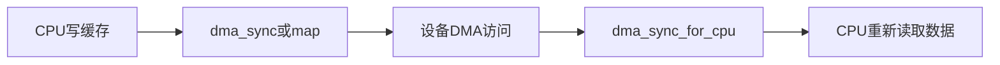

# cache一致性、streamingDMA与coherentDMA

## 前言

**C：** DMA 问题里最折磨人的一类，不是“完全不工作”，而是“偶尔不对”。同样一段驱动，在 x86 上总是正常，换到 ARM SoC、非一致性 cache 平台或高负载场景就开始出错，这类现象背后往往都绕不开一个词：**一致性**。本篇专门解释为什么 CPU 和设备明明操作的是“同一块数据”，却可能看到不同内容，以及 `streaming DMA` 和 `coherent DMA` 到底该怎么选。

<!-- more -->

## 一图看懂所有权切换

## 为什么会有 cache 一致性问题

CPU 访问内存时，很多数据先进入 cache，而不是立刻写回主存。  
设备做 DMA 时，通常并不会去看 CPU cache，它看的是内存系统里设备侧可见的数据。

于是就会出现两种经典不一致：

- CPU 新写的数据还在 cache 里，设备却读到旧内容
- 设备已经把新数据写回内存，但 CPU 还在 cache 里读旧值

所以 DMA 场景的关键，不只是“地址对不对”，还包括：

- 当前由谁拥有这块缓冲区
- 数据是否已经同步到对方可见的层次

## coherent DMA 不是“更高级”，而是“更省心”

`dma_alloc_coherent()` 分配的内存，目标是让 CPU 和设备在一致性语义上更容易协同。  
它最适合放：

- 描述符
- doorbell / 控制块
- 设备状态结构

因为这些数据通常：

- 生命周期长
- 结构固定
- 经常被 CPU 和设备共同观察

这类内存的好处是心智负担低，但不是没有代价：

- 不一定适合大块流式数据
- 在某些平台上分配成本与内存属性更特殊
- 不能因此忽略屏障、顺序和所有权问题

## streaming DMA 更强调“阶段性所有权”

如果你是把一块普通缓冲区临时交给设备，本质上是在做一次“阶段性交接”。  
典型 API 是：

- `dma_map_single()`
- `dma_unmap_single()`
- `dma_map_sg()`
- `dma_unmap_sg()`

此时驱动必须想清楚：

- 这块缓冲区现在归 CPU 还是归设备？
- 设备完成前，CPU 是否还会读写它？
- 完成后是否做了正确同步？

所以 streaming DMA 的难点不在 API 数量，而在**所有权管理**。

## `DMA_TO_DEVICE`、`DMA_FROM_DEVICE`、`DMA_BIDIRECTIONAL` 不能乱填

方向参数不是装饰，它会影响：

- cache 维护行为
- DMA 同步策略
- 架构层优化路径

一个实用判断方式：

- `DMA_TO_DEVICE`：CPU 先写，设备后读
- `DMA_FROM_DEVICE`：设备先写，CPU 后读
- `DMA_BIDIRECTIONAL`：双向共享，最保守，也通常最贵

如果方向写错，很多平台不会立即报错，但数据一致性会变得不可预测。

## 常见同步接口怎么理解

对于 streaming DMA，常见同步接口包括：

- `dma_sync_single_for_device()`
- `dma_sync_single_for_cpu()`
- `dma_sync_sg_for_device()`
- `dma_sync_sg_for_cpu()`

可以把它们理解成：

- `for_device`：把缓冲区交回给设备之前，保证设备看到的是新数据
- `for_cpu`：设备写完后，把所有权切回 CPU，保证 CPU 读到的是新数据

高级工程师在看代码时，最关心的是：  
**同步调用是否出现在所有权切换边界，而不是仅仅“有没有调用过”。**

## 一个典型错误场景

例如 RX 路径里：

1. 驱动准备接收缓冲区并映射给设备
2. 设备写入数据
3. 中断到来
4. 驱动直接从 CPU 指针读取内容

如果设备写完后没有把缓冲区同步回 CPU 可见状态，那么驱动看到的就可能是旧缓存。  
这类 bug 特征通常是：

- 抓包长度正常但 payload 偶发错误
- 校验和偶发失败
- 压力越大越容易复现

## x86 正常不代表代码正确

x86 平台的一致性模型往往更“宽容”，很多写法即使不严谨，也不容易立刻暴露。  
但下面这些环境会放大问题：

- ARM/ARM64 非完全一致性平台
- 打开 IOMMU/SMMU
- 大量并发 DMA
- 多队列 / 多核处理

所以真正成熟的驱动，不依赖“在某台开发机上碰巧没事”。

## 工程实践中的取舍建议

### 描述符和控制结构

优先考虑 coherent DMA。  
原因是它们体积通常不大，但很依赖稳定、一致的可见性。

### 大块数据缓冲

优先考虑 streaming DMA。  
因为这类数据更像“生产一次、消费一次”的流量模型，适合按传输批次管理生命周期。

### 极端高性能路径

要把注意力从“单个 API”提升到“缓冲池、批量同步、队列深度、cache 命中和 NUMA 拓扑”的整体设计上。

## 排查这类问题的实用顺序

1. 先确认方向参数是否正确
2. 再确认 map / sync / unmap 的生命周期是否闭合
3. 再确认 CPU 是否在设备拥有期间偷读偷写缓冲区
4. 最后才去怀疑硬件或总线本身

这套顺序很重要，因为绝大多数“一致性问题”其实都不是硬件坏了，而是软件交接时机错了。

## 一句经验总结

`coherent DMA` 解决的是“共享结构的一致可见性成本”，  
`streaming DMA` 解决的是“临时数据搬运的生命周期管理”。  
两者没有绝对高下，核心是：你的数据是长期共享，还是阶段性交接。
