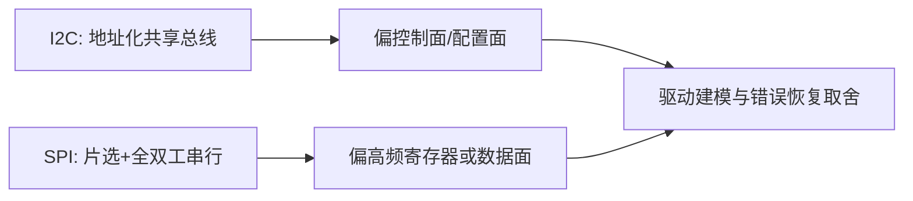

# I2C与SPI驱动设计对比

## 前言

**C：** 很多驱动工程师在刚接触总线驱动时，会把 I2C 和 SPI 都理解成“不过是换了几套 API 的串行外设”。这种理解在入门阶段够用，但一旦走到量产、调试和性能优化阶段，就会发现两者在吞吐、时序、寄存器访问组织方式、错误恢复和设备建模上的差异很大。本篇不讲“怎么把一个 demo 跑起来”，而是讲 I2C/SPI 在驱动设计上的核心差别。

<!-- more -->

## 一图看两类总线的关注点

## 从硬件模型开始就不一样

I2C 的关键特点是：

- 总线上可以挂很多从设备
- 通过从地址区分目标
- 总线速率通常较低
- 读写经常围绕寄存器地址展开

SPI 的关键特点是：

- 常见是一主多从，通过片选区分设备
- 时钟更高，吞吐更强
- 没有 I2C 那种统一“地址帧”语义
- 很多设备会把“命令 + 地址 + 数据”组织成一帧

这意味着：  
**I2C 更像共享控制总线，SPI 更像高性能串行设备接口。**

## 驱动层的第一处差异：设备发现方式

I2C/SPI 都可以通过设备树或板级描述创建，但驱动思路仍然不完全一样。

I2C 驱动常围绕：

- 设备地址
- 小块寄存器读写
- 设备存在性探测

SPI 驱动更常围绕：

- mode、bits_per_word、max_speed_hz
- 片选时序
- 传输帧组织

因此在 `probe()` 里，I2C 驱动往往先验证芯片 ID、寄存器可访问性；SPI 驱动则更常先确认 mode、频率和消息组织是否匹配硬件要求。

## 第二处差异：寄存器访问模型

I2C 设备非常适合抽象成：

- 写寄存器地址
- 再读/写数据

这也是为什么很多 I2C 芯片和 `regmap` 配合得很好。

SPI 设备则更复杂一些，常见情况包括：

- 首字节带读写标志
- 后续若干位是寄存器地址
- 再后面是 payload

所以 SPI 驱动更容易出现“传输格式本身就是协议”的情况。  
高级工程师会更关注：

- 消息如何打包
- 是否支持批量传输
- 是否能减少片选抖动和帧拆分

## 第三处差异：性能预期

I2C 一般不适合做高吞吐数据面。  
它更常见于：

- 传感器配置
- PMIC
- 小量状态读取

SPI 则经常承担：

- 显示控制
- ADC/DAC 数据流
- 高频寄存器访问
- 某些中等吞吐数据通路

因此如果你用 I2C 的思路去写 SPI 驱动，常见问题就是：

- 每次传输太碎
- 不会批量化
- 片选时序组织差
- 明明总线频率高，实际吞吐却很差

## 第四处差异：错误恢复

I2C 常见问题包括：

- 总线忙
- ACK 异常
- 某个从设备异常拉低总线

SPI 常见问题则更多偏：

- 时钟/模式配置错误
- 片选边界不对
- 半双工/全双工理解错
- 控制器 DMA 路径不稳定

所以排障时也要区分：

- I2C 更关注总线状态和寄存器级交互是否成功
- SPI 更关注帧格式、时序和控制器提交链路

## 哪些场景更适合抽成通用框架

I2C/SPI 驱动都不该只停留在“读写寄存器”层面。  
真正成熟的做法是尽快进入更高层框架，例如：

- `hwmon`
- `input`
- `iio`
- `regulator`
- `rtc`

总线只是接入方式，不是驱动最终的业务边界。  
高级工程师越早把“总线接入”和“子系统职责”拆开，后期维护越轻松。

## 一句经验总结

I2C 和 SPI 不是“换个函数名”的关系。  
I2C 更偏共享、低速、寄存器控制面；SPI 更偏高频、帧组织、时序和吞吐。驱动设计如果不从硬件模型出发，后面性能和稳定性问题会层出不穷。
