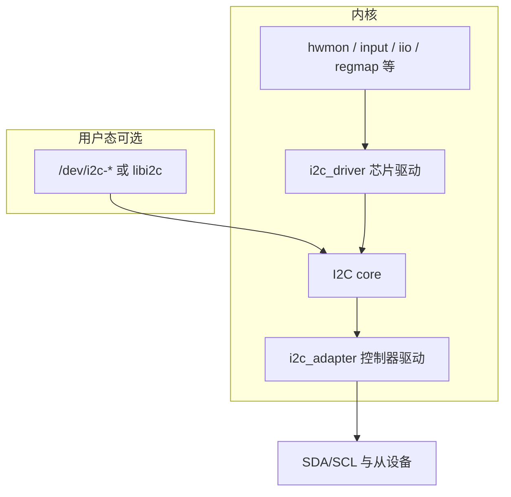
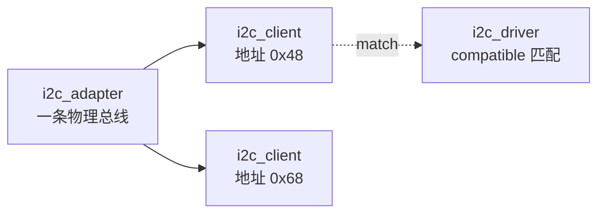
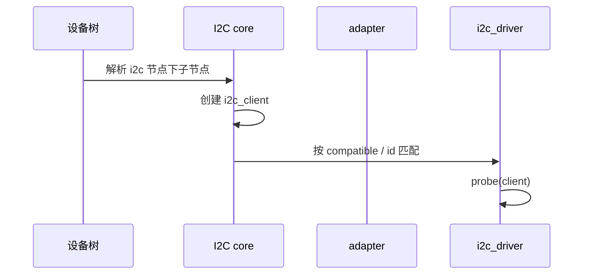

## 前言

**C：** I2C 在嵌入式里极其常见，但“能读写寄存器”和“写对一份 I2C 驱动”不是一回事。本篇从 Linux I2C 子系统的**对象模型、匹配路径、典型传输入口、与 regmap 协作**做更细的分析，并配上**示意源码与框图**，便于你对照内核文档与真实驱动阅读。

<!-- more -->

::: tip 关于文中源码
下列片段为**教学向骨架**：结构、字段名与常见写法与主线内核一致，但省略错误处理、PM、并发等生产细节；具体 API 请以你使用的 `Documentation/devicetree` 与内核版本为准。
:::

## 1. 总览：I2C 在驱动栈里的位置



**三类对象（务必分清）：**

| 对象 | 谁实现 | 职责 |
| --- | --- | --- |
| `i2c_adapter` | SoC I2C 控制器驱动 | 产生时钟、仲裁、执行 `master_xfer` |
| `i2c_client` | 内核根据 DT/ACPI 或板码创建 | 表示总线上的一个从设备实例（含地址） |
| `i2c_driver` | 你写的芯片驱动 | `probe(client)` 里初始化芯片、注册上层子系统 |

## 2. 对象关系框图



一条 `adapter` 上可挂多个 `client`；每个 `client` 可被独立的 `i2c_driver` 匹配（地址与 `compatible` 等由子系统与 DT 决定）。

## 3. 从设备树到 `probe`：匹配时序（示意）



**Bring-up 检查清单：**

- 子节点是否挂在**正确的** `i2c@...` 控制器下（parent 即 adapter）。
- `reg = <0x48>` 等是否为 **7-bit 地址**（Linux DT 惯例；若手册给 8-bit 写地址，需换算）。
- `compatible` 是否与驱动里 `of_match_table` 字符串**完全一致**（大小写敏感）。

## 4. 设备树片段示例

```txt
&i2c1 {
    clock-frequency = <400000>;
    status = "okay";

    sensor@48 {
        compatible = "vendor,foo-sensor";
        reg = <0x48>;
        interrupt-parent = <&gpio0>;
        interrupts = <12 IRQ_TYPE_LEVEL_LOW>;
    };
};
```

## 5. `i2c_driver` 骨架：匹配 + `probe`

下面展示最常见的 **设备树匹配** + **在 probe 里读芯片 ID** 的模式（简化）。

```c
#include <linux/i2c.h>
#include <linux/module.h>
#include <linux/of.h>

struct foo_data {
    struct i2c_client *client;
    /* 设备私有状态 */
};

static int foo_probe(struct i2c_client *client,
             const struct i2c_device_id *id)
{
    struct foo_data *priv;
    u8 buf[2];
    int ret;

    priv = devm_kzalloc(&client->dev, sizeof(*priv), GFP_KERNEL);
    if (!priv)
        return -ENOMEM;
    priv->client = client;
    i2c_set_clientdata(client, priv);

    /* 示例：读 16bit 芯片 ID，寄存器地址假定为 0x00 */
    buf[0] = 0x00;
    ret = i2c_master_send(client, buf, 1);
    if (ret < 0)
        return ret;
    ret = i2c_master_recv(client, buf, 2);
    if (ret < 0)
        return ret;

    dev_info(&client->dev, "chip id %02x%02x\n", buf[0], buf[1]);
    return 0;
}

static void foo_remove(struct i2c_client *client)
{
    /* devm_* 自动释放为主；此处可停轮询、注销子系统 */
}

static const struct of_device_id foo_of_match[] = {
    { .compatible = "vendor,foo-sensor" },
    { }
};
MODULE_DEVICE_TABLE(of, foo_of_match);

static struct i2c_driver foo_driver = {
    .driver = {
        .name = "foo-sensor",
        .of_match_table = foo_of_match,
    },
    .probe = foo_probe,
    .remove = foo_remove,
};
module_i2c_driver(foo_driver);

MODULE_LICENSE("GPL");
```

要点：

- `module_i2c_driver()` 等价于注册 `module_init` / `module_exit`，减少样板代码。
- `i2c_set_clientdata` / `i2c_get_clientdata` 用于在 `client` 上挂私有数据。

## 6. 传输方式：`i2c_master_*` 与 `i2c_transfer`

### 6.1 简单场景

- **`i2c_master_send` / `i2c_master_recv`**：适合已经拆好的单段写/读。
- 很多传感器需要先**写寄存器地址**再**读数据**，手册往往要求**一次事务内**的 STOP/RESTART 行为明确——这时更推荐 `i2c_transfer`。

### 6.2 `i2c_transfer`：写寄存器地址 + 读数据（两段消息）

典型 **写 1 字节寄存器地址，再读 N 字节**，第二段带 `I2C_M_RD`；是否在中间发 **Repeated Start** 由控制器与 `flags` 组合实现，需与芯片手册一致。

```c
static int foo_read_regs(struct i2c_client *client, u8 reg, u8 *buf, u8 len)
{
    struct i2c_msg msgs[2];
    u8 wbuf[1] = { reg };

    msgs[0].addr = client->addr;
    msgs[0].flags = 0; /* write */
    msgs[0].len = 1;
    msgs[0].buf = wbuf;

    msgs[1].addr = client->addr;
    msgs[1].flags = I2C_M_RD;
    msgs[1].len = len;
    msgs[1].buf = buf;

    return i2c_transfer(client->adapter, msgs, 2);
}
```

若返回 `< 0` 为错误；返回 `2` 表示两条消息都完成（具体语义可查 `i2c_transfer` 文档）。

## 7. 与 `regmap` 协作（示意）

寄存器多、位域多、需要 cache 或 debugfs 时，可用 **`devm_regmap_init_i2c()`** 把“字节级 I2C 事务”收敛成 regmap 的 `read/write/update_bits`。

```c
#include <linux/regmap.h>

static const struct regmap_config foo_regmap_cfg = {
    .reg_bits = 8,
    .val_bits = 8,
    .max_register = 0xff,
};

static int foo_probe_regmap(struct i2c_client *client)
{
    struct regmap *map;

    map = devm_regmap_init_i2c(client, &foo_regmap_cfg);
    if (IS_ERR(map))
        return PTR_ERR(map);

    return regmap_write(map, 0x10, 0xab);
}
```

**收益：** PM 前后批量恢复、统一 debug、减少手写 `i2c_transfer` 重复代码。

## 8. 常见故障与排查顺序

1. **`probe` 不进**：DT parent、`compatible`、`status`、adapter 是否已 `probe` 完成。  
2. **`-EREMOTEIO` / 无 ACK**：示波器看 SDA/SCL；核对 7-bit 地址；上拉、速率、线长。  
3. **偶发错数据**：多主冲突、ISR 与用户路径并发（需互斥）、控制器 DMA 路径与 cache（视平台而定）。

## 延伸阅读

同子目录下已拆成多篇，可按需深入：

- [I2C适配器与控制器驱动主线](/courses/linuxdev/06-总线与典型子系统/i2c/02-I2C适配器与控制器驱动主线)
- [I2C传输时序与错误处理-SMBus与总线恢复](/courses/linuxdev/06-总线与典型子系统/i2c/03-I2C传输时序与错误处理-SMBus与总线恢复)
- [I2C设备树与调试实践](/courses/linuxdev/06-总线与典型子系统/i2c/04-I2C设备树与调试实践)

更偏 I2C 与 SPI **选型与数据面对比** 见同组根目录对比篇。

::: tip 同组文章
[I2C与SPI驱动设计对比](/courses/linuxdev/06-总线与典型子系统/01-I2C与SPI驱动设计对比)
:::
