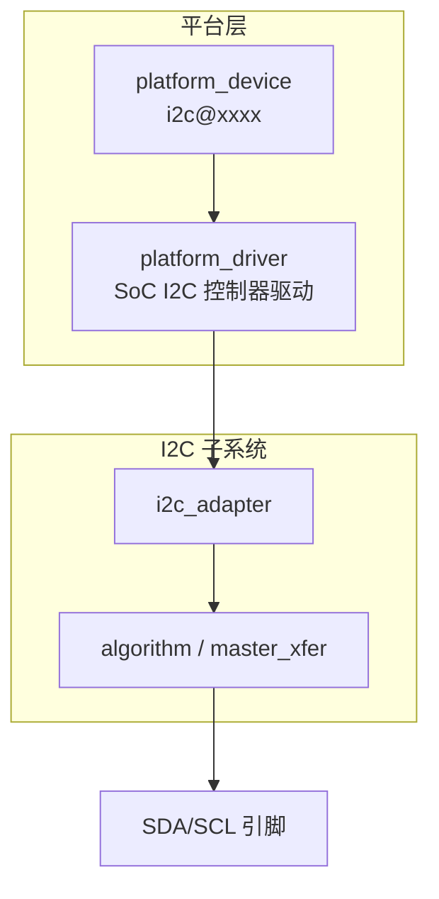
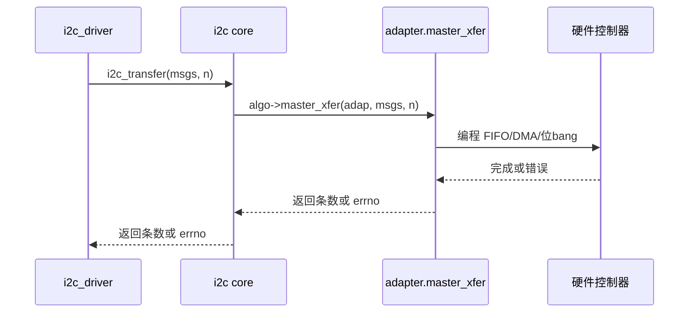

## 前言

**C：** 很多教程只讲 `i2c_driver` 和从设备，但一条总线要能工作，前提是 **`i2c_adapter`（控制器）** 已经正确注册并能执行 `master_xfer`。本篇从**适配器生命周期、与 platform/DT 的关系、一次传输在内核里如何落到硬件**这条线展开，便于你读 SoC 官方 I2C 驱动或自己排查“总线根本不动”的问题。

<!-- more -->

::: tip 阅读顺序
建议先读完 [I2C子系统与设备驱动要点](/courses/linuxdev/06-总线与典型子系统/i2c/01-I2C子系统与设备驱动要点)，再读本篇。
:::

## 1. 适配器在整体结构中的位置



控制器驱动通常仍是 **platform_driver**（或 ACPI/OF 平台设备），在 `probe` 里完成时钟、复位、引脚、中断初始化后，向 I2C 核心 **注册 `i2c_adapter`**。

## 2. `i2c_adapter` 上你最该关心的成员（概念）

不同内核版本结构体字段会有演进，但心智模型稳定：

| 概念 | 含义 |
| --- | --- |
| `nr` | 适配器编号，常影响用户态 `/dev/i2c-N` 中的 `N` |
| `algo` / `master_xfer` | 真正执行位时序、发 START/STOP、读写缓冲 |
| `timeout` / 锁 | 总线仲裁、多主或长事务时的保护 |
| `dev` | 与电源域、DMA、debugfs 绑定的设备模型入口 |

从设备驱动侧一般**不直接改** adapter，只通过 `client->adapter` 间接使用。

## 3. 从 `probe` 到 `i2c_add_adapter`（示意骨架）

下面是与主线风格接近的**极简骨架**（省略 clk/regulator/pinctrl、错误路径、PM）。

```c
#include <linux/i2c.h>
#include <linux/module.h>
#include <linux/platform_device.h>

struct foo_i2c {
    struct i2c_adapter adap;
    void __iomem *base;
};

static int foo_i2c_xfer(struct i2c_adapter *adap, struct i2c_msg *msgs, int num)
{
    /* 这里根据 msgs[] 逐条产生 START、地址字节、读写、ACK、STOP */
    return num;
}

static u32 foo_i2c_func(struct i2c_adapter *adap)
{
    return I2C_FUNC_I2C | I2C_FUNC_SMBUS_BYTE | I2C_FUNC_SMBUS_BYTE_DATA;
}

static const struct i2c_algorithm foo_algo = {
    .master_xfer = foo_i2c_xfer,
    .functionality = foo_i2c_func,
};

static int foo_i2c_probe(struct platform_device *pdev)
{
    struct foo_i2c *priv;

    priv = devm_kzalloc(&pdev->dev, sizeof(*priv), GFP_KERNEL);
    if (!priv)
        return -ENOMEM;

    priv->base = devm_platform_ioremap_resource(pdev, 0);
    if (IS_ERR(priv->base))
        return PTR_ERR(priv->base);

    priv->adap.owner = THIS_MODULE;
    priv->adap.algo = &foo_algo;
    priv->adap.dev.parent = &pdev->dev;
    priv->adap.dev.of_node = pdev->dev.of_node;
    snprintf(priv->adap.name, sizeof(priv->adap.name), "foo-i2c");

    platform_set_drvdata(pdev, priv);
    return i2c_add_adapter(&priv->adap);
}

static void foo_i2c_remove(struct platform_device *pdev)
{
    struct foo_i2c *priv = platform_get_drvdata(pdev);

    if (priv)
        i2c_del_adapter(&priv->adap);
}

static const struct of_device_id foo_i2c_of_match[] = {
    { .compatible = "vendor,foo-i2c" },
    { }
};
MODULE_DEVICE_TABLE(of, foo_i2c_of_match);

static struct platform_driver foo_i2c_driver = {
    .probe = foo_i2c_probe,
    .remove = foo_i2c_remove,
    .driver = {
        .name = "foo-i2c",
        .of_match_table = foo_i2c_of_match,
    },
};
module_platform_driver(foo_i2c_driver);

MODULE_LICENSE("GPL");
```

要点：

- **`i2c_algorithm.master_xfer`** 返回成功传输的 **message 条数**，失败返回负 errno。
- **`functionality`** 告诉子系统本控制器支持哪些协议能力（是否可做 SMBus 快速命令等）。

## 4. 设备树里总线节点与子设备的关系

控制器节点（示例形态）：

```txt
i2c1: i2c@400a0000 {
    compatible = "vendor,foo-i2c";
    reg = <0x400a0000 0x1000>;
    interrupts = <GIC_SPI 42 IRQ_TYPE_LEVEL_HIGH>;
    clocks = <&clk I2C1_CLK>;
    clock-frequency = <400000>;
    #address-cells = <1>;
    #size-cells = <0>;
    status = "okay";

    sensor@48 { /* ... */ };
};
```

- **`clock-frequency`**：给子系统/控制器驱动作为默认总线速率参考（具体是否严格生效看 binding 与驱动实现）。
- **`#address-cells = <1>; #size-cells = <0>;`**：声明子节点是 **I2C 从设备**，`reg` 为从地址。

## 5. 一条 `i2c_transfer` 如何落到 `master_xfer`



所以从设备驱动里看到的 `-EREMOTEIO`，往往是在 **`master_xfer` 层**没有收到有效 ACK 或控制器报错，不一定是你的 `probe` 写错了。

## 6. 与从设备驱动的分工边界

| 层级 | 典型职责 |
| --- | --- |
| 控制器驱动 | 时钟、复位、引脚、中断、DMA、寄存器时序、总线恢复（若支持） |
| 从设备驱动 | 芯片寄存器协议、业务状态机、与 regmap/子系统对接 |

Bring-up 时若 **所有从设备都无 ACK**，优先怀疑控制器与板级；若 **只有一个地址不通**，再怀疑该芯片与地址。

::: tip 下一篇
传输标志、SMBus、PEC、总线恢复与常见 errno 见 [I2C传输时序与错误处理-SMBus与总线恢复](/courses/linuxdev/06-总线与典型子系统/i2c/03-I2C传输时序与错误处理-SMBus与总线恢复)。
:::
