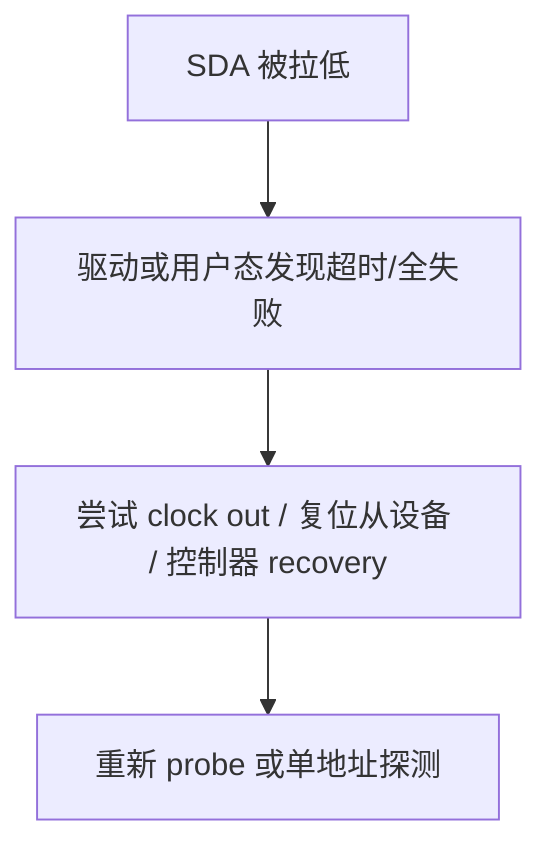

## 前言

**C：** 真正写 I2C 驱动时，大量时间花在：**消息该怎么拆**、**flags 怎么设**、**出错返回什么**、**要不要走 SMBus 辅助路径**、以及 **SDA 被拉死怎么救**。本篇把这些从“能编译”提升到“能在现场排障”的细节讲清楚，并配示意代码与流程图。

<!-- more -->

## 1. `i2c_msg` 与一次事务的边界


- **`I2C_M_RD`**：该条 `i2c_msg` 为读；否则为写。
- **`I2C_M_TEN`**：10-bit 从地址（少数芯片/场景）。
- **`I2C_M_RECV_LEN`**：与 SMBus 块读等机制相关（使用需对照内核文档与设备能力）。
- **`I2C_M_NO_RD_ACK`**：读时最后一字节不发送 NACK（特殊设备时序）。

**Repeated Start** 是否出现在两段 msg 之间，由控制器与 `i2c_transfer` 实现共同决定；**芯片手册若要求“写寄存器地址后必须紧接读且中间不能 STOP”**，你必须用 **两条 msg** 或等价的组合，而不能想当然拆成两次独立 `i2c_master_send/recv`（除非你能证明中间 STOP 被设备接受）。

## 2. 写寄存器再读：典型两段消息（复习）

```c
static int chip_read(struct i2c_client *client, u8 reg, u8 *buf, size_t len)
{
    struct i2c_msg msgs[2];
    u8 w = reg;

    msgs[0].addr = client->addr;
    msgs[0].flags = 0;
    msgs[0].len = 1;
    msgs[0].buf = &w;

    msgs[1].addr = client->addr;
    msgs[1].flags = I2C_M_RD;
    msgs[1].len = len;
    msgs[1].buf = buf;

    return i2c_transfer(client->adapter, msgs, 2) == 2 ? 0 : -EIO;
}
```

## 3. SMBus 辅助函数：何时用

内核提供 `i2c_smbus_read_byte_data()`、`i2c_smbus_write_byte_data()`、`i2c_smbus_read_word_data()` 等封装。

适用场景：

- 设备协议**就是** SMBus 寄存器模型（尤其 PMIC、部分传感器）。
- 单字节/字读写足够，不需要自定义帧格式。

不适用场景：

- 手册要求 **多字节命令头、特殊间隔、非标准长度**，应使用 **`i2c_transfer`** 精确控制。

可在 `probe` 里读 `i2c_check_functionality(adapter, I2C_FUNC_SMBUS_XXX)` 判断是否可用。

## 4. 常见 errno 与含义（驱动侧视角）

| 返回值 | 常见含义 |
| --- | --- |
| `-EREMOTEIO` | 无 ACK、总线异常、控制器报告 NACK |
| `-EIO` | 控制器或子系统通用 I/O 失败（需结合日志） |
| `-ETIMEDOUT` | 时钟拉伸过长、仲裁等待超时等（视实现） |
| `-EBUSY` | 总线忙、adapter 被占用（多主或锁） |

排障时建议：**打开 I2C 控制器与核心 dynamic_debug**，同时用示波器看 **第 9 个 SCL 周期上的 ACK**。

## 5. 总线恢复（bus recovery）概念

当从设备异常把 **SDA 拉低** 时，正常 STOP 可能发不出去，表现为整根总线“死掉”。部分 SoC 驱动支持：

- GPIO bitbang 方式恢复
- 控制器内置 recovery
- 或通过 `i2c_generic_scl_recovery` 等通用路径（取决于内核与驱动是否启用）



**工程现实**：很多现场问题最终靠 **断电/复位从芯片** 解决；内核 recovery 是辅助手段，不能替代硬件设计（上拉电阻、ESD、电源时序）。

## 6. 并发与锁

- 同一 `adapter` 上多 `client` 共享总线，核心路径会序列化 `master_xfer`，但你的驱动若在 **中断里** 与 **进程上下文** 同时访问同一 `client`，仍可能需要用 `mutex` 保护**上层状态**，而不是假设 I2C 核心替你包一切。

## 7. PEC（Packet Error Code）

部分 SMBus 设备支持 PEC。若使用带 PEC 的 API 或协议，需确认：

- 芯片是否真的启用 PEC
- 主机侧是否在每个事务末尾计算/校验 CRC

否则会出现“偶发成功、多数失败”的假象。

::: tip 下一篇
设备树属性、`i2cdetect`、debugfs/sysfs 与常见误判见 [I2C设备树与调试实践](/courses/linuxdev/06-总线与典型子系统/i2c/04-I2C设备树与调试实践)。
:::
