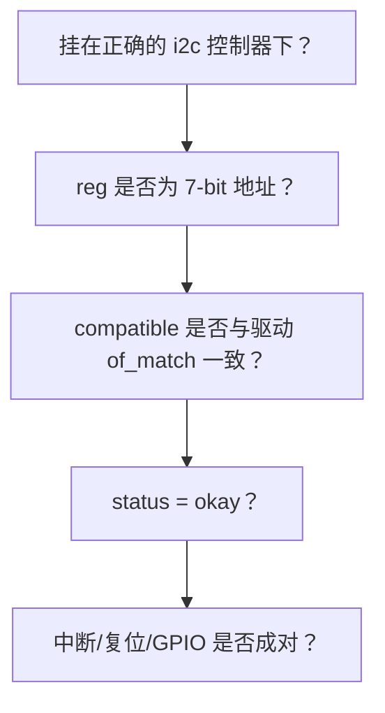

## 前言

**C：** 大量 I2C 问题不是 C 代码写错，而是 **DT 节点挂错总线、地址算错、中断/复位引脚没配对**，或者 **用户态/内核日志误判**。本篇把设备树常见属性、与 `i2c-tools` 的配合、以及内核里常用的观测手段整理成可执行的调试清单。

<!-- more -->

## 1. 从设备节点必备信息（检查清单）



### 1.1 `reg`：7-bit 还是 8-bit？

Linux 设备树里 **`reg` 通常为 7-bit 从地址**（0x08–0x77 有效范围常识）。数据手册常写 **8-bit 写地址**（例如 `0x90`），需右移一位得到 `0x48` 再写入 DT。

### 1.2 `compatible` 与 `of_match_table`

字符串必须**逐字符一致**。常见错误：

- 多写一个逗号、大小写错误、把芯片型号写成评估板名。

### 1.3 可选但高价值属性

- **`reg-names`**：多资源芯片（少见 I2C 从设备，多见于复合 MFD）。
- **`interrupt-parent` / `interrupts`**：若芯片有 ALERT 脚或数据就绪中断。
- **`reset-gpios`**：与 `gpio-reset` binding 配合时，注意有效电平 `GPIO_ACTIVE_LOW`。

## 2. 设备树示例（带注释）

```txt
&i2c2 {
    clock-frequency = <100000>;
    pinctrl-0 = <&pinctrl_i2c2>;
    pinctrl-names = "default";
    status = "okay";

    /* reg = 0x48 表示 7-bit 地址 0x48 */
    temp@48 {
        compatible = "vendor,tmp123";
        reg = <0x48>;
        interrupt-parent = <&gpio1>;
        interrupts = <5 IRQ_TYPE_EDGE_FALLING>;
    };
};
```

若把 `temp@48` 误挂在别的总线节点下，会出现 **`probe` 永远不执行** 或 **地址扫描在错误总线上**。

## 3. 用户态工具：`i2cdetect` / `i2cdump` / `i2cget` / `i2cset`

在启用 `i2c-dev` 后，常见用法：

```bash
# 列出适配器
i2cdetect -l

# 扫描总线 2（注意：部分平台扫描可能干扰设备，量产板谨慎）
i2cdetect -y 2

# 读某地址寄存器 0x00 一字节（模式因芯片而异，先读手册）
i2cget -y 2 0x48 0x00
```

**注意**：

- 扫描对 **睡眠中的设备**、**对时钟敏感的设备** 可能有害，生产环境慎用 `-y` 盲扫。
- 有些设备 **读前必须先写寄存器指针**，直接 `i2cget` 会误导你以为芯片坏了。

## 4. 内核态观测

### 4.1 `dynamic_debug` 打开 I2C 与控制器日志

```bash
# 示例：打开 i2c-core 与某控制器驱动（模块名按实际替换）
echo 'file i2c-core.c +p' | sudo tee /sys/kernel/debug/dynamic_debug/control
```

结合 `dmesg -w` 观察 `i2c_transfer` 失败点。

### 4.2 sysfs

部分驱动会挂出 `sysfs` 属性做校准或固件版本读取；这取决于具体芯片驱动实现，不是 I2C 核心保证的。

## 5. 典型误判与对照

| 现象 | 可能真相 |
| --- | --- |
| `i2cdetect` 看不到设备 | 地址错、设备未上电、SDA/SCL 反接、总线锁死、设备在 sleep |
| 内核 `probe` 进了但读 ID 错 | 字节序、需要先唤醒、需要先写 bank 选择寄存器 |
| 压力测试偶发失败 | 线长/电容过大、缺少锁、DMA 路径（若控制器用 DMA）与 cache |

## 6. 与 `regmap` 同时使用时

若使用 `regmap`，寄存器读写失败要先判断：

- 是 **regmap 层**返回的错误，还是底层 **`i2c_transfer`** 返回的 `-EREMOTEIO`。
- `reg_read`/`reg_write` 是否被 PM 路径 **suspend 后仍调用**。


## 7. 推荐阅读

- 内核 `Documentation/i2c/` 下与 devicetree、instantiating-devices 相关章节（随内核版本路径可能调整）。
- 同组对比文：[I2C与SPI驱动设计对比](/courses/linuxdev/06-总线与典型子系统/01-I2C与SPI驱动设计对比)。

::: tip 同子目录

- [I2C子系统与设备驱动要点](/courses/linuxdev/06-总线与典型子系统/i2c/01-I2C子系统与设备驱动要点)
- [I2C适配器与控制器驱动主线](/courses/linuxdev/06-总线与典型子系统/i2c/02-I2C适配器与控制器驱动主线)
- [I2C传输时序与错误处理-SMBus与总线恢复](/courses/linuxdev/06-总线与典型子系统/i2c/03-I2C传输时序与错误处理-SMBus与总线恢复)
:::
