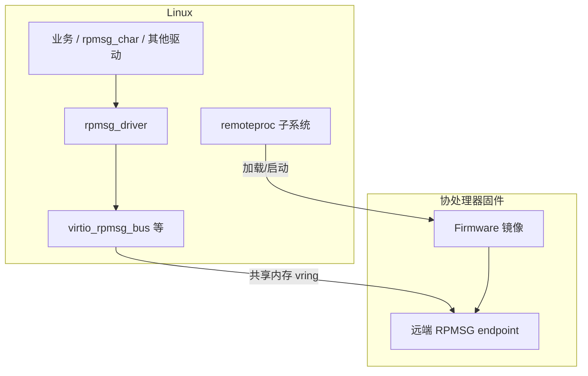
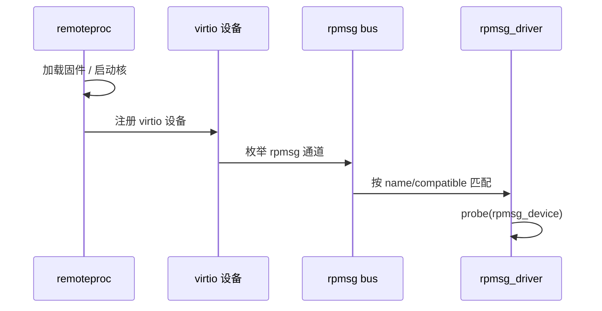
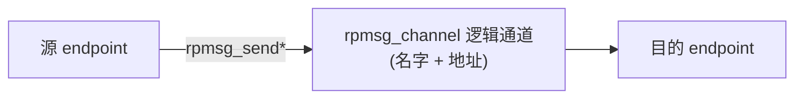

## 前言

**C：** AP 与 MCU/DSP 等协处理器之间常用 **virtio + RPMSG** 传小包消息。本篇是 **RPMSG 专题的入口**：用一张栈图分清 **remoteproc / virtio / RPMSG** 的职责，再给 **生命周期与最小驱动骨架**。更细的内容拆到同目录后续几篇，按下面顺序读即可一次把链路打通。

<!-- more -->

## 本组阅读顺序（建议）

1. **本文**： mental model + 生命周期 + 最小 `rpmsg_driver` 骨架。  
2. [remoteproc 与 RPMSG 衔接——资源表与设备出现时机](/courses/linuxdev/06-总线与典型子系统/rpmsg/02-remoteproc与RPMSG衔接-资源表与设备出现时机)：固件、资源表、virtio 何时出现——**`probe` 不来多半在这里**。  
3. [rpmsg 内核驱动编写——通道名、端点与收发](/courses/linuxdev/06-总线与典型子系统/rpmsg/03-rpmsg内核驱动编写-通道名-端点与收发)：`callback` 约束、发送 API、背压与并发。  
4. [RPMSG 用户态与调试实践](/courses/linuxdev/06-总线与典型子系统/rpmsg/04-RPMSG用户态与调试实践)：`rpmsg_char` 轮廓、内核态暴露接口、分层排障。

::: tip 关于文中源码
RPMSG 与 virtio 环形缓冲区细节高度依赖 **固件资源表、vring 布局与厂商实现**。下文骨架突出 Linux 侧 `rpmsg_driver` 形态；实际通道名、`virtdevice` 数量以你的 DT 与固件为准。
:::

## 1. 软件栈总览（Linux 侧 + 远端）



**分工直觉：**

- **remoteproc**：加载固件、解析资源表、启停远端核、管理关联的 virtio 设备出现时机。  
- **RPMSG**：在 virtio 通道就绪后，提供**命名通道**上的面向消息接口。

## 2. 生命周期：从固件加载到通道 `probe`



若通道一直不出现，排查应同时看：**固件是否跑起来、资源表是否声明了 virtio、通道名是否与驱动一致**。

## 3. 通道与端点（概念框图）



Linux 侧驱动通常关心：**通道名**（字符串匹配）、**收到回调**、**`rpmsg_send` / `rpmsg_sendto` 返回值**（背压与队列满）。

## 4. `rpmsg_driver` 骨架：回调 + 回包

下面是一个最小教学骨架：**收到任意包回显固定长度**（真实项目需定义协议头、校验、版本）。

```c
#include <linux/module.h>
#include <linux/rpmsg.h>

struct baz_rpmsg {
    struct rpmsg_device *rpdev;
};

static int baz_rpmsg_cb(struct rpmsg_device *rpdev, void *data, int len,
            void *priv, u32 src)
{
    /* data/len：对端发来的 payload；src：对端地址（视实现而定） */
    dev_dbg(&rpdev->dev, "rx %d bytes from 0x%x\n", len, src);

    /* 示例：把同样内容发回（生产代码需检查返回值与并发） */
    return rpmsg_send(rpdev, data, len);
}

static int baz_rpmsg_probe(struct rpmsg_device *rpdev)
{
    struct baz_rpmsg *priv;

    priv = devm_kzalloc(&rpdev->dev, sizeof(*priv), GFP_KERNEL);
    if (!priv)
        return -ENOMEM;
    priv->rpdev = rpdev;
    dev_set_drvdata(&rpdev->dev, priv);

    dev_info(&rpdev->dev, "channel %s up\n", rpdev->id.name);
    return 0;
}

static void baz_rpmsg_remove(struct rpmsg_device *rpdev)
{
}

static struct rpmsg_device_id baz_id_table[] = {
    { .name = "rpmsg-baz" },
    { }
};

static struct rpmsg_driver baz_rpmsg_driver = {
    .drv.name = KBUILD_MODNAME,
    .id_table = baz_id_table,
    .callback = baz_rpmsg_cb,
    .probe = baz_rpmsg_probe,
    .remove = baz_rpmsg_remove,
};
module_rpmsg_driver(baz_rpmsg_driver);

MODULE_LICENSE("GPL");
MODULE_ALIAS("rpmsg:rpmsg-baz");
```

要点：

- **`rpmsg_device_id.name`** 需与**固件/对端创建的通道名**一致（常见踩坑点）。  
- **`callback`** 在中断/软中断等上下文被调用，**勿做睡眠**；重活应丢 workqueue。  
- **`rpmsg_send` 失败**可能表示对端未就绪、缓冲区满、远端 down，要有降级与重试策略。

## 5. 与用户态：`rpmsg_char`（概念）

部分平台可将 RPMSG 通道暴露为字符设备，使用户态 `read/write/ioctl`；是否启用、节点名规则取决于内核配置与厂商补丁。驱动工程师至少要清楚：**内核态 rpmsg 与用户态接口是两条产品路径**，协议与权限模型需单独设计。

## 6. 调试与分层

| 现象 | 优先怀疑层 |
| --- | --- |
| 根本没有 `probe` | remoteproc / 固件 / 通道名 / DT |
| `probe` 有，收不到包 | 对端未发、地址不匹配、回调未注册 |
| 偶发 `-ENOMEM` / 发送失败 | 背压、对端慢、缓冲区配置 |
| 复位后死机 | 生命周期未重建、野指针、未取消工作 |

日志里务必区分：**传输失败（virtio/vring）** 与 **业务解析错误**。

## 延伸阅读

片上核间通信与 PCIe/USB **板级外设总线** 不同，勿混用同一套 bring-up 思路。与 **I2C/SPI 外设总线** 的对比见 [I2C与SPI驱动设计对比](/courses/linuxdev/06-总线与典型子系统/01-I2C与SPI驱动设计对比)。

::: tip 同组文章（RPMSG）
[02 remoteproc 与资源表](/courses/linuxdev/06-总线与典型子系统/rpmsg/02-remoteproc与RPMSG衔接-资源表与设备出现时机) · [03 内核驱动编写](/courses/linuxdev/06-总线与典型子系统/rpmsg/03-rpmsg内核驱动编写-通道名-端点与收发) · [04 用户态与调试](/courses/linuxdev/06-总线与典型子系统/rpmsg/04-RPMSG用户态与调试实践) · [PCIe驱动基础、BAR、中断与资源映射](/courses/linuxdev/06-总线与典型子系统/02-PCIe驱动基础、BAR、中断与资源映射)
:::
