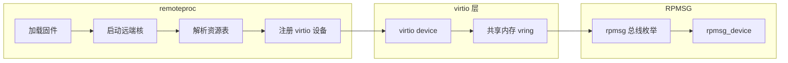
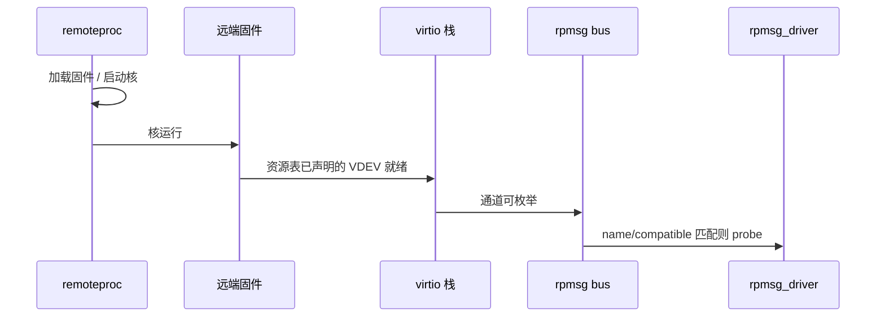

## 前言

**C：** 很多「RPMSG 驱动不 `probe`」的问题，根因其实在 **remoteproc 与固件资源表**，而不是 `rpmsg_driver` 写错一两行。本篇从 **Linux 侧可见的设备生命周期** 出发，说明 **固件加载 → 资源表声明 virtio → 总线上出现 `rpmsg_device`** 这条链，便于你和 BSP、固件同事对齐术语。

<!-- more -->

::: tip 和前后篇的关系
- 上篇：[RPMSG 异构核通信入门](/courses/linuxdev/06-总线与典型子系统/rpmsg/01-RPMSG异构核通信入门)（栈与分工总览）  
- 下篇：[rpmsg 内核驱动编写——通道名、端点与收发](/courses/linuxdev/06-总线与典型子系统/rpmsg/03-rpmsg内核驱动编写-通道名-端点与收发)（`rpmsg_driver` 与 API）  
具体 **RSC 结构体布局、vring 物理地址** 以 SoC 厂商文档与内核 `include/linux/remoteproc.h` 为准；此处只抓 **职责边界与出现顺序**。
:::

## 1. 两个子系统各管什么

| 子系统 | 你应记住的一句话 |
| --- | --- |
| **remoteproc** | 负责 **加载/启动远端固件**、解析 **资源表（resource table）**、把固件里声明的 **virtio 设备** 注册到 Linux 的 virtio 框架。 |
| **RPMSG** | 在 **virtio 传输已就绪** 的前提下，提供 **命名逻辑通道** 与 **收发 API**（`rpmsg_driver`、`rpmsg_send*` 等）。 |

没有「能用的 virtio 通道」，就不会有稳定的 `rpmsg_device`；**通道名对不上** 则会有 virtio 但你的驱动仍不匹配。

## 2. 生命周期：从「固件跑起来」到「通道 probe」

下面按 **Linux 驱动工程师排查顺序** 理解即可（与具体 SoC 驱动实现细节无关）：

1. **remoteproc** 根据 DT/ACPI 或平台代码，决定加载哪个固件镜像、如何复位/释放远端核。  
2. 固件镜像内携带 **资源表**：常见会声明 **virtio device（VDEV）**、 carveout、trace 等；**RPMSG 依赖的正是这份 VDEV 信息**。  
3. 远端固件启动后，与 Linux 约定好的 **共享内存 + 门铃/中断** 上建立 **vring**；Linux 侧 virtio 驱动探测成功。  
4. **virtio_rpmsg**（或厂商等价实现）在 virtio 之上 **创建/通告 rpmsg 通道**；内核 **rpmsg 总线** 为每个匹配的逻辑通道实例化 `rpmsg_device`，进而调用你的 **`rpmsg_driver.probe`**。

**直觉：** `probe` 晚于「固件已跑 + virtio 握手成功」；若你只看到 remoteproc 在线但永远没有 rpmsg，优先怀疑 **资源表缺 VDEV、固件未起、vring 地址错、或 virtio 驱动未编进内核**。

## 3. 资源表里通常关你什么事

资源表是 **固件与 Linux 的契约**。驱动工程师至少要能回答：

- 固件是否为 RPMSG **声明了 virtio 设备**？  
- **共享内存 carveout** 是否与设备树 / 内存 map 一致？  
- 是否有 **vendor 扩展项** 影响通道数量或门铃号？

你不需要背每个字段的偏移，但需要 **能在厂商文档里对上「这一块对应 Linux 里哪个 dmesg 阶段」**。常见现象对照：

| 现象 | 优先怀疑 |
| --- | --- |
| remoteproc 报错或反复重启 | 固件镜像、内存布局、复位/时钟 |
| virtio 注册失败 | 资源表、共享内存、IOMMU/Cache |
| virtio 正常但无 rpmsg 设备 | 固件侧未创建通道、或仅创建了与你 `id_table` 不符的名字 |

## 4. 设备树 / 固件名（工程向）

具体属性名因平台而异（如 `firmware-name`、`memory-region`、`mboxes` 等），原则只有几条：

- **remoteproc 节点** 把「用哪个固件、哪块内存、哪条 IPC」绑在一起；改 DT 往往比改 `rpmsg_driver` 更先验。  
- **固件版本与 DT 必须成对升级**；只换内核或只换固件都可能导致资源表与内存节点不一致。  
- 多核、多 remoteproc 时，确认你盯的是 **正确 rproc 实例** 对应的固件与通道。

## 5. 小结

- **RPMSG 不替代 remoteproc**：前者建立在后者（及 virtio）铺好的路上。  
- 排障时 **自顶向下**：remoteproc 状态 → virtio/dmesg → 通道名与 `rpmsg_device_id` → 最后才抠业务协议。

::: tip 同组文章
[I2C 与 SPI 驱动设计对比](/courses/linuxdev/06-总线与典型子系统/01-I2C与SPI驱动设计对比) · [RPMSG 用户态与调试实践](/courses/linuxdev/06-总线与典型子系统/rpmsg/04-RPMSG用户态与调试实践)
:::
