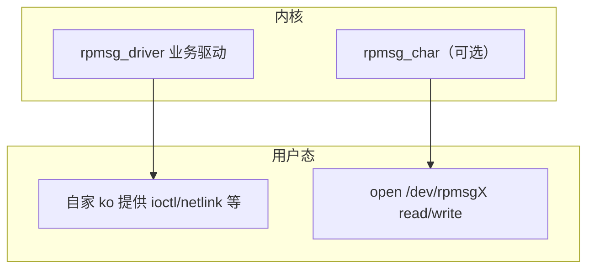

## 前言

**C：** 内核 `rpmsg_driver` 与用户态访问 **不是同一条路**：是否暴露 `/dev/rpmsg*`、节点命名规则、ioctl 能力，取决于 **`rpmsg_char` 等配置与厂商集成**。本篇说明 **常见用户态用法轮廓** 和 **分层排障清单**，避免在错误层次浪费时间。

<!-- more -->

::: tip 前置阅读
建议先读完：[入门](/courses/linuxdev/06-总线与典型子系统/rpmsg/01-RPMSG异构核通信入门) → [remoteproc 衔接](/courses/linuxdev/06-总线与典型子系统/rpmsg/02-remoteproc与RPMSG衔接-资源表与设备出现时机) → [内核驱动编写](/courses/linuxdev/06-总线与典型子系统/rpmsg/03-rpmsg内核驱动编写-通道名-端点与收发)。
:::

## 1. 用户态两条典型路径

- **路径 A**：业务完全在内核，`rpmsg_driver` 通过 **netlink、misc、自定义字符设备** 等把语义暴露给用户态。协议、权限、并发都在你控制内。  
- **路径 B**：打开 **`CONFIG_RPMSG_CHAR`**（及平台相关选项）后，部分通道可由 **`rpmsg_char`** 暴露为字符设备，用户态 **`read`/`write`**（以及版本相关的 **ioctl**）收发 **原始 payload**。

**注意：** 路径 B 并非所有 defconfig 都打开；即使打开，**通道是否导出、设备节点名** 也可能因内核版本与补丁而异。以你 **正在用的内核 `Kconfig` 与文档** 为准。

## 2. 与固件 / 对端的协议对齐

无论内核态还是用户态，**字节序、头部格式、最大包长、分片规则** 都必须与 **远端固件（如 Zephyr、FreeRTOS、TI/ NXP 等 SDK）** 一致。建议：

- 在仓库里维护 **一份双方共用的协议头定义**（或明确文档 + 版本号字段）。  
- **首包**做能力协商或版本校验，避免「能收发但语义静默错误」。  
- 明确 **最大消息长度** 与 **背压**：用户态猛写可能导致 `-EAGAIN` 或阻塞，需与 UI/业务线程模型一致。

## 3. 调试：自顶向下的检查单

| 层次 | 看什么 |
| --- | --- |
| **remoteproc** | 对应 rproc 是否 **running**、固件是否加载成功、dmesg 是否反复 **crash/restart** |
| **virtio / rpmsg 核心** | virtio 探测是否成功、是否有 **缓冲区/vring** 相关报错 |
| **通道匹配** | `rpmsg_device` 是否创建、`id.name` 与驱动 **`rpmsg_device_id`** 是否一致 |
| **收发** | 对端是否在同一通道上 **创建 endpoint**、地址是否匹配、是否只在单向发包 |

**日志习惯：** 区分 **传输错误**（`-ENOMEM`、virtio 错误）与 **应用解析错误**（checksum、长度）；前者找 BSP/固件/内存，后者找协议实现。

## 4. 常用信息来源（概念级）

具体路径随内核配置变化，思路是：

- **`/sys/class/remoteproc/remoteproc*/`**：状态、固件名等（若启用 sysfs 接口）。  
- **debugfs**（若编译打开）：部分平台提供 **rpmsg / virtio 的调试节点**，用于查看通道或统计。  
- **`dmesg -w`**：remoteproc、virtio、rpmsg 驱动probe 顺序 **一条时间线** 最有说服力。

不要把 **PCIe/USB 枚举** 的经验硬套到 **片上 IPC**：这里没有「插拔」语义，**复位远端核** 更接近「总线级重启」。

## 5. 小结

- 用户态是否走 **`/dev/rpmsg*`** 取决于 **`rpmsg_char` 与集成**；很多产品仍选 **内核驱动 + 自有接口**。  
- 排障 **先 remoteproc 与资源表，再 virtio，再通道名与协议**。  
- **协议与版本** 是跨团队最容易扯皮的地方，应用文档或代码 **显式写清**。

::: tip 同组文章
[PCIe 驱动基础、BAR、中断与资源映射](/courses/linuxdev/06-总线与典型子系统/02-PCIe驱动基础、BAR、中断与资源映射)（对比「板级总线」与「片上 IPC」） · [入门](/courses/linuxdev/06-总线与典型子系统/rpmsg/01-RPMSG异构核通信入门)
:::
