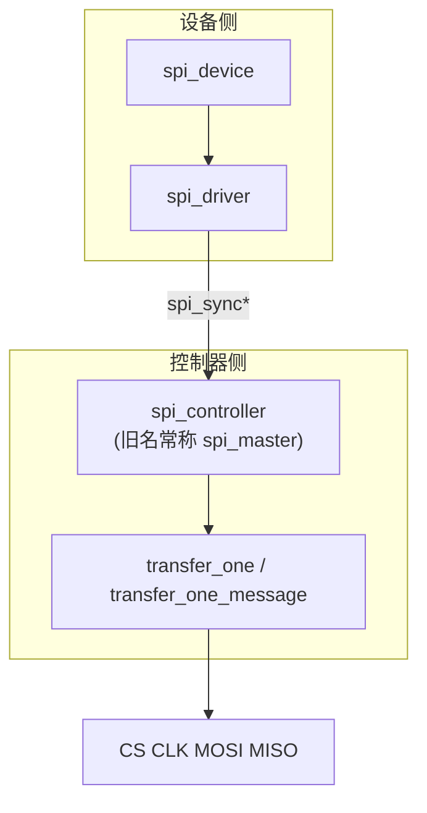
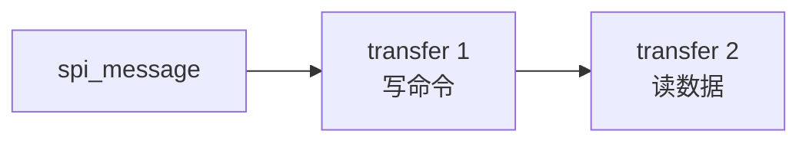

## 前言

**C：** SPI 强调**片选、模式、时钟**以及 **`spi_message` / `spi_transfer` 的拼接方式**。本篇作为 **SPI 小专题入口**：用一张栈图把 **`spi_controller` / `spi_device` / `spi_driver`** 分清，给出 **最短可运行的 `probe` + 一次传输** 骨架；**控制器主线、传输语义、设备树与调试** 已拆到同目录后续三篇，避免单篇笼统却又读不透。

<!-- more -->

::: tip 关于文中源码
为教学骨架，省略锁、错误恢复、PM；不同内核版本部分字段与 helper 可能略有差异，请以当前树内 `include/linux/spi/spi.h` 为准。
:::

::: tip 同组文章（建议按序阅读）
1. **本篇**：对象模型与最小闭环。  
2. [SPI控制器与主机驱动主线](/courses/linuxdev/06-总线与典型子系统/spi/02-SPI控制器与主机驱动主线)：`transfer_one*`、注册、片选与 DMA 分工。  
3. [spi_message与传输语义](/courses/linuxdev/06-总线与典型子系统/spi/03-spi_message与传输语义-全双工片选与性能)：`cs_change`、全双工、同步/异步与性能。  
4. [SPI设备树与调试实践](/courses/linuxdev/06-总线与典型子系统/spi/04-SPI设备树与调试实践)：DT 属性、sysfs、`spidev` 注意事项。  
5. [I2C与SPI驱动设计对比](/courses/linuxdev/06-总线与典型子系统/01-I2C与SPI驱动设计对比)
:::

## 1. SPI 子系统总览框图



设备驱动通过 **`spi_device`** 描述从设备属性，通过 **`spi_sync()` / `spi_sync_locked()`** 等把 `spi_message` 提交给控制器。  
**主机侧如何把 message 落到引脚**，见第二篇；**多段 transfer 与 `cs_change`**，见第三篇。

## 2. 三类对象（务必分清）

| 对象 | 谁实现 | 职责 |
| --- | --- | --- |
| `spi_controller` | SoC SPI 主机驱动 | 产生 CLK、控制 CS、执行 `spi_message` |
| `spi_device` | 内核根据 DT/ACPI 创建 | 片选号、mode、频率上限、`bits_per_word` 等 |
| `spi_driver` | 芯片或类驱动 | `probe` 初始化外设、组织传输 |

## 3. `spi_message` 与 `spi_transfer`（关系速览）



- 一个 **message** 表示一次原子提交（可含多段 transfer）。  
- 每段 **transfer** 有 `len`、`tx_buf` / `rx_buf`、`cs_change`、`bits_per_word`、`speed_hz` 等。  
- **帧边界、是否保持 CS 拉低** 往往由多段 transfer + `cs_change` 与硬件共同决定，**必须以芯片手册为准**（第三篇展开）。

## 4. 设备树片段示例

```txt
&spi0 {
    status = "okay";

    flash@0 {
        compatible = "jedec,spi-nor";
        reg = <0>;
        spi-max-frequency = <50000000>;
        spi-rx-bus-width = <4>;
        spi-tx-bus-width = <4>;
    };
};
```

`reg` 通常表示 **片选序号**（由 SPI 控制器 binding 定义）。更多属性与调试清单见 **第四篇**。

## 5. `spi_driver` 骨架：`probe` + `spi_setup`

在 `probe` 里常用 **`spi_setup(spi)`** 让控制器根据 `mode`、`bits_per_word`、`max_speed_hz` 等计算并应用硬件参数（具体失败原因用 `dev_err` 打印）。

```c
#include <linux/spi/spi.h>
#include <linux/module.h>

struct bar_data {
	struct spi_device *spi;
};

static int bar_probe(struct spi_device *spi)
{
	struct bar_data *priv;
	int ret;

	priv = devm_kzalloc(&spi->dev, sizeof(*priv), GFP_KERNEL);
	if (!priv)
		return -ENOMEM;
	priv->spi = spi;
	spi_set_drvdata(spi, priv);

	/* 若设备树未写全，可在此覆盖（谨慎，避免与 DT 重复冲突） */
	spi->mode |= SPI_MODE_0;
	spi->bits_per_word = 8;

	ret = spi_setup(spi);
	if (ret)
		return ret;

	dev_info(&spi->dev, "max_speed_hz %u\n", spi->max_speed_hz);
	return 0;
}

static void bar_remove(struct spi_device *spi)
{
}

static const struct spi_device_id bar_id_table[] = {
	{ "vendor,bar", 0 },
	{ }
};
MODULE_DEVICE_TABLE(spi, bar_id_table);

static const struct of_device_id bar_of_match[] = {
	{ .compatible = "vendor,bar" },
	{ }
};
MODULE_DEVICE_TABLE(of, bar_of_match);

static struct spi_driver bar_driver = {
	.driver = {
		.name = "bar-spi",
		.of_match_table = bar_of_match,
	},
	.probe = bar_probe,
	.remove = bar_remove,
	.id_table = bar_id_table,
};
module_spi_driver(bar_driver);

MODULE_LICENSE("GPL");
```

## 6. 典型传输：`spi_message_init` + 两段 transfer

示例：**先写 1 字节命令，再读 4 字节数据**（命令与数据是否应处于同一 CS 窗口由硬件定义，此处为常见教学结构）。**`cs_change`、延时与全双工语义**见第三篇。

```c
static int bar_read_id(struct spi_device *spi, u8 *buf4)
{
	struct spi_transfer t[2] = { };
	struct spi_message m;
	u8 cmd = 0x9f; /* 示例：读 JEDEC ID，非通用 */

	spi_message_init(&m);

	t[0].tx_buf = &cmd;
	t[0].len = 1;

	t[1].rx_buf = buf4;
	t[1].len = 4;

	spi_message_add_tail(&t[0], &m);
	spi_message_add_tail(&t[1], &m);

	return spi_sync(spi, &m);
}
```

也可使用栈上 `struct spi_transfer x[]` + **`spi_sync_transfer()`** 简化代码（内核提供的 helper，等价于构建 message）。

## 7. 接下来读什么？

| 你的问题 | 建议跳转 |
| --- | --- |
| SoC 主机驱动怎么注册？`transfer_one` 干什么？ | [第二篇](/courses/linuxdev/06-总线与典型子系统/spi/02-SPI控制器与主机驱动主线) |
| 同一 CS 下多段 transfer 怎么拼？异步与吞吐？ | [第三篇](/courses/linuxdev/06-总线与典型子系统/spi/03-spi_message与传输语义-全双工片选与性能) |
| DT 属性、`/sys`、spidev 调试顺序？ | [第四篇](/courses/linuxdev/06-总线与典型子系统/spi/04-SPI设备树与调试实践) |
| 和 I2C 在驱动设计上的取舍？ | [对比篇](/courses/linuxdev/06-总线与典型子系统/01-I2C与SPI驱动设计对比) |
