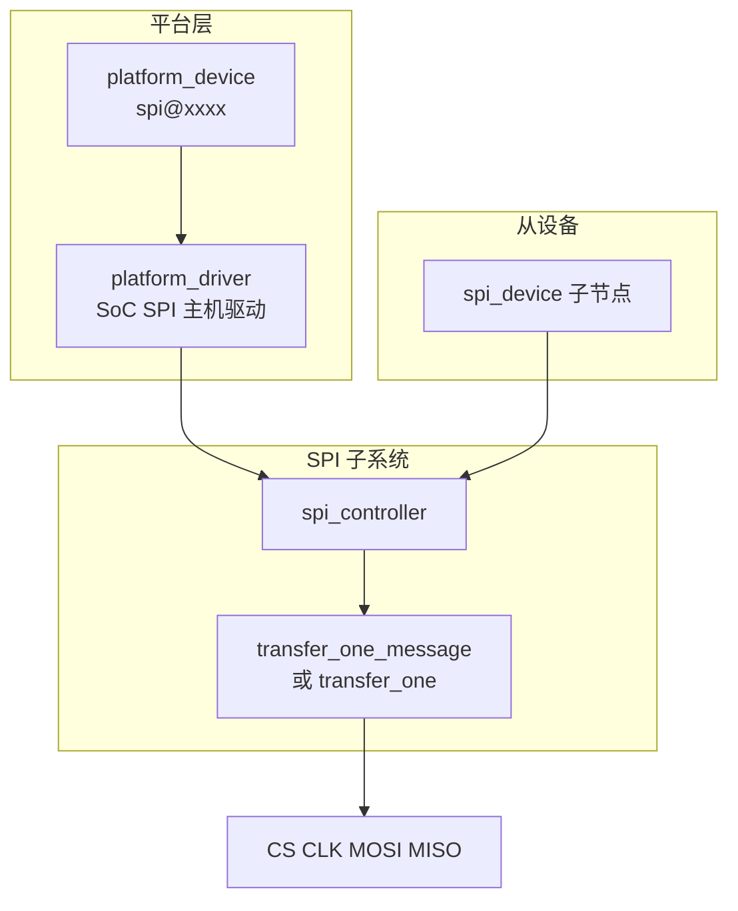
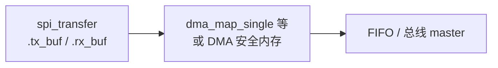

## 前言

**C：** 从设备驱动调 `spi_sync()` 能成功，前提是 **`spi_controller`（历史上常叫 `spi_master`）** 已注册，且控制器的 **`transfer_one` / `transfer_one_message`** 能把 `spi_message` 变成真实波形。本篇沿 **注册路径、与 DT 的绑定、一次 message 如何落到硬件、片选与 DMA 的常见分工** 展开，便于你读 SoC SPI 驱动或排查「软件一切正常但总线无波形」。

<!-- more -->

::: tip 阅读顺序
建议先读完 [SPI子系统与设备驱动要点](/courses/linuxdev/06-总线与典型子系统/spi/01-SPI子系统与设备驱动要点)，再读本篇；传输拼帧细节见 [spi_message 与传输语义](/courses/linuxdev/06-总线与典型子系统/spi/03-spi_message与传输语义-全双工片选与性能)。
:::

## 1. 控制器在栈里的位置



- **一条物理 SPI 总线**对应一个 **`spi_controller`** 实例。  
- DT 里 `spi@...` 节点下的 **每个子节点**（如 `flash@0`）会被核心解析成一个 **`spi_device`**，并挂到该控制器上。  
- 从设备驱动只面向 **`spi_device`**；**不会**在芯片驱动里再去 `spi_register_controller`。

## 2. 三个对象分工（对照记忆）

| 对象 | 谁实现 | 职责 |
| --- | --- | --- |
| `spi_controller` | SoC 主机驱动 | 时钟、FIFO/DMA、片选硬件、执行 message |
| `spi_device` | 内核根据 DT/ACPI 创建 | 保存 mode、频率上限、片选号等与**该从设备**绑定的参数 |
| `spi_driver` | 芯片或类驱动 | `probe(spi)` 里初始化外设、组织 `spi_message` 提交传输 |

## 3. 注册控制器：心智模型与示意骨架

主线趋势是使用 **`devm_spi_register_controller()`**（不同内核版本可能仍有 `spi_register_master` 等别名或封装，读你树内 `spi.h` 即可）。注册前通常要填：

- **`transfer_one` 或 `transfer_one_message`**：二选一（或依 SoC 模型封装），核心会把 `spi_message` 拆成硬件可执行序列。  
- **`setup`（可选）**：按 `spi_device` 校验 mode、位宽、频率是否支持。  
- **`num_chipselect` / CS 相关**：硬件原生 CS 线数量，或与 GPIO CS 扩展配合。

下面是与主线风格接近的**极简骨架**（省略 clk/reset/pinctrl、DMA 映射、错误路径、PM）。

```c
#include <linux/spi/spi.h>
#include <linux/module.h>
#include <linux/platform_device.h>

struct foo_spi {
	struct spi_controller *ctl;
	void __iomem *base;
};

static int foo_spi_transfer_one(struct spi_controller *ctl,
				struct spi_device *spi,
				struct spi_transfer *xfer)
{
	/* 典型：把 xfer->tx_buf / rx_buf、len、speed_hz、bits_per_word
	 * 写入 FIFO 或启动 DMA，等待完成，返回 0 或负错误码
	 */
	return 0;
}

static int foo_spi_probe(struct platform_device *pdev)
{
	struct foo_spi *priv;
	struct spi_controller *ctl;
	int ret;

	/* 新内核常见 devm_spi_alloc_host()；旧树可能为 devm_spi_alloc_master()。
	 * 第二个参数为挂在 controller 后的私有区大小，对应 spi_controller_get_devdata()。
	 */
	ctl = devm_spi_alloc_host(&pdev->dev, sizeof(struct foo_spi));
	if (IS_ERR(ctl))
		return PTR_ERR(ctl);

	priv = spi_controller_get_devdata(ctl);
	priv->ctl = ctl;

	priv->base = devm_platform_ioremap_resource(pdev, 0);
	if (IS_ERR(priv->base))
		return PTR_ERR(priv->base);

	ctl->bus_num = -1; /* 动态分配；或平台固定编号 */
	ctl->num_chipselect = 4;
	ctl->transfer_one = foo_spi_transfer_one;
	/* 若控制器以 message 为粒度更高效，可实现 transfer_one_message */

	ret = devm_spi_register_controller(&pdev->dev, ctl);
	if (ret)
		return ret;

	return 0;
}

static const struct of_device_id foo_spi_of_match[] = {
	{ .compatible = "vendor,foo-spi" },
	{ }
};
MODULE_DEVICE_TABLE(of, foo_spi_of_match);

static struct platform_driver foo_spi_driver = {
	.probe = foo_spi_probe,
	.driver = {
		.name = "foo-spi",
		.of_match_table = foo_spi_of_match,
	},
};
module_platform_driver(foo_spi_driver);

MODULE_LICENSE("GPL");
```

::: tip 与真实驱动的差距
量产驱动还会处理：**线程化传输**（`spi_transfer_one_message` 在 kthread_worker 里跑）、**prepare_message / unprepare_message**、**DMA 安全缓冲区**、**runtime PM** 等。对照你 SoC 的 `drivers/spi/spi-*.c` 阅读即可。
:::

## 4. `transfer_one` 与 `transfer_one_message` 怎么选？

- **`transfer_one`**：核心按 `spi_transfer` 链表多次调用；适合硬件天然「一段一段」执行、或驱动里容易按单段编程的 IP。  
- **`transfer_one_message`**：整包 `spi_message` 一次交给驱动；适合硬件支持「链式描述符」、或必须自己控制 CS 翻转时序的场景。  

两者不应随意混用语义：**同一控制器驱动通常只实现其一为主路径**（另一可能为 NULL），具体以你使用的内核该驱动为准。

## 5. 片选：硬件 CS 与 GPIO CS

- **硬件片选**：由控制器在传输期间自动控制，**`spi_device->chip_select` 与控制器线序**对应。  
- **GPIO 片选**：DT 常见 **`cs-gpios`**（或控制器 binding 中的等价属性），由 SPI 核心或主机驱动在提交传输前拉低/拉高。  

片选边界是否与 **`spi_transfer.cs_change`** 一致，取决于 **主机驱动 + 硬件** 的实现；从设备侧拼 message 时必须 **以芯片手册为准**（详见同组第三篇）。

## 6. DMA 与缓冲区（概念）



常见踩坑：

- 栈上小缓冲有时可用于 PIO，**DMA 路径常要求** `kmalloc`/`dma_alloc_coherent` 等满足对齐与缓存一致性的内存。  
- **`tx_buf` 与 `rx_buf` 相同物理缓冲区**的全双工场景，要确认控制器是否支持；不支持时需拆成半双工两段或使用 bounce buffer。

细节以 **`Documentation/devicetree/bindings/spi`** 与你平台驱动注释为准。

## 7. 和从设备驱动交接的「契约」

- 从设备在 `probe` 里调用 **`spi_setup(spi)`**，会间接走到控制器的 **`setup`**（若实现），用于 **协商 `mode`、`bits_per_word`、`max_speed_hz`**。  
- 单次传输里 **`spi_transfer.speed_hz` / `bits_per_word`** 若与默认值不同，**控制器应能动态切换**（若硬件做不到，会在 `setup` 或传输路径报错）。  

若 `spi_setup` 莫名失败，应 **同时查 DT 属性与控制器的 `setup` 实现**，而不是只改芯片驱动。

## 8. 小结

- **主机驱动**负责把 **`spi_message` → 引脚上的时序**；**从设备驱动**负责 **协议拼帧与业务**。  
- 读主线代码时优先抓住：**注册 API、`transfer_one*`、CS 与 DMA、PM**。  
- 设备树与 `/sys` 侧排查见 [SPI 设备树与调试实践](/courses/linuxdev/06-总线与典型子系统/spi/04-SPI设备树与调试实践)。

::: tip 同组文章
[I2C与SPI驱动设计对比](/courses/linuxdev/06-总线与典型子系统/01-I2C与SPI驱动设计对比)
:::
